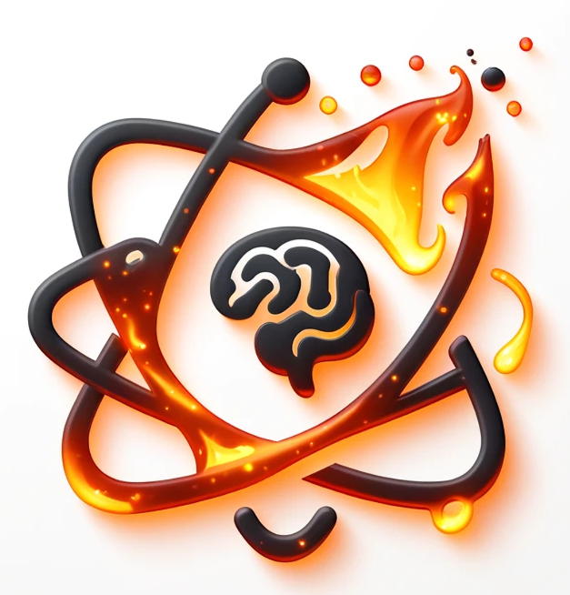

# OpenDrSai Scientific Agent Development Framework

## English | [简体中文](README.md)

An integrated framework for rapid development and deployment of agents and multi-agent collaborative systems, developed by the HepAI team at the Institute of High Energy Physics, Chinese Academy of Sciences: [HepAI](https://ai.ihep.ac.cn/). It enables fast development and deployment of both backend and frontend services for your own agents and multi-agent systems.

<div align="center">
  <p>
      
  </p>
</div>

OpenDrSai uses **BAMS (Brain-Actuators-Memory-Sensors)** as its overall agent architecture: Brain handles reasoning and task decisions; Actuators invoke tools and execute tasks; Memory manages short- and long-term context, knowledge, and execution state; and Sensors connect user input, scientific data, external services, and models. The framework targets professional scientific agents and multi-agent systems, with particular support for complex tasks, stateful human-agent collaboration, scientific tools, long-running work, and memory management.

It is highly compatible with mainstream MCP and A2A protocols, the [HepAI](https://ai.ihep.ac.cn/) ecosystem, and RAGFlow-based RAG architectures. Additionally, it supports integrated development and deployment: agent or multi-agent system code can be launched with one click and registered as OpenAI ChatCompletions format or HepAI Worker format APIs. A corresponding human-computer interaction frontend is also provided, enabling full-stack application development and deployment. Documentation is available at [OpenDrSai Docs](https://docs-drsai.ihep.ac.cn/).

### Architecture and technology-stack positioning

- **BAMS is OpenDrSai's high-level architecture.** It defines how agent capabilities are separated and composed; it is not a third-party runtime library.
- **[Microsoft AutoGen](https://github.com/microsoft/autogen) provides the current core agent runtime and component foundation.** The repository pins AutoGen `0.5.7` packages (`autogen-core`, `autogen-agentchat`, and `autogen-ext`). OpenDrSai implements its BAMS components, scientific-task capabilities, and deployment system on top of AutoGen's messages, model clients, tools, components, state, and multi-agent runtime. BAMS and AutoGen therefore describe different architectural layers.
- **HepAI belongs to the platform and deployment technology stack.** It provides model APIs, identity and organization services, and HepAI Worker/DDF deployment and distributed capabilities. OpenDrSai integrates them through the `hepai` package and platform APIs, while OpenDrSai itself remains responsible for the Agent Runtime and BAMS components.

### Other major upstream projects and integrations

- **[Magentic-UI](https://github.com/microsoft/magentic-ui)** is the upstream foundation of the OpenDrSai WebUI. `apps/webui/backend` and `apps/webui/frontend` integrate and extend its code and interaction model for sessions, plan presentation, approvals, browser/code execution environments, and multi-agent interaction.
- **Magentic-One** is not currently an active part of the OpenDrSai architecture. The repository retains historical or compatibility artifacts such as the `magentic-one` mode and directory names and the `autogen-ext[magentic-one]` installation extra, but the core package does not enable AutoGen's `MagenticOneGroupChat`. These names do not mean that OpenDrSai is based on the Magentic-One architecture.
- **RAGFlow / ChromaDB** are optional knowledge-base and long-term-memory backends rather than agent runtimes. RAGFlow has dedicated Memory, Agent, and WebUI integrations; ChromaDB is enabled through an optional dependency.
- **OpenWebUI Pipeline** is supported through a compatibility adapter that exposes OpenDrSai as an external model or agent service. OpenWebUI is not the implementation foundation of the repository's WebUI.
- **Codex** can be connected through the Codex Adapter and Codex App Server as an optional execution backend alongside the native OpenDrSai Agent Backend; it is not part of the BAMS core implementation.
- **browser-use** is an optional dependency of the Windows desktop browser-automation worker.
- **Hermes Agent** is the explicit source of the TUI JSON-RPC gateway client, which has been forked and adapted for OpenDrSai. This is a localized code origin, not the OpenDrSai agent runtime.
- **React/Ink, Gatsby/React, Electron, and Android Jetpack Compose** provide the UI stacks for the TUI, Web frontend, Windows desktop client, and Android client, respectively; they do not belong to the agent-architecture layer.

Some design documents also draw interaction, subagent, or remote-workspace ideas from Claude Code, the OpenAI Codex UI, and Orca. Except for the explicit adapters or derived code identified above, design inspiration does not imply a code dependency or foundational architecture.

## 1. Features

- 1. Supports flexible switching of agent foundation models via the [HepAI platform](https://aiapi.ihep.ac.cn/), along with flexible configuration of tools, knowledge bases, and other agent components. Also compatible with OpenAI ChatCompletions, Ollama, and other model formats.
- 2. Provides predefined modular components for perception, reasoning, memory, execution, and state management for agents and multi-agent systems. These are plugin-based and highly extensible, supporting a wide range of professional agent applications.
- 3. Includes a one-click startup frontend and backend for human-computer interaction, enabling "development-as-application". It also provides backend interfaces compatible with OpenAI ChatCompletions and OpenWebui-Pipeline, allowing agents and multi-agent systems to be used as third-party API services.
- 4. Features a brand-new **Terminal User Interface (TUI)** based on React/Ink, enabling direct interaction with agents in the terminal. Launch with `opendrsai` or `opendrsai chat`. Supports session management, model switching, slash commands, reasoning visualization, and more — delivering a Claude Code-like immersive development experience.
- 5. Includes a **Desktop App** (Electron) launchable via `opendrsai desktop`, with system tray support and remote gateway connectivity.

### 📢 Feature Comparison

|      Feature       | OpenDrSai Framework |    AutoGen     |    Camel AI    |    LangChain   |    AutoGPT     | Dify.AI |
| :-------------: | :------------: | :------------: | :------------: | :------------: | :------------: | :------------: |
| Framework Characteristics | ✅ BAMS organizes agent capabilities and AutoGen 0.5.7 provides the core runtime and component foundation; the WebUI extends Magentic-UI for scientific tasks, human-agent collaboration, and deployment | Conversation-driven multi-agent architecture, modular and general-purpose, strong ecosystem but basic framework only | Role-playing + heuristic prompting collaboration architecture, strong ecosystem | Modular assembly development | Highly integrated agent/multi-agent architecture | Low-code platform with drag-and-drop, limited extensibility |
| Model Integration | ✅ Supports professional scientific models and custom strategies | Only general LLM formats supported | Only general LLM formats supported | Only general LLM formats supported | Only general LLM formats supported | Only general LLM formats supported |
| Scientific Data Integration | ✅ Includes perception modules for scientific data | Requires development | Not available | Not available | Not available | Not available |
| Memory & Knowledge | ✅ Modular knowledge integration and long-term memory management | Requires development | ✅ Long-term memory supported | Requires development | ✅ Short/long-term memory | ✅ Built-in knowledge base and storage |
| Scientific Tools | ✅ Supports MCP/OpenAPI/HepAI Worker integrations | Only MCP tools and local functions | ✅ Built-in tools and integrations | Requires development | Requires development | Limited built-in tools |
| Reflection & Learning | ✅ Modular reflection and learning | Requires development | ✅ Built-in reflection and learning | Requires development | ✅ Built-in reflection and learning | Limited, mostly RAG-based |
| State Management & HCI | ✅ Full frontend + backend HCI support | Basic UserProxy mode, needs further development | Basic UserProxy mode, needs further development | Requires development | Requires development | Not available |
| Long-task Execution | ✅ Ultra-long scientific task monitoring and daemon | Not available | Not available | Not available | Not available | Not available |
| Modularity & Extensibility | ✅ Highly modular and extensible | ✅ Modular | ✅ Modular | Strong modularity | Limited | Limited |
| Interactive App Development | ✅ Build agents directly into web apps | AutoGen Studio drag-and-drop | CAMEL Web App | Requires external UI | Requires external UI | Drag-and-drop frontend |
| Terminal UI (TUI) | ✅ React/Ink TUI with slash commands, session mgmt, model switching, reasoning viz | Not available | Not available | Not available | Not available | Not available |
| Desktop Client | ✅ Electron desktop app with system tray and remote connection | Not available | Not available | Not available | Not available | Not available |

> As of: 2025-11-25

------

## 2. Quick Start

### 2.1. Install OpenDrSai

#### Source Install (Recommended)

> **Prerequisites**: Source install requires **Node.js (≥20)** and **pnpm** to compile the TUI frontend.
> The install script auto-detects and calls pnpm; if not installed, run:
> ```shell
> # Install Node.js (recommend LTS)
> # Option 1: Download from https://nodejs.org/
> # Option 2: Use nvm
> curl -o- https://raw.githubusercontent.com/nvm-sh/nvm/v0.40.1/install.sh | bash
> nvm install 22
>
> # Install pnpm
> npm install -g pnpm
> ```
> If Node.js cannot be installed, you can skip TUI compilation:
> ```shell
> # Create placeholder files to skip compilation
> mkdir -p apps/ui-tui/dist && touch apps/ui-tui/dist/entry.mjs
> pip install -e cores/python/packages/drsai
> ```

```shell
conda create -n drsai python=>3.11
conda activate drsai
git clone https://github.com/hepai-lab/drsai.git drsai # From Github
git clone https://code.ihep.ac.cn/hepai/drsai drsai # or From IHEP

cd drsai
pip install -e cores/python/packages/drsai # for OpenDrSai backend and agent components
pip install -e apps/webui/backend # for DrSai-UI  human-computer interaction frontend
```

> `pip install -e` automatically calls `pnpm install && pnpm build` to compile
> the `apps/ui-tui` frontend. If auto-build fails, run manually:
> ```shell
> cd apps/ui-tui && pnpm install && pnpm build
> ```

#### venv Install (no conda required)

If conda is not installed, use Python's built-in venv:

```shell
# Create venv
python3 -m venv drsai_env

# Activate
source drsai_env/bin/activate       # Linux/macOS
# or
drsai_env\Scripts\activate          # Windows

# Clone repo
git clone https://github.com/hepai-lab/drsai.git drsai # From Github
git clone https://code.ihep.ac.cn/hepai/drsai drsai    # or From IHEP

# Install OpenDrSai
cd drsai
pip install -e cores/python/packages/drsai
# Optional: install extensions
pip install -e cores/python/packages/drsai_ext && pip install -e apps/webui/backend
```

> Node.js (≥20) + pnpm are still required. Auto-compilation happens during install.

Deactivate:

```shell
deactivate
```

#### pip Install / Upgrade

```shell
conda create -n drsai python=>3.11
conda activate drsai

# First install
python -m pip install -U drsai

# Upgrade (use --no-cache-dir to avoid stale cache)
python -m pip install -U --no-cache-dir drsai

# Force reinstall specific version:
# python -m pip install --force-reinstall --no-cache-dir drsai==<version> drsai_ui==<version>
```

> Note: PyPI does not overwrite wheels with the same version number. If upgrading still shows old
