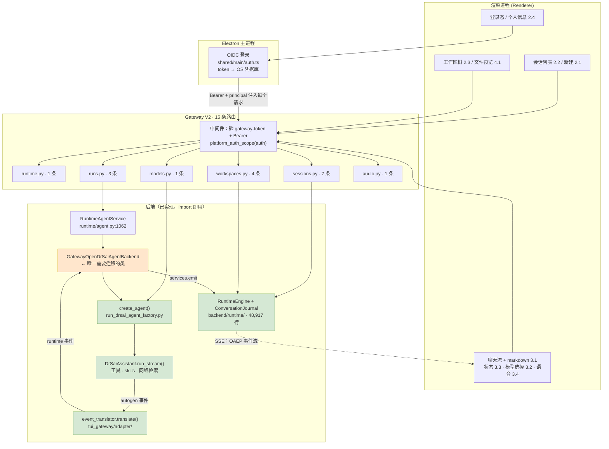

# Desktop V2 最小面：功能 → 路由 → 后端

- 分支：`feature/desktop-v2`
- 日期：2026-08-25
- 关系：**收窄** `desktop-v2-architecture-and-runtime-contract.zh-CN.md` 的 42 端点契约至 **16 条**

---

## 0. 结论

按你给的 11 项功能反推，**需要 16 条路由**。42 → 16 的差额不是删功能，是删掉了这些功能用不到的东西。

三个决定方案形状的事实（都是读代码读出来的，不是估计）：

**① OIDC 登录不需要任何 gateway 路由。**
gateway 里没有 `/v1/auth/*`。登录整个发生在 Electron 主进程（`apps/desktop/shared/main/auth.ts`：`startOidcLogin` / `getAuthSession` / `refreshAuthSession`），token 存在 OS 凭据库。gateway 只做逐请求校验，位置在 `gateway_legacy.py:4409-4441`：

```
x-opendrsai-gateway-token   ← 证明调用方是配对的本机主进程
x-opendrsai-auth-mode: oidc
authorization: Bearer <hepai token>
x-opendrsai-principal: <subject>
```

我之前契约里的 A 组「鉴权 4 条」是凭空造的。**实际是 0 条**，只有一段中间件。

> ⚠️ 这条与 V2 的「渲染进程直连 Runtime」铁律冲突：token 在主进程，渲染进程直连就拿不到。必须二选一——要么渲染进程走主进程代理（放弃直连），要么主进程把短时令牌下发给渲染进程（多一套令牌生命周期）。**这个必须在写第一行代码前定。**

**② 16 条里有 13 条是 `RuntimeEngine` 的薄包装。**
实测 handler 行数：`POST /v1/sessions` 13 行、`GET /v1/sessions` 10 行、`oaep-snapshot` 24 行、`oaep-events` 24 行、`POST .../runs` 25 行、`cancel` 12 行、`model-catalog` 5 行。真正的实现全在 `backend/runtime/`（48,917 行）里，已经写完了。

**③ `POST /v1/runs/{run_id}/execute` 的 693 行里，690 行是参数准备。**
函数体最后是一次调用：

```python
execution_result = await _runtime_agent_service(auth_context).execute(
    run_id, execution_prompt, correlation_id, model_override=..., ...)
return execution_result
```

前面 690 行全在准备这些参数：goal 确认、codex backend 分支、experiments、regression control、capability configuration、image understanding、agent model policy 解析、E2E 夹具分支。**这些你一条都不要。** V2 的 execute 大约 30 行。

> 更正我上一轮的说法：execute **不在 HTTP 响应上做流式输出**，它返回一个 JSON dict。事件是通过 `services.emit` → `append_backend_event` 写进 journal，客户端在会话事件流上读。所以它与 `202 + 事件流` 的差距只是「同步长轮询 vs 立即返回」，比我说的小。

---

## 1. 功能 → 路由 → 后端

| # | 桌面端功能 | Gateway 路由 | 后端实现 | 现有行数 |
|---|---|---|---|---|
| 1 | OIDC 登录 | *(无)* + `GET /v1/runtime` | `shared/main/auth.ts` + 中间件 `context_from_bearer` | 18 |
| 2.1 | 新建会话 | `POST /v1/sessions` | `RuntimeEngine.create_session` | 13 |
| 2.2 | 历史会话列表 | `GET /v1/sessions?workspace_id=` | `RuntimeEngine.list_sessions` | 10 |
| | 打开某条历史 | `GET /v1/sessions/{id}` | `RuntimeEngine.get_session` | 8 |
| | 渲染其内容 | `GET /v1/sessions/{id}/oaep-snapshot` | `RuntimeEngine.oaep_snapshot` | 24 |
| | 重命名 / 归档 | `PATCH /v1/sessions/{id}` | `RuntimeEngine.update_session` | 38 |
| 2.3 | 工作区文件视图 | `GET /v1/workspaces/{id}/files` | 目录遍历 + `git status --porcelain` | 85 |
| 2.4 | 个人信息（折叠） | *(无)* | 主进程已持有的 OIDC claims | 0 |
| 2.5 | 工作区 ↔ 会话归属 | `GET /v1/workspaces` | `RuntimeRegistry.list_workspaces` | 5 |
| | 打开工作区 | `POST /v1/workspaces` | `RuntimeRegistry.open_workspace` | 16 |
| 3.1 | 流式聊天（创建回合） | `POST /v1/sessions/{id}/runs` | `RuntimeEngine.create_run`（幂等键） | 25 |
| | 驱动回合 | `POST /v1/runs/{run_id}/execute` | `RuntimeAgentService.execute` → `GatewayOpenDrSaiAgentBackend` → `create_agent()` → `DrSaiAssistant.run_stream()` | **693** |
| | 实时 token | `GET /v1/sessions/{id}/oaep-events/stream` | SSE over `ConversationJournal` | ~50 |
| | 断线重放 | `GET /v1/sessions/{id}/oaep-events?after_sequence=` | `RuntimeEngine.list_oaep_events` | 24 |
| | markdown 渲染 | *(无)* | 渲染进程 | 0 |
| 3.2 | 模型选择 | `GET /v1/config/model-catalog` | `run_drsai_agent_factory.build_model_catalog()` | 5 |
| | 应用选择 | *(随 execute 请求体传)* | `create_agent(defult_config_name=alias)` | — |
| 3.3 | 会话状态显示 | *(无)* | OAEP `run.status` 在事件流上 | 0 |
| | 停止按钮 | `POST /v1/runs/{run_id}/cancel` | `RuntimeAgentService.cancel` | 12 |
| 3.4 | 语音输入 STT | `POST /v1/audio/transcriptions` | `OpenAIAudioOperationAdapter.transcribe` | ~40 |
| 4.1 | 右侧栏文件预览 | `GET /v1/workspaces/{id}/file` | 读文件 + mime + base64 兜底 | 23 |

**16 条。** 非 execute 部分现有实现合计约 400 行。

### 模型选择要改一处

`build_model_catalog()` 已经返回选择器需要的全部字段：

```python
{"alias", "display_name", "client_type", "model", "token_limit", "max_tokens", "vision"}
```

但现在的 execute **拒绝**直接传模型：

```python
if request.model is not None:
    raise RuntimeExecutionError("legacy_model_selection_rejected",
        "OpenDrSai Runs resolve models from the selected Agent policy, ...")
```

它强制走 agent model policy + model-provider config（就是那 23 条模型路由撑起的那套）。**V2 反过来：请求体带 alias，直接进 `create_agent(defult_config_name=alias)`，那 23 条一条都不要。**

### STT 有个耦合要拆

`/v1/audio/transcriptions` 只有 40 行，但依赖 `load_model_provider_config` + `load_agent_model_policy` + `resolve_agent_operation`——保留它就等于保留整套 provider 配置机器。**改成从同一个 catalog 解析 STT 模型**，否则这 40 行会把 19 条 config 路由拖进来。

### 相比上一版清单的变化

| 能力 | 上版 10 组 | 本次 11 项 | 说明 |
|---|---|---|---|
| 网络检索 | 保留 | 未列 | **零成本保留**——它是 `DrSaiAssistant` 内部的工具，表达为 `tool_call` item，本来就 0 条路由 |
| skills | 保留（3 条） | 未列 | 移出 v1；内置 skills 仍随 agent 加载，只是没有管理 UI |
| gfs | 保留（8-9 条） | 未列 | 移出 v1。原本就是新工作（`gfs_api.py` 的 9 条路由**当前 gateway 从未挂载**） |

---

## 2. 需要往 `backend/gateway/` 迁移什么

**先说一个反直觉的结果：已经抽出来的 6 个模块、18 条路由，与这 16 条零交集。**

| 已抽出模块 | 路由数 | 在 V2 中 |
|---|---|---|
| `routes/logs.py` | 2 | ✗ |
| `routes/platforms.py` | 2 | ✗ |
| `routes/env.py` | 4 | ✗ |
| `routes/cli_config.py` | 2 | ✗ |
| `routes/hepai_workers.py` | 2 | ✗ |
| `routes/threads.py` | 8 | ✗ 被 `/v1/sessions` 取代 |

所以对 V2 而言，`backend/gateway/routes/` 目前是空的。

### 迁移分三类

**A. 不迁移，新写（13 条）**

薄包装，直接对着 `RuntimeEngine` 写，每条 10-15 行。**不要从 legacy 复制**——复制会把 `_authorize_request` / `_security_enabled()` / `_principal_from_request` 这条鉴权链一起拖过来，那正是 214 处测试介入点所在。新写就绕开了整个问题。

```
routes/runtime.py     GET  /v1/runtime                                   1
routes/workspaces.py  GET  /v1/workspaces
                      POST /v1/workspaces
                      GET  /v1/workspaces/{id}/files                     ← 85 行，值得照抄
                      GET  /v1/workspaces/{id}/file                      4
routes/sessions.py    POST /v1/sessions
                      GET  /v1/sessions
                      GET  /v1/sessions/{id}
                      PATCH /v1/sessions/{id}
                      GET  /v1/sessions/{id}/oaep-snapshot
                      GET  /v1/sessions/{id}/oaep-events
                      GET  /v1/sessions/{id}/oaep-events/stream          7
routes/models.py      GET  /v1/config/model-catalog                      1
```

**B. 真正要迁移的只有一个类（1 项）**

`GatewayOpenDrSaiAgentBackend`（`gateway_legacy.py:2723`，约 690 行）→ `gateway/_agent_backend.py`。

它是 `AgentBackend` 协议的实现，把 `DrSaiAssistant.run_stream()` 的 autogen 事件翻译成 runtime 事件。这是网关里唯一的核心资产。它依赖的翻译函数**在包外，可直接 import，零成本**：

```python
from drsai.backend.tui_gateway.adapter.event_translator import (
    TurnState, finalize, translate,
)
```

迁移时可以砍掉：approval 往返、side-effect 认领、codex 分支、regression control。留下 `run_stream` → `translate` → `services.emit` 这条主干。

**C. 重写（4 条）**

```
routes/runs.py   POST /v1/sessions/{id}/runs      25 行，照抄
                 POST /v1/runs/{run_id}/execute   693 → ~30 行，重写
                 POST /v1/runs/{run_id}/cancel    12 行，照抄
routes/audio.py  POST /v1/audio/transcriptions    40 行，重接 catalog
```

### 不要碰的

`gateway_legacy.py` 保持冻结（见 `gateway-freeze-and-retirement.zh-CN.md`）。V2 的 16 条路由挂在**独立的 FastAPI app** 上，不 include 进 legacy 的 `app`——否则三个快照测试会红，而且会继承 legacy 的全部中间件。

---

## 3. 整体逻辑图



绿色 = 已实现、直接 import；橙色 = 唯一需要迁移的类。

### 一次对话的完整数据流

```
1. 渲染进程 → POST /v1/sessions/{sid}/runs   {idempotency_key}
                 → RuntimeEngine.create_run()                       → run_id
2. 渲染进程 → GET  /v1/sessions/{sid}/oaep-events/stream?after_sequence=N
                 （先订阅，再发起；避免 snapshot/subscribe 竞态）
3. 渲染进程 → POST /v1/runs/{run_id}/execute  {prompt, model_alias}
                 → RuntimeAgentService.execute()
                 → GatewayOpenDrSaiAgentBackend.execute()
                 → create_agent(defult_config_name=alias)
                 → DrSaiAssistant.run_stream(task=...)
4.               每个 autogen 事件 → translate() → services.emit()
                 → ConversationJournal 落盘 → SSE 推到步骤 2 的连接
5.               agent 写文件到 workspace/artifacts/ → artifact item 事件
6. 渲染进程     收到 run.completed → 刷新 GET /v1/workspaces/{wid}/files
```

**步骤 2 必须早于步骤 3。** 这是 `202 + 事件流` 契约存在的全部理由：run 的输出不绑定在发起它的那个 HTTP 请求上，所以刷新页面、开第二个窗口、断网重连都不丢消息。

---

## 4. 开工前必须定的三件事

1. **令牌怎么到渲染进程**（见 §0①）。渲染进程直连 Runtime 与「token 只在主进程」互斥。
2. **端口与 `DRSAI_HOME`**。V2 与冻结的 gateway（28642）并存时会共用同一份 SQLite。开发期给 V2 单独设 `DRSAI_HOME`，否则两边互相写脏会话数据。
3. **execute 是否立即返回 202**。现在是同步长轮询。改成 202 需要在 gateway 侧起后台 task；不改则渲染进程要容忍一个长连接挂着——但事件流那条路照常工作，所以这个可以推迟到 M1 之后。

## 5. 顺带发现

工作区里 `backend/feedback_service.py` 和 `backend/feedback_worker.py` 已被删除，但 `gateway_legacy.py:181-182` 仍在 import 它们。当前状态下 gateway 无法导入。
