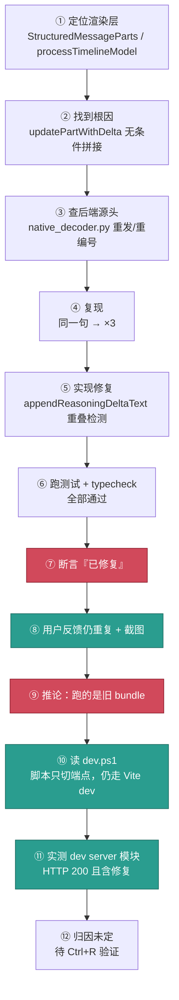
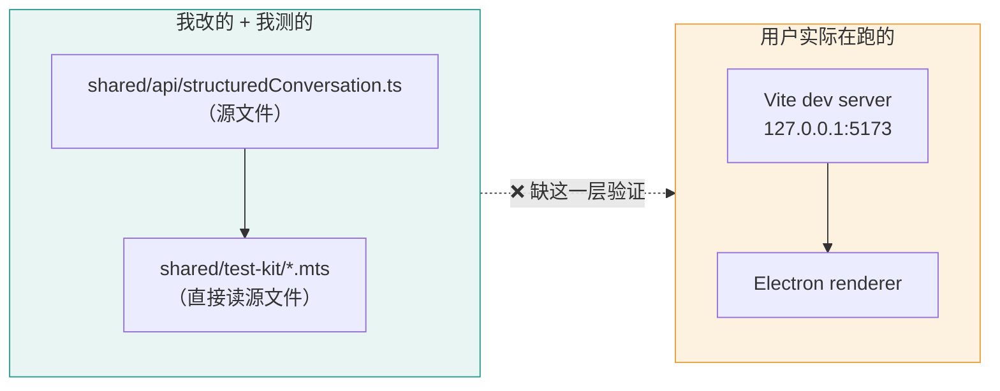
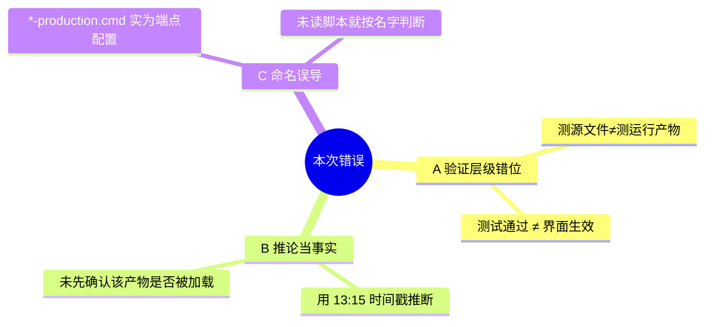
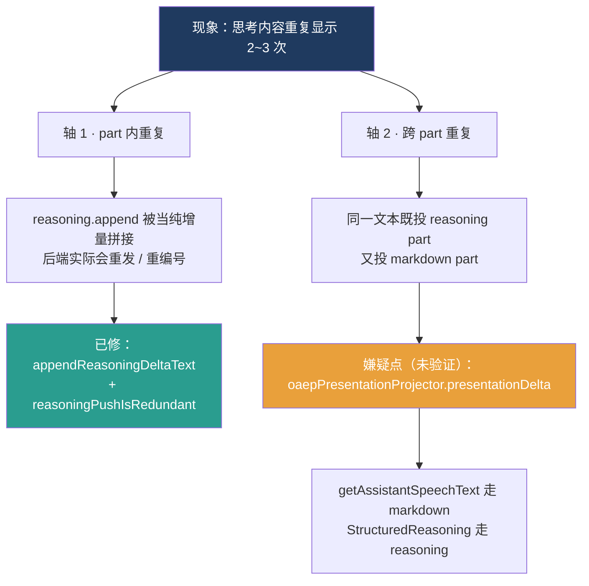
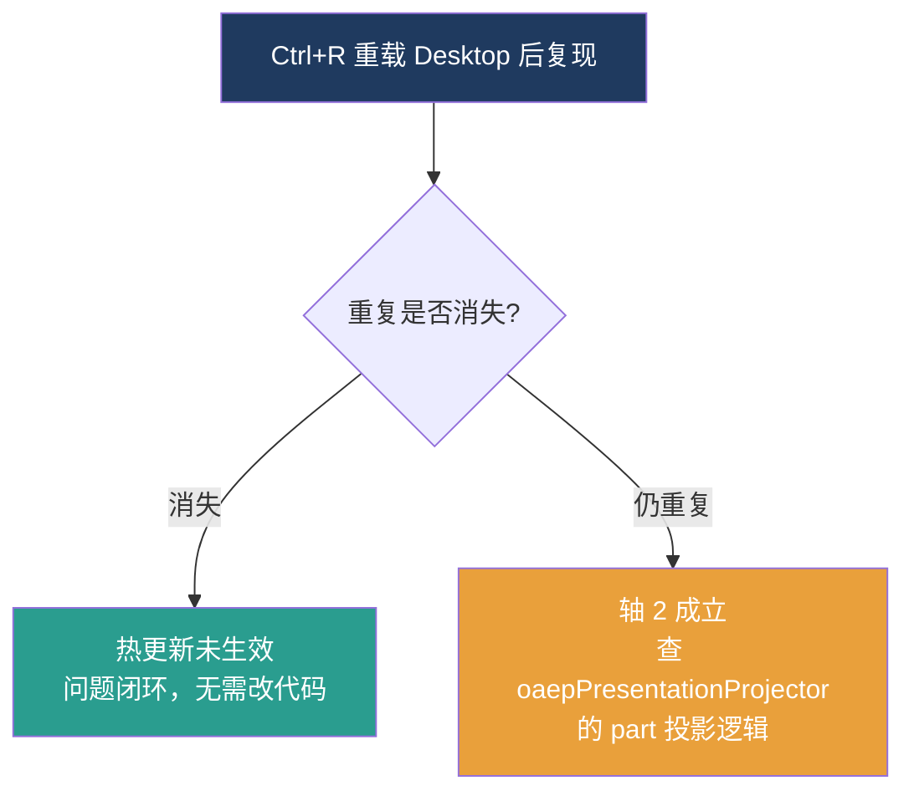

# 本次错误总结 · 框架图

配套文件：`本次排查复盘框架图.png`（示意渲染）、`本次排查复盘框架图.md`（文字版）

---

## 图 1：排查时间线（哪个环节出的错）

## 图 2：核心错误 —— 验证层级错位

**关键**：Node 侧测试通过 ⇒ **源逻辑正确**；
但它**推不出**「用户界面已生效」。中间那道虚线必须实测。

## 图 3：错误归类

## 图 4：根因结构（两个重复轴）

---

## 待验证分支

