# OpenDrSai Agent 运行时可编辑、可重放第二阶段开发方案

> 状态：Draft
>
> 适用范围：OpenDrSai Runtime、OAEP、OWOP、Windows Desktop
>
> 前置方案：[Agent 运行时可追溯、可复现第一阶段开发方案](./agent-runtime-traceability-reproducibility-phase1-development-plan.md)
>
> 阶段关键词：不可变原始运行、实验分支、显式覆盖、受控重放、隔离副作用、运行对比、可审计采纳

## 1. 阶段判断

第一阶段把 Agent Run 转换为可查看、可验证的对象。第二阶段在此基础上，使用户能够安全地回答并执行以下问题：

1. 如果修改输入、模型、Prompt、Skill 或工具策略，结果会怎样？
2. 能否从某个历史步骤创建实验，而不覆盖原始运行？
3. 哪些历史结果可以复用，哪些步骤必须重新执行，哪些外部副作用必须禁止？
4. 新旧运行的结果、成本、步骤、文件变更和风险有何差异？
5. 实验结果如何经过审查后采纳到当前工作区？

第二阶段不是允许用户改写历史，也不把“再次运行”包装成确定性复现。所有编辑都生成版本化草稿；所有执行都生成新的 Run；原 Run、Item、Event 和 Manifest 始终保持不可变。

上一阶段审计发现的证据真实性、真实执行 E2E、发布门禁、分页和用户错误解释问题，是第二阶段的强制入口门槛。入口门槛未满足时，Desktop 不得开放“创建实验分支”和“重放”能力。

## 2. 总体目标

### 2.1 用户目标

完成后，用户应当能够：

1. 从聊天摘要、运行检查器或指定 Item 创建一个实验分支；
2. 在 Desktop 的“运行实验”界面编辑允许覆盖的输入和配置，并随时恢复原值；
3. 在执行前看到重放起点、将复用的证据、将重新执行的步骤、外部副作用和预计影响范围；
4. 选择安全的重放模式并完成必要审批；
5. 在隔离工作区中执行新 Run，不污染原始 Run 和当前工作区；
6. 并排比较基线与实验 Run 的结果、步骤、成本、错误、产物和文件差异；
7. 看到“为什么不同”和“哪些差异无法归因”的清晰说明；
8. 经过预览和审批，将选定文件或产物采纳回当前工作区；
9. 放弃实验时清理临时执行资源，同时保留必要的审计和谱系记录；
10. 导出脱敏的实验包，用于离线验证、问题报告或后续评测。

### 2.2 工程目标

1. 建立不可变的 `parent_run_id + forked_from_item_id` 运行谱系；
2. 建立版本化的配置覆盖契约，禁止自由 JSON 直接进入执行器；
3. 区分“从头重新运行”“从检查点继续”“复用记录结果”和“真实重新执行”；
4. 以策略引擎决定 Tool 是否可复用、可只读重放、必须隔离执行或必须阻止；
5. 使用 OWOP Worktree/Checkpoint 作为代码与文件副作用隔离层；
6. 对基线和实验 Run 生成稳定、可解释的差异模型；
7. 让分支、执行、审批、采纳和清理形成完整审计链；
8. 让发布门禁执行真实命令，并把验收证据绑定到当前源码版本。

### 2.3 非目标

- 不修改、删除或覆盖历史 Run、Item、Event、Manifest；
- 不编辑模型已经产生的历史输出或 Tool Result；
- 不展示或编辑原始 chain-of-thought；
- 不承诺随机模型输出逐字一致；
- 不默认重新调用发送消息、支付、删除、发布、提交等有外部副作用的工具；
- 不在第二阶段实现通用可视化 Agent Workflow 编辑器；
- 不自动把实验结果合并到用户工作区；
- 不把 Workspace Checkpoint、Runtime Checkpoint 和 Git Commit 混为同一种对象；
- 不引入 LLM Space 的 Runtime、Thread JSON 或桌面框架，只借鉴实验、比较和可观测性思想。

## 3. 核心语义与安全边界

### 3.1 编辑不是修改历史

```text
原始 Run（不可变）
    └── Experiment Draft（可编辑、版本化、未执行）
            └── Replay Run（新的不可变 Run）
                    └── Comparison / Adoption（新的审计对象）
```

允许编辑的对象：

- 用户输入及附件引用；
- 模型选择和公开的推理参数；
- Agent definition、System Prompt 模板、Skill 选择；
- Tool allowlist、超时、重试和副作用策略；
- Workspace 基线或 Worktree 选择；
- 从哪个可恢复边界开始，以及如何处理历史 Tool Result。

不允许编辑的对象：

- 原 Run 的状态、时间、事件顺序和结果；
- 历史 Item/Event 正文；
- 审批决定、审计记录、证据摘要；
- 历史 Tool Result；
- 未公开推理内容和明文凭据。

### 3.2 重放模式

| 模式 | 含义 | 默认副作用策略 | 产品文案 |
|---|---|---|---|
| `rerun_from_start` | 使用指定配置从 Run 起点创建新执行 | 在隔离工作区执行；外部写入禁止 | 从头重新运行 |
| `resume_from_checkpoint` | 从经过验证的 Runtime Checkpoint 恢复模型/Agent 状态 | 在隔离工作区执行；外部写入禁止 | 从检查点继续 |
| `reuse_recorded_results` | 对满足条件的纯函数/只读工具复用已记录结果 | 不调用对应工具 | 复用已记录结果 |
| `reexecute_safe_steps` | 对允许的只读或幂等步骤真实重新执行 | 只读或隔离写入 | 重新执行安全步骤 |

如果目标 Item 没有完整 Runtime Checkpoint，系统不得声称“从此处继续”。它只能选择从头重新运行，并把历史消息作为上下文，或要求用户选择更早的可恢复边界。

### 3.3 Tool 重放分类

| 分类 | 例子 | P2 行为 |
|---|---|---|
| `pure` | 本地纯计算、确定性转换 | 可按输入、实现和结果 digest 复用 |
| `read_only_versioned` | Git ref 文件读取、带版本对象存储读取 | 可复用或重新读取，必须记录版本 |
| `read_only_volatile` | 网页、搜索、当前时间、实时数据库查询 | 默认重新读取并标记外部变化；也可显式复用历史结果 |
| `workspace_write_isolated` | 文件写入、格式化、代码生成 | 只允许在实验 Worktree/Checkpoint 隔离层执行 |
| `external_side_effect` | 发消息、发布、支付、删除远程对象 | 默认阻止；第二阶段不提供自动真实重放 |
| `unknown` | 未声明或第三方未知工具 | 默认阻止，fail closed |

Tool 分类必须来自版本化声明和执行策略，不能由 UI 根据工具名称猜测。

## 4. 整体解决方案

```mermaid
flowchart LR
    O["Original Run / Manifest"] --> D["Experiment Draft"]
    I["Selected Item / Checkpoint"] --> D
    D --> V["Draft Validator"]
    V --> P["Replay Planner"]
    P --> S["Side-effect Policy"]
    S --> A["Approval"]
    A --> W["Isolated Worktree / Checkpoint"]
    W --> X["New Replay Run"]
    X --> E["OAEP Events + New Manifest"]
    O --> C["Run Comparison"]
    E --> C
    C --> U["Desktop Experiment Workspace"]
    U --> R["Preview / Adopt / Discard"]
    R --> Q["Audit + Release Evidence"]
```



### 4.1 权威数据来源

| 数据 | 权威来源 | 约束 |
|---|---|---|
| 原始运行事实 | Runtime/OAEP | 永不由实验 UI 改写 |
| 实验草稿 | Runtime Experiment Store | 乐观并发、版本化保存 |
| 覆盖配置 | Typed Override Contract | allowlist、schema 校验、可计算 digest |
| 重放计划 | Replay Planner | 执行前生成，包含每步策略与风险 |
| 文件隔离 | OWOP Worktree/Checkpoint | 不直接写当前工作区 |
| 新运行事实 | 新 Replay Run/OAEP | 独立 run_id，保留父子谱系 |
| 对比结果 | Run Comparison Read Model | 可从两份权威 Run 重建 |
| 采纳结果 | OWOP/Git + Audit | 必须预览、审批、检测冲突 |

### 4.2 建议数据模型

```text
runtime_run_experiments
├── experiment_id                 PK
├── workspace_id / session_id
├── base_run_id                   FK
├── forked_from_item_id           nullable
├── forked_from_checkpoint_id     nullable
├── draft_version
├── title / status
├── overrides_json_encrypted
├── safe_summary_json
├── overrides_digest
├── replay_mode
├── created_by / created_at / updated_at
└── executed_run_id               nullable FK

runtime_replay_plans
├── replay_plan_id                PK
├── experiment_id / draft_version
├── base_manifest_digest
├── plan_json_encrypted
├── safe_plan_json
├── plan_digest
├── policy_version
├── approval_requirement
└── created_at / expires_at

runtime_run_relations
├── source_run_id
├── target_run_id
├── relation_type                 experiment_replay
├── source_item_id                nullable
├── experiment_id
└── created_at

runtime_run_comparisons
├── comparison_id                 PK
├── baseline_run_id / candidate_run_id
├── schema_version
├── comparison_json
├── comparison_digest
└── created_at
```

草稿可以修改；Replay Plan 绑定草稿版本和基线 Manifest digest，生成后不可变。草稿变化、基线证据变化或计划过期时，旧计划必须作废并重新生成。

### 4.3 API 草案

```http
POST   /v1/runs/{run_id}/experiments
GET    /v1/experiments/{experiment_id}
PATCH  /v1/experiments/{experiment_id}
DELETE /v1/experiments/{experiment_id}                 # 仅删除未执行草稿

POST   /v1/experiments/{experiment_id}/plan
GET    /v1/replay-plans/{replay_plan_id}
POST   /v1/replay-plans/{replay_plan_id}/execute

GET    /v1/runs/{run_id}/replay-boundaries
GET    /v1/runs/{run_id}/items/{item_id}/locator
GET    /v1/runs/{run_id}/relations

POST   /v1/run-comparisons
GET    /v1/run-comparisons/{comparison_id}

POST   /v1/run-comparisons/{comparison_id}/adoption-preview
POST   /v1/adoptions/{adoption_id}/apply
POST   /v1/adoptions/{adoption_id}/discard
```

执行接口必须携带 `draft_version`、`plan_digest`、`base_manifest_digest` 和幂等键。任一不匹配时返回冲突，不得静默使用最新配置。

## 5. 需要实现、更新或移除的模块

### 5.1 Runtime / Backend

新建：

- `runtime/experiments.py`：草稿、版本和不可变谱系；
- `runtime/replay_policy.py`：Tool 分类和副作用策略；
- `runtime/replay_planner.py`：边界检查、步骤决策和计划摘要；
- `runtime/run_comparison.py`：Run 级语义差异模型；
- `runtime/adoption.py`：采纳预览与审计协调；
- 相应 migration、schema 和测试 fixture。

更新：

- `runtime/engine.py`：新 Run 谱系、执行幂等、Manifest 封存事务；
- `runtime/run_inspection.py`：真实 Evidence Provider、关系和比较摘要；
- `runtime/journal.py`：数据库级 keyset pagination 和 Item locator；
- `runtime/security.py`：`operation_id` 与可选 `tool_id` 分离；
- `runtime/observability.py`：持久化指标与重放审计指标；
- `backend/gateway.py`：实验、计划、执行、比较、采纳 API 与授权。

### 5.2 OAEP / OWOP

更新：

- OAEP Run 的 `parent_run_id` 使用规则和 conformance fixture；
- 如跨端需要，增加 optional `relation_type`、`forked_from_item_id`；
- OWOP Worktree 创建、描述、合并、归档用于实验隔离；
- Workspace Checkpoint 只用于保护/恢复工作区，不承担 Runtime 状态恢复；
- Runtime Checkpoint 增加 schema、Agent state digest、模型上下文和兼容版本声明。

### 5.3 Desktop Main / Shared API

新建或更新：

- `shared/api/runExperiment.ts`：草稿、覆盖、计划、比较和采纳的联合类型；
- `shared/main/runtimeClient.ts`：新增 API client、AbortSignal 和稳定错误映射；
- `shared/api/desktopApi.ts`、preload、IPC allowlist：最小能力暴露；
- 原生 Manifest/Experiment 包保存：Save Dialog、原子写入、摘要回执；
- Worktree、Approval Center 和 Agent Run journal 的关联。

### 5.4 Desktop Renderer

新建：

- `RunExperimentPanel`：创建和编辑实验；
- `ReplayPlanReview`：执行前计划与风险审查；
- `RunComparisonView`：基线/实验并排对比；
- `AdoptionPreviewDialog`：文件和产物采纳预览。

更新：

- `RunInspectorPanel`：增加“创建实验”，重排普通用户首屏；
- `StructuredMessageParts`：显式传递 `runtimeRunId/oaepItemId`；
- `ChatWorkspace`：权威 RunSummary 和 Manifest 缓存；
- `App/WorkspaceShell/navigation`：实验和比较导航状态；
- 样式、键盘操作、焦点管理和本地化文案。

### 5.5 需要移除或替换

| 当前实现 | 处理方式 |
|---|---|
| Manifest 中的占位版本和 ID 字符串 digest | 移除，替换为真实 Evidence Provider；未知值保持缺失 |
| GET Manifest 时惰性创建或封存 | 移除写副作用，替换为终态事务和显式修复任务 |
| `activity.id` 默认作为 OAEP Item ID | 移除，使用显式 `oaepItemId` |
| Renderer Blob 下载 | 替换为 Desktop 原生保存和完整性回执 |
| `operation` 填入 `tool_id` | 移除，审计模型分离两种字段 |
| 通用生产路径的离线 Auth bypass | 移出生产授权路径，替换为测试身份注入或正式测试 Token |
| 全量读 Item 后在 Python 分页 | 替换为数据库 keyset pagination 和聚合查询 |
| 保存 JSON 即视为发布验收证据 | 替换为绑定 commit/source digest 的可执行证明 |
| “从任意 Item 继续”文案 | 移除；只有存在兼容 Checkpoint 才显示“从此处继续” |
| 默认重放外部副作用工具 | 禁止；未知工具和外部写工具 fail closed |

## 6. 功能点、测试与验收

每个功能点只有在实现、自动化测试、真实链路证据和发布台账四者同时存在时才算完成。

### M20：P1 可信基础修复

| ID | 功能点 | 自动化测试 | 验收标准 |
|---|---|---|---|
| M20-01 | 真实 Evidence Provider | 针对 runtime/backend/agent/model/prompt/skill/tool/workspace 构造已知和未知 fixture | 不再出现占位证据；已知值与实际版本/digest 一致；未知值正确降级 |
| M20-02 | Manifest 只在写路径封存 | completed/failed/cancelled、进程崩溃、恢复协调、并发 GET 测试 | GET 不产生数据库写入；所有新终态 Run 在返回终态前已封存 |
| M20-03 | Inspection DB 分页和 locator | 0/10k/100k Item、同 sequence、组合过滤、随机深链测试 | 无重复遗漏；深链最多 2 次查询；100k 首屏本地 P95 ≤ 500ms |
| M20-04 | 生产授权与审计语义修复 | 离线伪造、测试 Token、跨 Workspace、operation/tool audit fixture | 生产模式不能通过 dev flag 绕过；非 Tool 操作不产生伪 tool_id |
| M20-05 | 可执行发布证明 | 故意失败命令、旧 commit 回执、篡改 JSON、超时和取消测试 | 任一命令未执行、失败、证据过期或源码摘要不符时 gate fail closed |

### M21：实验草稿与不可变谱系

| ID | 功能点 | 自动化测试 | 验收标准 |
|---|---|---|---|
| M21-01 | 从 Run 创建 Experiment Draft | 成功/失败/取消/历史 Run、跨 Workspace、重复幂等请求 | 草稿引用唯一 base run；原 Run 数据和 digest 完全不变 |
| M21-02 | 从 Item 创建草稿 | 有/无 Item、错误 Run、被过滤 Item、未知 Item 类型 | `forked_from_item_id` 必须属于 base run；不存在时不创建半成品草稿 |
| M21-03 | 草稿版本与乐观并发 | 双窗口并发保存、旧 version 更新、网络重试 | 不丢覆盖值；旧 version 返回 409；相同幂等键不产生重复版本 |
| M21-04 | Run 关系查询 | 一对多、多层分支、删除未执行草稿、保留已执行关系 | 能从任一 Run 找到父、子和实验；已执行谱系不可删除 |

### M22：类型化编辑与验证

| ID | 功能点 | 自动化测试 | 验收标准 |
|---|---|---|---|
| M22-01 | 输入、附件和资源覆盖 | Unicode、大文本、内容 digest、失效引用、敏感内容测试 | 引用身份和内容摘要明确区分；失效资源阻止执行或显式降级 |
| M22-02 | 模型与公开参数覆盖 | provider/model/revision、温度边界、未知字段、不可用模型 | 只接受 allowlist 字段；执行前解析到真实模型身份 |
| M22-03 | Prompt、Agent、Skill、Tool 配置覆盖 | 版本不存在、digest 漂移、被禁 Skill、Tool schema 变化 | 每项覆盖显示原值/新值/来源；不可解析配置不能生成执行计划 |
| M22-04 | 恢复原值和变更摘要 | 单项/全部恢复、撤销重做、保存后重开 | 恢复后 overrides digest 与空覆盖一致；UI 摘要与后端安全摘要一致 |
| M22-05 | 凭据引用 | 缺失凭据、过期凭据、跨用户引用、导出扫描 | 草稿只保存 credential reference；API、日志、导出和 Renderer 无明文凭据 |

### M23：可恢复边界与 Replay Plan

| ID | 功能点 | 自动化测试 | 验收标准 |
|---|---|---|---|
| M23-01 | 计算可恢复边界 | message/tool/approval/checkpoint/terminal Item 全覆盖 | 只有状态和版本完整的 Runtime Checkpoint 标记为 resumable |
| M23-02 | 生成逐步 Replay Plan | 各 Tool 分类、缺失声明、模型变化、Workspace 漂移 | 每步明确 reuse/reexecute/isolate/block 和原因；未知项默认 block |
| M23-03 | Plan 绑定与过期 | 修改草稿、Manifest digest 改变、策略升级、超时 | 旧 plan 不能执行；用户必须查看重新生成的差异 |
| M23-04 | 影响和成本预估 | 有/无 usage、超大 Run、外部调用和文件写入 fixture | 不能估算时显示未知；不得伪造精确成本；风险步骤完整列出 |

### M24：Tool 重放与副作用控制

| ID | 功能点 | 自动化测试 | 验收标准 |
|---|---|---|---|
| M24-01 | Pure Tool 结果复用 | 输入/实现/schema/result digest 匹配和不匹配 | 仅四项全部匹配时复用；复用结果有来源 Event 引用 |
| M24-02 | 只读易变 Tool 策略 | 网页内容变化、数据库 snapshot、时间/随机源 | 用户可选历史结果或重新读取；比较结果标注外部变化 |
| M24-03 | Workspace 写入隔离 | 文件新建/修改/删除、命令中止、Worktree 创建失败 | 所有写入只发生于实验 Worktree；失败时当前工作区零变化 |
| M24-04 | 外部副作用阻断 | 发消息、远程删除、支付、发布、未知 MCP Tool | 默认计划为 blocked；绕过 UI 直接调用执行 API 仍被后端拒绝 |
| M24-05 | 审批与策略版本 | 低/中/高风险、审批过期/拒绝/恢复 | 执行使用 plan 中的策略版本；审批拒绝不创建运行副作用 |

### M25：Replay Run 执行与恢复

| ID | 功能点 | 自动化测试 | 验收标准 |
|---|---|---|---|
| M25-01 | 原子创建 Replay Run | 创建、Manifest、关系、Worktree 任一点故障注入 | 不出现已执行但无谱系/Manifest/隔离工作区的新 Run |
| M25-02 | 四种重放模式执行 | 每种模式的成功、失败、取消、等待审批场景 | 实际行为与 plan 一致；Run Manifest 记录 replay mode 和 plan digest |
| M25-03 | 幂等执行和并发保护 | 双击、网络重试、多窗口、重复幂等键 | 同一 plan/幂等键最多产生一个 replay run |
| M25-04 | 断线、重启和恢复 | 模型流、Tool、审批和终态封存阶段分别崩溃 | 恢复不重复副作用；Run/Item/Event 顺序稳定；谱系不丢失 |
| M25-05 | 取消与迟到事件隔离 | 各执行阶段取消、terminal 后 delta/tool result | 已完成证据保留；终态后迟到事件不改变最终结果和比较摘要 |

### M26：运行比较与解释

| ID | 功能点 | 自动化测试 | 验收标准 |
|---|---|---|---|
| M26-01 | 结果与状态对比 | success/failure/cancelled、文本和结构化结果 fixture | 用户能看到基线/实验结论和终态差异，不依赖原始日志 |
| M26-02 | 步骤对齐 | 相同 ID、重新生成 ID、插入/删除/重排 Tool 步骤 | 优先按 provenance 对齐，无法对齐时明确标记，不强行配对 |
| M26-03 | 文件、产物和使用量对比 | add/modify/delete/rename/binary、usage 缺失 | 文件差异基于 digest/OWOP；成本未知时不显示为 0 |
| M26-04 | 差异归因 | 单项覆盖、多项覆盖、模型随机性、外部数据变化 | 区分“已知配置差异”“外部依赖变化”“无法归因”，不做虚假因果结论 |
| M26-05 | Comparison digest 与缓存 | 顺序变化、重复生成、源 Run 更新保护 | 同一对不可变 Run 生成相同 digest；缓存损坏可从事实源重建 |

### M27：采纳、放弃与资源生命周期

| ID | 功能点 | 自动化测试 | 验收标准 |
|---|---|---|---|
| M27-01 | 采纳预览 | 当前工作区干净/脏、文件冲突、删除、二进制文件 | 执行前显示完整变更和冲突；预览 digest 绑定当前工作区状态 |
| M27-02 | 选择性采纳 | 全部/部分文件、产物、重命名、依赖文件漏选 | 只应用用户选中且通过依赖校验的内容；其余保持隔离 |
| M27-03 | 审批与原子应用 | 预览后工作区变化、写入中故障、审批拒绝 | stale preview 必须重新生成；故障可恢复，不留下半应用状态 |
| M27-04 | 放弃和清理 | 未执行草稿、已执行实验、活跃进程、锁定 Worktree | 临时进程和 Worktree 安全清理；谱系、比较和审计按保留策略存在 |
| M27-05 | 清理策略 | 到期、空间上限、被固定实验、导出中的实验 | 不清理当前执行/固定/待采纳对象；清理可审计且不破坏原 Run |

### M28：Desktop 实验工作区与易用性

| ID | 功能点 | 自动化测试 | 验收标准 |
|---|---|---|---|
| M28-01 | 一步创建实验 | Chat Run、Inspector Run、具体 Activity、键盘操作 | 一次操作进入正确基线；Activity 只有显式 oaepItemId 才聚焦 Item |
| M28-02 | 类型化编辑表单 | 中英文、键盘、缩放、窄窗口、字段校验和恢复 | 普通用户无需编辑 JSON；错误在字段附近解释；可恢复原值 |
| M28-03 | 执行前计划审查 | reuse/reexecute/block、风险、费用未知、审批状态 | 用户在一个界面理解将发生什么；blocked 项不能通过主按钮执行 |
| M28-04 | 运行比较界面 | 空、加载、超大结果、文件 diff、无法对齐场景 | 首屏优先展示结果、文件和风险；技术 ID 收入可展开区域 |
| M28-05 | 采纳交互 | 原生 Dialog、焦点锁定、Esc、屏幕阅读器、确认后回执 | 核心流程全键盘可完成；采纳后显示路径、摘要和审计回执 |
| M28-06 | 错误与缺失证据解释 | 404/403/409/离线/损坏/策略阻止/资源失效 | 显示可行动的本地化文案和重试/修复入口；技术详情含 correlation ID |

### M29：安全、隐私与审计

| ID | 功能点 | 自动化测试 | 验收标准 |
|---|---|---|---|
| M29-01 | 实验授权边界 | owner/editor/viewer、跨 workspace、猜测 ID | viewer 只能查看允许的安全视图；不能创建、执行或采纳 |
| M29-02 | 全链路审计 | 创建、编辑、计划、审批、执行、比较、采纳、清理 | 能回答谁在何时基于哪个 Run 做了什么；不记录正文秘密 |
| M29-03 | 脱敏与导出 | Secret corpus、Prompt、URL credential、路径、MCP payload | API、日志、UI、导出和异常中均无测试秘密；导出可离线验 digest |
| M29-04 | 策略绕过防护 | 直接 API、篡改 plan、过期审批、伪造 Tool 分类 | 所有关键约束由后端执行；绕过 Renderer 无效 |
| M29-05 | 保留和删除语义 | 删除草稿、用户数据清理、审计保留、引用中的 Run | 删除行为符合数据策略；不得悬空已执行 Run 谱系 |

### M30：性能、可观察性与兼容性

| ID | 功能点 | 自动化测试 | 验收标准 |
|---|---|---|---|
| M30-01 | 大 Run 编辑与比较性能 | 10k/100k Item、1k 文件变更、10MB 单 Item | 首屏本地 P95 ≤ 1s；DOM 常驻节点 ≤ 300；交互不冻结 |
| M30-02 | 缓存和请求控制 | 流式消息、快速切换 Run、取消请求、离线恢复 | 不发生 Manifest 请求风暴；过期响应不能覆盖当前选择 |
| M30-03 | 持久化指标 | 进程重启、直方图、错误码、隐私扫描 | 可查询 plan/execute/compare/adopt 延迟和失败率；指标无正文 |
| M30-04 | Schema 与跨版本兼容 | N/N-1 schema、未知 optional 字段、旧 Run、策略升级 | 旧 Run 可查看和从头实验；不能安全恢复时明确禁用 resume |
| M30-05 | Windows 与远程工作区 | 本地、SSH、路径大小写、断线、Worktree 能力缺失 | 能力缺失时降级为只读比较或禁止执行，不污染远端工作区 |

### M31：真实 E2E 与发布门禁

| ID | 功能点 | 自动化测试 | 验收标准 |
|---|---|---|---|
| M31-01 | 正式 execute 路径的确定性 E2E | 使用受控模型但走真实 execute、Tool dispatcher、OAEP 和 Manifest | 不允许 fixture 直接 append 事件代替执行；身份可从 UI 核对到 DB |
| M31-02 | 真实 Backend smoke | 可用账号环境中的真实模型和只读 Tool 场景 | 不要求输出相同，但谱系、策略、证据和终态完整；放入 nightly/RC |
| M31-03 | Windows Desktop 场景 G–N | 启动真实 Gateway/Electron，执行本方案第 8 节 | UI、API、OAEP、DB、Worktree 和导出证据交叉一致 |
| M31-04 | 可执行 Release Gate | gate 实际启动阻断命令并生成 attestation | attestation 包含 commit、source digest、命令、退出码、时间、平台、产物 digest |
| M31-05 | 回归与故障注入 | P1 A–F、审批、取消、恢复、Worktree、清理全量联跑 | 不降低 P1 不可变性和隐私门槛；任一 P0/安全项失败即禁止发布 |

## 7. 测试分层与证据要求

| 层级 | 目标 | 必须证明 |
|---|---|---|
| Unit | digest、策略、分类、diff、状态机 | 所有分支和负面路径确定性通过 |
| Contract | Python/TypeScript/API/OAEP/OWOP | Schema N/N-1 兼容，未知字段安全降级 |
| Integration | Runtime + SQLite + Gateway + Worktree | 事务、幂等、授权、恢复和隔离成立 |
| Renderer | 表单、计划、比较、采纳、无障碍 | 不依赖 mock 才能证明的逻辑下沉到 integration |
| Performance | 10k/100k Item、1k 文件 | 在固定机器档位记录 P50/P95/P99 和内存 |
| Security | 身份、跨租户、Secret corpus、策略绕过 | 后端 fail closed，UI 绕过不改变结果 |
| Real E2E | 正式执行入口到 Desktop | 不直接注入结果；证据绑定当前源码 |

每份发布证据至少包含：

- `schema_version`；
- Git commit 和源文件快照摘要；
- 完整命令及退出码；
- 开始/结束时间和运行平台；
- 使用的 fixture/应用构建摘要；
- 结果文件 SHA-256；
- 是否使用受控模型、真实模型或模拟外部服务；
- 明确的证明范围和未证明范围。

## 8. 真实端到端验收场景

### 场景 G：修改 Prompt 从头重新运行

- 从成功 Run 创建实验；
- 只修改公开 Prompt 模板；
- 在实验 Worktree 中从头运行；
- 验收原 Run digest 不变，新 Run 有父子关系和覆盖摘要；
- 对比界面明确显示 Prompt 变化、结果变化和不可归因变化。

### 场景 H：从有效 Runtime Checkpoint 继续

- 在 Tool 前生成包含 Agent state digest 的 Runtime Checkpoint；
- 从该边界创建实验并修改后续参数；
- 验收计划显示 checkpoint compatibility；
- 执行不重复 checkpoint 前的副作用，恢复后顺序稳定。

### 场景 I：不存在 Checkpoint 的历史 Item

- 用户从普通 message/tool Item 创建实验；
- 系统不得显示“从此处继续”；
- 允许改为“从头重新运行并携带历史上下文”，或选择更早边界；
- 验收产品文案与实际行为一致。

### 场景 J：复用 Pure Tool、重新读取易变 Tool

- 同一计划包含 pure、read-only-versioned 和 volatile Tool；
- 验收 pure Tool 未被重新调用且引用历史 Event；
- volatile Tool 真实重读并在比较中标记外部数据变化。

### 场景 K：阻止外部副作用

- 基线 Run 包含发送消息或远程删除 Tool；
- Replay Plan 将对应步骤标记 blocked；
- UI 和直接 API 均无法执行；
- 审计记录策略阻止，但不记录敏感参数。

### 场景 L：隔离文件写入和选择性采纳

- 实验新增、修改、删除多个文件；
- 当前工作区在实验期间保持不变；
- 用户只选择其中两个文件采纳；
- 验收未选文件不进入当前工作区，采纳有预览 digest 和审计回执。

### 场景 M：并发编辑与 stale plan

- 两个窗口编辑同一草稿；
- 一个窗口保存后，另一个窗口旧版本保存失败；
- 草稿更新后旧 Replay Plan 执行失败；
- 重新生成计划后才能执行。

### 场景 N：执行中崩溃、恢复和放弃

- 分别在模型流、Tool 执行、终态封存和采纳阶段注入崩溃；
- 验收不重复外部/文件副作用，不产生孤立关系；
- 放弃后临时资源清理，原 Run 和审计仍可查看。

## 9. 实施顺序与阶段门槛

### P2.0：可信基础

实施 M20。

门槛：发布门禁真实执行；P1 正式 execute E2E 通过；Manifest 无占位证据；GET 只读；数据库分页通过 100k 测试。

### P2.1：草稿、谱系和计划

实施 M21–M23，不开放真实执行。

门槛：用户可安全创建和编辑草稿；所有覆盖类型化；Plan 可解释并对未知 Tool fail closed。

### P2.2：隔离重放

实施 M24–M25，先开放 `rerun_from_start` 和 `reuse_recorded_results`，随后开放有兼容 Checkpoint 的 resume。

门槛：所有文件写入隔离；外部副作用不可执行；重试和恢复不重复副作用。

### P2.3：比较和采纳

实施 M26–M28。

门槛：比较不做虚假因果归因；采纳必须预览、审批、检测 stale state 并原子应用。

### P2.4：发布验收

实施 M29–M31，执行场景 G–N。

门槛：安全、隐私、真实 E2E、性能和源码绑定证据全部通过；任一 P0 项缺失时 release gate fail closed。

## 10. 发布总验收标准

第二阶段只有同时满足以下条件才可标记完成：

1. 原始 Run、Item、Event、Manifest 在所有编辑、重放、采纳和清理后 digest 不变；
2. 每个实验 Run 都能追溯到唯一基线 Run、草稿版本、Replay Plan 和可选源 Item/Checkpoint；
3. 没有有效 Runtime Checkpoint 时，产品和 API 均不声称从中间继续；
4. Tool 策略由后端执行，未知和外部副作用工具默认阻止；
5. 文件写入只发生在隔离 Worktree，采纳前当前工作区保持不变；
6. 重试、双击、断线和进程重启不会重复执行同一计划或副作用；
7. 用户可以在不阅读日志和 JSON 的情况下完成创建、编辑、审查、执行、比较和采纳；
8. 比较结果区分已知配置差异、外部依赖变化和无法归因，不承诺模型确定性；
9. 所有关键写操作有授权、审批和不含秘密正文的审计记录；
10. API、Renderer、日志、导出和验收产物通过 Secret corpus 扫描；
11. 100k Item Run 能通过规定的 API、深链和 UI 性能门槛；
12. 场景 G–N 通过正式 Runtime execute、Gateway 和 Windows Desktop 链路；
13. Release Gate 实际执行命令，验收证明与当前 commit/source digest 一致；
14. P1 场景 A–F 全量回归通过，且不降低不可变性、授权、隐私和恢复能力；
15. 所有 M20–M31 功能点都有实现、自动测试、真实证据和机器可读台账。

## 11. 主要风险与控制措施

| 风险 | 控制措施 |
|---|---|
| 用户误以为编辑了历史 | 所有入口使用“创建实验”，原 Run 始终只读并显示基线标识 |
| 把重新运行误称为确定性复现 | UI 明确模式和证据级别；比较不使用“相同输出”承诺 |
| Tool 被重复执行产生副作用 | 后端 Tool 分类、plan digest、幂等键、隔离和 fail closed |
| Checkpoint 状态与新版本不兼容 | Checkpoint schema、Agent/模型/工具版本 digest 和 compatibility gate |
| Worktree 与当前工作区冲突 | 实验期间隔离；采纳前重新计算 preview digest 和冲突 |
| 草稿或计划泄露 Prompt/凭据 | 加密正文、安全摘要、credential reference 和全链路 secret scan |
| 比较器给出错误因果结论 | 只报告可证明关联，其他差异标记为外部变化或无法归因 |
| 发布证据陈旧或伪造 | 命令实际执行，attestation 绑定源码和构建摘要，gate fail closed |

## 12. P3 接口预留

第二阶段可以预留但不开放：

- 多实验批量矩阵和参数搜索；
- Rubric、Judge、人工评分和统计显著性；
- 自动选择最佳分支；
- 可编辑 Tool Result 的纯模拟沙箱；
- 跨机器可移植执行环境和容器镜像封存；
- 多 Agent 分支合并和协同实验；
- 实验模板、数据集和持续回归评测。

P3 开始前必须重新评审评测偏差、Judge 模型可信度、成本上限、数据集隐私、并发副作用和自动采纳风险。
