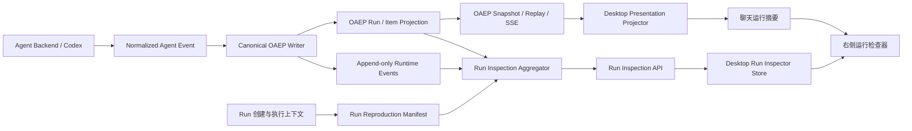

# OpenDrSai Agent 运行时可追溯、可复现第一阶段开发方案

> 状态：Draft
>
> 适用范围：OpenDrSai Runtime、OAEP、Windows Desktop
>
> 关联研究：[LLM Space 集成评估](../references/agent-development/llm-space/integration.md)
>
> 本阶段关键词：运行摘要、只读运行检查器、不可变证据、复现清单、投影一致性

## 1. 背景与阶段判断

OpenDrSai 已经具备 Runtime Run、append-only Runtime Event、OAEP Session/Run/Item/Event、
Snapshot/Replay/SSE、Desktop Structured Conversation 等基础。当前主要问题不是“没有运行数据”，而是：

1. 普通用户只能看到聊天结果，不能快速回答“这次运行经历了什么、为什么失败”；
2. 开发者能读取调试日志，但缺少以 Run 为中心、稳定且可导航的检查界面；
3. 运行配置、版本、输入资源和环境证据没有形成一份可验证的复现清单；
4. 实时显示、历史加载、断线恢复和重启恢复虽然共用 OAEP 基础，尚未成为产品级可验收的
   “同一 Run、同一证据、同一投影”承诺；
5. 当前“重新运行”容易被理解成复现，但没有先说明模型随机性、外部数据变化和工具副作用，
   不能把“再次执行”与“可复现”混为一谈。

第一阶段因此先完成只读证据闭环，不实现历史编辑、分支运行、Tool Result 模拟、A/B 评测或
外部工具重放。

## 2. 实现目标

### 2.1 用户目标

完成后，用户应当能够：

1. 在当前聊天消息中看到每次 Agent Run 的状态、耗时、关键步骤、错误和产物摘要；
2. 点击“查看运行”在 Desktop 右侧打开运行检查器；
3. 按时间线查看消息、公开推理摘要、计划、命令、工具、文件变更、审批、子任务、产物和错误；
4. 从任一界面元素追溯到稳定的 `run_id`、`item_id` 和必要时的 `event_id/sequence`；
5. 刷新、断线或重启 Desktop 后看到与实时运行结束时相同的结构化结果；
6. 查看并导出脱敏的“复现清单”，知道本次运行是否具备 `exact`、`compatible`、`partial`
   或 `unavailable` 级别的复现证据；
7. 清楚知道哪些证据缺失、哪些外部依赖可能已经变化，而不是得到虚假的“完全可复现”承诺。

### 2.2 工程目标

1. Runtime journal/OAEP 继续作为运行事实来源，Desktop 不建立第二套权威历史；
2. 运行事件保持 append-only，历史投影和复现清单可由权威数据重新生成；
3. Run 创建时固化最小运行配置快照，Run 终止时补齐结果、用量和产物摘要；
4. 建立类型化 Run Inspection API，避免 UI 直接解析 Backend 私有事件；
5. 实时、Replay、Snapshot、进程重启四条路径的结构化投影 digest 一致；
6. 敏感字段默认不返回、不渲染、不写前端日志；
7. 为第二阶段不可变分支重放准备稳定的数据契约，但本阶段不执行重放。

### 2.3 非目标

- 不编辑或覆盖已发生的 Run、Item、Event；
- 不展示原始 chain-of-thought，只展示 Backend 明确允许公开的 reasoning summary/commentary；
- 不从任意历史 Item 继续执行；
- 不重新执行 Tool Call，不模拟 Tool Result；
- 不做 Prompt、Skill、模型配置编辑；
- 不做 A/B 对比和 rubric 评测；
- 不保证随机模型输出逐字一致；
- 不把 LLM Space runtime、Thread JSON、Bun 或 Electrobun 引入 OpenDrSai。

## 3. “可追溯”与“可复现”的阶段定义

### 3.1 可追溯

一个 Run 满足第一阶段可追溯要求，当且仅当：

- Run 有稳定身份、状态和时间范围；
- 用户可从 Run 到 Item，再到产生该 Item 的 Event；
- 事件顺序连续，重复消费不会产生重复 UI 对象；
- 工具、命令、文件、审批、子任务和产物保留来源与状态；
- 错误能关联到失败 Run 和相关 Item；
- 原始证据与用户安全视图分离，脱敏不会破坏身份关联。

### 3.2 可复现

第一阶段的“可复现”指**可重建和可验证**，不是自动重放：

1. **展示可重建**：从 OAEP Event 0、Snapshot 或中断后的 Replay 能重建同一结构化运行视图；
2. **配置可核对**：保存足够的模型、Agent、Prompt、Skill、Tool、输入资源、代码和运行环境证据；
3. **完整性可判断**：系统明确计算复现等级和缺失项；
4. **证据可携带**：用户可以导出不含秘密的复现清单及 digest。

复现等级定义：

| 等级 | 条件 | 产品文案 |
|---|---|---|
| `exact` | 关键配置和输入均有不可变版本或内容 digest，且无未记录外部依赖 | 复现证据完整 |
| `compatible` | 关键配置完整，但模型服务、OS 或工具只能固定兼容版本 | 可在兼容环境复现 |
| `partial` | 可重建轨迹，但存在未固定模型、外部 URL、工作区脏状态等 | 部分可复现 |
| `unavailable` | 缺少关键输入、配置快照或事件不完整 | 暂不可复现 |

复现等级只评价证据完整性，不承诺模型输出逐字相同。

## 4. 产品范围与用户界面

### 4.1 一级入口：聊天中的运行摘要

在现有 `StructuredMessageParts` 基础上升级，不新建一级页面。每个 Assistant Run 显示：

- 状态：运行中、等待用户、已完成、失败、已取消；
- 时长和开始/结束时间；
- 关键步骤计数：工具、命令、文件、审批、子任务、产物；
- 最重要的失败原因或警告；
- 复现等级徽标；
- “查看运行”按钮。

摘要必须保持普通用户可读；`cursor`、`sequence`、Backend method、transport 等技术字段不进入默认卡片。

### 4.2 二级入口：右侧“运行”检查器

复用 Desktop 已有可调整宽度、可全屏展开的右侧面板，在 `RightTab` 增加 `run`：

```text
聊天消息或活动
  └─ 查看运行
      └─ 右侧 Run Inspector
          ├─ 概览
          ├─ 时间线
          ├─ 输入与配置
          ├─ 产物与变更
          ├─ 复现清单
          └─ 技术身份（按需展开）
```

时间线支持按类型和状态筛选；点击摘要中的某个工具、文件或错误时，检查器直接聚焦对应 Item。
本阶段所有字段只读。

### 4.3 与 Debug Panel 的边界

- Run Inspector 面向用户和 Agent 开发者，展示稳定、脱敏、协议级语义；
- Debug Panel 面向 OpenDrSai 本身的故障排查，可包含协议违规、transport 和内部诊断；
- Run Inspector 可以提供“打开技术诊断”跳转，但不复制 Debug Panel；
- 普通 Run 错误不能要求用户必须进入 Debug Panel 才能理解。

## 5. 整体架构



### 5.1 权威来源

| 数据 | 权威来源 | 说明 |
|---|---|---|
| Run 状态与身份 | Runtime Engine / OAEP Run | Desktop 不推断终态 |
| Item 当前状态 | OAEP Item Projection | completed 为最终权威字段 |
| 事件顺序与证据 | append-only Runtime/OAEP Event | `sequence` 为严格游标 |
| 配置与环境证据 | Run Reproduction Manifest | 创建前固化，终态补齐 |
| 用户显示状态 | Desktop Presentation Projector | 可从权威来源重建 |
| 技术诊断 | Runtime observability / Debug logs | 不成为普通 UI 事实来源 |

### 5.2 读取链路

1. 聊天实时显示继续消费 OAEP SSE；
2. 历史会话从 OAEP Snapshot 开始；
3. cursor 之后的增量通过 Replay/SSE 补齐；
4. 打开 Run Inspector 时读取类型化 Inspection API；
5. API 返回聚合摘要、分页 Item 时间线、安全配置视图和复现等级；
6. UI 使用 `run_id + item_id` 聚焦，必要时用 `event_id/sequence` 展开技术来源。

## 6. 数据模型与接口

### 6.1 Run Reproduction Manifest

建议新增独立表 `runtime_run_manifests`，避免把大量快照字段继续堆入 `runtime_runs`：

```text
runtime_run_manifests
├── run_id                    PK/FK
├── schema_version
├── manifest_json_encrypted  加密的完整清单
├── safe_summary_json        可直接返回的脱敏摘要
├── manifest_digest          规范化 JSON 的 SHA-256
├── reproducibility_level
├── missing_evidence_json
├── created_at
└── finalized_at
```

清单至少覆盖：

- Runtime、Backend、Adapter、mapping 和 OAEP 版本；
- Agent 定义 ID、版本或 digest；
- provider/model 的解析后身份及安全参数；
- System Prompt/模板、Skill、Tool schema 的版本或 digest；
- 用户输入、附件、资源引用的 digest；
- workspace、worktree、Git commit、dirty 状态；
- OS/架构和相关 runtime 版本的 allowlist；
- 外部依赖声明，如 URL、MCP 服务和不可固定的数据源；
- 安全策略版本和审批摘要；
- 缺失证据与复现等级。

API Key、Authorization Header、Cookie、明文秘密和不允许公开的 Prompt 内容不得进入 `safe_summary_json`。

### 6.2 Inspection Read Model

Inspection API 返回只读 read model，不把数据库行直接暴露给 Desktop：

```text
RunInspection
├── run
│   ├── id / session_id / status / timestamps
│   ├── backend / agent / model labels
│   └── error_summary
├── summary
│   ├── duration_ms
│   ├── counts_by_item_type/status
│   ├── artifact_count / warning_count
│   └── usage（有证据时）
├── timeline[]
│   ├── item_id / sequence / type / status
│   ├── safe_summary / timestamps / source
│   └── event_refs[]
├── manifest
│   ├── digest / level / missing_evidence[]
│   └── safe configuration and environment
└── page
    ├── next_cursor
    └── has_more
```

### 6.3 API

第一阶段新增或补齐：

```http
GET /v1/sessions/{session_id}/runs?cursor=&limit=&status=
GET /v1/runs/{run_id}/inspection?timeline_cursor=&limit=&type=&status=
GET /v1/runs/{run_id}/reproduction-manifest
GET /v1/runs/{run_id}/reproduction-manifest/export
```

约束：

- API 必须执行与 Run/Workspace 相同的授权和租户边界检查；
- timeline cursor 是稳定 Item 顺序游标，不复用 Session Event cursor；
- 导出结果默认脱敏，并包含 `schema_version`、`manifest_digest`、生成时间和缺失证据；
- `404` 表示对象不存在或不可见；证据缺失使用 `200 + unavailable/partial`，不能伪装成完整；
- 第一阶段没有 `POST replay`、`POST fork` 或历史更新接口。

### 6.4 OAEP 边界

第一阶段继续使用 OAEP v1 表达 Run、Item 和 Event，不要求为了 UI 再增加一套事件协议。
复现清单先作为 Runtime Inspection 扩展资源落地；待字段稳定、Android/Web 也需要消费时，再评估升级
OAEP schema。任何新增 OAEP 字段都必须保持 optional，并经过 schema、生成类型和跨端 drift gate。

## 7. 模块、功能点、测试与验收

以下每个功能点只有同时具备实现、自动测试和验收证据时才算完成。

### M01：追溯契约与身份

| ID | 实现内容 | 自动测试 | 验收标准 |
|---|---|---|---|
| M01-01 | 明确 Run → Item → Event 的稳定身份和引用规则 | 构造跨 Run 同名 Backend Item、重复事件和乱序 fixture | 任一可见 Item 能定位唯一 Run；重复消费不新增对象 |
| M01-02 | 统一 Run 状态、Item 状态和终态映射 | 状态机表驱动测试，覆盖非法回退和重复终态 | queued/running/waiting/completed/failed/cancelled 显示与 Runtime 一致 |
| M01-03 | 为 Inspection 定义版本化共享类型 | Python schema 与 TypeScript contract fixture | 后端响应、Desktop 类型和 fixture 无字段漂移 |
| M01-04 | 定义复现等级和缺失证据代码表 | 对 exact/compatible/partial/unavailable 做 table test | 同一 manifest 在不同进程中计算相同等级和原因 |

### M02：Runtime Manifest 与不可变证据

| ID | 实现内容 | 自动测试 | 验收标准 |
|---|---|---|---|
| M02-01 | 数据库迁移创建 `runtime_run_manifests` | 空库、旧库、重复迁移、回滚前向兼容测试 | 旧数据可读；迁移可重复执行；不改写 runtime_events |
| M02-02 | Run 执行前原子固化输入和配置清单 | 在 Run 创建、manifest 写入、execute 前注入故障 | 不允许出现“已执行但无 manifest”的新 Run；失败时事务一致 |
| M02-03 | Run 终态补齐用量、产物和完成信息 | completed/failed/cancelled/waiting fixture | 四类 Run 均有可计算的安全摘要；失败 Run 不丢证据 |
| M02-04 | 规范化 JSON 并计算 SHA-256 digest | 字段顺序、Unicode、时间格式、重复生成测试 | 相同语义清单 digest 相同；任一受保护字段改变则 digest 改变 |
| M02-05 | 完整清单加密、安全摘要单独存储 | 密钥轮换、无密钥、损坏密文和敏感 fixture | 明文数据库及日志中找不到测试秘密；损坏时降级 unavailable |
| M02-06 | 为历史 Run 惰性生成 partial/unavailable 清单 | 无配置、无附件、旧 Backend Run 的迁移测试 | 打开旧 Run 不报错，且明确显示缺失证据，不虚构快照 |

### M03：Run Inspection 聚合与 API

| ID | 实现内容 | 自动测试 | 验收标准 |
|---|---|---|---|
| M03-01 | Session Run 列表支持分页和状态筛选 | 0/1/500/5000 Runs、并发新增和 cursor 测试 | 顺序稳定、无重复无遗漏；过滤结果正确 |
| M03-02 | 聚合 Run 概览、计数、错误和用量 | 每种 OAEP Item/终态 golden fixture | 摘要计数与原始 Item 一致；未知字段不导致 500 |
| M03-03 | 分页返回安全时间线并支持类型/状态筛选 | 10k Item、边界 cursor、组合筛选测试 | 分页拼接结果等于未分页权威顺序 |
| M03-04 | 返回安全复现清单和导出文件 | JSON schema、digest、自包含导出测试 | 导出可离线校验 digest，且不包含凭据或绝对秘密路径 |
| M03-05 | 实施 Workspace/Run 授权边界 | owner/editor/viewer、跨 workspace、匿名请求测试 | 无权用户无法根据 ID 枚举 Run 或 manifest |
| M03-06 | 为缺失、损坏和不完整证据提供稳定错误语义 | 404、partial、unavailable、数据库损坏 fixture | UI 能区分不存在、暂不可复现和服务故障 |

### M04：OAEP 投影一致性

| ID | 实现内容 | 自动测试 | 验收标准 |
|---|---|---|---|
| M04-01 | Run/Item/Event 生命周期完整进入 OAEP | 十类 Item、七类 Delta、六类 Run 状态 contract test | 成功、失败、取消、等待审批都能从 Event 0 重建 |
| M04-02 | Realtime、Replay、Snapshot、重启恢复使用同一 projector/reducer | 同一 golden fixture 走四条路径并计算 digest | Part、Activity、文本、状态、稳定 ID 和顺序 digest 完全一致 |
| M04-03 | cursor gap、重复、倒退和过期处理 | 断线窗口、重复帧、gap、cursor_expired fixture | 不静默跳过事件；过期时原子切 Snapshot，且不重跑 Run |
| M04-04 | completed 权威校正和 terminal 后 Delta 隔离 | 短回答、长流、completed 不一致、terminal 后 delta | UI 无重复文本；违规只进诊断，不改变最终状态 |
| M04-05 | 未知 Item/Delta 安全降级 | 未来类型和超大未知 payload fixture | 以 Notice/诊断降级，不泄露 raw payload、不导致会话崩溃 |

### M05：聊天运行摘要

| ID | 实现内容 | 自动测试 | 验收标准 |
|---|---|---|---|
| M05-01 | 展示 Run 状态、时长和关键计数 | 运行中、等待、成功、失败、取消组件测试 | 状态与 Inspection/OAEP 一致，终态后不继续计时 |
| M05-02 | 展示安全错误摘要、产物和复现等级 | 错误、有/无产物、四种等级 fixture | 普通用户无需 Debug Panel 即可理解结果和证据完整性 |
| M05-03 | “查看运行”携带 runId 和可选 itemId 打开右栏 | 点击、键盘 Enter/Space、无 Inspection 能力测试 | 正确打开对应 Run；能力不可用时按钮隐藏或给出明确降级 |
| M05-04 | 长会话和流式更新保持稳定布局 | 500 Runs、持续 Delta、100/125/150% 缩放视觉测试 | 卡片不跳到错误消息；状态一行可读；滚动位置不异常跳动 |

### M06：Desktop Run Inspector

| ID | 实现内容 | 自动测试 | 验收标准 |
|---|---|---|---|
| M06-01 | `RightTab` 增加 `run`，接入现有折叠、缩放和全屏能力 | 导航 reducer、快捷键、折叠/展开测试 | 从聊天一次点击到达；关闭再打开保留当前 Run |
| M06-02 | 概览展示身份、状态、时间、错误、计数和版本标签 | 成功/失败/旧 Run snapshot test | 首屏不依赖 raw log；缺失字段显示“未记录”而非空白 |
| M06-03 | 时间线按稳定顺序渲染并支持筛选、虚拟化 | 全 Item 类型、组合筛选、10k Item 性能测试 | 可定位任一 Item；大 Run 不冻结 UI；筛选不改变原始顺序 |
| M06-04 | Item 详情显示安全输入、输出、状态和 Event 引用 | Tool/File/Approval/Subtask/Error 组件测试 | 技术身份可复制；秘密、绝对敏感路径和 raw CoT 不显示 |
| M06-05 | 从聊天活动深链并高亮指定 Item | 不存在、已分页、筛选隐藏、重复点击测试 | 自动加载目标页并聚焦；目标缺失时显示可恢复提示 |
| M06-06 | 复现清单展示等级、证据、缺失项和导出入口 | 四级清单、导出成功/失败、离线校验测试 | 用户能解释为何不是 exact；导出文件 digest 校验通过 |
| M06-07 | 加载、空、错误、离线和重连状态 | 延迟、超时、断网、Runtime 重启测试 | 已加载证据不消失；重试不创建新 Run、不重复时间线 |

### M07：安全、隐私与审计

| ID | 实现内容 | 自动测试 | 验收标准 |
|---|---|---|---|
| M07-01 | 统一 manifest/inspection 脱敏策略 | API Key、Bearer、Cookie、env secret、URL credential corpus | API、导出、Renderer、Debug bridge 中均无测试秘密 |
| M07-02 | 原始推理内容禁止进入普通检查器 | raw reasoning 与 public summary 对照 fixture | 只显示公开 summary；未知 reasoning 字段默认丢弃 |
| M07-03 | 文件和工作区路径按策略相对化 | Windows drive、UNC、`..`、远程路径测试 | 普通视图无越界绝对路径；允许资源仍可通过 OWOP 引用 |
| M07-04 | Inspection/manifest 读取产生安全审计记录 | 成功、拒绝、批量访问和导出测试 | 能审计谁在何时查看/导出哪个 Run，不记录正文秘密 |
| M07-05 | 导出文件有明确隐私提示和 schema 版本 | 快照/文案/文件 schema test | 用户在保存前知道文件包含的运行证据范围 |

### M08：性能、可访问性与可观测性

| ID | 实现内容 | 自动测试 | 验收标准 |
|---|---|---|---|
| M08-01 | Inspection 查询有索引、分页和有界 payload | query plan、1k/10k Item benchmark | 1k Item Run 首屏本地 P95 ≤ 500ms；单页响应有上限 |
| M08-02 | Renderer 虚拟化时间线、延迟展开大输出 | 10k Item、单 Item 10MB 安全样本 | 首屏交互 P95 ≤ 1s；大输出不一次性挂载到 DOM |
| M08-03 | 键盘、焦点、读屏和对比度支持 | axe、Tab 顺序、焦点恢复、缩放测试 | 核心路径无需鼠标；焦点从摘要正确进入/返回检查器 |
| M08-04 | 记录读取延迟、投影违规和不完整证据指标 | metrics unit test 和故障注入 | 指标不含正文；可区分 API 慢、投影违规和证据缺失 |

### M09：E2E、发布门禁与证据账本

| ID | 实现内容 | 自动测试 | 验收标准 |
|---|---|---|---|
| M09-01 | 建立脱敏 golden fixtures | fixtures schema、secret scan、版本校验 | fixtures 覆盖成功、失败、取消、等待和恢复，且可提交 Git |
| M09-02 | Windows Desktop 真实 Runtime E2E | 启动真实 Runtime 执行场景 A–F | UI、API、OAEP 和数据库身份可交叉核对 |
| M09-03 | 生成机器可读验收账本 | 校验每个功能点的实现、测试、证据链接 | 任一 P0 项缺证据时 release gate fail closed |
| M09-04 | 回归现有聊天、Debug、审批和恢复功能 | 现有 verify 脚本与新增 suite 联跑 | 不降低现有 OAEP V6、审批、取消和恢复能力 |

## 8. 端到端验收场景

### 场景 A：成功的工具型任务

执行一次包含模型输出、只读命令、文件读取和最终产物的任务。

验收：

- 聊天摘要显示完成、耗时、工具/文件/产物计数；
- Run Inspector 时间线顺序与 OAEP sequence 一致；
- 点击文件活动能定位对应 Item；
- 复现清单包含模型、Agent、代码和输入资源证据；
- 实时结束视图与重启后视图 digest 相同。

### 场景 B：Tool Call 失败

工具返回结构化错误，Agent 最终失败。

验收：

- 摘要显示用户可理解的失败原因；
- 时间线保留失败前全部步骤和失败 Item；
- `run_id/item_id/event_id` 可关联；
- 失败 Run 同样存在 manifest，不因未成功而丢失历史。

### 场景 C：等待审批后拒绝

Run 请求一次审批，用户拒绝，Run 收敛为取消或失败的权威状态。

验收：

- waiting/resumed/terminal 状态无虚假跳转；
- 审批请求和决定以安全摘要显示；
- 不展示敏感完整命令或凭据；
- 重启后决定和终态不改变。

### 场景 D：运行中取消

在模型 Delta 或工具输出阶段取消。

验收：

- 已提交事件全部保留；
- 未完成 Item 明确为 cancelled/failed，而非 completed；
- 终态后的迟到 Delta 不修改 UI；
- manifest 标记实际终止点和缺失结果。

### 场景 E：断线与 Runtime/Desktop 重启

分别在 reasoning、command output 和 final answer 阶段断线并恢复。

验收：

- Run 不被重新执行；
- cursor 连续，无重复 Item 和文本；
- cursor 过期时通过 Snapshot 原子恢复；
- 恢复结果与不中断基线 digest 相同。

### 场景 F：历史旧 Run

打开第一阶段上线前产生、没有完整配置快照的 Run。

验收：

- 现有轨迹仍可查看；
- 系统显示 `partial` 或 `unavailable` 及具体缺失项；
- 不把当前 Agent/模型配置冒充历史配置；
- 无 500、白屏或无限加载。

## 9. 实施顺序

### P0：契约和基线

1. 固化六类 E2E fixture 和当前投影 digest；
2. 定义 Inspection/Manifest schema、复现等级和错误代码；
3. 建立数据迁移、隐私和性能基线；
4. 建立功能点验收账本骨架。

门禁：契约评审通过；fixture 通过 secret scan；旧 OAEP fixture 全部通过。

### P1：Runtime 证据闭环

1. 实现 manifest 表、迁移、加密和 digest；
2. 在 Run 执行前原子固化清单，终态补齐；
3. 实现 Run list、Inspection、Manifest 和 export API；
4. 补齐授权、脱敏、分页和指标。

门禁：M01–M04、M07 的 Backend 项通过；真实失败 Run 也能生成清单。

### P2：Desktop 运行摘要和检查器

1. 为 `RightTab` 增加 `run`；
2. 实现 Inspection client/store、运行摘要和深链；
3. 实现概览、时间线、Item 详情和复现清单；
4. 完成虚拟化、加载/离线状态和可访问性。

门禁：M05、M06、M08 全部通过；从聊天一步打开正确 Run。

### P3：真实验收与发布

1. Windows 真实 Runtime 执行场景 A–F；
2. 验证实时/Replay/Snapshot/重启 digest；
3. 执行安全扫描、10k Item 和长会话性能测试；
4. 生成机器可读验收账本并接入 release gate。

门禁：所有 P0 功能点有实现、自动测试和真实证据；任一安全或一致性项失败则禁止发布。

## 10. 主要代码落点

### Runtime / Backend

- `cores/python/packages/drsai/src/drsai/backend/runtime/engine.py`
- `cores/python/packages/drsai/src/drsai/backend/runtime/migrations.py`
- `cores/python/packages/drsai/src/drsai/backend/runtime/oaep.py`
- `cores/python/packages/drsai/src/drsai/backend/runtime/normalized_writer.py`
- `cores/python/packages/drsai/src/drsai/backend/runtime/observability.py`
- `cores/python/packages/drsai/src/drsai/backend/gateway.py`
- 建议新增 `runtime/run_manifest.py` 和 `runtime/run_inspection.py`

### OAEP Contract

- `cores/protocol/oaep/oaep.schema.json`
- `cores/protocol/oaep/examples.json`
- `apps/desktop/shared/api/oaep.generated.ts`

第一阶段若无跨端需求，可不修改 OAEP schema；但现有 schema/conformance 测试仍是发布门禁。

### Desktop Main / Shared API

- `apps/desktop/shared/main/runtimeClient.ts`
- `apps/desktop/shared/main/oaepSessionStream.ts`
- `apps/desktop/shared/main/oaepPresentationProjector.ts`
- `apps/desktop/shared/api/structuredConversation.ts`
- `apps/desktop/shared/api/desktopApi.ts`
- 建议新增 `apps/desktop/shared/api/runInspection.ts`

### Desktop Renderer

- `apps/desktop/shared/renderer/src/navigation.ts`
- `apps/desktop/shared/renderer/src/App.tsx`
- `apps/desktop/shared/renderer/src/components/WorkspaceShell.tsx`
- `apps/desktop/shared/renderer/src/components/ChatWorkspace.tsx`
- `apps/desktop/shared/renderer/src/components/StructuredMessageParts.tsx`
- 建议新增 `components/RunInspectorPanel.tsx` 及其子组件

### Tests / Gates

- `cores/python/packages/drsai/tests/`
- `apps/desktop/shared/test-kit/`
- `apps/desktop/windows/scripts/verify-oaep-presentation-projector.mts`
- `apps/desktop/windows/scripts/verify-structured-message-renderer.mjs`
- 建议新增 `verify-run-inspection-contract.mts`、`verify-run-inspector-ui.mts`、
  `verify-run-reproduction-manifest.py`

## 11. 发布验收总门槛

第一阶段只有同时满足以下条件才可以标记完成：

1. 新产生的 Run 在执行前均有 manifest；失败和取消 Run 也不例外；
2. 每个可见时间线对象都有稳定 `run_id/item_id`，必要时能定位 Event；
3. 成功、失败、取消、等待审批和旧 Run 五类数据均能打开检查器；
4. 实时、Replay、Snapshot、重启四条路径的结构化 digest 一致；
5. 原始 Runtime Event 保持 append-only，UI 或导出不会修改历史；
6. 复现等级可解释，缺失证据不会被伪装为 exact；
7. API、导出、Renderer 和前端日志通过秘密扫描；
8. 普通检查器不展示 raw chain-of-thought；
9. 1k Item Run 首屏 API P95 不超过 500ms，10k Item 时间线可交互；
10. 核心路径可通过键盘完成，缩放和窄窗口下仍可读；
11. 场景 A–F 在真实 Windows Runtime/Desktop 上通过；
12. 机器可读验收账本完整，任何 P0 证据缺失时发布门禁失败关闭。

## 12. 第二阶段接口预留

第一阶段只预留、不开放以下概念：

- `relation_type=experiment_fork`；
- `parent_run_id` 与 `forked_from_item_id`；
- `configuration_overrides`；
- `replay_policy` 和 Tool 副作用分类；
- “从此处创建分支”按钮的 capability flag。

进入第二阶段前必须重新评审：工具幂等性、外部副作用审批、配置快照完整性、fork provenance、
新 Run 不覆盖原始证据，以及模型/Prompt/Skill/Tool 版本固定能力。第一阶段的“导出复现清单”不得在
产品文案或 API 上被误称为“已支持安全重放”。
