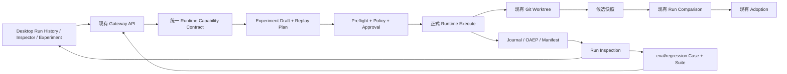

# OpenDrSai Agent 运行时可追溯、可复现第三阶段开发方案

> 状态：Draft
>
> 适用范围：OpenDrSai Runtime、Gateway、OAEP、Windows Desktop、`eval/regression`
>
> 前置方案：[P1 可追溯、可复现方案](./agent-runtime-traceability-reproducibility-phase1-development-plan.md)、[P2 可编辑、可重放方案](./agent-runtime-editable-replayable-phase2-development-plan.md)
>
> 参考研究：[LLM Space 集成评估](../references/agent-development/llm-space/integration.md)、[LLM Space v4.6.3 源码审阅](../references/agent-development/llm-space/source-review.md)
>
> 本阶段关键词：能力诚实、产品闭环、实时可见、安全重放、实验采纳、发布回归

## 1. 阶段判断

P1 已建立以 Runtime journal/OAEP 为事实来源的只读检查和复现清单；P2 已建立 Experiment、
Replay Plan、Replay Run、Comparison 和 Adoption 的主要骨架。当前主要问题不再是缺少概念或数据表，
而是若干能力只完成了“可保存、可规划、可测试”，尚未形成用户可理解、行为与界面承诺一致的完整链路：

1. Desktop 暴露了 Prompt、Agent、Skill、Tool、Resource、凭据和模型参数覆盖，但执行路径只实际应用
   输入、附件引用和 `model_id`；
2. 安全 Tool 重执行主要按 Tool kind/name 匹配，未绑定规范化参数和 schema/policy digest；
3. Replay execute 的能力检查、执行 claim 和 Worktree 创建顺序可能留下半执行状态或孤立资源；
4. Desktop 缺少统一 Run History，运行中的 Inspector 也不是实时更新；
5. Comparison 后端已有结果、步骤、文件、产物和用量数据，但 UI 未形成可读的基线/候选差异；
6. Adoption 依赖候选 Worktree 已提交且干净，真实 Agent 产生的未提交变更不能自然进入采纳；
7. `eval/regression` 已有 Case、Suite、Schema、Runner 和 Gate 骨架，但环境准备、证据完整性、
   语义评价和发布门禁尚未闭环；
8. 现有 P2 acceptance ledger 将部分“接口存在”误记为“端到端能力通过”。

第三阶段因此定位为**产品闭环和可信收敛阶段**。本阶段不继续横向增加实验能力，而是让已经公开的能力
真实生效、无法生效的能力明确隐藏或阻止，并用真实 Runtime、Desktop GUI 和发布回归证明完整链路。

## 2. 奥卡姆剃刀约束

### 2.1 必须复用的权威实体

| 需求 | 唯一权威实体或模块 | P3 约束 |
|---|---|---|
| Run 与事件历史 | Runtime Run、append-only journal、OAEP Run/Item/Event | 不创建 Desktop 本地 Run 历史 |
| Run 检查 | Run Inspection read model | 不让 UI 直接解析 Backend 私有事件 |
| 复现证据 | Reproduction Manifest | 不再创建第二份配置快照 |
| 编辑与谱系 | Experiment Draft、Run relation | 不引入 LLM Space Thread Snapshot |
| 重放决策 | Replay Plan、Replay Policy | 不在 Renderer 重复实现策略 |
| 运行比较 | Run Comparison | 不创建独立 A/B 数据库 |
| 文件采纳 | Git Worktree Service、Adoption | 不增加另一套 patch/merge 引擎 |
| 自动回归 | `eval/regression` Case/Suite/Result | 不使用第二个 Agent Runtime 或测试专用对话执行器 |

### 2.2 新实体准入条件

P3 默认只允许：补字段、补索引、补状态约束、补安全摘要和补现有 API。新增表、队列、服务、事件协议或
长期驻留进程必须同时证明：

1. 现有实体不能无歧义表达该状态；
2. 不新增会导致不可恢复的数据一致性或安全问题；
3. 生命周期、权威来源、迁移和删除语义已经明确；
4. 至少一个本方案 P0 验收场景必须依赖该实体。

仅为了 UI 缓存、测试便利、复制上游设计或未来可能使用，不构成新增实体理由。

### 2.3 明确不做

- 不嵌入、fork 或依赖 LLM Space Runtime、Bun、Electrobun、Thread JSON；
- 不新增通用工作流编排器、事件总线、Trace 数据库或 Eval 服务；
- 不实现参数搜索、自动选优、自动采纳、统计显著性平台或 Judge 模型市场；
- 不允许编辑、截断或覆盖历史 Run；
- 不开放外部副作用 Tool 的自动重放；
- 不为没有 Runtime Checkpoint 的 Item 宣称“从这里继续”；
- 不为了测试通过伪造 Tool Call、Knowledge Query、Citation、Artifact 或成功结果；
- 不把测试 fixture 直接写事件形成的结果作为正式 Runtime E2E 证据。

## 3. 总体目标

### 3.1 用户目标

P3 完成后，普通用户应能够：

1. 在当前会话的 Run History 中找到成功、失败、取消、等待审批和重放 Run；
2. 打开 Inspector 后实时看到消息、Tool、审批、文件、产物和错误，不需要反复手动刷新；
3. 使用“重新运行”“创建实验副本”和在确有兼容 Checkpoint 时出现的“从此处继续”；
4. 只编辑当前 Runtime 真正支持的输入、模型、附件或其他已验证配置；
5. 执行前看懂将复用、重新执行、隔离或阻止哪些步骤，以及为什么；
6. 在一个比较界面看懂基线和实验的回答、步骤、文件、产物、用量及已知配置差异；
7. 将实验 Worktree 的已审查修改选择性采纳到当前工作区，或安全放弃并清理；
8. 在发布前运行版本化回归套件，并得到可核验、不会伪造通过的报告和门禁结果。

### 3.2 工程目标

1. 界面、API、Planner 和 Executor 对“支持哪些覆盖项”使用同一能力契约；
2. Tool 重执行绑定到已审核的 Tool 身份、参数、schema、策略和上下文；
3. Replay 执行满足 preflight、原子 claim、终态封存和资源补偿；
4. 正式运行产生的未提交变更能形成不可变候选快照并进入 Comparison/Adoption；
5. Run History、实时 Inspector、Replay、Comparison 全部由现有 Runtime/OAEP 事实重建；
6. 回归 Runner 使用正式 Gateway API，并真实准备 Case 声明的知识、网络、附件和隔离环境；
7. 发布台账只在自动测试、真实链路和 GUI 验收均有当前源码绑定证据时标记通过。

### 3.3 完成定义

P3 的“完成”不是组件存在，而是同时满足：

```text
功能真实生效
  AND 后端不可被 UI 绕过
  AND 用户能理解和恢复
  AND 自动测试覆盖负面路径
  AND 正式 Runtime/Desktop 证据绑定当前源码
```

## 4. 总体解决方案



核心方案只有五项：

1. **统一能力契约**：Runtime 返回可执行覆盖项、可用目录和 Replay mode；Desktop 只渲染这些能力；
2. **收紧执行边界**：Plan 与实际 Tool 调用完整绑定，所有能力检查在 claim 和 Worktree 创建前完成；
3. **补齐产品入口**：复用 Session Run List 和 OAEP 增量流，增加 Run History 与实时 Inspector；
4. **打通候选快照**：复用 Git Worktree，在用户结束实验时形成候选 snapshot commit，再比较和采纳；
5. **完成发布回归**：复用正式 Gateway、Inspection 和 Manifest，补环境准备、断言、语义评价和 fail-closed gate。

## 5. 模块变更范围

### 5.1 需要实现

| 模块 | 必要实现 |
|---|---|
| Runtime capability contract | 返回实际支持的 override 字段、模型/Prompt/Agent/Skill/Tool/Resource 目录、Checkpoint 和 Worktree 能力 |
| Replay call binding | 生成并核验 Tool identity、arguments、schema、policy、workspace digest |
| Experiment finalization | 将隔离 Worktree 的已审查未提交变更固化为候选 snapshot commit |
| Desktop Run History | 使用现有 Session Run List API 展示所有终态和非终态 Run |
| Inspector live controller | 使用现有 OAEP cursor/SSE 增量更新，断线后补齐 |
| Regression environment provisioner | 按 Case 声明配置知识库、网络策略、附件和测试隔离，并在结束后清理 |
| Regression semantic evaluator | 受控、版本化、可判定 `passed/failed/inconclusive` 的语义评价，保留原始证据引用 |

### 5.2 需要更新

| 模块 | 更新内容 |
|---|---|
| `experiment_overrides.py` | 由能力契约验证字段；未知或未实现字段返回稳定错误，不静默保存为可执行覆盖 |
| `replay_planner.py` | 使用真实目录；区分上次用量和估算；Plan 包含完整调用绑定和能力版本 |
| `replay_execution.py` | 只执行 Plan 已确认且 Executor 实际支持的覆盖；执行后记录 effective configuration |
| `agent.py` Tool dispatcher | 按完整调用 digest 消费 re-execute 许可；不一致时阻止并要求重新规划 |
| `gateway.py` | preflight 前置；claim 后统一 finally/finalize；Worktree 创建失败可补偿 |
| `git_worktree_service.py` | 支持候选快照生命周期，同时保留 clean/stale/conflict 门禁 |
| `run_comparison.py` | 完整返回结果、步骤、Tool、配置、文件、产物和用量差异，不虚构因果 |
| Desktop experiment/comparison UI | 目录选择器、原值/新值、行动化阻止原因、结果左右对比和采纳确认 |
| `eval/regression` | 环境准备、OAEP 证据规范化、断言覆盖、分页、重试、并发、语义评价和 Gate |
| acceptance ledger | 将“接口/单测存在”与“正式 E2E/GUI 通过”分级记录，并绑定 source digest |

### 5.3 需要移除或隐藏

| 当前内容 | P3 处理 |
|---|---|
| Executor 尚未应用的 Prompt/Agent/Skill/Tool/Resource/Credential 覆盖 | 默认隐藏；后端返回 `unsupported_override`；实现并验收后才由 capability contract 开启 |
| 尚未实际应用的 provider/temperature/top_p/max tokens/seed | 隐藏或禁用，不得只保存后静默忽略 |
| 打开面板即创建 Experiment Draft | 移除；首次保存或执行时惰性创建 |
| 四种 Replay mode 对普通用户平铺展示 | 移除默认展示；普通模式只显示用户意图，高级模式按能力开放 |
| 将 baseline usage 标为 token/cost estimate | 移除或改名为“上次运行用量” |
| 将“放弃并清理”与普通关闭并列 | 移出普通关闭路径，作为需确认的危险操作 |
| fixture 直接注入事件或手工 commit 形成的发布证明 | 可保留为单元/组件 fixture，但从正式 E2E 证据中移除 |
| 不具备真实执行证据却标记 `passed` 的 ledger 项 | 降级为 `implemented`、`partial` 或 `awaiting_evidence` |

## 6. 功能点、测试与验收

每个功能点必须同时有实现、自动化测试和验收证据；带 `P0` 的项目未完成时 P3 不得发布。

### M32：能力诚实与验收治理

| ID | 功能点 | 测试方案 | 验收标准 |
|---|---|---|---|
| M32-01 P0 | 建立统一 capability contract | Python/TypeScript contract、N/N-1、未知字段测试 | UI、Planner、Executor 对支持字段和 mode 的判断完全一致 |
| M32-02 P0 | 未支持覆盖 fail closed | 逐项提交所有未实现 override，绕过 Renderer 直接调用 API | 均返回稳定 `unsupported_override`；不创建可执行 Plan |
| M32-03 | Ledger 证据分级 | 篡改 source digest、缺失命令、过期结果、只有 mock 结果 | 不满足真实证据时不得记 `passed`；Gate 输出具体缺项 |
| M32-04 | 修正 P2 台账 | 对 M22、M23、M25、M26、M27、M31 逐项重验 | 台账状态与当前正式链路一致，不以文件存在代替功能完成 |

### M33：类型化编辑真实生效

| ID | 功能点 | 测试方案 | 验收标准 |
|---|---|---|---|
| M33-01 P0 | 输入、附件和 `model_id` 覆盖端到端生效 | 创建草稿、生成 Plan、正式 execute、读取 candidate Manifest | effective configuration 与用户确认值一致，基线 Run digest 不变 |
| M33-02 | 模型目录选择 | 空目录、无权限、模型下线、provider/model 不匹配、刷新目录 | 用户不能输入虚构模型；下线后旧 Plan stale 并要求重建 |
| M33-03 | 公共模型参数按能力开放 | 各 Backend 参数 allowlist、边界、Backend 不支持测试 | 仅后端支持的参数出现并真实进入执行；不支持参数明确禁用 |
| M33-04 | Prompt/Agent/Skill/Tool/Resource 分批开放 | 每一类型单独做版本、digest、不可用和执行配置核验 | 任一类型只有在 catalog、Plan、Executor、Manifest 四处均生效后开放 |
| M33-05 | 草稿惰性创建与恢复 | 打开即关闭、首次保存、断网重试、重开、并发版本冲突 | 只查看不产生草稿；已保存草稿可重新打开且不丢修改 |

### M34：Replay 安全和事务闭环

| ID | 功能点 | 测试方案 | 验收标准 |
|---|---|---|---|
| M34-01 P0 | Tool 重执行完整绑定 | 同名不同参数、schema 变化、策略升级、Workspace 变化、重复调用 | 只有全部 digest 匹配才允许执行；任何差异均阻止并重新规划 |
| M34-02 P0 | preflight 在 claim/Worktree 前完成 | 不支持 Backend、stale Plan、无权限、不可用模型、资源失效 | 失败时无 executing execution、queued candidate Run 或新 Worktree |
| M34-03 P0 | claim 后统一终结 | 在模型启动、Tool、Manifest 封存、Comparison 阶段注入异常 | Execution 和 Run 必达 terminal/waiting 状态；错误可追溯且可恢复 |
| M34-04 | Worktree 补偿和资源回收 | 创建后执行前崩溃、取消、重复清理、活跃进程和锁测试 | 无引用 Worktree 被安全清理；有运行/待采纳引用的不误删 |
| M34-05 | Replay mode 渐进开放 | 从头重跑、结果复用、安全重执行、Checkpoint 继续的正反例 | 默认只开放从头重跑；其他 mode 仅在能力和证据满足时显示 |

### M35：实验候选快照和采纳闭环

| ID | 功能点 | 测试方案 | 验收标准 |
|---|---|---|---|
| M35-01 P0 | 实验结束时生成候选快照 | 新增/修改/删除/重命名/二进制/无变化、Git identity 缺失 | 已审查变更形成 candidate snapshot；无变化不生成空 commit |
| M35-02 | 快照与 Run/Comparison 绑定 | Run 重试、重复 finalize、candidate HEAD 变化、崩溃恢复 | 同一 finalize 幂等；Comparison 可追溯到 snapshot digest |
| M35-03 P0 | 真实修改进入 Adoption preview | 正式 Agent execute 修改 Worktree，不允许 fixture 手工 commit | 预览包含真实修改；当前工作区在确认采纳前保持不变 |
| M35-04 | 选择性采纳与危险操作确认 | 部分路径、rename group、冲突、stale preview、放弃清理 | 仅选中路径被原子应用；放弃有二次确认和审计回执 |

### M36：Run History 与实时 Inspector

| ID | 功能点 | 测试方案 | 验收标准 |
|---|---|---|---|
| M36-01 P0 | Session Run History | 成功、失败、取消、等待、Replay、消息前失败、500 Runs 分页 | 所有 Run 可找到；列表无重复遗漏；不依赖聊天消息存在 |
| M36-02 P0 | Inspector OAEP 实时更新 | 正常 SSE、断线、cursor gap、Runtime 重启、重复帧、终态迟到帧 | 无需手动刷新；重连后内容与重新读取 Inspection digest 一致 |
| M36-03 | 跟随、暂停和筛选 | 长流、Tool 密集、用户上滚、切换筛选、深链 Item | 自动跟随不抢夺用户滚动；暂停后可恢复；深链能加载目标页 |
| M36-04 | 用户可读错误和阻止原因 | 403/404/409、stale、policy block、offline、evidence missing | 默认展示行动建议；技术代码和 correlation ID 放在可展开区 |
| M36-05 | GUI 易用性和无障碍 | 中文/英文、键盘、屏幕阅读器、100/125/150% 缩放、窄窗口 | 普通用户三步内找到 Run 并解释一次失败；核心流程全键盘可完成 |

### M37：实验与比较用户闭环

| ID | 功能点 | 测试方案 | 验收标准 |
|---|---|---|---|
| M37-01 | 普通/高级实验界面 | 新手测试、能力缺失、Checkpoint 有/无、风险 Tool 场景 | 普通模式只展示实际可用动作；高级项不影响默认路径 |
| M37-02 | 执行前计划解释 | reuse/reexecute/isolate/block、成本未知、上次 usage | 用户能区分历史用量和估算；blocked 主按钮不可执行 |
| M37-03 P0 | 最终结果左右比较 | 文本、结构化输出、失败/成功、空输出、超长内容 | 首屏能看懂基线和候选结论及终态，不要求读 JSON |
| M37-04 | 步骤、Tool、配置、文件、产物和用量差异 | 插入/删除/重排 Tool、外部变化、usage 缺失、binary file | 差异完整且来源可追溯；未知不显示为 0；不强行归因 |
| M37-05 | 比较到采纳的一致流程 | 预览、审批、stale、应用、放弃、重开 Comparison | 用户无需复制 ID/回执；每一步状态可恢复并有审计证据 |

### M38：Agent 发布回归闭环

| ID | 功能点 | 测试方案 | 验收标准 |
|---|---|---|---|
| M38-01 P0 | Case 环境真实准备 | 网络 allow/deny、固定知识库、附件/图片、缺失能力、清理失败 | Runtime 实际获得声明环境；准备失败记 error，不执行不可信 Case |
| M38-02 P0 | OAEP 证据规范化和完整分页 | 超过 500 Item、Tool attempt、Citation、Knowledge、Skill、Artifact | 所有断言来自稳定 OAEP/Inspection/Manifest；完整性不能因空列表为真 |
| M38-03 | 确定性断言覆盖 | required capability、source domain、external write、retrieved doc、次数和顺序 | Case Schema 已声明的确定性约束要么执行，要么校验阶段明确拒绝 |
| M38-04 | 受控语义评价 | 固定 rubric revision、双评/重试、Evaluator 不可用、提示注入 fixture | 输出 passed/failed/inconclusive 及理由；Evaluator 不可用时 fail closed |
| M38-05 | attempts、concurrency、resume 和隔离 | 临时失败、超时、并发 1/2/N、重复 execution ID、崩溃恢复 | 尝试次数符合 Case；同一结果不重复写；Case 间状态不污染 |
| M38-06 P0 | Release Gate 语义完整 | 缺 Case、非终态、inconclusive、不完整证据、零容忍错误 | `fail_closed` 和 `require_all_cases_terminal` 真正生效；任一关键缺口阻止发布 |
| M38-07 | 多模态案例扩展 | 简单问答、Tool、Knowledge、Skill、图片输入、图片输出和失败恢复 | 每类至少一个 smoke Case；资产有 digest；输出 Artifact 可打开并追溯 |

### M39：安全、性能、真实 E2E 和发布

| ID | 功能点 | 测试方案 | 验收标准 |
|---|---|---|---|
| M39-01 P0 | 全链路 Secret corpus | compound key、header、cookie、URL credential、Prompt、异常和报告 | API、日志、Renderer、Manifest 导出、Eval result 均无测试秘密 |
| M39-02 | 大 Run 性能 | 10k/100k Item、500 Runs、1k 文件、长输出 | Run History/Inspector 首屏本地 P95 ≤ 1s；DOM 常驻节点 ≤ 300 |
| M39-03 P0 | 正式 Runtime controlled E2E | 真实 session/run/execute/Tool/OAEP/Manifest/Experiment/Comparison | 禁止直接 append 事件；每个 UI 对象可核对到 Runtime 事实 |
| M39-04 | 真实模型 nightly smoke | 问答、只读 Tool、Knowledge、图片输入/输出 | 不要求逐字一致；行为证据、终态、引用和 Artifact 完整 |
| M39-05 P0 | Windows Desktop GUI 验收 | 启动真实 Gateway/Electron，执行第 8 节场景 | 截图/视频、API、DB、OAEP 和报告绑定同一 run/source digest |
| M39-06 P0 | 可执行发布证明 | 实际执行单测、契约、集成、GUI、回归 Gate 并生成 attestation | 任一命令未执行、失败、超时、证据陈旧或使用错误构建即阻止发布 |

## 7. 回归评测最小实现规则

为避免把 `eval/regression` 扩张为新的平台，P3 采用以下最小规则：

1. Case YAML 是版本化输入和期望的权威定义；Suite 只保存 Case 集合和执行默认值；
2. Runner 只负责准备环境、调用正式 Gateway、收集证据、执行断言和写报告；
3. 自动结果继续保存为 JSONL/JUnit/Markdown 文件，不新增长期运行的 Eval 数据库；
4. 语义 rubric 直接版本化在 Case 或公共 rubric 文件中，结果必须保存 rubric snapshot digest；
5. Desktop 的单次 Run Comparison 不复制批量 Eval Runner；发布报告可通过 run ID 深链到 Inspector；
6. 只有出现跨机器查询历史评测的明确产品需求后，才重新评审是否需要服务端持久化；
7. P3 不建设通用人工 Rubric Studio。人工备注可以进入现有 Comparison 的可选安全摘要字段，
   但不因此创建新的 Evaluation 实体。

## 8. 真实端到端验收场景

### 场景 O：失败 Run 可发现且实时追溯

- 创建一个在生成 Assistant 消息前失败的 Run；
- 在 Session Run History 中找到该 Run；
- Inspector 实时显示失败过程和行动建议；
- 重启 Desktop 后重新打开，时间线 digest 与重启前一致。

### 场景 P：只修改模型后重新运行

- 从基线 Run 创建实验；
- 从真实模型目录选择另一个 `model_id`；
- 执行前确认 effective configuration；
- 正式执行 candidate Run；
- 比较界面展示回答、状态、Tool、用量和模型差异；
- 原基线 Run 和 Manifest digest 不变。

### 场景 Q：未支持覆盖被诚实阻止

- 通过 Desktop 和直接 API 分别提交一个 Executor 未支持的 Skill/Prompt 覆盖；
- UI 不展示或禁用该字段；
- API 返回 `unsupported_override`；
- 不生成可执行 Plan、Candidate Run 或 Worktree。

### 场景 R：同名 Tool 不同参数不能复用授权

- 审核一个只读 Tool 调用；
- 执行时让模型以同名 Tool 提交不同参数；
- Runtime 阻止调用并记录 call-binding mismatch；
- 用户重新生成 Plan 后才可继续；
- 外部 Tool 没有收到未批准请求。

### 场景 S：正式 Agent 修改、比较和选择性采纳

- 正式 Agent 在实验 Worktree 新增、修改和删除文件；
- 完成实验并生成候选快照；
- Comparison 展示真实文件差异；
- 用户只采纳部分路径；
- 当前工作区只发生已确认变更，其余候选仍隔离或按确认清理。

### 场景 T：发布回归六类能力

- 执行问答、Tool、Knowledge、Skill、图片输入、图片输出 Case；
- 所有 Case 使用正式 Gateway 并保留 run/session ID；
- 确定性断言与语义评价均给出来源；
- 任一关键 Case 为 failed/error/inconclusive 或证据不完整时 Release Gate 失败。

### 场景 U：中断与恢复

- 分别在 preflight、claim 后、Tool 中、Manifest 封存和候选快照阶段注入崩溃；
- 重启后不重复副作用；
- 不存在永久 executing 状态和无引用 Worktree；
- Run History 能解释恢复后的最终状态。

## 9. 实施顺序与阶段门槛

### P3.0：能力诚实

实施 M32、M33。

门槛：未实现能力全部隐藏或 fail closed；输入、附件和 `model_id` 的 effective configuration 经正式
execute 与 Manifest 证明；P2 ledger 已按证据重标。

### P3.1：安全重放与候选快照

实施 M34、M35。

门槛：Tool 调用完整绑定；preflight/claim/Worktree 顺序无半状态；正式 Agent 修改无需 fixture 手工
commit 即可进入 Comparison 和 Adoption。

### P3.2：Desktop 用户闭环

实施 M36、M37。

门槛：所有 Run 可从 Run History 找到；Inspector 实时更新；普通用户无需 JSON/技术 ID 即可完成
创建实验、审查计划、比较和采纳。

### P3.3：发布回归

实施 M38。

门槛：Case 声明的环境和断言真实生效；语义评价可判定；release policy 的 fail-closed 字段全部执行；
至少覆盖问答、Tool、Knowledge、Skill、图片输入和图片输出。

### P3.4：正式验收

实施 M39，执行场景 O–U。

门槛：安全、性能、正式 Runtime E2E、真实模型 smoke、Windows GUI 和 release attestation 全部通过。

## 10. 发布总验收标准

只有同时满足以下条件，P3 才能标记完成：

1. UI 公开的每个覆盖项都真实进入 effective configuration 和 Candidate Manifest；
2. 未支持覆盖在 UI 隐藏且 API fail closed，不得静默忽略；
3. Tool 重执行许可绑定 Tool、参数、schema、policy 和 Workspace 上下文；
4. 任一 Replay 异常都不会留下永久 executing 状态、无谱系 Run 或孤立 Worktree；
5. 正式 Agent 的未提交文件修改可以形成候选快照并被比较、选择性采纳或清理；
6. 成功、失败、取消、等待和 Replay Run 均可在 Session Run History 找到；
7. Inspector 实时、断线恢复和重启读取生成相同投影 digest；
8. Comparison 首屏展示最终结果与终态，并能继续查看配置、步骤、Tool、文件、产物和用量差异；
9. 普通用户默认只接触“重新运行、创建实验副本、从有效 Checkpoint 继续”三类意图；
10. `eval/regression` 使用正式 Gateway，Case 环境、附件、知识库和隔离声明真实生效；
11. Case Schema 中已接受的确定性期望都有执行器，未实现期望在 validate 阶段被拒绝；
12. 语义评价保存 rubric revision/snapshot digest，Evaluator 不可用时不伪造通过；
13. Release Gate 对缺 Case、非终态、inconclusive、不完整证据和零容忍错误 fail closed；
14. 全链路通过 Secret corpus，包含复合 Token 字段、异常、导出和 Eval 报告；
15. 场景 O–U 均通过正式 Runtime 和 Windows Desktop GUI，不以事件注入 fixture 代替；
16. 发布 attestation 绑定当前 commit、source digest、构建、命令、退出码、平台和产物 digest；
17. P1/P2 不可变性、授权、隐私、Checkpoint 和 Worktree 安全回归全部通过；
18. 所有 P0 功能点均有自动化测试、真实链路证据和机器可读台账。

## 11. 主要风险与控制

| 风险 | 控制措施 |
|---|---|
| 为补齐覆盖项导致 Runtime 分支膨胀 | capability contract + Backend allowlist；逐类型开放，不做通用动态解释器 |
| Tool 参数规范化不一致 | 统一 canonical JSON、schema digest 和版本化 call-binding 算法 |
| 候选 snapshot commit 被误认为用户提交 | 使用明确内部前缀和 provenance；只存在实验 Worktree；采纳生成独立回执 |
| 实时 Inspector 与历史读取漂移 | 继续复用同一 OAEP projector/reducer，以 Inspection digest 做终态核验 |
| Semantic Evaluator 不稳定 | 确定性断言优先；固定 rubric/version；允许 inconclusive 但发布 Gate fail closed |
| 回归环境污染用户数据 | 独立测试 Workspace/Session/Worktree，Case 结束后按引用安全清理 |
| 为 Eval 引入重复平台 | P3 只保留文件化 Case/Result 和正式 Gateway Adapter，不新增服务与数据库 |
| GUI 验收只验证截图 | GUI 操作证据必须关联相同 run ID、API 响应、OAEP/DB 事实和 source digest |

## 12. P3 完成后的后续评审条件

P3 完成后，不自动进入“更多功能”阶段。只有出现明确用户需求和数据证据时，才评估：

- 通用人工 Rubric Studio；
- 批量参数矩阵和自动调优；
- 跨版本趋势数据库与可视化；
- 可编辑 Tool Result 的无副作用模拟；
- 跨机器封装环境的字节级复现；
- 自动推荐或自动采纳候选实验。

在此之前，应优先增加高价值回归 Case、修复失败模式和降低用户完成一次实验所需操作，而不是新增实体。
