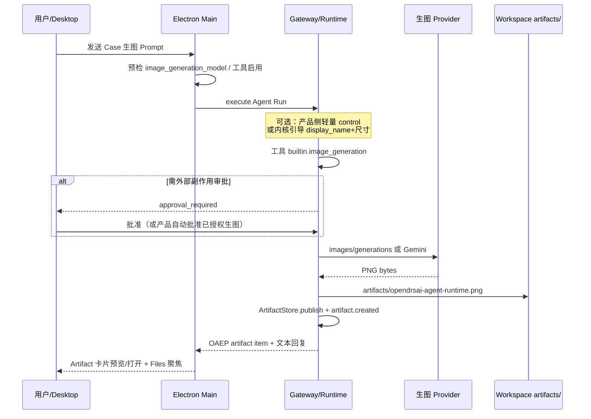

# 第 9 项功能实现方案

| 项 | 内容 |
| --- | --- |
| 功能编号 | 第 9 项 |
| Case ID | `image.output.simple` |
| 功能名称 | 生成指定主题与比例的图片（16:9 PNG + Artifact） |
| 所属计划 | OpenDrSai 回归测试 P3（真实 Desktop 端到端） |
| Case 文件 | `eval/regression/cases/image_output/agent_runtime_illustration.yaml`（rev 7） |
| 与第 8 项关系 | 第 8 项是**识图输入**；第 9 项是**生图输出**。Gateway 生图主链路已有，本方案聚焦 **Desktop 产品路径打通与验收留证** |
| 方案日期 | 2026-08-13 |
| 实现状态 | Phase A–D 代码已落地（2026-08-13）；待 Desktop 重启 Gateway 后人工 E2E 留证（Phase E） |

---

## 一、目标与验收口径

### 1.1 用户路径

**Desktop 聊天发送生图需求 → Agent 调用正式图片生成能力 → 工作区产出 PNG Artifact → UI 可预览/打开 → Run 完成**

### 1.2 Case 硬性要求（摘要）

| 维度 | 要求 |
| --- | --- |
| 输入 | 生成 16:9 横版科技插图，主题「OpenDrSai Agent Runtime」；深蓝背景、中央发光核心、五类无文字抽象图标；禁止人物/文字/Logo/水印 |
| 网络 | `required`（真实 Provider，禁止离线 Fixture 冒充） |
| 能力 | 必须 `image_generation`；禁止 web/knowledge/pptx |
| 调用 | 生图 1–2 次；审批在产品路径上期望 0 次人工卡死（harness 可自动批准） |
| 产物 | 恰好 1 个 Artifact：`artifacts/opendrsai-agent-runtime.png`，PNG，≥1280×720，16:9±2%，≥20KB，可解码 |
| 交付 | 回复中有可交互 Artifact 链接；与 Run / 生图调用可关联 |
| 基准 | `specification_only`（不做像素比对） |
| 超时 | 360s |

### 1.3 成功标准（本阶段）

1. 本机配置 `image_generation_model` 后，Desktop 用户提示可真实生图。  
2. 产物落在工作区 `artifacts/opendrsai-agent-runtime.png`（或等价可验收路径 + 展示名）。  
3. 聊天气泡 / Files 侧栏可预览与打开原图。  
4. Run Inspector 能看到 Artifact 与生图调用关系。  
5. 按 Case 人工验收一遍并留证；可选补自动化脚本。

---

## 二、现状判断

| 层级 | 状态 | 说明 |
| --- | --- | --- |
| Gateway / Runtime 生图 | **已有** | `RuntimeImageOperationAdapter`：解析 `image_generation_model`，Gemini / OpenAI Images，写 `artifacts/`，`RuntimeArtifactStore.publish`，发 `artifact.created` |
| 回归 Harness | **已通过（历史）** | 注入 regression control（固定文件名、约束、自动审批）；视觉 Judge 三轮 |
| Agent 设置 UI | **已有** | 「图像生成」角色 `image_generation_model`；默认常为 hepai `gemini-3.1-flash-lite-image` |
| Desktop 产品 E2E | **缺口** | 无 regression control 注入；审批可能卡住；Artifact 类型多为 `file`；ArtifactsPanel 偏 git/PPT，未完整接 OAEP 生图事件；GfsView 未作为交付面 |
| 正式工作报告 / 留证 | **未开始** | 第 8 项报告明确第 9 项未开 |

**结论**：第 9 项不是从零写生图后端，而是把 **已有 Runtime 能力接到 Desktop 可验收产品路径**，并处理审批、命名、预览与留证。

---

## 三、目标架构

与第 8 项对照：

| | 第 8 项 | 第 9 项 |
| --- | --- | --- |
| 方向 | 图 → 文（识图） | 文 → 图（生图） |
| 角色 | `image_understanding_model` | `image_generation_model` |
| Desktop 入口 | `stageAttachments` | 文本 Prompt + 生图工具 |
| 交付 | 诊断文本 | `artifacts/*.png` + 可交互 Artifact |

---

## 四、分阶段实现

### Phase A — 环境与预检（先 unblock）

**目的**：保证本机一点就有机会真正调到生图 Provider。

| 动作 | 落点 |
| --- | --- |
| 确认 Agent 绑定生图模型 | `~/.drsai-dev/configs/agents/agent_opendrsai.toml` → `[models.image_generation]`（推荐 hepai 视觉生成模型，如 `gemini-3.1-flash-lite-image`） |
| 确认模型目录能力 | `configs/models/provider_hepai.toml`：`output_modalities` 含 `image`，`capabilities` 含 `image_generation` |
| 确认工具启用 | Agent 工具策略含 `builtin.image_generation`（或 inherit 且未禁用） |
| Desktop 预检（对齐第 8 项识图预检） | `apps/desktop/shared/main/chat.ts` / `myDrSaiConfig.ts`：发「请生成图片」类任务前检查 `effective_image_generation_ref`，缺失则 `image_generation_model_unavailable` + `select_model` |
| 设置页可配可测 | `App.tsx` 已有「图像生成」；补能力探测失败时的用户文案 |

**验收**：设置里选好生图模型；故意清空时应有明确错误，而不是模糊失败。

---

### Phase B — 产品路径契约（对齐 Harness，但不照搬）

**目的**：没有 regression control 时，用户自然语言也能稳定落到 Case 文件名与比例。

| 动作 | 落点 |
| --- | --- |
| 内核/适配器引导 | `desktop_agent_kernel_adapter.py` / `agent_kernel.py`：识别「16:9 / 生成插图 / OpenDrSai Agent Runtime」时，引导工具参数 `display_name=opendrsai-agent-runtime.png`、横版尺寸（如 `1536x1024`） |
| 可选轻量 control | Desktop Main 对冒烟 Prompt 注入窄版 `oaep.input` 控制资源（仅固定 artifact 目标与约束，不做完整回归信封）——**可选**，优先软引导 |
| 审批策略 | 用户明确要求生图 = 已授权该次 `image_generation`：产品路径自动批准或一键批准，避免卡在 `external_side_effect`；复用第 8 项审批解锁经验 |
| 禁止冒充 | 不允许 SVG/Mermaid/ASCII/临时 URL 顶替 PNG Artifact |

**验收**：粘贴 Case Prompt，至多批准一次（理想 0 次），产物路径符合 Case。

---

### Phase C — Artifact 类型与聊天气泡

**目的**：生图结果在会话里像「图」而不是普通文件。

| 动作 | 落点 |
| --- | --- |
| 发布类型 | `runtime/artifacts.py`：`mime` 为 `image/*` 时 `artifact_type: "image"` |
| 投影 | `threadRuntimeProjection.ts` → `StructuredMessageParts`：图片图标、缩略图或「预览」入口 |
| 打开行为 | `ChatWorkspace` → `onOpenWorkspaceArtifact` → `App.tsx` 聚焦 Files + `previewWorkspaceFile` |

**验收**：气泡可点预览；路径与 Run Inspector 一致。

---

### Phase D — Files / Artifacts 侧栏

**目的**：交付面稳定，不依赖已禁用的 GfsView。

| 动作 | 落点 |
| --- | --- |
| 接入 OAEP | `ArtifactsPanel` / `FilesContextPanel`：订阅或映射 `artifact.created` / 时间线文件项（今日偏 git + PPT） |
| 预览 | 选中 `artifacts/*.png` 自动预览；「打开原图」可用系统/应用内查看器 |
| 范围 | **不以 GfsView 为验收依赖**；Files 右侧栏为产品交付面 |

**验收**：不离开当前任务，能预览并打开 Case 产物。

---

### Phase E — Desktop E2E 留证与文档

| 动作 | 落点 |
| --- | --- |
| 人工剧本 | 新建任务 → 贴 Case 全文 → 批准（若有）→ 检查文件/预览/字面约束 → 截图留证 |
| 自动化（可选） | 扩展 `apps/desktop/windows/scripts/verify-run-traceability-phase3-live-model.mjs`，或新增 Desktop 留证脚本；结果进 `tmp/eval-results/...` |
| 工作报告 | 新增 `docs/desktop/item9-image-output-simple-work-report.md`（结构对齐第 8 项） |

**验收清单**

- [ ] Run `completed`  
- [ ] 存在 `artifacts/opendrsai-agent-runtime.png`（或约定等价路径）  
- [ ] PNG 可解码，尺寸与 16:9 容差达标  
- [ ] UI 可预览/打开  
- [ ] 回复含 Artifact 链接  
- [ ] 无 web/knowledge/pptx；无明显文字/人物（人工或 Judge）  
- [ ] 生图模型与主模型配置正确；Gateway 已重启（若改了 Python）

---

### Phase F — 硬化（仅当 E2E 不稳时）

- 比例：Provider 无原生 16:9 时，在 `image_operations.py` 后处理裁剪/缩放。  
- 鉴权：HepAI 生图协议（OpenAI Images vs Gemini）与 OIDC/Key 差异，复用第 8 项鉴权踩坑经验单独记录。  
- 次数：限制 1–2 次生成，避免刷结果。  
- 失败分类：Provider 不可用 → `environment_failed`；配置缺失 → `select_model`；禁止用描述冒充。

---

## 五、关键文件一览

| 区域 | 路径 |
| --- | --- |
| Case | `eval/regression/cases/image_output/agent_runtime_illustration.yaml` / `.md` |
| 生图适配器 | `cores/.../runtime/image_operations.py` |
| Gateway 工具 | `cores/.../backend/gateway.py`（`image_generation` 等） |
| Artifact 存储 | `cores/.../runtime/artifacts.py` |
| 内核契约 | `cores/.../runtime/desktop_agent_kernel_adapter.py`、`agent_kernel.py` |
| Desktop 策略 | `apps/desktop/shared/main/myDrSaiConfig.ts`、`chat.ts` |
| 投影 / UI | `threadRuntimeProjection.ts`、`ChatWorkspace.tsx`、`FilesContextPanel.tsx`、`ArtifactsPanel.tsx`、`App.tsx` |
| 既有脚本 | `apps/desktop/windows/scripts/verify-run-traceability-phase3-live-model.mjs` |

---

## 六、风险与依赖

| 风险 | 缓解 |
| --- | --- |
| HepAI / Gemini 生图额度或 401/503 | 预检 + 明确 environment_failed；验收窗口确认 Provider 可用 |
| Desktop 审批卡住 | Phase B 自动/一键批准；复用第 8 项审批修复 |
| Agent 文件名随意 | Phase B 引导或轻量 control |
| 把 Fixture 当通过 | 坚持 network required + 真实 Artifact 证据 |
| Windows Gateway 不热更 | 改 Python 后必须重启 |
| 与第 8 项抢同一联调窗口 | 先冻结第 8 项留证，再开第 9 项生图配置，避免改乱 `image_*` 角色 |

---

## 七、建议排期（工作量粗估）

| 阶段 | 内容 | 粗估 |
| --- | --- | --- |
| A | 配置 + 预检 | 0.5–1 天 |
| B | 契约 + 审批 | 1–2 天 |
| C | Artifact 类型与气泡 | 0.5–1 天 |
| D | Files 预览接线 | 1 天 |
| E | 人工 E2E + 报告（+可选脚本） | 1 天 |
| F | 按需硬化 | 机动 |

**推荐顺序**：A → B → 手工冒烟 → C/D → E。不要先做 GfsView。

---

## 八、第一步（立刻可做）

1. 打开 Agent 设置，配置并探测 **图像生成** 模型（建议 hepai 生图模型）。  
2. 确认工具策略未禁用 `image_generation`。  
3. 新建 Desktop 任务，粘贴 Case Prompt，观察是否出现生图工具调用与 `artifacts/` 文件。  
4. 记录卡点（预检 / 审批 / 路径 / 预览），按本方案 Phase B–D 逐项补齐。

---

## 九、一句话小结

第 9 项（`image.output.simple`）的实现重点是：**复用已有 Runtime 生图与 Artifact 发布能力，补齐 Desktop 预检、审批、固定产物命名、图片型 Artifact 预览与 P3 留证**；不是重写生图后端。
