# OpenDrSai macOS v1.5.8 Beta VM 自动化测试验收方案

> 状态：执行中（P0 已完成，P1 待开始）
> 制定日期：2026-08-13
> 目标版本：OpenDrSai macOS Desktop v1.5.8 Beta（Apple Silicon arm64）
> 目标产物：签名、公证并 staple 的 DMG，以及与其绑定的 Runtime、更新 ZIP、发布元数据和验收证据
> 核心原则：只验收最终可下载产物；每轮从可复现的干净 macOS 环境开始；自动化证据必须绑定同一版本、commit 和产物摘要

## 1. 背景

macOS v1.5.7 已经暴露出传统宿主机测试的不足：源码、开发运行和临时目录隔离测试通过，并不能证明用户从下载站取得的最终 DMG 在干净 Mac 上能够完成首次启动、登录、Runtime 安装、智能体准备和真实任务。

macOS 没有与 Windows Sandbox 完全相同的系统组件，但 Apple Silicon 提供原生 Virtualization Framework，可以运行 macOS 虚拟机。Tart 在这套框架上提供镜像、克隆、共享目录、SSH 和 CI 编排能力，因此可用“一份只读基础镜像 + 每轮一次性克隆”的方式构造等价的干净系统验收。

参考资料：

- [Apple：Virtualize macOS on a Mac](https://developer.apple.com/documentation/virtualization/virtualize-macos-on-a-mac)
- [Apple：Running macOS in a virtual machine on Apple silicon](https://developer.apple.com/documentation/virtualization/running-macos-in-a-virtual-machine-on-apple-silicon)
- [Tart Quick Start](https://tart.run/quick-start/)
- [Tart Packer Integration](https://tart.run/integrations/packer/)

## 2. 目标和非目标

### 2.1 目标

本方案必须证明：

1. 阿里云 OSS 或候选下载地址上的 DMG 与待发布摘要一致；
2. DMG、App、Runtime、更新包和证据来自同一个 reviewed clean commit；
3. 最终 DMG 在没有 OpenDrSai 历史数据的 macOS VM 中可安装、启动和退出；
4. 用户通过真实认证进入主界面后，应用确实执行 Runtime bootstrap，并进入明确的 Ready 或可恢复失败终态；
5. Runtime 安装、Gateway、智能体、工作区和真实任务形成完整产品闭环；
6. 重启、升级、中断、损坏、断网、端口冲突等场景能安全恢复；
7. 测试结束后无孤儿进程、无秘密泄漏、无越界文件修改；
8. VM 自动化证据与物理真机的 Keychain、TCC、通知、睡眠唤醒证据共同组成发布门禁。

### 2.2 非目标

以下内容不能仅由 VM 结果替代：

- 真实麦克风、摄像头和音频设备行为；
- 物理睡眠、唤醒、电池和长时间功耗；
- 外接屏、真实 Retina 缩放和硬件切换；
- 物理设备上的通知、Dock、Finder 和 TCC 最终体验；
- 用户真实 MFA、验证码或需要人工确认的身份流程。

这些项目继续由发布候选物理真机门禁覆盖。

## 3. 验收分层

完整验收分为三层，任何一层都不能替代其余两层。

| 层级 | 环境 | 目的 | 运行频率 |
| --- | --- | --- | --- |
| H：宿主隔离测试 | 当前 Mac，临时 `DRSAI_HOME` 和 Electron `user-data-dir` | 快速检查 Runtime、Gateway、IPC、PTY、退出清理 | 每次相关提交 |
| V：一次性 macOS VM | Tart 干净克隆 | 验证最终 DMG 的下载、安装、真实首次启动、产品旅程、故障恢复和升级 | 每个 Beta/RC |
| D：物理真机 | 专用标准用户或专用发布 Mac | 验证 TCC、Keychain、通知、睡眠唤醒、Finder/Gatekeeper 和真实人工体验 | RC/正式发布 |

推荐数据流：

```mermaid
flowchart LR
  A["冻结 clean commit"] --> B["构建 Runtime、App、DMG、ZIP"]
  B --> C["宿主隔离冒烟"]
  C --> D["上传候选 OSS 路径"]
  D --> E["克隆一次性 macOS VM"]
  E --> F["VM 内重新下载 DMG"]
  F --> G["签名、公证、provenance 校验"]
  G --> H["真实安装与首次启动"]
  H --> I["登录、Runtime、智能体、工作区、真实任务"]
  I --> J["恢复、升级、负面场景"]
  J --> K["导出结构化证据并销毁 VM"]
  K --> L["物理真机门禁"]
  L --> M["发布决策与 stable 晋级"]
```



## 4. 工具选型

### 4.1 推荐：Tart

选择 Tart 的原因：

- 基于 Apple Virtualization Framework；
- 支持 Apple Silicon 上的 macOS guest；
- 支持从基础镜像快速 clone；
- 支持 SSH 和只读共享目录；
- 支持 OCI 镜像和 Packer，可将基础环境版本化；
- 适合本地脚本和 self-hosted CI runner。

UTM 适合人工调试，但不作为主自动化编排器。Anka 适合后续多机企业级调度，不作为 v1.5.8 Beta 的首期依赖。直接开发 Virtualization Framework 管理器成本较高，仅在 Tart 无法满足证据或安全要求时考虑。

### 4.2 当前本机资源约束

制定方案时的本机事实：

- MacBook Air M1；
- 16 GB 内存；
- macOS 26.5.2；
- 系统盘可用空间约 28 GiB；
- 尚未安装 Tart、UTM 或 Anka。

28 GiB 不足以稳定保存基础镜像、克隆、DMG、Runtime 和证据。开始 VM 落地前必须满足以下任一条件：

1. 系统盘至少释放到 80–100 GiB 可用；或
2. 使用高速外置 SSD 保存 Tart VM 和缓存，建议预留 150 GiB。

单台 M1/16 GB 建议一次只运行一个 VM，初始配置为 4 vCPU、6 GB RAM、60–70 GB 稀疏磁盘。具体 Tart 参数在安装后以当前版本的 `tart set --help` 为准，不把未经验证的 CLI 参数硬编码进发布脚本。

## 5. macOS 版本矩阵

产品当前为 arm64 架构。VM 矩阵必须与 `LSMinimumSystemVersion` 和实际支持声明保持一致。

| 门禁 | Guest 版本 | 说明 |
| --- | --- | --- |
| Beta 必跑 | macOS 26 | 当前主开发和真实用户环境 |
| Beta Nightly | macOS 15 | 上一代主流系统兼容性 |
| RC 必跑 | 最低声明支持版本 | 若仍声明 macOS 12，则必须真实覆盖 macOS 12 arm64 |
| RC 必跑 | macOS 15、macOS 26 | 覆盖上一主流与当前系统 |

若某个系统不能运行指定 Runtime 或 Electron 版本，应调整产品最低版本声明，不得只从矩阵中静默删除。

## 6. Golden Image 设计

### 6.1 镜像分类

至少维护两类基础镜像：

#### `opendrsai-pristine-<macos-version>`

- 没有安装 OpenDrSai；
- 不存在 `~/.drsai`；
- 不存在 OpenDrSai Electron userData；
- 不存在 OpenDrSai Keychain 项；
- 不存在 `DRSAI_HOME`、`DRSAI_REPO`、`OPENDRSAI_RUNTIME_ROOT` 覆盖；
- 浏览器没有 OpenDrSai/HepAI 登录态；
- 用于 Gatekeeper、首次安装、首次登录和无历史环境测试。

#### `opendrsai-sso-ready-<macos-version>`

- 同样没有 App、Runtime 或 OpenDrSai 会话；
- 浏览器已建立专用测试账号的 HepAI SSO 会话；
- 用于自动执行真实 authorize/callback，而不在仓库或脚本中存储账号密码；
- 镜像本身不得上传到公开 registry。

### 6.2 基础镜像仅包含测试设施

- `qa` 标准用户；
- 独立自动化管理员账号；
- SSH/Remote Login；
- 自动化公钥；
- 屏保和自动锁屏按测试需要配置；
- 证据采集脚本；
- 固定语言、地区和时区；
- 不包含 OpenDrSai 构建目录或开发 Runtime；
- 不包含生产签名私钥、公证密钥、OSS 长期密钥或模型 API Key。

### 6.3 镜像不可变性

每个基础镜像记录：

- macOS ProductVersion 和 BuildVersion；
- Tart 版本；
- 镜像 digest；
- CPU、内存和磁盘配置；
- provision 脚本 SHA-256；
- 创建时间；
- 预置软件清单；
- 安全例外清单。

测试只 clone 基础镜像，不原地修改基础镜像。每轮结束必须删除 clone。

## 7. 最终产物契约

VM 只能测试最终候选产物，禁止测试：

- `electron-vite dev`；
- `release/mac-arm64/OpenDrSai.app` 目录后就直接得出 DMG 可用结论；
- 本地未签名 `.app` 代替发布 DMG；
- 从宿主源码目录加载 renderer；
- 使用与远端不同字节的本地同名 DMG。

每轮先在 guest 内从候选 OSS URL 下载 DMG，并生成以下绑定关系：

```text
expected Git commit
= source snapshot commit
= App out/build-metadata.json commit
= Runtime runtime-provenance-*.json gitCommit
= L4/L5/L6 evidence commit
= release-decision commit
```

同时记录并校验：

- 下载 URL、时间、HTTP 状态、Content-Length、ETag；
- DMG SHA-256；
- App 主可执行文件 SHA-256；
- `app.asar` SHA-256；
- Runtime archive SHA-256；
- Runtime manifest SHA-256；
- 更新 ZIP SHA-512；
- `CFBundleShortVersionString` 和 `CFBundleVersion`；
- Developer ID TeamIdentifier；
- notarization/staple 结果。

任一 commit、版本或摘要不一致，VM 不继续执行产品测试，直接判定产物来源失败。

## 8. VM 自动化主流程

### 8.1 宿主准备

1. 确认工作树 clean；
2. 固定 Node 22、npm lockfile 和 Python 3.11.9；
3. 构建签名、公证候选产物；
4. 运行宿主 H 层测试；
5. 上传到不可变 beta 路径，不更新 stable；
6. 记录预期 URL、版本、commit 和 SHA-256。

### 8.2 每轮 VM 生命周期

1. 生成唯一 `runId`；
2. 从指定 Golden Image clone 一次性 VM；
3. 启动 VM 并等待 SSH ready；
4. 验证 guest OS 和镜像 digest；
5. 在 guest 内重新下载 DMG；
6. 验证产物来源、签名、公证和摘要；
7. 安装 App 到 `/Applications`；
8. 运行指定产品场景；
9. 采集日志、截图、视频、进程和文件摘要；
10. 正常退出 App，确认无孤儿进程；
11. 将证据复制回宿主；
12. guest 关机；
13. 删除 clone；
14. 输出单一非零/零退出码和 `summary.json`。

VM clone 的创建、启动、停止和删除必须放在 `try/finally` 等价清理结构中；即使测试失败，也不得遗留运行中的 VM。

## 9. 产品验收旅程

### 9.1 A：下载、签名和安装

必须验证：

- OSS 远端 DMG 可完整下载；
- `hdiutil verify` 通过；
- DMG 可只读挂载；
- DMG 中只有预期 App 和安装辅助内容；
- `codesign --verify --deep --strict` 通过；
- `spctl --assess --type execute` 接受；
- App 和 DMG 的 staple 可验证；
- 复制到 `/Applications` 后签名仍通过；
- 从 `/Applications` 启动，而不是直接运行 DMG 内 App；
- 首次启动没有 DYLD、Framework、quarantine 或架构错误。

### 9.2 B：真实身份认证

认证测试分两条：

1. 日常自动旅程：使用 `sso-ready` 镜像，真实走 OIDC authorize/callback；
2. RC 黑盒旅程：使用 pristine 镜像，由测试人员完成一次真实 MFA/验证码，之后自动继续。

发布级旅程禁止使用 `developerBypass` 代替 OIDC。允许使用专用 staging/测试账号，但必须满足：

- 凭据不进入仓库、日志和证据；
- refresh/access token 不进入 VM 公共基础镜像；
- 测试账号权限范围固定；
- 账号失效时产生明确 `auth_required`，而不是误判为 Runtime 故障。

### 9.3 C：首次 Runtime bootstrap

真实主界面必须观察到以下状态迁移：

```text
身份：正在读取 → 已登录
运行时：正在准备 → 已就绪
智能体：正在检查 → 已就绪
工作区：未选择或未信任 → 已信任
```

必须断言：

- 登录成功后自动触发真实 `bootstrapDesktop`；
- 不依赖用户先发送一次任务；
- 不依赖用户手动点击“修复并重试运行时”；
- `~/.drsai/drsai-agent` 产生；
- `.opendrsai-runtime.json` 存在且与 DMG manifest 一致；
- Python 架构、版本和 `import drsai` 正常；
- Runtime 文件 inventory 和 SHA-256 正常；
- Gateway 健康且模型目录可读；
- Runtime、智能体检查都有明确成功或失败终态；
- 不存在无限“正在检查”；
- 首次 Runtime 安装耗时在发布预算内。

### 9.4 D：最小黄金任务

Runtime Ready 后必须通过真实用户入口完成：

1. 创建并信任一个临时工作区；
2. 发送 `hello`；
3. 收到真实模型回复；
4. 创建一个文本文件；
5. 读取并总结该文件；
6. 执行一个无副作用终端命令；
7. 验证任务结束、会话持久化和成果可见；
8. 完全退出并重启；
9. 重启后 Runtime 不重复安装，工作区和会话仍存在；
10. 再发送一条消息并成功返回。

### 9.5 E：感知器和联网任务

- 从 UI 配置 Tavily 感知器；
- 保存、更新、测试、禁用和删除 IPC 全部可达；
- Key 只进入受控秘密存储；
- 运行一次真实网页搜索；
- 无网络时提供明确离线选择；
- 恢复网络后任务可安全重试；
- 日志和证据不得包含 API Key 原值。

### 9.6 F：退出、重启和进程清理

- 正常退出；
- Cmd+Q；
- 强制终止 App；
- Gateway crash；
- Runtime 任务执行中重启；
- 登录后立即退出；
- Runtime 安装中断后重启。

每种情况都要检查：

- App、Helper、Gateway、PTY 孤儿进程数量；
- Runtime 和会话是否损坏；
- 下一次启动是否能恢复；
- 重复恢复是否幂等；
- 用户工作区文件前后 SHA-256 是否保持预期。

## 10. 故障注入矩阵

每个故障场景使用独立 VM clone，禁止一个场景污染下一个场景。

| 场景 | 注入方式 | 预期终态 | 必须验证的恢复 |
| --- | --- | --- | --- |
| Runtime 缺文件 | 删除受控 fixture 文件 | `runtime_missing` 或 `runtime_needs_repair` | 修复后 Ready |
| Runtime 哈希错误 | 修改受控文件 | 完整性失败且不启动 | 原子重装后 Ready |
| 安装中断 | 解压/验证阶段终止 App | 不激活半成品 | 重启后重新安装 |
| 磁盘不足 | 使用受限磁盘 fixture | 明确空间不足 | 释放空间后重试 |
| Runtime 目录不可写 | 收紧 fixture 权限 | 明确权限错误 | 恢复权限后重试 |
| Gateway 端口冲突 | 占用测试端口 | 明确服务不可用 | 端口释放后启动 |
| Gateway crash | 受控终止进程 | 任务失败或恢复中 | 单实例恢复 |
| 网络断开 | VM 网络受控断开 | 离线终态 | 恢复网络后继续 |
| OIDC 过期 | 注入过期测试会话 | `auth_required` | 重新登录成功 |
| Keychain 锁定 | 测试账号锁定 Keychain | 明确凭据不可用 | 解锁后恢复 |
| 旧 Runtime | 从上一 beta/稳定版升级 | 版本不匹配可识别 | 原子升级且保留数据 |
| `.previous` 残留 | 放置回滚 fixture | 不误用未知文件 | 安全清理或恢复 |
| 损坏 DMG | 修改候选副本 | 下载/摘要失败 | 不安装、不覆盖旧版 |
| App 启动失败 | 受控替换测试副本 | 更新健康失败 | 回滚到上一签名版本 |

破坏操作只能作用于一次性 VM 内明确解析过的测试路径。脚本禁止对宿主 `/Applications`、宿主用户目录或未解析变量执行递归删除。

## 11. UI 自动化边界

### 11.1 自动化手段

按优先级使用：

1. 正常产品 UI + macOS Accessibility/XCUITest 黑盒操作；
2. Electron packaged E2E bridge，用于难以稳定观察的内部状态和结构化证据；
3. SSH 只负责安装、启动、等待、文件断言和证据回收，不直接代替用户产品操作。

至少保留一条不启用 packaged E2E bridge 的黑盒黄金旅程，防止出现“测试接口可用但用户入口不可用”。

### 11.2 截图和视觉证据

关键节点必须截图：

- DMG/Finder 安装；
- 登录页；
- OIDC 返回；
- Runtime preparing；
- Runtime Ready；
- 智能体 Ready；
- 工作区 trusted；
- 首条真实回复；
- 故障提示和修复入口；
- 重启后的恢复状态。

自动检查：

- 黑屏、白屏；
- 无限 loading；
- 未解析 i18n key；
- `Error invoking remote method` 等技术错误直接暴露；
- 中文乱码；
- 主要操作不可见或被遮挡；
- axe serious/critical 问题。

## 12. 物理真机补充门禁

VM 全绿后，RC 仍必须在物理 Mac 上完成：

- Safari/Finder 从真实下载页取得 DMG；
- Finder 拖放安装和首次 Gatekeeper 启动；
- 完全干净的标准用户登录；
- Keychain 保存、锁定、解锁、替换和删除；
- 麦克风和通知 TCC 首次授权、拒绝和重新授权；
- 睡眠/唤醒 20 轮；
- 网络切换；
- Cmd+Q、Dock、菜单栏、深链和单实例；
- 前一稳定版本到 v1.5.8 Beta/RC 的真实升级和失败回滚；
- 至少 2 小时稳定性运行。

真机证据必须引用与 VM 相同的 DMG SHA-256。

## 13. 证据结构

建议输出目录：

```text
apps/desktop/macos/build/acceptance/vm/<version>/<run-id>/
├── summary.json
├── environment.json
├── artifact-provenance.json
├── download.json
├── codesign.txt
├── gatekeeper.txt
├── staple-app.txt
├── staple-dmg.txt
├── runtime-install.jsonl
├── gateway.log
├── app-main.log
├── process-before.json
├── process-after.json
├── file-integrity.json
├── scenarios/
│   ├── clean-install.json
│   ├── first-run.json
│   ├── golden-task.json
│   ├── restart.json
│   └── fault-*.json
├── screenshots/
└── recordings/
```

### 13.1 `summary.json` 最小字段

```json
{
  "schemaVersion": 1,
  "testId": "macos-beta-vm-acceptance",
  "version": "1.5.8-beta.N",
  "platform": "darwin-arm64",
  "guestVersion": "26.x",
  "guestBuild": "...",
  "sourceCommit": "...",
  "appCommit": "...",
  "runtimeCommit": "...",
  "dmgSha256": "...",
  "goldenImageDigest": "...",
  "passed": true,
  "scenarioCount": 0,
  "passedScenarioCount": 0,
  "failedScenarioCount": 0,
  "retries": 0,
  "generatedAt": "..."
}
```

### 13.2 证据规则

- 每条 receipt 必须带 runId、scenarioId、开始/结束时间、退出码和重试次数；
- 任一自动重试都必须计数，不能用重试隐藏不稳定；
- 测试日志保存 SHA-256，聚合证据引用摘要；
- 证据生成期间源码变化则整轮无效；
- VM、App、Runtime、DMG 和证据 commit 不一致则整轮无效；
- 证据中秘密原值命中必须为 0；
- 失败场景也必须导出日志和最后截图。

## 14. 安全要求

- VM 基础镜像不得包含生产长期凭据；
- 测试账号使用最小权限；
- OIDC、Tavily、OSS 临时凭据由宿主秘密存储在运行时注入；
- 共享目录默认只读；
- guest 输出复制回宿主前执行秘密扫描；
- 不上传包含登录会话的私有 Golden Image 到公开 OCI registry；
- VM SSH key 与开发者个人 SSH key 分离；
- 不关闭产品自身签名、Gatekeeper、Runtime hash 或工作区安全校验来让测试通过；
- 不修改系统 TCC 数据库伪造用户批准；
- 自动化管理员和实际产品标准用户分离。

## 15. 仓库落地结构

建议新增：

```text
apps/desktop/macos/vm/
├── README.md
├── images.json
├── prepare-golden-image.sh
├── run-beta-acceptance.mjs
├── lib/
│   ├── tart.mjs
│   ├── ssh.mjs
│   ├── evidence.mjs
│   └── cleanup.mjs
├── guest/
│   ├── verify-environment.sh
│   ├── download-artifact.sh
│   ├── verify-artifact.sh
│   ├── install-dmg.sh
│   ├── run-first-launch.mjs
│   ├── run-golden-task.mjs
│   ├── inject-fault.sh
│   └── collect-evidence.sh
└── scenarios/
    ├── clean-install.json
    ├── first-run.json
    ├── restart.json
    ├── interrupted-runtime-install.json
    ├── runtime-corruption.json
    ├── offline-recovery.json
    └── upgrade-from-stable.json
```

建议 npm 入口：

```json
{
  "verify:beta:host": "...",
  "verify:beta:vm": "node vm/run-beta-acceptance.mjs",
  "verify:beta:device": "...",
  "verify:beta:all": "..."
}
```

目标调用形式：

```bash
npm run verify:beta:vm -- \
  --url "https://download.example/OpenDrSai-macOS-v1.5.8-beta.N-arm64.dmg" \
  --sha256 "<expected-dmg-sha256>" \
  --commit "<expected-clean-commit>" \
  --image "opendrsai-sso-ready-macos26@<digest>"
```

正式脚本必须验证所有参数，URL 只允许 HTTPS 和批准的下载 host；不能接受空 SHA、浮动 commit 或未固定基础镜像。

## 16. 本地与 CI 分工

### 16.1 本地开发 Mac

- 单 VM 串行执行；
- 用于开发 VM harness、重现故障和 Beta 候选验收；
- 证据默认保留在本地；
- 不直接拥有发布 stable 权限。

### 16.2 self-hosted 发布 Mac

- 使用固定 Tart、macOS 镜像和 Xcode 版本；
- 运行完整 VM 矩阵；
- 运行物理真机门禁；
- 上传不可变证据；
- 只有完整门禁成功后才允许 OSS stable metadata 晋级。

### 16.3 CI 触发策略

| 触发 | 执行内容 |
| --- | --- |
| Pull Request | H 层、静态 VM harness 测试，不启动完整 macOS VM |
| feature/desktop push | H 层 + 单一 macOS 26 VM 冒烟，可按路径过滤 |
| Beta tag | macOS 26 完整 VM 旅程 + 故障矩阵 |
| Nightly | macOS 15/26 兼容矩阵和稳定性 |
| RC tag | 最低支持版本 + 15 + 26、升级/回滚、真机门禁 |
| 正式发布 | 只消费已通过且绑定同一产物摘要的 RC 证据，不重新生成不同字节的 DMG |

## 17. 发布阻断条件

任一条件成立，v1.5.8 Beta/RC 不得晋级 stable：

- DMG 远端摘要与候选摘要不一致；
- App commit、Runtime commit、source commit 或 evidence commit 不一致；
- 签名、公证、staple、Gatekeeper 任一失败；
- VM 从干净环境无法安装或启动；
- 登录成功后 Runtime 没有自动开始准备；
- Runtime、智能体或工作区长期停留在不真实的“正在检查”；
- 黄金任务不能通过真实模型完成；
- 重启后 Runtime 重复安装或会话丢失；
- 修复流程不能恢复 Ready；
- 存在孤儿 Gateway/PTY/Helper；
- 用户文件出现未授权修改；
- 日志或证据包含 Token、API Key、密码或测试秘密；
- 自动化测试使用 developer bypass 冒充发布级认证结果；
- 只有本地 `release` 产物通过，未验证 OSS 实际下载字节；
- 物理真机关键门禁缺失或引用不同 DMG SHA-256。

## 18. 完成定义

v1.5.8 Beta VM 自动化达到“可用于发布决策”必须满足：

1. Tart 基础镜像可复现并有 digest；
2. 一条命令可以从 clone 到销毁完整运行；
3. VM 内从 OSS 下载最终 DMG；
4. provenance、签名、公证和摘要全自动校验；
5. 真实 OIDC、Runtime Ready、智能体 Ready、工作区 trusted 和黄金任务闭环通过；
6. clean install、restart、runtime corruption、interrupted install、offline recovery、upgrade 六类场景通过；
7. 所有结果产生结构化 receipt、日志和截图；
8. 失败也能清理 VM 并保留证据；
9. 物理真机补充门禁与相同 DMG 绑定；
10. 发布决策器只接受同 commit、同 version、同 hash 的完整证据。

## 19. 分阶段实施计划

### P0：资源和工具准备

- 释放磁盘或准备外置 SSD；
- 安装并固定 Tart 版本；
- 创建 macOS 26 pristine 基础镜像；
- 验证 clone、启动、SSH、共享目录、关机和删除；
- 输出基础镜像 digest。

退出条件：一次性 VM 生命周期可由单命令重复执行 5 轮且无残留。

### P1：制品安全和干净安装

- guest 内下载 OSS DMG；
- 实现摘要、commit、codesign、Gatekeeper、staple 校验；
- 安装到 `/Applications`；
- 启动和退出 App；
- 输出 artifact provenance 和 clean-install receipt。

退出条件：不依赖 OpenDrSai 测试 bridge 即可证明最终 DMG 安装和启动。

### P2：首次登录和 Runtime Ready

- 建立私有 `sso-ready` 镜像；
- 自动执行 OIDC callback；
- 观察四层状态；
- 持久化 Runtime 安装阶段日志；
- 验证 Runtime、Gateway 和智能体 Ready。

退出条件：从无 `~/.drsai` 到 Runtime Ready 全链路自动通过，失败时有明确阶段和错误码。

### P3：黄金任务和重启

- 工作区创建/信任；
- 真实模型 `hello`；
- 文件和终端最小任务；
- 完全退出、重启和会话恢复；
- 无孤儿进程。

退出条件：连续 20 轮无无限 loading、无任务丢失、无 Runtime 重装。

### P4：故障和升级矩阵

- Runtime 损坏和中断安装；
- offline/online；
- Gateway crash/端口冲突；
- 上一稳定版本升级；
- 更新失败回滚；
- 用户数据和文件完整性。

退出条件：所有故障都有明确终态和自动恢复证据。

### P5：真机与发布决策整合

- 把 VM evidence 接入 L5/L6 recorder；
- 物理真机执行 TCC、Keychain、通知、睡眠唤醒；
- 发布决策器增加 VM receipt 和 provenance 强制项；
- OSS stable 晋级只消费已验收字节。

退出条件：Beta/RC 从构建到 stable 晋级没有人工替换产物、跨 commit 证据或未验收下载字节。

## 20. v1.5.8 Beta 首轮最小范围

首轮不需要一次实现全部矩阵。建议先完成以下最小闭环：

1. macOS 26 Tart 基础镜像；
2. 一次性 clone 和自动清理；
3. VM 内从 Beta OSS URL 下载 DMG；
4. DMG/App/Runtime provenance、签名和公证验证；
5. 安装到 `/Applications`；
6. 真实 OIDC 登录；
7. 自动 Runtime bootstrap 并进入 Ready；
8. 创建可信工作区；
9. 完成一条真实 `hello`；
10. 完全退出、重启并再次发送消息；
11. 回收 summary、日志和关键截图；
12. 销毁 VM。

这条闭环稳定后，再扩展多版本系统、Tavily、故障注入、升级回滚和 20 轮稳定性。

## 21. 执行记录

### 2026-08-13：P0 启动

- 宿主机确认：Apple Silicon arm64、macOS 26.5.2、16 GiB 内存；
- 已通过 Homebrew 安装并固定 Tart `2.32.1` 和 Softnet `0.19.0`；
- 已新增 `apps/desktop/macos/vm/images.json`，记录工具链、资源门槛和 macOS 26 基础镜像入口；
- 已新增宿主机 preflight，检查架构、系统、内存、Virtualization.framework、工具链、APFS、`TART_HOME` 可写性和保守剩余空间；
- 已新增 P0 生命周期 harness，支持 5 轮 clone、启动、guest 健康检查、停止、删除和结构化证据；
- 当前系统卷保守可用空间约 42 GiB，且没有挂载外置卷，因此基础镜像下载和 VM 启动保持阻断；
- 下一退出条件：准备至少 80 GiB 可用的 APFS 卷（推荐外置 SSD 预留 150 GiB），随后创建并封存 macOS 26 pristine 基础镜像。

### 2026-08-13：P0 基础镜像封存

- 宿主机清理后可用空间约 211 GiB，preflight 22/22 通过；
- 下载并创建 `opendrsai-pristine-macos26`，下载后宿主机仍约有 185 GiB 可用；
- 固定 Tart `2.32.1`，基础镜像 OCI digest 为 `sha256:1214590cd279a1ff82897d802624362ced1ff960d7b9f99a6ced5bbf8071e319`；
- 基础镜像配置为 4 vCPU、6 GiB RAM、70 GiB 稀疏磁盘、1440×900；
- guest 实测为 macOS `26.6.1`、Build `25G76`、arm64、`admin` 用户；
- 检查确认不存在 `/Applications/OpenDrSai.app`、`~/.drsai` 或 OpenDrSai Electron userData；
- 本机开发验收使用 Tart 标准共享 NAT；Softnet 需要 root 权限，留给具备专用权限模型的 self-hosted 发布机，不为开发账号开启无密码 sudo；
- 下一退出条件：完成 5 轮一次性 clone、启动、guest 检查、停止和删除，且无残留 VM。

### 2026-08-13：P0 完成

- 单轮预验收通过，随后连续 5 轮正式生命周期验收全部通过；
- 每轮均完成 clone、4 vCPU/6 GiB 配置、启动、guest agent 探测、精确版本/build/arm64 校验、停止和删除；
- 5 轮总耗时约 3 分 15 秒，单轮约 35–41 秒；
- 验收后仅保留停止状态的 `opendrsai-pristine-macos26` 基础镜像，没有 `opendrsai-p0-*` clone 或 Tart 运行进程残留；
- 结构化证据保存在 `apps/desktop/macos/build/acceptance/macos-vm/`；
- P0 退出条件已满足，下一阶段进入 P1：VM 内下载候选 OSS DMG、验证 provenance/签名/公证、安装、启动和退出。

### 2026-08-13：P1 Harness 就绪

- 已新增严格参数化的 P1 runner，只接受 `download-opendrsai.ihep.ac.cn` 的 HTTPS URL、固定文件名、完整 SHA-256、完整 Git commit 和版本；
- runner 会在 guest 内下载候选 DMG，记录最终 URL、HTTP 状态、下载字节和响应头，并拒绝重定向到非批准域名；
- 已实现 DMG 摘要、codesign、Gatekeeper、App/DMG staple、Bundle 版本、App build metadata 和 Runtime provenance 校验；
- 已实现 `/Applications` 安装、黑盒启动、首屏截图、正常退出、残留进程检查、证据回收和 clone 清理；
- P1 参数正向 dry-run 与 HTTP/非批准域名负向测试通过；
- 使用一次性 clone 验证 guest 已具备 codesign、spctl、xcrun/stapler、hdiutil、curl、shasum、open、osascript、screencapture、ditto、plutil 和无交互自动化安装能力；
- 当前本机仅有 v1.5.3/v1.5.7 DMG，尚无 v1.5.8 Beta 最终 URL、SHA-256 和 commit，因此真实 P1 运行等待候选制品，禁止以旧版本替代。
