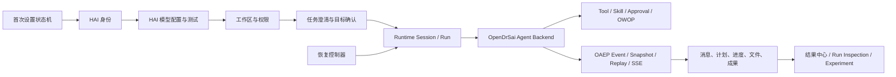

# OpenDrSai Windows App Full Agent Runtime 第三阶段：产品完整性与首次使用闭环开发方案

> 状态：实施中（第 40 轮；模型收敛专项 5/8，本地验收 62.5%）  
> 制定日期：2026-08-04  
> 阶段：OpenDrSai Agent Runtime 第三阶段（P3）  
> 核心范围：Windows App + HAI 平台模型配置 + OpenDrSai Full Agent Runtime  
> 明确排除：Codex Adapter、Codex 账号、Codex 模型、Codex 会话迁移及其发布证据

关联基线：

- `agent-runtime-traceability-reproducibility-phase1-development-plan.md`
- `agent-runtime-editable-replayable-phase2-development-plan.md`
- `opendrsai-local-agent-runtime-model-convergence-phase3-development-plan.md`
- `evidence/agent-runtime-traceability-phase1-acceptance-ledger.json`
- `evidence/agent-runtime-editable-phase2-acceptance-ledger.json`
- `../model-provider-next-stage-implementation-report.md`
- `../product/opendrsai-windows-user-product-evaluation-plan.md`
- `../product/opendrsai-windows-product-acceptance-tracker.md`

## 1. 核心任务和阶段判断

本任务只围绕以下用户旅程：

```text
安装并启动 OpenDrSai
  -> 登录 HAI
  -> 选择或配置 HAI 平台模型
  -> 选择工作区并用自然语言提出任务
  -> OpenDrSai Full Agent Runtime 创建 Session/Run
  -> OpenDrSai Agent 执行模型、Tool、Skill、审批和文件操作
  -> OAEP 实时展示、恢复和持久化
  -> 用户查看、修改、导出或复用成果
```

Codex 是另一个 Agent Backend 和另一条研发主线。P3 的任何完成度、测试数量或发布结论都不得引用 Codex 路径作为 OpenDrSai 自身能力的替代证据。

### 1.1 当前阶段

当前应认定为 **P2 收尾、P3 待启动**：

- P1“运行可追溯、可复现”账本 45/45 为 `passed`；
- P2“可编辑、可重放”账本当前 59 项中 56 项为 `passed`；
- P2 尚有 3 项发布证据未闭环：`M31-02` 真实 Backend smoke、`M31-04` 发布证明、`M31-05` P1 完整回归；`M31-03` Windows E2E 已在隔离开发 Home/Gateway 下通过 G～N；其中真实 Backend 必须在可用 HAI 账号和真实模型环境的 nightly/RC 中完成；
- Windows 产品严格验收仍为 79/93，A 类 0/5、B 类 0/5、F 类 3/6、M 类 9/10；
- 所以 P3 可以开始开发，但 P2 的真实 Backend 证据未通过前，运行实验和重放能力不得进入正式发布环。

### 1.2 P3 定位

P1 解决“运行能否追溯”，P2 解决“运行能否安全实验和重放”，P3 解决：

> 普通 Windows 用户能否不依赖命令行和 Codex，从首次启动开始，正确配置 HAI 模型，并稳定使用 OpenDrSai Full Agent Runtime 完成真实任务。

P3 不继续优先堆叠高级运行实验功能，而是收敛入口、配置、执行、审批、恢复和成果的完整用户闭环。

## 2. 代码实现合理性审计

### 2.1 设计合理、应继续保留的部分

| 实现 | 判断 | 保留要求 |
| --- | --- | --- |
| `chat.ts` 的 `opendrsai@1 -> createAgentRun -> executeAgentRun` | 正确 | 普通 OpenDrSai 对话已经走 Runtime 权威 Session/Run；P3 将它扩展为唯一任务执行路径。 |
| `RuntimeAgentService` | 正确 | 统一创建不可变 Context、绑定 Agent Definition、驱动终态、取消、审批、证据和 Backend 路由。 |
| `GatewayOpenDrSaiAgentBackend` | 基础合理 | 复用生产 `manager.run_stream`，把事件转换为 Runtime Event；需补齐审批、恢复和权限边界。 |
| 模型配置事务服务 | 正确 | revision、跨进程锁、原子替换、最后可用快照、凭据安全存储和热更新均应保留。 |
| HAI/Provider 两级连接测试 | 正确 | 基础连接和真实模型调用明确区分，真实调用前提示可能产生费用。 |
| OAEP Snapshot/Replay/SSE 与 Session View Store | 正确 | 继续作为实时、历史、断线和重启恢复的唯一结构化输出链路。 |
| Run Inspection、Manifest、Experiment、Comparison | 正确 | 作为高级能力保留，但首次任务不应要求用户理解这些概念。 |
| 工作区 checkpoint、OWOP 与幂等键 | 正确 | 文件副作用、安全执行、重放和恢复必须继续使用这些边界。 |

### 2.2 功能完整性缺口

#### A. 首次启动没有完整 setup 状态机

登录、Runtime 准备、模型配置和工作区信任分别存在，但没有一个统一的首次使用流程。模型配置被放在“设置 -> 常规 -> 模型服务”中；当服务不可用时，用户先看到阻断提示，却不一定知道下一步应登录、配置模型还是修复 Runtime。

应建立显式 setup 状态机：

```text
identity_required
  -> runtime_preparing
  -> model_unconfigured / model_untested
  -> workspace_required
  -> ready
```

每个状态只能显示与当前问题匹配的操作，完成后自动进入下一步，并支持关闭后继续。

#### B. 模型配置能力完整，但操作链分散

已有事务提交、草稿测试、模型发现和凭据保护，但 Desktop 仍存在以下缺口：

1. 保存动作直接调用提交接口，没有把后端已有的 `/v1/config/model/preview` 变成用户可见的提交前预览；
2. “恢复 HAI 默认”不等同于“恢复最后可用配置”，后端 restore/doctor 能力没有完整 Desktop 入口；
3. `getMyDrSaiConfig()` 用一个 `Promise.all` 聚合 CLI、catalog、model-state，任一辅助接口失败会把整个配置标成 `ready=false`，应返回分项状态；
4. `loadAvailableModels()` 静默吞掉身份或网络失败，用户看到空列表但不知道是无权限、离线还是服务端为空；
5. `chatChoicesPromiseRef` 按工作区长期缓存，配置更新后模型目录和能力可能没有同步失效；
6. 用户很难理解 HAI 登录身份、模型 Provider 凭据和具体模型授权是三个不同层次。

#### C. OpenDrSai 自身仍有两条任务执行链

普通聊天已经使用 Full Agent Runtime，但 `AgentRunWorkspace` 仍通过：

```text
startAgentRun
  -> Gateway /v1/chat/completions
  -> AgentRunEvent / agentRunJournal
  -> recoverAgentRun
```

这条旧链路绕过了 Runtime Session/Run/OAEP 的统一事实源。它造成两套历史、终态、恢复、取消、审批和错误语义。应保留 Agent 页面的计划、进度、文件和取消体验，但把执行迁移到 `opendrsai@1` Full Runtime。

#### D. Runtime 创建后、执行前失败会留下不完整 Run

`runRuntimeBackendChat()` 在创建 Runtime Run 后才复制/暂存附件。如果附件复制、路径校验或预执行诊断失败，Run 已存在却可能仍停留在 queued/running，且 UI 只得到外层错误。P3 必须增加预执行事务：先验证输入和附件，再创建 Run；若创建后失败，统一调用 fail/cancel finalizer 并写入可恢复原因。

#### E. 生产 OpenDrSai Backend 的审批恢复未真正统一

`GatewayOpenDrSaiAgentBackend.respond_approval()` 当前固定抛出 `approval_not_found`。这说明 Runtime 的审批决定接口没有完整接到生产 OpenDrSai Agent 的等待点。产品已有审批中心不等于 Full Runtime 的 Agent 审批闭环已经成立。

应把生产 Agent 的审批请求映射到 Runtime approval，使用稳定 `approval_id/run_id/idempotency_key` 恢复等待中的 Agent；拒绝、超时、重启恢复都必须有确定语义。

#### F. 用户需求澄清缺乏统一协议对象

产品追踪表 A/B 类尚未通过。当前澄清多依赖普通消息文本，没有稳定的 Goal、Clarification、Confirmation 和 Revision 对象，因此难以保证：只问必要问题、确认前不执行副作用、纠正后旧目标不再驱动执行。

#### G. 高级能力过早暴露，核心路径认知负担大

侧栏、设置、右侧面板同时提供 Agent、模型、思考强度、运行检查、实验、工作树、审批、渠道、浏览器等大量入口。对新用户而言，“先完成任务”的主路径不够突出。高级能力应按任务进度渐进披露，而不是全部在首屏竞争注意力。

### 2.3 用户易用性缺口

1. 首次任务前需要用户跨登录页、设置页和任务页自行拼接流程；
2. “服务不可用”“模型不可用”“Runtime 未安装”“账号无权限”文案分散，恢复动作不一致；
3. HAI/HepAI、模型服务、Provider、Agent Backend、Runtime 等术语缺少面向普通用户的统一解释；
4. 配置成功后没有自动返回任务输入并保留用户先前输入；
5. 模型列表为空时缺少原因分类和直接修复入口；
6. `AgentRunWorkspace` 仍有英文硬编码，恢复失败被 `catch(() => undefined)` 静默吞掉；
7. `App.tsx` 超过六千行，`SettingsPanel` 与多种产品域共存，状态耦合使局部修改容易产生回归；
8. 多处仍使用 `window.alert/window.confirm`，与已有可访问、可审计的应用内对话框不一致；
9. 用户主流程中仍能看到 Codex 专用状态和命名；本任务的 OpenDrSai 体验不应依赖这些状态。

## 3. 明确的保留、完善与移除清单

### 3.1 保留

- Runtime Session/Run、OAEP、OWOP、Runtime Client、Session View Store；
- OpenDrSai `manager.run_stream` 的生产 Agent 能力；
- 模型配置事务、凭据安全存储、revision 冲突和最后可用快照；
- Run Inspection、Experiment、Comparison、Adoption 的不可变语义；
- checkpoint、幂等、工作区边界和审批策略；
- 结果中心、文件活动、任务进度、计划编辑和取消体验。

### 3.2 必须完善

- 首次设置向导与可恢复 setup 状态机；
- HAI 模型配置预览、Doctor、最后可用恢复和分项状态；
- OpenDrSai Agent 的 Runtime 审批、取消、重启恢复；
- 需求澄清、目标确认和目标版本；
- 附件预处理与 Run 生命周期事务；
- 模型配置更新后的 catalog/cache 原子失效；
- 全链路错误码到用户文案和操作映射；
- 普通账户真实安装和首个任务 3 分钟门槛。

### 3.3 立即移除

| 对象 | 原因 | 删除前门禁 |
| --- | --- | --- |
| `apps/desktop/windows/src/renderer` 重复源码树 | 实际 Vite root 是 `apps/desktop/shared/renderer`；重复树约 8 个文件、243 KB，容易误改错误入口；当前仍有验证脚本直接读取旧路径，必须先迁移脚本 | 验证脚本迁移、静态引用扫描、node/web typecheck、production build、packaged smoke |
| `AgentRunWorkspace` 无依赖数组的反复订阅 | 每次 render 都退订再订阅，存在抖动和闭包竞态 | React StrictMode listener 计数与事件不重不漏测试 |
| `recoverAgentRun(...).catch(() => undefined)` | 无法区分“没有历史”和“恢复失败” | 恢复错误卡、重试和诊断动作测试 |
| OpenDrSai 主流程中的 Codex 专用变量/函数命名 | `CodexProjectionTarget`、`codexChatTargets`、`emitCodexOaepEvent` 实际也服务 OpenDrSai，误导维护 | 重命名为 backend-neutral，协议 digest 不变 |
| 核心危险操作中的 `window.alert/window.confirm` | 不可统一测试、焦点、影响说明和审计 | 应用内 dialog 全键盘、Esc 零副作用、可访问树测试 |

### 3.4 迁移后移除

| 对象 | 迁移策略 | 退场门槛 |
| --- | --- | --- |
| `startAgentRun/recoverAgentRun/onAgentRunEvent` 旧 IPC | 建立到 Runtime Session/Run/OAEP 的兼容适配，旧数据一次性导入 | 两个发布环无新写入；旧任务迁移 100%；rollback 演练通过 |
| `agentRunJournal` 作为权威历史 | 只读迁移源，写入停止 | OAEP 历史、恢复、取消和文件事件 parity 20/20 |
| Gateway legacy `/v1/chat/completions` 作为 OpenDrSai Desktop 执行入口 | Desktop 全部改走 Runtime Agent API；保留外部 OpenAI 兼容服务用途 | Desktop 调用计数为 0；CLI/兼容客户不受影响 |
| Renderer 本地 legacy message projection | 迁移历史后只保留有期限的读取器 | 活跃数据迁移率 100%，无 rollback 使用一个稳定版本 |

### 3.5 不在本任务删除

- Codex Adapter 代码：属于另一线程，本任务不修改；
- Platform Agent/DDF：可以作为独立能力保留，但不得被计入 OpenDrSai Full Runtime 验收；
- OAEP legacy 数据表：只有完成数据迁移、双读对比和回滚周期后才能退场；
- Runtime Experiment：P2 真实 Backend smoke 未完成时仅保持发布门禁关闭，不删除实现。

## 4. P3 总体目标与完成定义

P3 完成必须同时满足：

1. 干净 Windows 普通账户安装后，无命令行和人工环境变量操作即可启动；
2. 用户在应用内完成 HAI 登录、模型选择/配置、真实模型测试和工作区选择；
3. 首个有效任务在 3 分钟内进入 OpenDrSai Full Agent Runtime 并完成；
4. 所有 OpenDrSai 桌面任务只有一套 Runtime Session/Run/OAEP 事实链；
5. 模糊需求能够澄清、确认、纠正，确认前无副作用；
6. Tool、Skill、文件、审批、子任务、成果均由 Runtime 产生可追溯事件；
7. 断网、Runtime 重启、应用强退和模型故障后不丢会话、不重复副作用；
8. A1～A5、B1～B5、F4～F6、M1 全部取得正式自动证据，使产品追踪达到 93/93；
9. P2 `M31-02`～`M31-05` 四项发布证据全部通过；
10. Codex 不运行、未安装或不可用时，上述全部 OpenDrSai 验收仍然通过。

## 5. 总体解决方案



核心规则：

- 身份、模型、Runtime、工作区分别建模，不用一个 `ready` 布尔值掩盖四类问题；
- Desktop 只提交意图，不自行维护第二套 Agent 权威状态；
- 所有执行创建 Runtime Run，所有用户可见输出来自 OAEP；
- 先验证输入和附件，再创建 Run；创建后任何失败都必须进入 Runtime 终态；
- 默认只展示普通用户能理解的信息，高级运行证据按需展开；
- 用户输入、附件选择和配置草稿在可恢复错误中不得丢失。

## 6. 模块、功能点、测试和验收

### M01 首次启动与 setup 状态机

更新模块：`AuthProvider.tsx`、`LoginScreen.tsx`、新增 `FirstRunSetup.tsx`、bootstrap IPC、installer readiness。

| ID | 功能点与实现 | 自动测试 | 验收标准 |
| --- | --- | --- | --- |
| M01-F01 | 建立身份、Runtime、模型、工作区四段 setup 状态机。 | UNIT + CONTRACT，覆盖全部状态转移和重启。 | 不出现矛盾状态；每个阻断只有匹配的恢复动作；重启继续原步骤。 |
| M01-F02 | 首屏说明产品用途并提供一个主任务入口。 | 冷启动 UI-E2E + VISUAL/A11Y。 | 3 秒内可交互；主输入自动聚焦；A1 通过。 |
| M01-F03 | 登录成功后自动进入模型步骤，不让用户寻找设置页。 | HAI OIDC packaged E2E。 | 登录状态和模型状态分别显示；登录成功不误报模型已可用。 |
| M01-F04 | Runtime 自动安装、启动、健康检查和修复。 | 缺失、损坏、端口占用、版本不兼容矩阵。 | 每类进入明确终态；修复动作可执行；无无限 loading。 |
| M01-F05 | setup 完成后恢复用户预先输入的任务和附件。 | 关闭/重启/失败恢复 E2E。 | 文本、附件、目标工作区均不丢；只在用户确认后发送。 |

### M02 HAI 模型配置完整闭环

更新模块：`myDrSaiConfig.ts`、Gateway model config API、设置页模型组件、新增 setup model step。

| ID | 功能点与实现 | 自动测试 | 验收标准 |
| --- | --- | --- | --- |
| M02-F01 | HAI 预设默认使用登录身份发现有权模型，明确区分身份与 Provider Key。 | OIDC model-list CONTRACT + UI-E2E。 | 有权模型可选；无权限、token 过期、空目录分别提示；不要求重复输入登录凭据。 |
| M02-F02 | 保存前调用 preview，展示 Provider、模型、Base URL、凭据来源和影响。 | revision/preview/取消 E2E。 | 取消写入为 0；确认后原子提交一次；不显示 Key。 |
| M02-F03 | 保留基础测试和真实模型测试，结果绑定配置 revision。 | mock + 真实 HAI nightly。 | 两种结果不可混淆；真实调用有费用提示；失败不保存；P2 M31-02 通过。 |
| M02-F04 | 接入 Doctor 和“恢复最后可用配置”。 | 配置损坏、凭据丢失、网络失败、LKG 恢复。 | Doctor 给出分类原因和动作；恢复后真实模型调用成功；不误删当前草稿。 |
| M02-F05 | 配置提交后原子失效模型/Agent/cache，并刷新当前会话能力。 | 并发配置更新 + 下一轮模型身份断言。 | 下一轮使用新 revision/model；运行中的 Run 不被中途换模型；旧 cache 不回写。 |

### M03 OpenDrSai Full Runtime 单执行路径

更新模块：`chat.ts`、`agentRuns.ts`、`RuntimeAgentService`、`GatewayOpenDrSaiAgentBackend`、preload/API。

| ID | 功能点与实现 | 自动测试 | 验收标准 |
| --- | --- | --- | --- |
| M03-F01 | Chat 和 Agent 任务统一调用 `opendrsai@1` Runtime API。 | IPC/HTTP 调用计数 + packaged E2E。 | 每个任务只有一个 session/run；Desktop 对 legacy chat completion 调用为 0。 |
| M03-F02 | 计划、进度、工具、文件、子任务映射为 OAEP 结构化 Item。 | Golden event + Snapshot/Replay/Live digest。 | 四路径 UI digest 一致；顺序、身份、终态不漂移。 |
| M03-F03 | 预验证附件、路径和权限，再创建 Run。 | 外部文件、大文件、权限、复制失败矩阵。 | 验证失败不创建 Run；创建后失败必有 failed/cancelled 终态。 |
| M03-F04 | 模型 override 和配置 revision 写入 Run Manifest。 | 两模型切换、并发配置变更测试。 | 每个 Run 能核对真实 Provider/model/revision；运行中不热切换。 |
| M03-F05 | 旧 AgentRun 数据一次性导入 Runtime/OAEP。 | 多版本 legacy fixtures + 幂等迁移。 | 历史、文件、终态不丢不重；重复启动不重复导入。 |

### M04 目标澄清、确认和计划

更新模块：Runtime Goal schema、OAEP clarification/goal items、ChatWorkspace 目标卡、Agent planner。

| ID | 功能点与实现 | 自动测试 | 验收标准 |
| --- | --- | --- | --- |
| M04-F01 | 模糊请求生成结构化目标或必要澄清。 | 20 个 GOLDEN + SEMANTIC。 | 至少 17/20 合格；禁止动作执行为 0；B1 通过。 |
| M04-F02 | 缺失信息只询问 1～3 轮，已有信息不重复问。 | G2/G4 缺字段矩阵。 | 结束后目标必需字段齐全；B2 通过。 |
| M04-F03 | 执行前目标确认卡包含目标、材料、输出和限制。 | UI-E2E + side-effect ledger。 | 确认、修改、补充可执行；确认前副作用为 0；B3 通过。 |
| M04-F04 | 用户纠正生成目标新版本并使旧计划失效。 | Goal version/后续事件断言。 | 被否定字段不再驱动执行；旧版本只读保留；B4 通过。 |
| M04-F05 | 输出语言、篇幅、引用和格式采用有来源的默认值。 | 缺字段 GOLDEN + 成果 metadata。 | 默认值明确标注，成果遵守最终目标；B5 通过。 |

### M05 Tool、Skill、文件与审批闭环

更新模块：Runtime dispatcher、生产 Agent event translator、approval bridge、OWOP、安全策略。

| ID | 功能点与实现 | 自动测试 | 验收标准 |
| --- | --- | --- | --- |
| M05-F01 | 生产 Agent Tool/Skill 调用全部带 run/call/operation/correlation 身份。 | Runtime event contract。 | UI、OAEP、审计和实际副作用可用同一身份关联。 |
| M05-F02 | Runtime approval 真正挂起并恢复生产 OpenDrSai Agent。 | 允许/拒绝/超时/重启 20 轮。 | 决定最多执行一次；`respond_approval` 不再固定失败。 |
| M05-F03 | 低风险操作不打扰，高风险操作必须确认。 | F1～F3 六类风险回归。 | F1～F3 保持正式通过；技术内部动作不弹审批。 |
| M05-F04 | 文件和命令统一经过 OWOP 与 canonical workspace guard。 | `..`、symlink/junction、UNC、大小写、TOCTOU。 | 越界 100% 拒绝且文件无变化；F6 通过。 |
| M05-F05 | 取消在模型、Tool、审批、子任务阶段均收敛。 | 每阶段双击取消、断线取消、重启测试。 | 最多一个 cancelled 终态；后台进程停止；已完成副作用不回滚或重做。 |

### M06 决策、隐私和安全感

更新模块：decision card、敏感信息管线、side-effect ledger、错误和审批文案。

| ID | 功能点与实现 | 自动测试 | 验收标准 |
| --- | --- | --- | --- |
| M06-F01 | 异常数据提供“保留、排除、两种都做”及影响说明。 | F4 单轮 57/57 + 20 轮/60 场景。 | 选择准确执行、结果记录决定、分支产物完整；F4 通过。 |
| M06-F02 | 聊天、日志、通知、导出、分享共用秘密扫描和脱敏。 | Key/Bearer/个人信息全渠道 SECURITY。 | 明文秘密命中 0；外发个人信息前提示；F5 通过。 |
| M06-F03 | side-effect ledger 记录请求、审批、幂等键、执行和恢复。 | crash-between-approve-and-write。 | 可证明未授权副作用为 0，重启后不漏不重。 |
| M06-F04 | 用户文案描述业务动作、对象、范围和影响。 | 术语/错误码扫描 + A11Y。 | 主流程不出现裸 JSON、内部异常或协议术语。 |
| M06-F05 | 用应用内 dialog 替换核心 `window.confirm/alert`。 | 键盘、焦点、Esc、遮罩、调用计数。 | 取消副作用为 0；焦点返回触发点；决定可审计。 |

### M07 状态、历史和故障恢复

更新模块：connection state、thread hydration、Runtime lifecycle actions、错误映射、outbox。

| ID | 功能点与实现 | 自动测试 | 验收标准 |
| --- | --- | --- | --- |
| M07-F01 | 统一 identity/runtime/model/workspace/run 五层状态。 | 状态组合 property test。 | 不用单个 ready 掩盖原因；UI 始终显示当前阻断层。 |
| M07-F02 | 错误卡提供重试、修复 Runtime、重新配置模型、复制诊断。 | 五类故障 packaged E2E。 | 动作与故障匹配且真实执行；无无限 loading。 |
| M07-F03 | 断网和 OAEP gap 恢复同一 Run。 | 流式断网 1～3 分钟，20 轮。 | 已收内容保留；恢复不重复 Item/Tool/副作用。 |
| M07-F04 | 应用强退和 Runtime 重启后恢复会话。 | 强杀 main/runtime 后重启 20 轮。 | completed 不重跑；中断任务提供继续/重做/放弃。 |
| M07-F05 | 非活动会话只加载轻量目录，打开时按需 hydrate。 | 1,000 会话、长历史性能测试。 | 首屏不批量读取正文；切换 200ms 内反馈；空闲 DB 不线性增长。 |

### M08 成果、运行证据与渐进披露

更新模块：ChatWorkspace、Results Center、RunInspector、Experiment Panel、文件活动。

| ID | 功能点与实现 | 自动测试 | 验收标准 |
| --- | --- | --- | --- |
| M08-F01 | 完成消息优先展示结果、下一步和失败项。 | G1～G4 UI-E2E。 | 普通用户无需打开调试或 Run Inspector 即能取到成果。 |
| M08-F02 | Tool、文件、计划按业务摘要折叠，高级证据按需展开。 | visual + 10k Item virtualization。 | 核心结果首屏可见；DOM ≤200 项；无隐藏关键审批。 |
| M08-F03 | 结果中心关联来源 Session/Run/输入/目标版本。 | provenance contract + packaged E2E。 | 任一成果可返回原任务和 Run；来源 digest 可验证。 |
| M08-F04 | Run Inspection 只展示公开推理摘要和脱敏证据。 | secret/CoT negative tests。 | 原始 chain-of-thought、Key、token、完整私有路径命中 0。 |
| M08-F05 | Experiment 功能在 P2 门禁满足后才开放。 | feature gate、P2 四项发布证据缺失/存在两态。 | M31-02～M31-05 任一缺失时无法正式发布重放；全部通过后不影响普通任务入口。 |

### M09 前端架构、本地化与无障碍

更新模块：拆分 `App.tsx/SettingsPanel`，共享 renderer，i18n catalog，统一 dialog。

| ID | 功能点与实现 | 自动测试 | 验收标准 |
| --- | --- | --- | --- |
| M09-F01 | 将 setup、model settings、task shell、results、diagnostics 拆成独立容器。 | typecheck + component contract。 | `App.tsx` 不再持有各域的内部草稿状态；行为保持。 |
| M09-F02 | 删除 Windows 重复 renderer 源码树。 | 引用扫描、build、packaged smoke。 | 唯一 renderer root 为 shared；无失效导入。 |
| M09-F03 | OpenDrSai Runtime 路径采用 backend-neutral 命名。 | 静态禁用词规则 + digest 回归。 | OpenDrSai 主路径不依赖 Codex 命名或状态变量。 |
| M09-F04 | HAI、模型、Agent、Runtime 术语进入中英文词典。 | AST/i18n/乱码/截图扫描。 | 中文 key 100%；英文泄漏、乱码、未解析 key 为 0。 |
| M09-F05 | setup 到成果支持全键盘、屏幕阅读和 100%～200% 缩放。 | axe + AX Tree + 禁鼠标 E2E。 | 严重违规 0；无键盘陷阱；主要按钮不遮挡。 |

### M10 安装、性能、发布与证据

更新模块：Windows installer、RC workflow、P3 ledger、evidence manifest、product tracker。

| ID | 功能点与实现 | 自动测试 | 验收标准 |
| --- | --- | --- | --- |
| M10-F01 | 干净普通账户安装和首次任务矩阵。 | Windows 10/11、10 个隔离普通账户环境。 | 无命令行/管理员手工配置；首个任务 ≤3 分钟；10/10；M1 通过。 |
| M10-F02 | 真实 HAI 模型 Full Runtime smoke。 | nightly/RC，文本+只读 Tool+文件成果。 | P2 M31-02 通过；Run/OAEP/Manifest/成果完整；输出无需逐字相同。 |
| M10-F03 | Codex 不可用的独立性门禁。 | 禁用/移除 Codex binary 和账号的 packaged E2E。 | OpenDrSai setup、模型、任务、Tool、恢复和成果全部通过。 |
| M10-F04 | 建立 P3 50 点 ledger 和源码/包/Runtime/模型证据 manifest。 | schema + SHA-256 verifier。 | 每点有 source、suite、artifact、版本和哈希；缺项 fail closed。 |
| M10-F05 | 回填产品追踪并执行 93/93 发布门禁。 | A～M 全量 packaged regression。 | 一票否决项为 0；A/B/F/M 缺口全绿；状态由机器计算。 |

## 7. 实施顺序和轮次

### 第 1 轮：建立正确基线

- 关闭误用 Codex 证据的完成度统计；
- 运行 P1/P2 ledger verifier、模型配置门禁和 OpenDrSai Runtime 基线；
- 建立 P3 50 点初始 ledger，所有未验证项保持 `pending`；
- 进度计算：`accepted / 50`，不得按代码行或测试数量估算。

### 第 2 轮：首次 setup 与 HAI 模型闭环

- 实施 M01、M02；
- 完成冷启动、OIDC、模型 preview/test/save/restore；
- 门槛：用户从启动到模型 ready 不进入设置迷宫，配置草稿和密钥安全测试全绿。

### 第 3 轮：Full Runtime 单执行路径

- 实施 M03，迁移 Agent Run；
- 修复附件预执行事务和 backend-neutral 命名；
- 门槛：OpenDrSai Desktop legacy completion 调用为 0，同一任务只有一个 Runtime Run。

### 第 4 轮：澄清、审批与安全

- 实施 M04～M06；
- 完成 B1～B5、F4～F6；
- 门槛：确认前副作用 0，审批恢复 20/20，路径逃逸和秘密泄漏为 0。

### 第 5 轮：恢复、成果与易用性

- 实施 M07～M09；
- 完成强退/断网、按需历史、结果渐进披露和无障碍；
- 门槛：20 轮稳定性通过，普通用户主流程无内部术语和隐藏恢复失败。

### 第 6 轮：真实 RC 与最终验收

- 实施 M10；
- 完成真实 HAI Backend、普通账户安装、Codex 独立性和 93/93 门禁；
- 生成最终 ledger/manifest，只有 50/50 accepted 才能声明 P3 完成。

每轮汇报格式固定为：

```text
轮次：N/6
功能进展：accepted/50（百分比）
本轮新增 accepted：...
本轮实现但待证据：...
失败或风险：...
下一轮入口门槛：...
```

## 8. 测试分层和证据规则

| 层级 | 证明内容 | 不能替代 |
| --- | --- | --- |
| UNIT | 状态机、reducer、配置、路径、幂等 | 不能证明真实 UI 可用 |
| CONTRACT | Desktop IPC、Runtime API、OAEP、Goal、Approval schema | 不能证明生产包链路 |
| GOLDEN/SEMANTIC | 模糊需求、澄清、目标和成果质量 | 不能用关键词命中冒充理解 |
| SECURITY | 凭据、越界、审批、副作用、诊断脱敏 | 必须核对真实副作用为 0 |
| UI-E2E/VISUAL/A11Y | 可发现、键盘、焦点、文案、布局 | 必须使用 production renderer |
| PACKAGED E2E | Electron main/preload/IPC/Runtime/installer | dev server 结果不能替代 |
| LIVE HAI | 真实身份、模型、流式、Tool 和用量 | mock 不能完成 M31-02/M10-F02 |
| STABILITY/PERF | 20 轮、长会话、空闲、断网、强退 | 平均值不能掩盖单轮失败 |
| EVIDENCE | source/package/runtime/model/result 的哈希绑定 | 缺哈希或版本即未验收 |

判定规则：

- 功能点只有实现、自动测试、正式链路行为和证据 manifest 四者齐全才是 `accepted`；
- 测试重试必须保留首次失败，不得用最终成功掩盖 flaky；
- 不得直接修改数据库、调用 fixture 后门或静态写入成功事件冒充真实执行；
- 真实 HAI 测试只记录模型身份、状态、用量和脱敏 digest，不保存账号 token 或提示正文；
- Codex 相关测试始终标记为 out-of-scope，不能增加 P3 百分比；
- 未授权副作用、秘密泄漏、用户文件误删、会话/成果永久丢失、失败标成功任一出现，发布立即失败。

## 9. 性能与可靠性预算

| 指标 | P3 门槛 |
| --- | --- |
| 冷启动可交互 | P95 ≤3 秒 |
| setup 状态判断 | P95 ≤2 秒；长操作有进度 |
| 会话切换反馈 | ≤200 ms |
| 首个流式可见事件 | HAI 正常网络 P95 ≤5 秒 |
| UI 主线程长任务 | 不得出现 >2 秒无反馈 |
| 空闲 CPU | 30 分钟 P95 <2% |
| 空闲数据库增长 | 无线性增长 |
| 断网/强退恢复 | 20/20，无重复副作用 |
| 黄金任务成功率 | ≥95%，目标 20/20 |
| 普通账户首次任务 | ≤3 分钟，10/10 |

## 10. 风险与回滚

| 风险 | 控制 | 回滚 |
| --- | --- | --- |
| Agent Run 迁移导致旧历史不可读 | 一次性幂等迁移、原数据只读、双投影 digest | 临时启用 legacy 只读适配器，禁止恢复旧写入 |
| setup 状态误判阻止可用用户 | 分层健康状态、相关性 ID、确定性状态测试 | 回退到设置页入口，但保留模型配置事务 |
| 模型配置热更新影响正在运行任务 | Run 固化 revision/model，下一轮原子生效 | 禁用热更新，只在新 Session 生效 |
| Runtime approval 与旧 Agent approval 重复 | 唯一 approval id/idempotency key、单 owner | 关闭 Runtime approval bridge，旧路径只读处理等待项 |
| 真实 HAI 门禁受外部波动影响 | bounded retry、记录每次 attempt、区分产品/外部故障 | 不把外部失败改写为通过，保持 RC 阻断并保留证据 |
| 重构 App 导致 UI 回归 | 容器逐步抽取、视觉和 packaged 回归 | 按模块 feature flag 回退，不回退数据 schema |

## 11. P3 非目标

- 不开发或修改 Codex Adapter；
- 不把 Platform Agent/DDF 的远程执行算作 OpenDrSai Full Runtime；
- 不增加新的通用工作流可视化编辑器；
- 不展示隐藏 chain-of-thought；
- 不承诺随机模型输出逐字一致；
- 不在迁移证据不足时删除 OAEP/Runtime legacy 数据；
- 不用 Android 或 macOS 验收代替 Windows 正式包验收；
- 不在本阶段增加与首次任务闭环无关的第三方连接器。

## 12. P3 交付物

1. 首次 setup 状态机和 HAI 模型配置向导；
2. HAI 模型 preview/test/save/doctor/restore 完整 UI；
3. OpenDrSai Chat/Agent 统一 Full Runtime Session/Run/OAEP 执行链；
4. Goal/Clarification/Confirmation/Revision 协议和 UI；
5. 生产 OpenDrSai Agent 的 Runtime approval/cancel/recovery；
6. 旧 AgentRun 数据迁移器及停止写入证明；
7. 删除重复 renderer、静默失败和核心原生确认框；
8. `docs/desktop/evidence/opendrsai-windows-phase3-acceptance-ledger.json`，固定 50 点；
9. `docs/desktop/evidence/opendrsai-windows-phase3-release-manifest.json`；
10. P2 M31-02～M31-05 真实 HAI、Windows E2E、发布证明和 P1 回归证据；
11. Windows 普通账户 10/10 安装和首次任务证据；
12. 产品验收追踪 93/93 的机器可计算回填。

P3 完成后，P4 才适合进入跨设备任务连续性、更多生态连接和复杂成果编排。P3 未达到 50/50 accepted、产品 93/93 或 P2 M31-02～M31-05 仍缺证据时，不得以新增功能替代完成条件。

## 13. 当前实施进度（2026-08-05，第 50 轮）

- 模型收敛专项：P3-MC01～P3-MC08 已完成本地实现与自动化验收，8/8（100% 本地实现）；真实 HAI discovery、文本、视觉、图片生成/编辑，以及 macOS 签名产物仍是 RC 外部门禁，不伪造为已执行，因此 P3 产品总体验收尚未完成。
- P3 固定 50 点产品台账：39/50（78%）。第 50 轮新增严格验收 M09-F01（setup、model settings、task shell、results、diagnostics 独立容器边界）；其余未验证项继续 fail-closed。
- Windows 产品基线：82/93（88.2%）。
- 第 50 轮交付：新增 `SetupContainer`、`ModelSettingsContainer`、`TaskShellContainer`、`ResultsContainer` 和 `DiagnosticsContainer` 五个独立边界，`AuthenticatedApp` 域内草稿状态和 `App.tsx` 模型草稿状态均降为 0；首次设置草稿、模型凭据草稿、成果刷新和诊断瞬态分别由对应容器持有。同步修复空白新任务页不显示运行恢复入口的真实易用性缺陷，并把它纳入 M07 静态与打包契约。typecheck、生产 build、`build:unpack`、生产 Renderer 容器视觉流、模型提供方真实 UI E2E、首次设置双进程恢复、打包 main/preload/IPC、M07 打包 42/42、成果库 27/27 和 20 张结构化视觉回归均通过；旧首次设置假 Runtime 夹具补齐 `RuntimeModelCatalog` 与 `AgentModelPolicy`，不再沿用收敛前的模型目录契约。
- 下一轮：处理剩余 11 点，优先完成 M09-F03 OpenDrSai Runtime 主路径 backend-neutral 命名的严格验收；随后完成 M09-F04 本地化和 M10 真实发布验收。真实 HAI、10 个普通账户和 macOS 签名产物继续作为外部门禁。
- 本轮证据：`docs/desktop/evidence/opendrsai-windows-phase3-round50-frontend-container-boundaries.json`、`docs/desktop/evidence/opendrsai-windows-phase3-round50-first-run-restart.json`、`apps/desktop/windows/release/product-evidence/frontend-containers/production-renderer-setup-container.png`、`apps/desktop/windows/release/product-evidence/frontend-containers/production-renderer-container-shell.png`、`apps/desktop/windows/release/product-evidence/m07-operational-state/latest/packaged-m07-operational-state-result.json`、`docs/desktop/evidence/opendrsai-windows-phase3-release-manifest.json`。
- 当前状态：模型专项本地实现 8/8（100%）；固定 P3 台账 39/50（78%）；93 点产品基线仍为 82/93。真实 HAI、Windows 10/11 十账户矩阵、macOS 签名/公证和最终产品追踪未执行，因此 P3 仍未完成。
