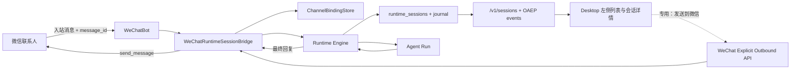

# Desktop 设置-频道微信接入开发方案 P2：Runtime Session 会话融合

状态：方案待评审，尚未进入开发  
日期：2026-08-15  
依赖：[Desktop 设置-频道微信接入开发方案（P1）](./settings-channels-wechat-integration-development-plan.zh-CN.md)  
适用范围：Windows Desktop、macOS Desktop、共享 Renderer、Python Runtime  

## 1. 总体目标

P2 将微信入站会话接入 Desktop 已有的正式 Runtime Session 体系，使微信不再拥有一套仅由频道内部维护、Desktop 不可见的会话历史。

最终结果如下：

1. 某个微信联系人首次发送有效消息时，Runtime 原子地创建一条正式 Runtime Session。
2. 该会话通过现有 `/v1/sessions` 会话目录和事件流自然显示在 Desktop 左侧会话列表，无需另建“微信聊天列表”。
3. 会话标题只使用本机生成的脱敏序号，例如“微信会话 1”，不显示或向 Renderer 传递原始微信 ID。
4. 会话列表和详情页显示“微信”来源标识。
5. 微信入站消息、Agent 运行过程和最终回复写入同一份 Runtime Session journal；Desktop 打开会话时可查看完整历史。
6. 同一个微信联系人后续消息复用其当前 Runtime Session，Desktop 和微信不会产生两套上下文。
7. Desktop 默认不能把普通消息意外外发到微信。若提供主动回复，必须走独立、明确的“发送到微信”操作。

P1 的真实账号剩余验收按当前决定暂停；P2 不以完成该项验收为前置条件，但进入发布候选前仍需用测试微信账号完成本方案的真实闭环验收。

## 2. 当前实现与问题根因

当前 Desktop 左侧会话列表读取正式 Runtime Session：Python Runtime 的 `runtime_sessions`、`runtime_session_journal` 以及 `/v1/sessions` API；Desktop 通过 `runtimeClient.ts` 和现有会话投影展示它们。

当前微信链路则由以下独立实现承载：

- `gateway_wechat.py` 创建 `wechat_sessions.json` 映射文件。
- `wechat/session_manager.py` 把微信用户映射为 `wechat_session_N`。
- `daemon/wechat_adapter.py` 使用旧式 `AgentSessionAdapter` 执行消息。
- 微信状态接口只返回频道会话数量，不创建或投影正式 Runtime Session。

因此现在的微信消息虽然能被 Agent 处理并回复，但它不属于 Desktop 会话目录所消费的 Runtime Session。仅在 Desktop 补一个展示页面或把两边历史定时复制，会继续造成上下文分叉、重复消息和一致性问题，不作为 P2 方案。

## 3. 范围与非目标

### 3.1 本期范围

- 首次微信消息创建正式 Runtime Session。
- 微信联系人和当前 Runtime Session 的持久化绑定、重启恢复和并发幂等。
- Desktop 左侧列表同步、微信来源标识、脱敏标题和完整历史展示。
- 入站消息和 Agent 回复只写一份 Runtime journal。
- 多个微信联系人隔离成不同 Runtime Session。
- 微信图片入站使用当前 Agent 配置的“图像理解”模型，图片与文字共同写入同一 Runtime Run。
- Agent 调用当前配置的“图像生成”模型产生图片 Artifact 后，将结果图片回传微信。
- `/newsession` 创建新 Runtime Session 并切换当前绑定，旧会话保留可查。
- 归档、重新入站、断线重连和失败恢复规则。
- Desktop 主动外发的安全边界；明确操作作为独立交付项和功能开关。
- 数据迁移、日志脱敏、自动测试和真实账号验收。

### 3.2 非目标

- 多个微信 Bot 账号同时绑定到同一 Desktop。
- 群聊、语音、普通文件、视频、小程序等能力；图片理解和生成属于本期范围。
- 在 Desktop 展示微信头像、昵称、原始用户 ID 或联系人列表。
- 将任意普通 Desktop 会话直接转换为微信会话。
- 在 Renderer 保存微信凭据、上下文 token 或原始微信标识。
- 把历史 Desktop 消息批量补发到微信。

## 4. 核心设计原则

### 4.1 Runtime Session 是唯一事实来源

微信首次消息到达后，绑定记录只保存“该频道联系人当前对应哪个 Runtime Session”。消息内容、Agent 回复、运行状态和错误全部写入该 Runtime Session 的 journal。Desktop 与微信处理器都读取这份历史，不额外保存可参与推理的微信聊天副本。

### 4.2 创建与绑定必须幂等

绑定键使用 `provider + bot_account_fingerprint + provider_user_key`。`provider_user_key` 使用每次安装独有密钥进行 HMAC，不能保存原始微信 ID，也不能使用可跨安装关联用户的裸哈希。

微信消息的服务端消息 ID 经规范化后作为 `source_message_id`，并以 `source_client=wechat` 写入 journal。唯一约束保证重复投递、长轮询重连和进程重启不会重复创建会话、重复执行 Agent 或重复显示消息。

同一脱敏联系人键下的入站 Run 必须串行创建和执行，避免上一条仍处于 active 状态时触发 `session_run_already_active`；不同联系人使用不同调度锁，保持联系人之间的并行能力。调度锁只保存在进程内存并使用弱引用回收，不持久化原始微信 ID。

### OAEP 到微信的外发投影边界

微信是外部、低带宽且不可撤回的渠道，不能等同于 Desktop 的完整 OAEP 检查视图。自动回复采用显式白名单：仅允许同一 Run 中 `type=message`、`role=assistant`、`phase=final`、`status=completed` 的最终文本，以及已登记为正式 Runtime Artifact 的受支持图片。Desktop 发往微信的用户文本仍必须走独立的“发送到微信”确认和幂等投递流程。

以下 OAEP 内容不得自动外发：`reasoning` 的 summary/commentary/analysis 全部可见性级别、`phase=commentary` 的进度消息、plan、tool call/result、command execution、file change、subtask、interaction/approval、notice、诊断、错误栈及未完成消息；非图片 Artifact 也不自动外发。最终文本在出口转换为纯文本，移除 HTML/script/style 和 `<think>` 块，HTML emoji span 转成 Unicode。若模型错误地把明显的内部过程自述写入 final，出口从该段开始 fail-closed 截断；没有安全正文时不发送该内容并进入受控失败回复。

### 4.3 来源元数据属于会话，不靠标题推断

Runtime Session 增加结构化来源字段，例如：

```json
{
  "origin": {
    "kind": "channel",
    "provider": "wechat",
    "binding_id": "wcb_...",
    "reply_capability": "unavailable"
  }
}
```

Desktop 根据 `origin.provider` 显示“微信”标识；标题“微信会话 N”仅用于展示，不能作为权限判断或数据路由依据。

### 4.4 普通 Desktop 发送绝不隐式外发

微信来源会话在 P2.1 中默认只读，隐藏或禁用普通会话输入框。P2.2 如启用主动回复，必须提供独立的“发送到微信”按钮和专用操作区，清晰展示“将发送给：微信会话 N”。该操作直接发送一条人工回复，不触发普通 Desktop Agent turn，也不复用普通发送快捷键。

第一次在该会话主动外发时需要二次确认；后续仍保留明确的按钮文案和外发图标。接口必须要求专用权限、当前可用的微信回复上下文和幂等请求 ID。功能默认关闭，可由产品配置启用。

### 4.5 多模态仍使用当前 Agent 模型策略

微信频道不维护独立模型列表，也不接受 `/model` 绕过 Desktop 设置。图片入站从 iLink 固定 CDN 下载并在内存中完成 AES-128-ECB 解密，经过大小、格式、工作区路径和摘要校验后编码为标准 `oaep.input/1` 文件资源。Runtime 使用当前 Agent 的 `image_understanding_model` 生成有界、只读的视觉摘要，再交给当前主模型继续同一 Run；图片正文、摘要和回复不产生第二套微信推理历史。

图像生成继续使用 Runtime 已有的 `builtin.image_generation` 与当前 Agent 的 `image_generation_model`。生成结果先成为正式 Runtime Artifact，再通过 iLink `getuploadurl`、固定微信 CDN、AES-128-ECB 加密上传和 `image_item` 回发。CDN 查询参数、AES 密钥和原始微信 ID 不写入 Session、journal、日志或 Renderer payload。

微信频道执行时每次从当前 Agent 模型策略读取主模型、图像理解和图像生成配置。设置页微信卡片不展示具体模型分配，避免与模型设置形成重复入口；模型选择和缺失状态统一在模型设置中查看和管理。频道接口中的安全能力信息不得包含密钥、配置路径或原始策略内容。

## 5. 总体解决方案



### 5.1 首次入站流程

1. WeChatBot 收到文本消息，提取原始联系人标识、消息 ID 和短期回复上下文；原始标识只存在于受信任 Runtime 内存和协议调用边界。
2. Bridge 生成安装内稳定的 `provider_user_key`，按绑定键查询当前会话。
3. 若无绑定，在一个数据库事务内分配脱敏序号、创建标题为“微信会话 N”的 Runtime Session、写入来源元数据并创建绑定。
4. 用 `source_client=wechat` 和稳定 `source_message_id` 追加 user item；若已存在则直接返回既有处理结果，不再次执行。
5. 在同一 Runtime Session 创建 Agent run，沿用 Desktop Runtime 的身份、审批、工具和模型策略。
6. Agent 的增量事件和最终 assistant item 写入同一 journal，Desktop 事件订阅实时收到更新。
7. 最终文本通过微信发送成功后记录渠道投递状态；投递失败只标记失败和提供重试，不删除已经完成的 Agent 回复。

### 5.2 后续消息与多用户隔离

- 相同绑定键复用当前 Runtime Session。
- 不同微信联系人拥有不同绑定和 Runtime Session；同一联系人的消息按绑定级串行锁排队，避免两个并发 turn 互相覆盖上下文。
- 多联系人之间可并行执行，但都受 Runtime 的全局并发和资源限制。
- `/newsession` 原子创建下一条脱敏 Runtime Session，并把绑定的 `active_session_id` 切换到新会话；旧会话继续显示在 Desktop，且不再接收该联系人的新消息。

### 5.3 Desktop 会话同步与展示

复用现有 Runtime Session 目录、snapshot 和 event stream：

- 左侧列表项展示脱敏标题、最后消息摘要、更新时间和“微信”徽标。
- 打开后使用标准会话详情渲染 user/assistant 消息，不从 `/v1/channels/wechat/sessions` 拉第二份内容。
- 微信入站 user item 显示“来自微信”；Agent assistant item 显示正常 Agent 身份，并可显示“已发送到微信 / 发送失败”。
- 新入站到达已归档会话时自动取消归档并置顶；不静默新建另一个会话。
- Desktop 重启后通过标准会话列表恢复；事件流断线后按 sequence 补拉，不丢失或重复展示。

### 5.4 明确的 Desktop 主动外发

P2 拆成两个可独立验收的交付段：

- **P2.1 会话可见与历史统一（必做）**：微信来源会话在 Desktop 只读，不允许普通输入框发送。
- **P2.2 显式发送到微信（受控可选）**：增加独立按钮和接口，默认由功能开关关闭。只有确认微信协议允许、短期回复上下文仍有效时才可用。

建议接口：

```text
POST /v1/channels/wechat/sessions/{runtime_session_id}/outbound-messages
Idempotency-Key: <uuid>
Body: { "text": "...", "confirm_external_send": true }
```

服务端校验该 Session 确实绑定当前微信 Bot、调用者已认证、功能已启用、文本符合限制且回复上下文可用。发送记录以 `pending -> sent | failed | unknown` 状态写入 Runtime journal。对于结果未知的网络失败，不自动生成新请求重发，避免重复外发。

## 6. 数据模型与 API 契约

### 6.1 Channel binding

新增 Runtime 数据表或等价持久化实体 `runtime_channel_bindings`：

| 字段 | 说明 |
|---|---|
| `binding_id` | 随机内部 ID |
| `provider` | 固定为 `wechat` |
| `account_fingerprint` | Bot 账号的不可逆安装内标识 |
| `provider_user_key` | 安装密钥 HMAC 后的联系人键 |
| `display_index` | 脱敏标题序号 |
| `active_session_id` | 当前正式 Runtime Session ID |
| `created_at` / `updated_at` | 审计时间 |

对 `(provider, account_fingerprint, provider_user_key)` 建唯一索引；对 `(provider, account_fingerprint, display_index)` 建唯一索引。表中禁止出现原始微信 ID、昵称、头像、bot token 和 context token。

短期 `context_token` 仅保存在受信任 Runtime 内存；如果协议确实要求跨重启保存，必须进入现有凭据安全存储并设置过期时间，不能进入 session/journal 或 Renderer API。

### 6.2 Runtime Session 扩展

为 `runtime_sessions` 增加可查询的 `origin_kind`、`origin_provider`、`origin_binding_id`，或增加一张一对一来源表。优先使用结构化列和外键，不把 JSON 标题当作唯一索引。

`RuntimeSession` API 类型增加可选 `origin`，保持旧客户端兼容。OAEP/relay 契约将 `source_client` 从 `windows | android | runtime` 扩展为 `windows | android | runtime | wechat`，同步更新生成代码、schema fixture 和 Desktop TypeScript 类型。

### 6.3 投递状态

每条需要发往微信的 assistant 或人工 outbound item 记录：`channel_delivery_id`、`session_id`、`item_id`、`idempotency_key`、`status`、`attempt_count`、脱敏错误码和时间。该记录只描述投递，不复制消息正文。

## 7. 需要实现、更新或移除的模块

### 7.1 Python Runtime

| 动作 | 模块 | 工作内容 |
|---|---|---|
| 新增 | `drsai/backend/wechat/runtime_session_bridge.py` | 首次建会话、绑定解析、入站幂等、Agent run、回复投递协调 |
| 新增 | `drsai/backend/wechat/channel_binding_store.py` | 绑定、脱敏序号、迁移和事务接口；底层与 Runtime SQLite 同库事务协作 |
| 新增 | `drsai/backend/wechat/outbound_service.py` | P2.2 显式外发校验、幂等与投递状态 |
| 更新 | `drsai/backend/runtime/engine.py` 与 journal | Session 来源字段、`wechat` source client、渠道投递事件和查询 |
| 更新 | `drsai/backend/gateway.py` | Session API 暴露安全的 `origin`；生成契约同步更新 |
| 更新 | `drsai/backend/gateway_wechat.py` | Bot 改用 Runtime bridge；新增受控 outbound API；sessions 诊断只返回脱敏统计 |
| 更新 | `drsai/backend/wechat/wechat_bot.py` | 使用稳定消息 ID、绑定级串行、投递结果回写；保留原生输入状态 |
| 更新 | relay/OAEP schema 与生成代码 | 加入 `wechat` 来源并保持旧客户端兼容 |
| 移除 | Desktop 微信路径中的 `AgentSessionAdapter` | P2 切换完成后不再作为 Desktop 微信消息执行器；TUI 如仍需要可暂时保留 |
| 移除 | Desktop 微信路径中的 `wechat_sessions.json` | 迁移完成且回滚窗口结束后停止读写；不直接删除用户旧文件 |

### 7.2 Desktop shared main / API / IPC

| 动作 | 模块 | 工作内容 |
|---|---|---|
| 更新 | `apps/desktop/shared/main/runtimeClient.ts` | RuntimeSession origin、wechat source、投递状态类型 |
| 更新 | 会话目录与 conversation projection | 保留来源字段并向 Renderer 安全投影 |
| 更新 | `desktopApi.ts`、preload、Windows/macOS IPC | P2.2 增加专用 outbound 方法；不暴露通用微信 send 方法 |
| 更新 | 微信频道服务 | 提供功能开关、回复能力和脱敏诊断，不返回联系人标识 |

### 7.3 Desktop Renderer

| 动作 | 模块 | 工作内容 |
|---|---|---|
| 更新 | 左侧会话列表项 | 添加“微信”徽标、无障碍标签和来源筛选兼容 |
| 更新 | 会话详情 | 入站来源、投递状态、失败提示和历史实时更新 |
| 更新 | Composer | 微信来源会话默认只读；不得沿用普通发送快捷键外发 |
| 新增 | `SendToWeChat` 明确操作 | P2.2 专用编辑区、首次确认、能力不可用提示和发送状态 |

## 8. 数据迁移与兼容

1. 首次启动 P2 时读取旧 `wechat_sessions.json`，只迁移可验证的脱敏联系人映射。
2. 旧映射没有正式 Runtime 历史时，不伪造历史消息；为下一次入站预留或创建 Runtime Session，并记录 `migration_source=wechat_sessions_v2`。
3. 如果旧映射无法安全对应联系人，则不猜测合并；下一次入站创建新的绑定。
4. 迁移使用版本号和幂等标记，可重复执行；旧文件在至少一个发布回滚窗口内只读保留。
5. 回滚到 P1 时不得让 P2 数据库内容被旧代码覆盖；P1 仍使用旧映射，但回滚期间产生的消息不会自动合并，发布说明必须明确这一限制。

## 9. 功能点、测试与验收

| ID | 功能点 | 自动测试 | 验收标准 |
|---|---|---|---|
| P2-W01 | 首次入站创建正式 Session | 单元测试事务创建；集成测试模拟首条消息 | `/v1/sessions` 只新增一条，标题为“微信会话 N”，消息可打开 |
| P2-W02 | 重复投递幂等 | 相同 message ID 并发投递 10 次 | 只创建一个 Session、一个 user item 和一个 Agent run，只外发一次 |
| P2-W03 | 左栏实时同步 | Runtime API + Desktop projection 测试 | Desktop 不刷新应用即可出现会话和微信徽标 |
| P2-W04 | 完整历史 | snapshot、事件流断线补拉测试 | 入站正文、Agent 回复顺序一致，重启后仍完整，无重复 |
| P2-W05 | 来源标识 | Session contract、Renderer 组件测试 | 列表和详情显示“微信”；旧会话不误标 |
| P2-W06 | 脱敏与日志安全 | API snapshot、日志扫描、Renderer payload 测试 | 标题/API/日志/诊断均不出现原始微信 ID、token 或 context token |
| P2-W07 | 唯一上下文 | Bridge 与 Runtime run 集成测试 | 第二条微信消息能引用第一轮内容；不存在独立微信推理历史文件 |
| P2-W08 | 多联系人隔离 | 两个联系人交错及并发测试 | 分别产生两条 Session，序号不同，消息和上下文绝不串线 |
| P2-W09 | `/newsession` | 命令与绑定事务测试 | 创建新 Runtime Session 并切换绑定；旧会话可查且不再收新消息 |
| P2-W10 | 归档与新入站 | lifecycle 集成测试 | 已归档会话收到新消息后恢复 active 并置顶，不静默分叉 |
| P2-W11 | 重启与断线恢复 | Runtime/Bot/Desktop 重启测试 | 绑定稳定、序号不变、事件可补拉、重复包不重复执行 |
| P2-W12 | Agent 失败可见 | 模拟认证、审批、模型和工具错误 | Desktop 会话内有脱敏失败状态；微信获得稳定错误回复且可重试 |
| P2-W13 | 普通发送防外发 | Renderer、IPC 负向测试 | 微信会话普通 Composer 不可发送，Enter/Ctrl+Enter 不触发微信 API |
| P2-W14 | 显式发送到微信 | P2.2 API、确认框、幂等和真实发送测试 | 只有点击明确操作并确认后外发一次，记录 sent/failed 状态 |
| P2-W15 | 回复能力过期 | 过期/缺失 context token 测试 | 按钮禁用并提示“等待对方先发消息”，不产生假成功记录 |
| P2-W16 | 权限与跨会话攻击 | 未认证、错误 Session、伪造 binding 测试 | 全部拒绝且不泄露绑定是否存在，不向其他联系人发送 |
| P2-W17 | 双平台一致 | Windows/macOS 构建和 UI 冒烟 | 两平台列表、徽标、历史和只读/外发行为一致 |
| P2-W18 | 微信图片理解 | CDN 白名单、AES 解密、图片资源与当前模型策略集成测试 | 微信发送图片后由当前 `image_understanding_model` 理解；Desktop 同一会话可见图片附件与回复 |
| P2-W19 | 微信图像生成 | Artifact 提取、AES 上传、图片消息和投递幂等测试 | 微信文字/图片请求触发当前 `image_generation_model`，微信仅收到一次生成图片且 Runtime 保留正式 Artifact |

### 9.1 测试分层

- **单元测试**：HMAC 键、脱敏序号、标题、绑定事务、幂等键、状态机、权限判定、媒体 AES、CDN 白名单和图片格式/大小边界。
- **契约测试**：OpenAPI/OAEP schema、Python 生成类型、Desktop TypeScript 类型和旧客户端兼容。
- **Runtime 集成测试**：模拟微信客户端，将文字/图片消息送入 Bot，验证 Session、journal、Run、当前能力模型路由、Artifact 和投递记录。
- **Desktop 集成测试**：用假 Gateway 验证列表实时更新、徽标、历史、归档恢复和 Composer 安全边界。
- **端到端测试**：启动真实 Desktop + 本地 Runtime + fake WeChat server，覆盖首次消息、重复投递、重启和多用户。
- **真实账号验收**：使用至少两个测试微信联系人，验证会话隔离、完整历史、原生输入状态和 P2.2 显式外发。

### 9.2 发布验收门槛

P2.1 必须同时满足：

1. P2-W01 至 P2-W13、P2-W16 至 P2-W19 全部通过。
2. 新增和受影响自动测试全绿，Windows/macOS 构建通过。
3. 日志与 API 脱敏扫描零泄漏。
4. 两个真实微信联系人各完成至少两轮上下文对话，Desktop 左栏和详情全程一致。
5. 关闭 Desktop 再启动后，会话与历史仍一致且不重复。

P2.2 只有 P2-W14、P2-W15 及真实外发验收通过后才能打开功能开关；否则 P2.1 仍以只读方式发布。

## 10. 实施顺序

### 阶段 A：Runtime 基座

- 扩展 Session 来源和 `source_client=wechat` 契约。
- 实现 channel binding、HMAC 脱敏、事务创建和消息幂等。
- 用 Runtime bridge 替换 Desktop 微信链路的旧 Adapter。

### 阶段 B：Desktop 可见性

- 扩展 Desktop Runtime 类型和投影。
- 实现左栏微信徽标、详情来源和投递状态。
- 将微信来源会话设为默认只读。

### 阶段 C：迁移与可靠性

- 迁移旧映射，覆盖多用户、`/newsession`、归档、重启和断线。
- 完成日志脱敏、诊断和故障恢复测试。

### 阶段 D：显式外发（可选开关）

- 实现专用 outbound API、权限、幂等和投递状态。
- 实现明确按钮、首次确认和不可用提示。
- 通过真实账号验收后再决定是否默认启用。

## 11. 风险与处理

| 风险 | 处理 |
|---|---|
| 首条消息并发导致多会话 | 唯一索引、数据库事务和冲突后重读 |
| 长轮询重复包导致重复 Agent 回复 | `source_message_id` 唯一约束和可恢复处理状态 |
| Desktop 与微信处理同时修改会话 | P2.1 会话只读；P2.2 只允许专用外发，不创建普通 Agent turn |
| 微信短期回复上下文过期 | 能力实时计算，过期即禁用；不持久化到普通 Session 数据 |
| 原始微信 ID 泄漏 | 安装密钥 HMAC、字段白名单、日志扫描和 Renderer 负向测试 |
| 旧映射无法还原历史 | 不伪造、不猜测合并；从下一次入站开始建立正式历史 |
| 网络结果未知导致重复外发 | 稳定幂等键；unknown 状态需用户明确重试 |
| Runtime schema 影响旧客户端 | origin 字段可选、契约兼容测试和分阶段迁移 |

## 12. 待产品确认项

以下项目不阻塞 P2.1 开发，采用文中默认值即可推进：

1. P2.2 “发送到微信”是否首发启用。建议默认关闭，真实验收后开放。
2. 脱敏序号范围。建议按“当前安装 + 当前 Bot 账号”递增；重新登录同一 Bot 保持序号。
3. 微信来源会话的普通 Composer 行为。建议只读，不允许创建仅 Desktop 可见的隐藏 turn。
4. 已归档会话收到新入站时的行为。建议自动恢复 active 并置顶。
5. 未读计数和系统通知是否纳入首版。建议只做现有会话列表能力兼容，不新增通知系统。

## 13. 完成定义

P2 完成不是“频道页显示会话数量”，而是：微信消息从首次进入开始就属于正式 Runtime Session；Desktop 左侧可实时看到带微信来源标识的脱敏会话，并能查看与微信处理共用的完整历史；多用户、重复投递、重启和归档均不造成串线或分叉；普通 Desktop 操作绝不会隐式向微信外发，任何主动外发都只能通过经过权限、确认和幂等保护的明确操作完成。
