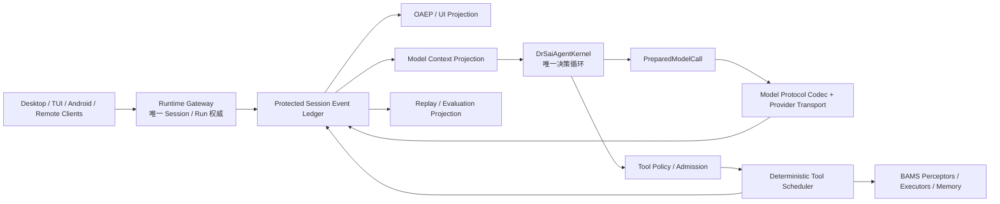

# OpenDrSai DeepSeek Harness Inspired Runtime 演进方案

> 状态：方案草案，待架构评审
> 日期：2026-08-14
> 范围：OpenDrSai Runtime Gateway、Agent Kernel、模型协议、工具执行、Session Journal、Desktop/TUI/Android Host 适配
> 研究输入：Codex 任务 `019ffe1c-0ebd-7641-b21e-cb9ff9cd6deb`、`019ffe40-9e44-71f3-b004-25f76a7e70a7`
> 参考版本：DeepSeek Harness `v0.1.0-rc.5`，commit `47f943859bef60e4160492346772ded9b24f765a`
> 关联方案：[Desktop/TUI Runtime 统一方案](../desktop-tui-runtime-unification-plan.md)、[BAMS 资源配置架构方案](./opendrsai-bams-resource-configuration-architecture.md)、[Agent Runtime 可追溯与可复现第四阶段方案](../desktop/agent-runtime-traceability-reproducibility-phase4-development-plan.md)

## 1. 阶段结论

OpenDrSai 不引入 Cordis 作为第二套依赖注入或生命周期容器，不把 DeepSeek Harness 整体嵌入 BAMS，不用其 Session、Agent Loop 或 Web Host 替换 Runtime Gateway、OAEP、共享 Agent Kernel 和现有安全副作用账本。

本方案借鉴 DeepSeek Harness 的运行时机制，而不是复制其产品架构。首要吸收四条不变量：

1. 所有运行时注册都绑定明确作用域，并且可撤销、可等待、可验证清理完成；
2. 所有模型可见输入都能从权威、受保护的 Session 事件记录重建；
3. 每次模型调用在发出首个网络字节前冻结成可审计的 `PreparedModelCall`；
4. 工具允许受控并发执行，但其模型可见结果按模型调用顺序确定性提交。

OpenDrSai 保留并继续强化自身已有优势：

- BAMS 的 Brain、Actuators、Memory、Sensors 产品语义；
- Runtime Gateway 对 Workspace、Session、Run、Approval、Artifact 和 Event Journal 的唯一权威；
- `DrSaiAgentKernel` 作为跨 Desktop、TUI、Android 的唯一 Agent 决策循环；
- OAEP、Run Manifest、Replay、Comparison、Evaluation 和回归证据；
- 未知或不可逆副作用禁止自动重放，审批与真实执行回执必须闭环；
- 凭据不进入 Renderer、日志、OAEP、导出和普通 Run Snapshot。

这是一项渐进式架构收敛工作，不建立第二套 Runtime，不要求一次性重写现有 Agent，也不以 package 数量衡量模块化程度。

## 2. 参考实现中真正值得借鉴的部分

### 2.1 插件不是目标，明确的能力边界才是目标

DeepSeek Harness 将模型适配器、工具注册表、Session Log、Agent Loop 和 UI Host 都建模成插件。其高价值不在于“所有东西都是插件”，而在于每个扩展都明确回答：

- 它提供什么能力；
- 谁消费该能力；
- 注册在哪个作用域；
- 何时开始接收新工作；
- 如何取消和排空已有工作；
- 卸载时如何证明没有遗留任务、监听器或进程。

OpenDrSai 应在现有 Protocol、Port、Registry、Agent Backend 和 BAMS Resource 边界上采用这些约束，不再引入通用 Service Locator。

### 2.2 Lifecycle Effect 的语义值得移植，名称不应照搬

Cordis Effect 表示“副作用和其 disposer 绑定在一起”。OpenDrSai 已使用 `side_effect` 表示经过审批、可能改变外部世界的操作，因此本方案使用以下术语避免冲突：

- `LifecycleScope`：生命周期作用域；
- `RegistrationLease`：一次注册的所有权和释放句柄；
- `AsyncDisposer`：可等待的异步清理；
- `SideEffectReceipt`：现有的、具有外部业务副作用的执行回执。

Lifecycle cleanup 与业务 side effect 必须在类型、事件名、数据库字段和文档中保持严格区分。

### 2.3 Session Log 是模型上下文来源

DeepSeek Harness 的关键规则是“model-visible means logged”：只要内容进入模型请求，它就必须能从 Session Log 重建。该规则使 fork、resume、transcript、telemetry 和持久化可以共享一个事件源。

OpenDrSai 当前已有追加式 Runtime Session Journal 和 OAEP 投影，但 Agent Kernel 的模型历史仍主要来自 Kernel checkpoint 中的 `messages` 或 AutoGen model context。本方案要求逐步把模型上下文也变成受保护 Journal 的投影，使 checkpoint 降级为可验证的加速缓存，而不是独立事实源。

### 2.4 Prepared Call 冻结实际调用

DeepSeek Harness 在调用模型前冻结 provider、model、adapter defaults、context window 和 retry policy。OpenDrSai 已有 provider revision、model route snapshot、capability digest 和 Run Manifest，但还缺少统一、跨 provider 的最终调用快照。

本方案增加 `PreparedModelCall`，把“配置解析成功”和“这一次网络调用究竟会发送什么”连接起来。

### 2.5 工具执行与结果提交解耦

DeepSeek Harness 的工具调度器允许 bounded parallel dispatch，同时在模型调用顺序上执行 post-processing 和 durable commit。该设计兼顾吞吐、确定性历史和 KV cache 稳定性。

OpenDrSai 已有工具批次校验、最大并发数、审批隔离、执行 registry snapshot 和 side-effect receipt，但 Desktop Host 当前仍逐个等待 Tool Port。应在不削弱现有安全策略的前提下增加确定性调度器。

### 2.6 Provider Codec 是独立、纯净、可测试的协议层

DeepSeek Harness 将 DeepSeek 请求序列化、SSE 翻译、thinking/reasoning passback、tool-call delta 组装和 cache usage 映射拆成纯函数。OpenDrSai 当前相关逻辑分散在运行模型客户端、配置探针和模型 operation adapter 中，应统一为可复用 codec。

## 3. 当前 OpenDrSai 实现审计

### 3.1 已具备的正确基础

| 领域 | 当前实现 | 本方案判断 |
| --- | --- | --- |
| Runtime 权威 | `RuntimeEngine`、Runtime Gateway、Session/Run/Event Journal | 保留并强化，不建立并行事实源 |
| Agent Backend | `AgentBackendRouter`、`RuntimeAgentService`、native/Codex backend | 继续作为外部 Agent 集成边界 |
| 跨端 Agent 核心 | `create_agent_kernel()` 只构造 `DrSaiAgentKernel` | 保持唯一 Kernel 类型 |
| 事件协议 | `NormalizedAgentEvent`、OAEP bridge、Backend event adapter | 作为外部 Backend 事件归一化边界 |
| 工具安全 | execution registry snapshot、approval、side-effect receipt | 保留；并发调度必须在准入之后 |
| 资源配置 | stable ID registry、credential ref、revision、Run Snapshot | 作为 BAMS capability composition 基础 |
| 对话存储 | append-first Journal、snapshot waterline、OAEP projection | 扩展 Model Context Projection |
| 可复现性 | Run Manifest、Replay、Comparison、Evaluation | Prepared Call 和模型输入 digest 接入现有证据链 |

### 3.2 需要收敛的问题

#### 3.2.1 模型上下文与 Runtime Journal 尚未完全同源

Desktop Kernel adapter 恢复历史时优先读取 `_agent_kernel_checkpoint.state.messages`，否则读取 AutoGen `_model_context`。这两者虽然能被持久化，但并非直接从 Runtime Session Journal 的 waterline 投影。

风险包括：

- UI 显示历史与下一次模型输入可能发生细微漂移；
- checkpoint、AutoGen context、Runtime events 和 OAEP projection 需要额外 reconciliation；
- fork、resume、backend 切换和模型切换难以证明使用了同一上下文；
- 回归测试只能证明最终输出，不能精确证明模型请求前缀。

#### 3.2.2 模型协议存在重复实现

当前至少存在以下相关路径：

- `modules/components/model_client/LLMClient.py` 的实际 Chat/Responses 调用；
- `config/model_operation_adapters.py` 的能力探测和 operation 调用；
- AutoGen provider SDK 的序列化与流式解析；
- Gateway provider capability probe 和连接测试。

同一模型可能在“探针通过”与“正式 Runtime 调用”中使用不同 wire shape、thinking 参数或错误分类。

#### 3.2.3 工具批次可校验，但 Host 执行仍主要串行

Kernel 可以验证多个 tool call 和 `max_parallel_tool_calls`，但 `DesktopKernelCoordinator` 当前对每个 `TOOL_CALL_REQUEST` 执行 `await ToolPort(...)`。并发声明尚未成为真实并发执行能力。

#### 3.2.4 注册和资源释放缺少统一所有权

Backend、adapter、watcher、terminal、job、MCP connection 和 Gateway singleton 的注册/关闭方式不统一。部分 registry 的 `register()` 不返回 disposer，部分资源依赖调用方记住 `close()`，热更新和异常启动失败容易产生清理路径分叉。

#### 3.2.5 Gateway 作为 composition root 承担了过多功能实现

`backend/gateway.py` 同时负责应用装配、HTTP API、模型配置、Runtime Backend、工具、审批、Artifact、移动端、远程 Workspace、回归控制和多种产品设置。新能力继续直接进入该文件会扩大隐式依赖和全局状态。

#### 3.2.6 主 Kernel 已收敛，但 legacy Agent loop 仍可被调用

正式 factory 会创建共享 Kernel，普通 Desktop 任务走 Kernel adapter；slash command 作为 human command 在模型 Turn 外执行是合理的。但是 `DrSaiAssistant.on_messages_stream()` 中仍保留完整 legacy model/tool loop，可在缺少共享 Kernel 的构造路径中运行。

在迁移完成后，应把 legacy loop 明确限制为测试/兼容入口或移除，避免未来修复只落到其中一条执行链。

## 4. 总体目标

### 4.1 产品目标

1. Desktop、TUI、Android 对同一 Workspace/Session 使用同一 Runtime 权威状态；
2. 任意一次模型调用都能解释其 provider、model、reasoning mode、tool surface、context waterline 和 retry policy；
3. Session 恢复、Backend 重启和进程重启不会改变模型历史语义；
4. 多个安全只读工具可以真实并行，模型历史和 OAEP 顺序仍保持确定；
5. 所有进程、监听器、注册、队列和后台任务都有可验证的 owner 与 disposer；
6. DeepSeek V4 thinking、reasoning passback、tool call 和 cache usage 通过同一 codec 在 probe 与 Runtime 中保持一致；
7. 未来接入新模型或外部 Agent Backend 时，不修改 Kernel 决策核心。

### 4.2 工程目标

- 将 `gateway.py` 收敛为 composition root 和兼容 facade；
- 将模型协议从 Agent 类和配置服务中提取为共享模块；
- 将模型上下文构造从隐式对象状态转为事件投影；
- 将工具准入、执行调度和结果提交拆成三个显式阶段；
- 将生命周期清理纳入单元测试、故障测试和 Runtime health；
- 为架构不变量建立自动化门禁，不只依赖文档约定。

## 5. 非目标

- 不引入 Cordis、Schemastery 或 DeepSeek Harness 的 Loader；
- 不把 TypeScript DeepSeek adapter 作为 Python Runtime 的直接运行依赖；
- 不替换 AutoGen 的消息和模型客户端基础，除非单独立项；
- 不让 Agent Kernel、OAEP、Runtime Journal 或 BAMS 成为可随意替换的插件；
- 不把完整隐藏思维链作为产品功能、回归断言或普通持久化证据；
- 不把 raw provider stream 全量永久保存；
- 不允许配置热更新改变已经开始的模型调用；
- 不允许并发调度绕过审批、Workspace policy 或 side-effect receipt；
- 不把 DeepSeek Harness ACP 的结果冒充完整 OAEP 轨迹；
- 不因架构演进修改历史 Run、Tool Result 或原始 Comparison 事实。

## 6. 必须冻结的架构不变量

### INV-01：Runtime Gateway 是唯一 Run 执行权威

正常 Workspace 聊天只能通过 Runtime 创建 Session/Run 和执行。TUI direct Agent execution 只能保留为明确标识的 compatibility/debug mode，且不得与同一 Runtime Session 双写。

### INV-02：共享 Kernel 是唯一 Agent 决策循环

Desktop、TUI、Android 和测试通过同一 factory 构造 `DrSaiAgentKernel`。Host adapter 只服务 Kernel 请求，不拥有 Agent 决策。

### INV-03：模型可见内容必须可追溯

进入模型请求的每条 system/user/assistant/tool 内容必须对应：

- 一个受保护 Session event；或
- 一个不可变 Artifact/Memory/Knowledge reference；或
- 一个有 digest、版本和生成依据的 deterministic projection。

无法满足该条件的输入必须在请求发出前失败。

### INV-04：Checkpoint 不是第二事实源

Checkpoint 是受保护 Journal projection 的缓存。恢复后必须校验 session id、waterline、projection digest、Kernel version 和 policy version；不匹配时从 Journal 重建或明确失败。

### INV-05：调用配置在首个网络字节前冻结

`PreparedModelCall` 创建后，provider、model、wire API、tool schema、context、reasoning mode 和 retry policy不可变。配置 reload 只影响后续调用。

### INV-06：工具先准入，后调度，再提交

工具必须先经过 Kernel policy、capability snapshot、approval mode 和 execution registry 校验；Scheduler 不能自行扩大工具集合或权限。

### INV-07：并发执行，顺序提交

并发只影响 wall-clock execution，不改变模型可见的 tool result 顺序、OAEP item identity 和 durable commit 顺序。

### INV-08：未知副作用不自动重放

Started 但无真实 completion receipt 的副作用保持 outcome unknown。重启、取消或超时不能生成伪造成功结果。

### INV-09：所有注册可释放

每个 runtime registration 必须返回 `RegistrationLease` 或绑定到 `LifecycleScope`。进程关闭、Workspace 关闭、Session 归档、Run 结束和插件 reload 都必须有确定清理路径。

### INV-10：私有 reasoning 不进入公共证据面

模型私有 reasoning 可以在 provider passback 所需的受保护上下文中短期保存，但不进入普通 OAEP、Renderer、公开日志、导出或回归报告。公共面只使用 reasoning 状态、摘要、可见性和 digest。

## 7. 目标架构



### 7.1 分层职责

| 层 | 允许负责 | 禁止负责 |
| --- | --- | --- |
| Runtime Gateway | Workspace/Session/Run、授权、Backend 路由、公共 API | 模型 prompt 决策、Tool 选择 |
| Protected Journal | 追加事件、waterline、不可变引用、投影输入 | 业务策略、模型调用 |
| Projection | 从事件构造 OAEP、模型上下文、Replay 证据 | 修改历史事件 |
| Agent Kernel | Prompt 层选择、Tool policy、回合状态、预算、终止决策 | 网络、文件、数据库、Provider 私有 API |
| Prepared Model Call | 冻结实际模型请求与 adapter | 动态重新解析配置 |
| Model Protocol | wire serialization、stream translation、usage、错误归一化 | Agent 决策、UI projection |
| Tool Scheduler | 执行模式、并发、取消、顺序提交 | 工具准入、权限提升 |
| BAMS Provider | 外部能力实现和真实回执 | 伪造 Runtime/OAEP 事实 |

## 8. 核心公共契约

### 8.1 LifecycleScope

建议新增：

```text
cores/python/packages/drsai/src/drsai/backend/runtime/lifecycle.py
```

建议最小契约：

```python
class RegistrationLease(Protocol):
    @property
    def closed(self) -> bool: ...
    async def close(self) -> None: ...

class LifecycleScope:
    def child(self, kind: str, identity: str) -> "LifecycleScope": ...
    def add(self, disposer: Callable[[], Awaitable[None] | None]) -> RegistrationLease: ...
    async def close(self) -> None: ...
```

作用域关闭顺序必须是确定、可等待的 LIFO。需要严格顺序的资源应注册一个聚合 disposer，不允许依赖多个并发 disposer 的完成先后。

建议作用域：

```text
ProcessScope
  └─ WorkspaceScope
       └─ SessionScope
            └─ RunScope
                 └─ StepScope
```

关闭 Run 的规范顺序：

1. 停止接收新模型片段、工具和子任务；
2. 触发 cancellation；
3. 排空已开始且可安全等待的工作；
4. 对未知副作用写入真实 unknown/cancelled 状态；
5. 提交 terminal event 和 checkpoint；
6. 关闭 adapter、transport、watcher 和临时资源；
7. 验证 scope 中无活动 lease。

### 8.2 Protected Session Event Ledger

不新建与 Runtime Journal 平行的数据库。扩展现有 Journal 的 event vocabulary、visibility 和 secure payload reference。

建议公共字段：

```json
{
  "event_id": "evt_...",
  "session_id": "session_...",
  "run_id": "run_...",
  "sequence": 42,
  "type": "model.request.prepared",
  "visibility": "public | diagnostic | model_private | secret_ref",
  "payload": {},
  "secure_payload_ref": null,
  "payload_sha256": "...",
  "created_at": "..."
}
```

建议新增或统一事件：

| 事件 | 作用 | 默认可见性 |
| --- | --- | --- |
| `input.accepted` | 记录 followup/steer/inject 和来源 | public/diagnostic |
| `turn.started` | Turn identity、claim 和 context waterline | diagnostic |
| `model.context.projected` | projection version、waterline、digest、message count | diagnostic |
| `model.request.prepared` | 无密钥调用配置和 request digest | diagnostic |
| `model.output.delta` | 可选、合并后的公开文本 delta | public，可设置短期保留 |
| `assistant.message.committed` | 已提交 assistant 内容 | public |
| `tool.call.admitted` | Kernel 准入后的调用和 execution mode | diagnostic/public projection |
| `tool.execution.started` | 真实执行开始 | diagnostic |
| `tool.result.committed` | 真实结果按模型顺序提交 | public/diagnostic |
| `tool.execution.skipped` | 未开始、取消或 barrier 阻止 | diagnostic |
| `turn.ended` | completed/blocked/interrupted/error | public/diagnostic |

原始私有 reasoning 不作为公共 event payload。DeepSeek thinking passback 需要的内容放入加密 secure payload，并通过 digest 与对应 assistant tool-call event 绑定。

### 8.3 ModelContextProjection

建议新增：

```text
cores/python/packages/drsai/src/drsai/backend/runtime/model_context_projection.py
```

输入：

- `session_id`；
- journal waterline；
- projection policy/version；
- context budget；
- model capabilities；
- tool and memory snapshots。

输出：

```python
@dataclass(frozen=True)
class ProjectedModelContext:
    messages: tuple[ModelMessage, ...]
    waterline: int
    projection_version: str
    context_sha256: str
    source_event_ids: tuple[str, ...]
    omitted_event_ids: tuple[str, ...]
    compaction_ref: str | None
```

要求：

- 相同 Journal、waterline、policy 和资源 snapshot 必须产生相同 digest；
- projection 不修改 Journal；
- tool call/result 必须成组，不能产生 orphan tool result；
- compaction summary 必须有来源事件集合、版本和 digest；
- 不支持的历史事件必须显式失败或按版本化迁移规则处理，不能静默丢弃模型可见内容。

### 8.4 PreparedModelCall

建议新增：

```text
cores/python/packages/drsai/src/drsai/model_protocols/contracts.py
cores/python/packages/drsai/src/drsai/backend/runtime/prepared_model_call.py
```

建议契约：

```python
@dataclass(frozen=True)
class PreparedModelCall:
    call_id: str
    provider_id: str
    provider_revision: int
    model_id: str
    upstream_model_id: str
    wire_api: str
    codec_id: str
    codec_version: str
    reasoning_mode: str
    context_waterline: int
    context_sha256: str
    tool_schema_sha256: str
    request_sha256: str
    retry_policy: RetryPolicy
    timeout_seconds: float
```

凭据、Authorization header 和明文私有 reasoning 不进入该公开对象。实际 transport binding 作为 RunScope 内存对象持有；Manifest 只保存 secret-free snapshot 和 digest。

重试约束：

- 只允许在未向用户或 Kernel 暴露可见输出前自动切换 attempt；
- attempt 必须使用同一个 `PreparedModelCall`，不能重新解析 provider 配置；
- 首个可见 delta 后的失败必须作为当前 attempt 失败，不得静默重新生成不同答案；
- provider route 不可用时，新 route 只能创建新的 prepared call 和新 attempt 事件。

### 8.5 DeepSeekChatCodec

建议新增：

```text
cores/python/packages/drsai/src/drsai/model_protocols/deepseek_chat.py
cores/python/packages/drsai/src/drsai/model_protocols/usage.py
```

Runtime、capability probe、provider connectivity test 和真实回归 fixture 共同使用。

必须覆盖：

- `thinking.type = enabled | disabled`；
- `reasoning_effort = high | max`，`off/none` 不作为非法 wire effort 发送；
- session-title 或轻量内部调用可显式关闭 thinking；
- 只在具有 tool call 且 reasoning 非空的 assistant message 上回传 `reasoning_content`；
- reasoning、text 和 tool-call delta 可能交错；
- tool-call fragments 按 `index` 组装；
- usage-only chunk；
- `prompt_cache_hit_tokens`、`prompt_cache_miss_tokens`、`prompt_tokens_details.cached_tokens`；
- `[DONE]`、正常 EOF、缺失 `[DONE]` 和 malformed SSE 的明确语义；
- cancellation 与 idle timeout；
- provider error 中的 credential、内部 URL 和原始 response body 脱敏。

禁止通过 `<think>...</think>` 字符串充当内部 reasoning 数据结构。UI 如果需要兼容标签，应在 presentation adapter 最后生成，不能反向作为 provider passback 的权威内容。

### 8.6 DeterministicToolScheduler

建议新增：

```text
cores/python/packages/drsai/src/drsai/backend/runtime/tool_scheduler.py
```

建议执行模式：

```text
parallel_read       只读、幂等、并发安全
parallel_pure       纯计算、无外部状态
exclusive           必须独占 Workspace/Session 资源
approval_barrier    需要审批或外部副作用
kernel_internal     由 Kernel 同步执行，不进入 Host Scheduler
subagent_barrier    子 Agent 编排，遵循独立预算和取消策略
```

流程：

```text
Kernel admission
  → Scheduler.prepare(all calls)
  → execution-mode classification
  → bounded dispatch
  → await/drain started calls
  → normalize results
  → commit in model call index order
  → send ordered ToolResult commands to Kernel
```

关键约束：

- classification 来源于冻结的 execution registry，不接受模型声明；
- 默认模式为 `exclusive`，未知工具不能自动并行；
- approval-required batch 继续 fail closed；
- 并发池有全局和每 Workspace 上限；
- 取消时停止启动新调用，已经开始的调用按工具 cancellation contract 处理；
- 未启动调用记录 `tool.execution.skipped`，不能伪装为真实 execution result；
- started external side effect 没有 receipt 时标记 outcome unknown；
- durable result commit 和 Kernel message append 按原始 call index；
- Artifact、file change 和 command OAEP projection 在 durable commit 后生成。

### 8.7 Input Intent

建议新增：

```text
cores/python/packages/drsai/src/drsai/backend/runtime/input_intents.py
```

最小语义：

| Intent | 语义 | 对当前 Run 的影响 |
| --- | --- | --- |
| `followup` | 当前 Run 结束后创建后续 Turn | 不打断当前 Run，进入 Session FIFO |
| `steer` | 用户改变当前执行方向 | 在安全点 interrupt 当前 Run，并以明确 relation 创建后续 Run/Turn |
| `inject` | Host/系统注入状态、通知或受信上下文 | 不伪装成 user message，必须记录来源和 visibility |

语音 barge-in、Desktop 追加消息、TUI 队列和后台任务通知都必须映射到上述 intent，不能各自创造不同的隐式队列语义。

### 8.8 Runtime Module

建议新增：

```text
cores/python/packages/drsai/src/drsai/backend/runtime/modules/
```

建议最小接口：

```python
class RuntimeModule(Protocol):
    module_id: str
    async def install(self, scope: LifecycleScope, services: RuntimeServices) -> None: ...
```

首批从 `gateway.py` 抽取：

- workspace/session/run routes；
- model provider routes；
- BAMS resource routes；
- approval routes；
- artifact routes；
- backend account/model/history routes；
- relay/mobile routes；
- inspection/experiment/comparison routes。

模块只能通过 typed `RuntimeServices` 获取依赖，不直接读取另一个模块的私有 global singleton。

## 9. DeepSeek Harness 运行时集成边界

### 9.1 第一阶段不注册为完整 AgentBackend

DeepSeek Harness ACP 当前是 JSON-RPC stdio 自动化桥：

- 只创建新 Session；
- 只接受 baseline text/resource-link；
- 不支持 load/list/resume/fork；
- 只输出 committed assistant text；
- reasoning、tool activity、plan、usage 和 title 不在协议面；
- 一个连接拥有其创建的全部 Session。

这些限制无法满足 OpenDrSai 完整 OAEP、Run Inspector、历史恢复、工具展示和跨端 continuation。因此第一阶段不能把 ACP committed answer 冒充完整 Runtime Backend 事件流。

### 9.2 可选实验：外部自动化 Subagent Provider

如确需验证 DeepSeek Harness Agent 能力，建议新增实验性：

```text
cores/python/packages/drsai/src/drsai/backend/deepseek_harness_adapter/
```

定位为 `Delegate`/subagent provider，而非主 Agent Backend：

```text
Parent OpenDrSai Run
  → Delegate admitted
  → Runtime spawns dsh ACP process in bounded child scope
  → fresh ACP session in exact Workspace
  → one text task + one-shot approval policy
  → committed assistant answer
  → normalized subagent result
  → parent Kernel continues
```

约束：

- Parent Runtime 保持 Run、Workspace、Approval 和 Artifact 权威；
- dsh Session ID 只作为 backend diagnostic binding；
- 不读取或同步 dsh 私有 Session 数据库；
- 不解析 Web UI 或内部非公开事件；
- Node 运行时、进程生命周期和 stdout protocol framing 纳入 RunScope；
- 缺少完整事件时，OAEP 明确显示 `automation_result_only`；
- 只有 ACP 协议稳定且补齐 history/event capabilities 后，才评估完整 `AgentBackend`。

## 10. 模块变更建议

| 模块 | 动作 | 说明 |
| --- | --- | --- |
| `runtime/lifecycle.py` | 新增 | LifecycleScope、RegistrationLease、清理诊断 |
| `runtime/model_context_projection.py` | 新增 | Journal → Model Context deterministic projection |
| `runtime/prepared_model_call.py` | 新增 | 冻结实际模型调用和 transport binding |
| `model_protocols/contracts.py` | 新增 | 跨 Runtime/probe 的模型协议 DTO |
| `model_protocols/deepseek_chat.py` | 新增 | DeepSeek serializer、SSE translator、passback |
| `model_protocols/usage.py` | 新增 | cache/read/write token 统一语义 |
| `runtime/tool_scheduler.py` | 新增 | 有界并发、barrier、顺序提交 |
| `runtime/input_intents.py` | 新增 | followup/steer/inject 契约 |
| `runtime/journal.py` | 更新 | visibility、secure ref、模型上下文事件和 projection waterline |
| `runtime/engine.py` | 更新 | Prepared call、projection、scheduler 事件持久化和查询 |
| `runtime/mobile_core/engine.py` | 更新 | 消费 ProjectedModelContext；输出 admitted tool batch |
| `runtime/desktop_kernel_coordinator.py` | 更新 | 使用 Scheduler 驱动 Tool Port，不再逐个串行等待 |
| `runtime/desktop_agent_kernel_adapter.py` | 更新 | 停止以 Agent object checkpoint 作为首选历史权威 |
| `modules/components/model_client/LLMClient.py` | 收敛 | 移除 DeepSeek 私有 wire 修补，转调共享 codec |
| `config/model_operation_adapters.py` | 收敛 | probe 与正式 Runtime 共享协议 codec 和错误分类 |
| `runtime/adapter_registry.py` | 更新 | `register()` 返回 lease/disposer |
| `backend/gateway.py` | 逐步瘦身 | 保留 app assembly 和兼容 facade，routes 下沉到 modules |
| `modules/agents/skills_agent/drsai_assistant.py` | 逐步收敛 | command adapter 保留；legacy model loop 限制或移除 |
| `runtime/normalized_events.py` / OAEP bridge | 更新 | 新事件归一化和 public/private projection |
| `eval/regression/` | 更新 | 增加上下文、prepared call、并发顺序和故障矩阵门禁 |

以上路径是建议布局，开发前可以按仓库依赖方向调整；不得为迁就目录而形成新的循环依赖。

## 11. 分阶段实施

### P0：架构合同与 Runtime 权威冻结

目标：先用测试和文档固定边界，防止后续实现同时扩张多条执行链。

| ID | 功能点 | 实现 | 验收 |
| --- | --- | --- | --- |
| DHI-P0-F01 | Runtime 唯一权威门禁 | 将 Desktop/TUI Runtime 统一原则写入架构 invariant | 正常 TUI prompt 不直接拥有 Agent；兼容模式有明确标识 |
| DHI-P0-F02 | 唯一 Kernel 门禁 | factory 和测试拒绝生产 surface 构造其他 loop | Desktop/TUI/Android identity fixture 一致 |
| DHI-P0-F03 | 模型可见追溯清单 | 定义 event/reference/projection 三类合法来源 | 未记录的 system injection 在请求前失败 |
| DHI-P0-F04 | 术语冻结 | 区分 Lifecycle cleanup 与业务 SideEffect | Schema、事件和文档不再混用 Effect |
| DHI-P0-F05 | legacy loop 清单 | 列出全部正常/测试/兼容入口 | 生产普通任务只命中共享 Kernel |
| DHI-P0-F06 | 基线证据 | 保存当前代表性 Run、Manifest 和 OAEP digest | 后续阶段能做前后语义对比 |

P0 不要求迁移模型上下文或工具执行，只建立不可绕过的合同测试。

### P1：DeepSeek Codec 与 PreparedModelCall

目标：先解决低耦合、高收益的模型协议一致性问题。

| ID | 功能点 | 自动化测试 | 验收 |
| --- | --- | --- | --- |
| DHI-P1-F01 | DeepSeek request serializer | off/high/max、title call、tool passback fixture | wire payload 与声明的 reasoning policy 一致 |
| DHI-P1-F02 | DeepSeek SSE translator | reasoning/text/tool 交错、fragment index、usage-only | 输出次序和 tool arguments 稳定 |
| DHI-P1-F03 | cache usage | hit/miss/cached_tokens 多种 spelling | Manifest/metrics 不重复计算 cached tokens |
| DHI-P1-F04 | stream terminal contract | `[DONE]`、EOF、missing DONE、malformed JSON、timeout | 每种情况有稳定错误码和 retryable 语义 |
| DHI-P1-F05 | probe/runtime parity | 同一 fixture 通过 probe 和正式 model port | 两条路径生成相同核心 wire payload digest |
| DHI-P1-F06 | PreparedModelCall | 配置热更新、provider revision、tool schema 变化 | 运行中调用不漂移；下一调用读取新配置 |
| DHI-P1-F07 | reasoning privacy | passback、日志、OAEP、导出测试 | 私有 reasoning 只出现在加密受保护面 |

真实验收至少执行一次 DeepSeek high、max、off 和 tool-call continuation，不允许只用 Mock 结果宣布 P1 完成。

### P2：Protected Journal 与 Model Context Projection

目标：让 conversation display truth 和 model input truth 共享事件源。

| ID | 功能点 | 自动化测试 | 验收 |
| --- | --- | --- | --- |
| DHI-P2-F01 | Event visibility/secure ref | 数据库 round-trip、权限、脱敏 | public API 无法读取 model_private payload |
| DHI-P2-F02 | Context projection | user/assistant/tool/system/compaction fixture | 同一 waterline 产生同一 digest |
| DHI-P2-F03 | Tool pair integrity | orphan、duplicate、cancelled、unknown side effect | 非法历史 fail closed，不静默修补成成功 |
| DHI-P2-F04 | Checkpoint binding | waterline/digest/version mismatch | 命中缓存或从 Journal 重建，不能使用陈旧 messages |
| DHI-P2-F05 | Resume/restart | 进程重启、Backend restart、Session resume | 首个恢复请求 context digest 与重启前一致 |
| DHI-P2-F06 | OAEP/model dual projection | public/private/diagnostic fixture | OAEP 不泄露私有内容，模型上下文仍可合法 passback |
| DHI-P2-F07 | Compaction provenance | summary source ids、version、digest | 可解释包含和省略了哪些历史事件 |

迁移期间允许 checkpoint/model context 作为 fallback，但每次 fallback 必须写 diagnostic event 和 metric；达到门禁后才移除 fallback。

### P3：确定性并行工具调度

目标：提高只读和纯计算工具吞吐，同时保持安全与历史确定性。

| ID | 功能点 | 自动化测试 | 验收 |
| --- | --- | --- | --- |
| DHI-P3-F01 | execution mode registry | unknown/read/pure/write/approval 分类 | unknown 默认为 exclusive |
| DHI-P3-F02 | bounded rolling pool | 不同耗时、池上限、Workspace 上限 | 并发数从未超过冻结策略 |
| DHI-P3-F03 | ordered commit | 反序完成、错误、Artifact 输出 | Journal、OAEP、Kernel message 始终按 call index |
| DHI-P3-F04 | approval barrier | mixed batch、required approval、denied/timeout | 审批前无受保护副作用执行 |
| DHI-P3-F05 | cancellation drain | before-start、during-read、during-write | 无孤儿任务；未启动与 outcome unknown 正确区分 |
| DHI-P3-F06 | web/delegate/core policy | mixed batch 和特殊策略 fixture | 现有 Kernel 限制不被通用 Scheduler 绕过 |
| DHI-P3-F07 | performance gate | 2/4/8 个只读工具基准 | 相比串行有可测改善，历史 digest 保持稳定 |

P3 首次发布只允许 `parallel_read` 和 `parallel_pure`。外部写和敏感操作继续 exclusive/approval barrier，后续扩展必须单独评审。

### P4：LifecycleScope 与 Gateway 模块化

目标：减少全局 singleton、手工 close 和超大 composition root。

| ID | 功能点 | 自动化测试 | 验收 |
| --- | --- | --- | --- |
| DHI-P4-F01 | LifecycleScope/Lease | LIFO、幂等 close、异常 disposer | close 可重复调用且无资源泄漏 |
| DHI-P4-F02 | Backend/adapter lease | register/reload/unregister | reload 不产生重复 adapter 和 orphan process |
| DHI-P4-F03 | Workspace/Session/Run scope | close/archive/cancel/restart | health 显示 active lease 数归零 |
| DHI-P4-F04 | partial-start rollback | 第 N 个模块安装失败 | 已安装模块全部逆序释放，端口未错误公告 ready |
| DHI-P4-F05 | Gateway router extraction | 每次抽取一个领域模块 | API 契约、认证、错误码和 OpenAPI 不漂移 |
| DHI-P4-F06 | dependency direction gate | import graph 和 runtime closure | module 不读取其他模块私有 global |
| DHI-P4-F07 | legacy loop restriction | 生产构造和回归测试 | 普通任务无法回退到 legacy model loop |

不得用一次大规模 `gateway.py` 重写完成 P4。每次只迁移一个领域，保留兼容 facade，并用契约测试比较迁移前后 API。

### P5：Input Intent 与可选 Harness Subagent 实验

目标：统一多端追加/打断语义，并在受限边界验证 dsh ACP。

| ID | 功能点 | 自动化测试 | 验收 |
| --- | --- | --- | --- |
| DHI-P5-F01 | followup | 当前 Run + 多条 FIFO | Run 关系、顺序和 UI 显示一致 |
| DHI-P5-F02 | steer | model stream/tool wait/approval wait | 在定义的安全点中断，无孤儿副作用 |
| DHI-P5-F03 | inject | Host notification/system context | 不伪装 user role，来源和 visibility 可追溯 |
| DHI-P5-F04 | voice/TUI/Desktop mapping | barge-in、queued message、notification | 三端使用相同 intent vocabulary |
| DHI-P5-F05 | ACP process scope | initialize/new/prompt/cancel/disconnect | stdout 只含协议帧，进程和 Session 无泄漏 |
| DHI-P5-F06 | automation-result-only projection | committed answer、permission、error | UI 明确缺少完整 tool/reasoning trace |
| DHI-P5-F07 | Backend promotion gate | capability checklist | 未满足 history/event/resume 前不能注册完整 backend |

P5 的 ACP 部分是可选实验，不阻塞 P0-P4，也不进入默认安装和默认 Agent 配置。

## 12. 测试矩阵

### 12.1 单元测试

- codec request/response/SSE 纯函数；
- projection deterministic digest；
- lifecycle LIFO、幂等和失败聚合；
- scheduler classification、pool、ordered commit；
- intent 状态机；
- secure visibility 和 redaction。

### 12.2 契约测试

- Kernel ↔ Host envelope；
- Runtime ↔ Agent Backend；
- Journal ↔ OAEP projection；
- Journal ↔ Model Context Projection；
- PreparedModelCall ↔ Provider transport；
- Tool Scheduler ↔ Tool Port；
- TUI/Desktop/Android ↔ Runtime APIs；
- 可选 ACP JSON-RPC stdio。

### 12.3 故障测试

必须覆盖：

- Provider 在首个 delta 前失败；
- Provider 在首个 delta 后失败；
- SSE 缺 `[DONE]` 或截断 JSON；
- 配置在调用中途 reload；
- Tool 快慢顺序反转；
- Tool cancellation 不生效；
- approval timeout/denied；
- started side effect 无 completion receipt；
- Journal append 成功但 projection 失败；
- checkpoint digest 不匹配；
- Gateway 部分模块启动失败；
- Backend 子进程断连或输出污染 protocol stdout；
- Workspace/Session 在活动 Run 中关闭。

### 12.4 性质测试

建议增加 property-based tests：

- 任意合法事件序列重复投影得到相同 digest；
- 任意 tool completion permutation 最终 commit 顺序相同；
- 任意取消点不会产生成功的伪造 side-effect receipt；
- 任意 scope 关闭顺序结束后 active lease 为零；
- 任意 visibility 组合都不会把 model_private payload 投影到 public OAEP。

### 12.5 真实验收

每个阶段至少有一个正式 Runtime Run，不得用 fixture 冒充产品验收：

- P1：真实 DeepSeek thinking/tool continuation；
- P2：进程重启后的 Session resume 和 context digest；
- P3：多个真实只读工具并发和反序完成；
- P4：Gateway restart/reload 和资源清理；
- P5：Desktop/TUI/语音 steer/followup，ACP 实验仅在启用时执行。

真实验收产物保存 Run ID、Manifest digest、projection digest、prepared call digest、OAEP reference 和脱敏错误，不保存凭据或完整私有 reasoning。

## 13. 数据、隐私与保留策略

### 13.1 Visibility

| 级别 | 可访问者 | 典型内容 |
| --- | --- | --- |
| `public` | 授权客户端和普通 OAEP | 用户消息、已提交回答、公开 Tool Result |
| `diagnostic` | Runtime Inspector/管理员 | digest、错误码、route、timing、attempt |
| `model_private` | Model Context Projection、受保护恢复 | provider passback 所需 reasoning、私有内部输入 |
| `secret_ref` | Credential/secure store resolver | 凭据引用、加密 payload reference |

### 13.2 保留

- committed message、Tool Result、Approval 和 side-effect receipt 按现有 Run/Journal 策略保留；
- 合并后的公开 delta 可以在 committed message 后压缩或按短期策略保留；
- raw provider chunk 默认不永久保存；
- model_private payload 加密保存并允许独立 TTL，但删除前必须确保历史请求不再依赖其 provider passback；
- Manifest 保存 secret-free metadata 和 digest，不保存明文 credential 或 Authorization header；
- telemetry 默认只发送聚合指标，不发送完整 Session、prompt、reasoning 或 Tool Result。

## 14. 迁移、兼容与回退

### 14.1 Context Projection 双读阶段

迁移顺序：

1. 现有 checkpoint/model context 继续作为主路径，同时生成 Journal projection shadow digest；
2. 比较两者 message role、tool pairing、count 和 digest，记录差异；
3. 对无差异 Session 切换为 Journal 主读、checkpoint fallback；
4. fallback 使用率达到门禁后，仅允许旧版本 Session 使用；
5. 新 Session 禁止创建不绑定 Journal waterline 的 checkpoint；
6. 最终移除生产普通任务的隐式 model context fallback。

不得批量改写历史 Journal。旧 Session 需要迁移时创建明确的 migration event 或兼容 projection version。

### 14.2 Scheduler 灰度

- 默认 feature flag 关闭；
- 首先只在回归环境启用；
- 再对明确 allowlist 的 read-only tools 启用；
- 每个 Run Manifest 记录 scheduler version、pool limit 和 execution mode snapshot；
- 发现顺序或安全回归时可回退到 serial dispatcher；
- 回退只影响新 Run，不修改已有 Run。

### 14.3 Gateway 模块化回退

- 保留原 route import facade；
- 每个领域独立迁移和回退；
- API path、request/response schema、权限和错误码保持不变；
- 模块安装失败时 Gateway 不得报告 ready；
- 不在同一变更中同时迁移数据库 schema、路由和业务语义。

### 14.4 DeepSeek Codec 回退

- codec 有显式 `codec_id` 和 version；
- prepared call 和 Manifest 记录实际 version；
- 可以为新 Run 回退 codec，但不能在同一调用 attempt 中切换；
- 旧 codec 只在读取历史证据时保留，不长期维护多套活动发送路径。

## 15. 风险与应对

| 风险 | 影响 | 应对 |
| --- | --- | --- |
| 把 Inspired 误解为引入完整 Harness | 形成第二 Runtime 和跨语言生命周期 | 在 INV、依赖门禁和 P5 promotion gate 中明确禁止 |
| Journal 扩展导致数据库复杂度继续上升 | migration/reconciliation 风险 | 不建平行数据库；使用 versioned event/projection；分阶段双读 |
| model-visible logged 泄露 reasoning | 隐私和安全风险 | visibility + encrypted secure ref；OAEP 只投影摘要/digest |
| 并发工具改变行为 | 文件冲突、副作用重复、历史不稳定 | 默认 exclusive；只灰度 read/pure；ordered commit；真实 receipt |
| Prepared Call 与 SDK 仍不一致 | Manifest 可解释但实际 wire 漂移 | transport 必须消费 prepared call；probe/runtime 共用 codec |
| Lifecycle 抽象隐藏关闭顺序 | orphan process 或数据库未刷盘 | LIFO 可等待；严格序列用聚合 disposer；fault injection |
| Gateway 模块化变成大重写 | 高回归和长期分支 | 一次迁移一个 router/领域；兼容 facade；API snapshot tests |
| legacy loop 长期保留 | 两条实现继续漂移 | P0 建清单；P4 生产门禁；删除或隔离未使用路径 |
| ACP 能力不足却被产品化 | OAEP 和历史显示不诚实 | automation-result-only 标签；默认关闭；promotion checklist |
| DeepSeek Harness 仍是 RC | 上游协议和包不稳定 | 只借鉴机制；ACP 实验锁版本；不依赖内部数据库/UI |

## 16. 可观测性和成功指标

建议新增聚合指标：

```text
runtime.lifecycle.active_scopes
runtime.lifecycle.active_leases
runtime.lifecycle.dispose_failures
runtime.model_context.projection_duration_ms
runtime.model_context.projection_mismatch_total
runtime.model_call.prepared_total
runtime.model_call.retry_before_visible_total
runtime.model_call.failure_after_visible_total
runtime.model_usage.input_tokens
runtime.model_usage.cache_read_tokens
runtime.model_usage.output_tokens
runtime.tool_scheduler.active
runtime.tool_scheduler.queued
runtime.tool_scheduler.parallel_width
runtime.tool_scheduler.ordered_commit_wait_ms
runtime.tool_scheduler.outcome_unknown_total
runtime.input.followup_total
runtime.input.steer_total
runtime.input.inject_total
runtime.compat.model_context_fallback_total
runtime.compat.legacy_agent_loop_total
```

阶段成功标准：

- 新 Session 的 Journal/Context projection mismatch 为零；
- 生产普通任务 legacy Agent loop 使用量为零；
- 正常 shutdown/reload 后 active Run/Session lease 为零；
- 并行工具 history digest 在多次反序执行中一致；
- started external side effect 无 receipt 时从不自动标记成功；
- DeepSeek probe 与 Runtime request 核心 digest 一致；
- public OAEP 和导出中 model_private/credential 泄露为零；
- Desktop、TUI、Android 对同一 Session 使用相同 event waterline。

## 17. 完成定义

只有以下项目全部满足，本方案核心部分才可标记完成：

- [ ] Runtime Gateway 是正常 Desktop/TUI/Android Workspace Run 的唯一执行权威；
- [ ] 生产普通任务只使用共享 `DrSaiAgentKernel`；
- [ ] 所有新 Session 的模型上下文从受保护 Journal projection 构造；
- [ ] checkpoint 绑定并校验 Journal waterline、projection version 和 digest；
- [ ] 每次正式模型调用都有 `PreparedModelCall` 和 Manifest digest；
- [ ] DeepSeek Runtime、probe 和连接测试共享同一个 codec；
- [ ] DeepSeek thinking、reasoning passback、tool delta、usage 和 stream terminal 矩阵通过；
- [ ] 只读/纯计算工具支持有界并发和按模型顺序 durable commit；
- [ ] approval、external write 和 unknown side effect 安全语义无退化；
- [ ] 所有 Backend、adapter、watcher、job 和 process 注册拥有可等待 disposer；
- [ ] Gateway 至少完成首批高耦合领域的模块抽取，composition root 不再承载新增业务实现；
- [ ] followup、steer、inject 在 Desktop/TUI/语音 Host 使用统一协议；
- [ ] OAEP、Renderer、导出、日志和 telemetry 不泄露 credential 或私有 reasoning；
- [ ] 单元、契约、性质、故障、回归和真实 Runtime 验收全部通过；
- [ ] 回退只影响新 Run，不修改任何历史 Run、Tool Result、Manifest 或 Comparison；
- [ ] 可选 ACP 实验保持默认关闭，未通过 promotion gate 时不注册完整 Agent Backend。

## 18. 开发前必须确认的决策

1. `model_private` payload 的加密存储是否复用现有 checkpoint/Manifest 密钥体系，还是只保存 provider passback 的独立 secure blob；
2. Context Projection 的首个版本是否直接使用现有 Runtime Session Journal，还是先建立兼容 projection adapter；
3. raw public delta 的保留周期和压缩策略；
4. `PreparedModelCall` 的 request digest 是否基于 canonical secret-free wire payload，如何表示临时 signed URL 和附件；
5. 首批允许 `parallel_read` 的工具 allowlist；
6. Scheduler 全局、每 Workspace、每 Run 的默认并发上限；
7. TUI direct compatibility mode 的移除版本和用户迁移路径；
8. legacy `DrSaiAssistant.on_messages_stream()` model loop 的最终删除或隔离版本；
9. Gateway 首批模块抽取顺序；
10. ACP 实验是否确有产品需求；若无需求，P5 只实施 Input Intent，不安装或打包 dsh。

## 19. 参考资料

- [DeepSeek Harness Architecture](https://github.com/deepseek-ai/deepseek-harness/blob/47f943859bef60e4160492346772ded9b24f765a/docs/architecture.md)
- [DeepSeek Harness Agent Loop](https://github.com/deepseek-ai/deepseek-harness/blob/47f943859bef60e4160492346772ded9b24f765a/packages/core/agent-loop/src/agent.ts)
- [DeepSeek Harness Tool Scheduler](https://github.com/deepseek-ai/deepseek-harness/blob/47f943859bef60e4160492346772ded9b24f765a/packages/core/agent-loop/src/tool-calls.ts)
- [DeepSeek Harness DeepSeek Serializer](https://github.com/deepseek-ai/deepseek-harness/blob/47f943859bef60e4160492346772ded9b24f765a/packages/llm/llm-deepseek/src/serialize.ts)
- [DeepSeek Harness DeepSeek Stream Translator](https://github.com/deepseek-ai/deepseek-harness/blob/47f943859bef60e4160492346772ded9b24f765a/packages/llm/llm-deepseek/src/translate.ts)
- [DeepSeek Harness ACP](https://github.com/deepseek-ai/deepseek-harness/blob/47f943859bef60e4160492346772ded9b24f765a/packages/acp/acp/README.md)
- [OpenDrSai Desktop/TUI Runtime 统一方案](../desktop-tui-runtime-unification-plan.md)
- [OpenDrSai BAMS 资源配置架构方案](./opendrsai-bams-resource-configuration-architecture.md)
- [OpenDrSai Agent Runtime 可追溯与可复现第四阶段方案](../desktop/agent-runtime-traceability-reproducibility-phase4-development-plan.md)
