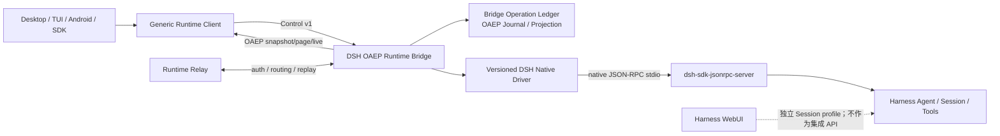

# DSH 作为 OAEP Agent Runtime 的集成方案 P1

> 状态：待实施方案
> 日期：2026-08-15
> 作用域：独立 DSH Runtime Bridge、协议适配、OpenDrSai Runtime/Relay 接口与版本兼容
> 首个审计基线：DeepSeek Harness `47f943859bef60e4160492346772ded9b24f765a`（v0.1.0-rc.5）
> 拆分来源：[原 DeepSeek Harness Inspired 混合方案](./opendrsai-deepseek-harness-inspired-runtime-evolution-plan.md)
> 平行方案：[DSH 启发的 OpenDrSai 内核演进方案 P1](./opendrsai-dsh-inspired-kernel-evolution-p1-plan.md)

## 1. 结论

本方案把 DeepSeek Harness 作为一个 **独立 Agent Runtime** 接入 OpenDrSai，而不是把它嵌入 OpenDrSai 原生 Agent Kernel，也不是让 OpenDrSai 直接调用 Harness WebUI 的内部 API。

P1 推荐形态：

```text
OpenDrSai Client / Runtime Relay
  → Runtime Control v1 + OAEP Stable 1.0
  → DSH OAEP Runtime Bridge
  → versioned DSH Native Driver
  → official dsh-sdk-jsonrpc-server
  → DeepSeek Harness Core / Session / Agent / Tools
```

`DSH OAEP Runtime Bridge` 是相对独立的外围进程和发行包：

- 对北向客户端提供 OpenDrSai Runtime Control 与 OAEP；
- 对南向 Harness 只使用官方 SDK JSON-RPC 服务边界；
- 自己维护 OAEP projection、event sequence、snapshot/page/live stream 和 Control operation ledger；
- 通过版本化 Native Driver 隔离 Harness 私有协议变化；
- 不导入 OpenDrSai Agent Kernel 私有类型，不修改 DSH Agent Loop；
- 可以独立升级、回滚、测试和发布。

P1 明确采用 **单一 Runtime 权威模式**：DSH OAEP Runtime Bridge 拥有其 Session、Run、Item 和 OAEP Event；OpenDrSai 只作为 Client/Relay/BFF，不为同一物理 Session 再写第二份 product Journal。

这使本方案与内核演进 P1 可分开实施，并把未来 DSH 升级的影响限制在 Native Driver、兼容档案、映射和发行载体中。

## 2. 为什么选择独立 Runtime Bridge

### 2.1 符合 OpenDrSai 总体架构

[OpenDrSai 总体架构 V1](../OpenDrSai总体架构V1.md) 规定“Run 在哪个 Runtime 执行，哪个 Runtime 就是 Run、Event 和 Checkpoint 的权威来源”。DSH 实际执行 Agent Run 时，由其桥接 Runtime 持有权威最自然：

| 数据 | P1 权威来源 |
| --- | --- |
| DSH Session/Agent 内部状态 | DeepSeek Harness Session service |
| Runtime Session/Run/Control operation | DSH OAEP Runtime Bridge |
| OAEP Event sequence、Item Projection | DSH OAEP Runtime Bridge |
| Harness native source event | DeepSeek Harness canonical Session Log |
| Workspace 文件和工具副作用 | DSH 所在主机及其固定 Workspace root |
| Client/Relay 缓存 | 非权威副本 |

OpenDrSai Desktop、TUI、Android 或 Web 只通过标准 Runtime 协议连接，不理解 DSH 的 SessionEvent、agent status、Cordis、Web host 或插件对象。

### 2.2 官方 SDK Server 已经是正确南向边界

当前 Harness 已提供 `dsh-sdk-jsonrpc-server`：

- newline-delimited JSON-RPC 2.0 over stdio；
- `initialize`、`session/prompt`、`shutdown`；
- `session.event`、`session.status`、`subagent.started/finished`；
- server 直接驱动 Harness `ctx.agents` 并读取 committed Session Event。

它比 WebUI `/api` 更适合作为稳定集成起点。Web 后端可以借鉴 list/resume/history/reconnect/approval 的实现模式，但 Web host 与 frontend 同版本发布，权限面和 owner 语义面向 UI，不应成为 OpenDrSai 集成合同。

### 2.3 为什么 P1 不采用内嵌 AgentBackend 模式

内嵌模式会让 OpenDrSai Runtime 为 DSH 事件重新分配产品 Session/Run/OAEP sequence，并维护 `product Run ↔ Harness Turn` 双重权威绑定。它可以作为未来兼容模式，但不符合本次“外围适配、与内核分开实施”的首要目标。

P1 因而不实现：

- `DeepSeekHarnessAdapter` 直接注册到 OpenDrSai `AgentBackendRouter`；
- DSH native event → OpenDrSai `NormalizedAgentEvent` → 本地 Runtime Journal 的二次重写；
- 一个 DSH Session 同时由 WebUI、OpenDrSai Runtime 和独立 Bridge 争抢控制权。

如果未来确有“在一个 OpenDrSai Runtime 内混合选择 opendrsai/codex/dsh Backend”的产品需求，应另立 AgentBackend P2，不能在 P1 中悄悄引入第二 authority 模式。

## 3. 对现有协议边界的再确认

[Runtime Protocol Suite](../../cores/protocol/runtime/runtime-protocol-suite.json) 已明确四个平面：

| 协议 | 负责 | 不负责 |
| --- | --- | --- |
| OAEP 1.0 | Session/Run/Item projection、Agent events | transport、auth、Workspace operation、control command |
| Runtime Control v1 | Session/Run command、Approval decision | Event history、Workspace payload |
| OWOP 1.0 | Workspace、Files、Git、Process、PTY、Artifact | Agent Session history、Run 状态机 |
| Relay 2.0 | auth、routing、connection ownership、bounded replay | Backend mapping、Run terminal、Workspace state |

因此“DSH 符合 OAEP”在产品上必须解释为：

```text
Runtime Control v1
+ OAEP Stable 1.0 / oaep.session-stream/1
+ 明确的 Workspace capability 声明
+ 可选 Runtime Relay transport
```

P1 不宣称完整 OWOP conformance。它使用 `workspace.mode=co_located_root`：Bridge 在启动时固定一个 canonical Workspace root，所有 Harness 文件、Shell 和工具操作必须留在该 root 内。Capability 中明确 `owop=false`；需要 Files/Git/PTY 标准远程管理时再实施独立 OWOP 阶段。

## 4. P1 范围与边界

### 4.1 P1 必须交付

1. 独立、可发行的 DSH OAEP Runtime Bridge；
2. Runtime Control v1 的初始化、能力协商、Session、Run、Cancel、Approval、Health、Shutdown 最小合同；
3. OAEP `snapshot + bounded event page + live stream + cursor expired`；
4. DSH Session/Turn/Message 与 OAEP Session/Run/Item 的持久绑定；
5. DSH committed Session Event 到 OAEP 的确定性投影；
6. DSH native approval 与 Runtime Approval/Interaction 的 fail-closed 桥接；
7. local/remote Runtime 注册与 OpenDrSai generic client 访问；
8. Harness version/schema/profile/mapping 的兼容矩阵、升级和回滚门禁；
9. 固定 Workspace root、凭据隔离、日志脱敏和进程生命周期；
10. Fake native server、真实 DSH、断线恢复和版本漂移自动验收。

### 4.2 P1 非目标

- 不修改 OpenDrSai 原生 Agent Kernel、模型上下文、Tool Scheduler 或 Provider Codec；
- 不修改 OpenDrSai Runtime Engine 的 Session/Run/OAEP 写入逻辑；
- 不从 DSH Web `/api`、内部数据库或 Session 文件直接抓取状态；
- 不把 Harness WebUI 与 OpenDrSai 客户端同时设为同一 Session 的 control/approval owner；
- 不支持未知 DSH 版本“尽力运行”；
- 不在 OpenDrSai UI 中添加大量 DSH 专用分支；能力由 Runtime catalog/capability 驱动；
- 不宣称 P1 支持标准 OWOP Files/Git/PTY；
- 不承诺崩溃前尚未写入 Harness Session Log 的 token 无损恢复；
- 不在 P1 自动导入既有 WebUI Session；历史 discovery/import 作为后续可选模块；
- 不将 ACP 作为产品主链路。

### 4.3 允许触碰的 OpenDrSai 代码

P1 只允许必要的接口与外围接线：

- generic Runtime catalog/registration 配置；
- generic Runtime Control/OAEP client 能力协商；
- Relay 注册或本地 sidecar supervisor 接口；
- capability-driven Runtime 选择和健康展示；
- 从 `cores/protocol` 生成独立协议 SDK/fixture 的构建脚本。

以下目录默认禁止因本方案修改：

```text
drsai/backend/runtime/agent_kernel*.py
drsai/backend/runtime/engine.py
drsai/backend/runtime/normalized_writer.py
drsai/modules/components/model_context/*
drsai/modules/components/model_client/*
```

如果实现发现必须改这些文件，应停止并提交架构变更说明；不得把它混入“适配与接口”提交。

## 5. 架构不变量

### DSH-INV-01：一个 Session 只有一个 Runtime authority

P1 Session 由 DSH OAEP Runtime Bridge 拥有。OpenDrSai Client、BFF 和 Relay 只能缓存、代理和提交 Control command，不重新分配该 Session 的 OAEP sequence。

### DSH-INV-02：北向只暴露公共协议

Desktop、Android、TUI、Web 和 Relay 不接收 Harness `SessionEvent`、`messageId`、Cordis service 或 native JSON-RPC method。

### DSH-INV-03：南向只使用官方服务边界

Native Driver 只调用 `dsh-sdk-jsonrpc-server` 或未来上游正式声明的兼容 Runtime API；禁止读取上游私有持久化文件。

### DSH-INV-04：OAEP 与 Control 分离

Control command 的成功响应不等于 Run terminal；Run 最终状态只能由具有关联证明的 committed Harness fact 投影产生。

### DSH-INV-05：Run 必须强绑定 Turn

`session.status=idle` 只是 Agent 排空信号，不能单独完成 Run。P1 必须建立 `run_id ↔ session_id/message_id/turn` 的持久关联。

### DSH-INV-06：OAEP sequence 由 Bridge 单独分配

Harness source sequence 只作为 provenance。一个 source event 可能映射零个、一个或多个 OAEP events，不能直接复用为 OAEP session cursor。

### DSH-INV-07：未知协议或未知用户可见事件 fail closed

未知字段可按兼容规则忽略；未知 method/event 若可能改变 Session、Run、Item、Approval 或 Tool 语义，则该 DSH 版本不可进入 production profile。

### DSH-INV-08：mapping version 对 Session 冻结

Session 创建时保存 native profile、mapping version 和 OAEP schema digest。升级不得静默重写旧历史。

### DSH-INV-09：Approval 只有一个 answerer

同一 Session 只能由 Runtime Bridge 或 WebUI 中的一方回答审批。P1 Bridge-owned Session 禁止加载 Web approval provider。

### DSH-INV-10：升级不等于自动切换 latest

安装、激活、创建新 Session 和恢复旧 Session分别决策。活动或历史 Session 始终使用其已冻结的兼容 profile。

## 6. 目标架构



### 6.1 北向边界

北向只出现：

- `runtime_id`、`workspace_id`、`session_id`、`run_id`、`item_id`、`approval_id`；
- Runtime Control command/result；
- OAEP Session/Run/Item/Event；
- Runtime capability、health、safe diagnostic；
- Relay 所需的身份、授权和路由元数据。

### 6.2 南向边界

南向 Native Driver 负责：

- 启动、握手、关闭和 generation fencing；
- native request/response/notification 解码；
- Session 创建/恢复、prompt、cancel、approval 的能力差异；
- source event disposition；
- 将 native identity 和 source cursor交给桥接投影器。

Native Driver 不分配 OAEP ID/sequence，不直接处理北向认证，也不包含 OpenDrSai UI 逻辑。

## 7. Runtime Control P1 合同

### 7.1 初始化与能力协商

`initialize`/capabilities 必须返回：

```json
{
  "server_info": {
    "name": "opendrsai-dsh-oaep-runtime",
    "version": "1.0.0"
  },
  "runtime_id": "runtime-...",
  "protocols": {
    "control": {"version": "1", "schema_sha256": "..."},
    "oaep": {
      "version": "1.0",
      "profiles": ["oaep.session-stream/1"],
      "schema_sha256": "..."
    },
    "owop": {"supported": false}
  },
  "native_runtime": {
    "name": "deepseek-harness-sdk-runtime",
    "version": "...",
    "source_commit": "...",
    "protocol_profile": "dsh-sdk/...",
    "schema_sha256": "..."
  },
  "mapping_version": "dsh-oaep/...",
  "generation": 1,
  "capabilities": []
}
```

协商按 profile 和 digest 判断，不能只比较 SemVer 字符串。

### 7.2 最小命令集

| Control 能力 | P1 语义 |
| --- | --- |
| `runtime.health` | native/bridge 版本、generation、persistence、degraded reason；不返回路径和 secret |
| `session.create` | 固定 Workspace fingerprint、model/native profile、mapping version、owner profile |
| `session.resume` | 精确恢复并校验 Workspace、native profile 和 mapping；不匹配 fail closed |
| `session.archive` | 停止 admission、处理 active Run、flush projection 后归档；不删除历史 |
| `run.create/start` | 幂等创建 Run，提交 input content blocks，原子保存 native binding |
| `run.cancel` | 精确取消关联 Turn；幂等；等待 authoritative terminal 收敛 |
| `approval.respond` | exact approval/run binding；首个合法响应获胜 |
| `session.snapshot` | OAEP Snapshot，包含 snapshot sequence 和分页信息 |
| `session.events` | `after_sequence` 的有界分页；严格连续 |
| `session.events.stream` | 从 cursor 接续 live OAEP；gap/expired 要求 snapshot resync |
| `runtime.shutdown` | 停止 admission、解决未决交互、flush、关闭 native process |

若直接复用当前 HTTP Runtime API，建议兼容：

```text
POST /v1/sessions
POST /v1/sessions/{session_id}/runs
POST /v1/runs/{run_id}/execute
POST /v1/runs/{run_id}/cancel
POST /v1/runs/{run_id}/approvals/{approval_id}/decision
GET  /v1/sessions/{session_id}/oaep-snapshot
GET  /v1/sessions/{session_id}/oaep-events
GET  /v1/sessions/{session_id}/oaep-events/stream
```

具体 transport 可以是 loopback HTTP/SSE、受管 stdio 或 Relay；领域语义和 conformance fixture 必须相同。

### 7.3 幂等与 operation ledger

所有状态变更命令携带：

- `idempotency_key`；
- canonical secret-free request digest；
- caller/correlation identity；
- expected Session revision 或 binding generation（适用时）。

Bridge operation ledger 至少记录：

```text
operation_id
operation_kind
idempotency_key
request_digest
session_id / run_id
native_request_id / message_id / turn binding
state = prepared | sent | acknowledged | completed | outcome_unknown
generation
created_at / updated_at
```

“已发送但响应丢失”不得盲重试。先通过 Session fact、native receipt 或恢复 API核对；无法证明时保持 `outcome_unknown`。

## 8. Run、Turn 与终态关联

当前上游 `session/prompt` 只返回 durable `messageId`，`session.status=idle` 又是 whole-agent 状态，因此 P1 Driver 必须补足关联证明：

```text
Runtime run/start
  → persist operation prepared
  → native session/prompt
  → receive messageId
  → persist run ↔ native session/message binding
  → observe inbox claimed / turn start relation
  → project only facts belonging to bound turn
  → observe matching turn/end reason
  → wait committed assistant/tool facts + source waterline
  → flush OAEP outbox
  → emit exactly one Run terminal
```

若当前官方 SDK wire 无法提供稳定的 claimed turn 或 cancel/approval，P1 可选两条南向实现，优先级如下：

1. 向上游贡献向后兼容的 SDK Runtime v2 方法/notification；
2. 在独立发行的、极薄的 DSH Runtime plugin 中补充这些服务，再由 Native Driver 调用。

禁止在 OpenDrSai 内核中猜测 Turn，也禁止读取 DSH 私有 Session 文件完成关联。

冻结终态映射：

| Harness `turn/end.reason` | OAEP Run terminal |
| --- | --- |
| `completed` | `event.run.completed` |
| `aborted` | `event.run.cancelled` |
| `error` | `event.run.failed` |
| `blocked` | `event.run.failed`，保留安全 reason code |
| `max-tokens` | `event.run.failed` 或产品冻结的 incomplete policy |
| `interrupted` | 有明确 cancel request 时 cancelled，否则 failed/interrupted |

一个 Run 只能出现一个 terminal。`idle` 只能触发 reconciliation/timeout 检查。

## 9. DSH Event 到 OAEP 的映射

映射输入以 committed `session.event` 为主；live `agent/*` 只做 Control correlation、Approval 和低延迟提示。

| Harness fact | OAEP 语义 | P1 规则 |
| --- | --- | --- |
| `turn/start` / `turn/end` | Run lifecycle | 必须匹配持久 Run/Turn binding |
| user message receipt/commit | `message(role=user)` | Control 输入与 native commit 去重，只生成一个 Item |
| `assistant/chunk` text | message started/delta | 有界 coalesce；completed 前 flush |
| `assistant/message` | message completed | committed message 校准累计 delta，作为最终权威 |
| raw reasoning | 默认不公开 | 只有显式 user-visible summary 可映射 reasoning |
| `tool/call` | tool_call 或 command_execution started | `callId` 是 backend identity，参数按 schema 脱敏 |
| `tool/result` | 同一 Item completed/failed | call/result 配对；真实 exit/result 与 OAEP 一致 |
| `todo/write` | plan updated | whole-list snapshot 生成稳定 step identity |
| `approval/asked/decided` | interaction + Run waiting/resumed | 与 live request 和 Control decision exact correlation |
| subagent lineage/end | subtask lifecycle | parent/child binding 明确，不从字符串猜测 |
| retry/error/compaction | notice 或 diagnostic | 不暴露 private prompt、reasoning 和原始 traceback |

每个已知 native event type 必须在 profile 中标记：

```text
mapped_public
mapped_diagnostic
reviewed_ignored
release_blocked
```

新 DSH 版本出现未知 event 时，只允许记录 content-free type、版本、计数和 correlation。若它可能影响用户可见状态，compatibility gate 必须阻断该版本。

## 10. OAEP Journal、Projection 与恢复

### 10.1 Bridge 自己是 OAEP writer

投影键：

```text
native session id
native source sequence / stable source key
mapping version
sub-index
  → deterministic event_id / dedupe_key
  → contiguous OAEP Session Event.sequence
```

不能直接把 Harness source seq 作为 OAEP sequence，因为事件可能 0/1/N 映射。

### 10.2 持久数据

Bridge 使用自己的状态目录和数据库，至少包含：

```text
runtime_sessions
runtime_runs
native_session_bindings
native_run_bindings
control_operations
pending_interactions
oaep_events
oaep_items
projection_waterlines
runtime_installations / active_profile
```

这不是 OpenDrSai 主 Runtime Engine 的数据库，也不能与其共享 SQLite 文件。

### 10.3 Snapshot、分页与 live attach

- Snapshot 返回确定性 Session/Run/Item projection 和 `snapshot_sequence`；
- event page 从 `after_sequence` 返回严格连续、有界记录；
- live stream 先补历史 gap，再 attach；
- cursor 早于保留窗口时返回 `cursor_expired`，客户端重新取 Snapshot；
- terminal 发布前，native committed facts、projection waterline 和 OAEP outbox 必须全部 flush；
- 崩溃丢失的未提交 delta 不制造 sequence gap，恢复由最终 committed Item 校准。

### 10.4 Session mapping 冻结

每个 Session 保存：

```text
native_runtime_version
native_protocol_profile
native_schema_digest
bridge_version
mapping_version
oaep_schema_digest
workspace_fingerprint
owner_profile
```

旧 Session 恢复时选择兼容的 side-by-side Driver/profile。不能拿最新 mapper 静默重放并覆盖旧 OAEP 历史。

## 11. Approval、Tool 与 Workspace

### 11.1 Approval Bridge

流程：

```text
Harness approval request/fact
  → Native Driver exact call/run correlation
  → Bridge persists pending Interaction
  → OAEP Interaction Item + event.run.waiting
  → Runtime Control approval.respond
  → Bridge validates first legal decision
  → native server response
  → committed approval decision
  → Interaction completed + event.run.resumed/terminal
```

要求：

- Permission/policy 拒绝可以立即 fail closed；
- transport 断开、Run cancel、timeout、shutdown 必须收敛 pending request；
- 原始 native request id 不暴露给 Client；
- WebUI approval provider 不得挂载到 Bridge-owned Session；
- decision、Tool result 和 Audit correlation 一致，但不复制 secret/raw payload。

### 11.2 P1 Tool authority

P1 使用经过审计、固定 profile 的 Harness-native tools：

- 工具由 Harness 执行；
- 敏感操作经 Bridge Approval；
- Bridge 只映射事实，不再次执行同一 Tool；
- 结果不能伪称为 OpenDrSai BAMS/OWOP receipt；
- Capability 明确标记 `tool_authority=harness-native`。

未来若要使用 BAMS capability proxy，应作为 P2：Tool 请求通过专门 server request 调用 OpenDrSai Tool Dispatcher，届时每个 Tool 仍只能有一个 authority，禁止双执行或双审批。

### 11.3 Workspace P1

- Bridge 启动时固定 canonical Workspace root；
- Session 创建保存 Workspace fingerprint，resume 必须一致；
- path、cwd、symlink 和 Tool arguments 做 containment 检查；
- OAEP 只出现 workspace-relative path 或受信 resource ref；
- P1 不提供标准 Files/Git/PTY API，Capability 对此必须诚实降级；
- Desktop 如需文件浏览，应连接同主机的 OWOP Runtime，或等待后续 DSH+OWOP 组合方案，不能把 Web file API 冒充 OWOP。

## 12. 面向 DSH 持续升级的兼容架构

### 12.1 Stable Core 与 Native Driver 分层

```text
dsh-oaep-runtime/
├─ bridge/                         # 与具体 DSH 版本无关
│  ├─ control_service
│  ├─ oaep_writer
│  ├─ projection_store
│  ├─ approval_service
│  └─ runtime_server
├─ native/
│  ├─ driver.py                    # NativeDriver Protocol
│  ├─ jsonrpc_peer.py
│  └─ profiles/
│     ├─ dsh-sdk-0.1-rc.json
│     └─ ...
├─ mappings/
│  ├─ dsh-oaep-v1.py
│  └─ event-disposition/*.json
├─ schemas/
│  ├─ control/
│  ├─ oaep/
│  └─ native/
└─ tests/fixtures/native/<profile>/
```

建议作为独立发行包放在类似以下位置，而不是 `drsai/backend/runtime` 内：

```text
integrations/deepseek-harness-runtime/
```

若仓库不希望新增顶层目录，可使用独立 Python distribution：

```text
cores/python/packages/drsai_dsh_runtime/
```

无论物理位置如何，它只能依赖已发布/生成的 Runtime Control、OAEP schema 和通用 transport SDK，禁止导入 OpenDrSai Kernel、Gateway singleton 或 Codex Adapter 私有模块。

### 12.2 NativeDriver 接口

```python
class NativeDriver(Protocol):
    profile_id: str

    async def probe(self) -> NativeRuntimeIdentity: ...
    async def start(self, config: NativeStartConfig) -> None: ...
    async def create_or_resume_session(self, binding: NativeSessionBinding) -> NativeSession: ...
    async def start_run(self, request: NativeRunRequest) -> NativeRunReceipt: ...
    async def cancel_run(self, binding: NativeRunBinding) -> None: ...
    async def respond_interaction(self, request_id: str, decision: object) -> None: ...
    async def read_facts(self, session_id: str, cursor: object | None) -> NativeFactPage: ...
    def subscribe(self, session_id: str) -> AsyncIterator[NativeFact]: ...
    async def close(self) -> None: ...
```

Bridge 测试使用 Fake Driver；真实 DSH 升级只替换/扩展 Driver profile 和 fixture。

### 12.3 Protocol Profile Manifest

每个受支持兼容族记录：

```json
{
  "profile_id": "dsh-sdk/0.1-rc",
  "supported_versions": ["0.1.0-rc.5"],
  "source_commits": ["47f943..."],
  "native_schema_sha256": "...",
  "required_methods": ["initialize", "session/prompt", "shutdown"],
  "required_notifications": ["session.event", "session.status"],
  "required_capabilities": ["turn-binding", "run-terminal"],
  "mapping_version": "dsh-oaep/1",
  "event_disposition_sha256": "...",
  "carrier": {},
  "security_review": "accepted"
}
```

版本范围只是人类可读提示，真正放行条件是：

- server identity；
- protocol capability negotiation；
- native schema digest；
- required method/event field conformance；
- event disposition 全覆盖；
- fixture 与真实 smoke；
- carrier digest/signature。

### 12.4 升级策略

1. `probe` 新版本并导出/生成 native contract；
2. 与当前 profile 做 method、field、event vocabulary 和行为 diff；
3. 未改变语义时扩展兼容 manifest，并跑全量 fixture；
4. 有新语义时新增 Driver capability或 mapping version，不修改旧 profile；
5. side-by-side 安装候选版本，旧 Session 继续使用旧 profile；
6. 新建 canary Session，通过真实 smoke 后才允许新 Session 默认使用；
7. 失败时切回旧 active profile，不回写旧 OAEP Journal；
8. 只有达到安全支持期限后才停止创建旧 profile Session，历史读取仍保留。

禁止：

- `>=0.1` 之类无上界自动兼容；
- 启动时在线拉取 latest 并立即替换；
- 未知 event 原样透传 OAEP；
- 为了新版本修改 OpenDrSai Kernel；
- 用一个 mapper 静默重写所有旧 Session。

## 13. 进程、载体与安全

### 13.1 进程所有权

Bridge Supervisor 负责：

- exact binary/package discovery 和 digest 校验；
- stdout 仅承载协议帧，stderr 单独有界读取和脱敏；
- allowlist 环境变量和独立 credential channel；
- start/health/restart/close 与 generation fencing；
- graceful shutdown → stdin EOF → terminate → kill 的有界阶梯；
- 旧 generation notification、approval response 和 late result 不得写入新 Run。

### 13.2 官方载体限制

审计基线的 Python Runtime carrier 只有：

- Linux x64；
- Linux arm64；
- macOS arm64。

没有 Windows carrier。因此 P1 产品范围建议为：

- Linux/macOS 上的受管本地或远程 Runtime；
- Windows Desktop 通过 Runtime Relay、SSH/remote host 或明确的 WSL profile 连接；
- 系统 Node 开发态只用于 probe，不作为生产安装证明。

Windows 本机生产支持必须满足其一后另行放行：signed single executable、OpenDrSai 携带受信 Node/dependency closure，或上游正式 Windows carrier。

### 13.3 数据与隐私

- credential 只通过 secret ref/channel 解析；
- raw native payload 默认不持久化；诊断只保留 type、版本、correlation 和安全摘要；
- raw reasoning 不进入公共 OAEP、普通日志或诊断包；
- Workspace 路径对外相对化；
- 大 delta/tool result 有界化，超限进入 Artifact/摘要或明确失败；
- mapping fixture、日志、数据库、export 和 E2E evidence 统一执行 secret canary scan。

## 14. OpenDrSai 侧集成方式

### 14.1 优先使用 generic Runtime 接口

OpenDrSai 侧不新增 `if backend == dsh` 的客户端协议分支。它只识别：

- Runtime identity/catalog；
- Control/OAEP/OWOP/Relay capabilities；
- Runtime health、platform 和 auth requirement；
- Workspace/Session/Run 的标准 ID 与生命周期。

用户选择 DSH 时，实质上选择一个 `runtime_id` 或 Runtime profile，而不是在本地 Agent Kernel 中切换模型实现。

### 14.2 本地与远程

| 形态 | P1 连接 |
| --- | --- |
| Linux/macOS 本地 | Desktop/TUI 启动或发现 Bridge，使用 loopback Control/OAEP |
| 远程主机 | Bridge 注册 Runtime Relay，客户端使用现有 Relay 路由 |
| Windows | 连接 remote/WSL Bridge；本机 carrier 未验收前不可伪装 available |
| WebUI | 作为独立 Harness profile；不控制 Bridge-owned Session |

### 14.3 最小 OpenDrSai 改动门禁

允许：

- Runtime catalog 新增一个由配置/Relay 发现的实例；
- capability-driven UI 展示 Runtime 名称、版本、可用模型和缺失 OWOP；
- generic client conformance 修复；
- 协议 codegen/package 拆分。

不允许：

- 在 `gateway.py` 复制一套 DSH Session/Run；
- 在 `AgentBackendRouter` 注册 DSH；
- 在本地 Runtime Journal 重写 Bridge OAEP；
- 修改原生 Kernel 适配 DSH message/tool；
- Desktop 直接连接 native DSH JSON-RPC。

## 15. P1 模块与功能点

| 编号 | 模块 | 交付内容 | 验收摘要 |
| --- | --- | --- | --- |
| DSH-P1-M01 | Protocol SDK | Control/OAEP generated types、conformance fixtures | 与仓库 schema digest 一致，不依赖 Runtime Engine 私有代码 |
| DSH-P1-M02 | Native Driver | JSON-RPC、supervisor、generation、profile probe | 乱序/EOF/unknown/late notification 无悬挂和串代 |
| DSH-P1-M03 | Control Service | Session/Run/cancel/approval/health/shutdown | 全部状态命令幂等，operation unknown 不盲重试 |
| DSH-P1-M04 | Binding/Finalizer | Session/Run/Turn/Item binding、唯一 terminal | idle 不完成 Run；restart 后确定收敛 |
| DSH-P1-M05 | OAEP Writer | mapper、journal、projection、snapshot/page/live | `OAEPStreamValidator` 通过，序列连续可恢复 |
| DSH-P1-M06 | Approval/Tool | single answerer、Harness-native authority、workspace containment | 无双审批/双执行；敏感操作 fail closed |
| DSH-P1-M07 | Compatibility | profile manifest、schema/event diff、side-by-side upgrade | 未知版本默认 unavailable；旧 Session 可恢复 |
| DSH-P1-M08 | Packaging/Registration | carrier、Relay/local registration、health/catalog | DSH 不可用不影响其他 Runtime；卸载无残留进程 |
| DSH-P1-M09 | Product E2E | Desktop/TUI/Android/SDK generic OAEP 消费 | 客户端不理解 DSH 私有字段，刷新/重连一致 |
| DSH-P1-M10 | Release Gate | Fake/real/fault/security/version drift evidence | 10/10 模块有机器可读证据才可发布 |

## 16. 实施顺序

### P1.0：协议与可行性尖峰

- 用当前固定 DSH 启动官方 SDK server；
- 验证 initialize、Session prompt、messageId、Session event、turn/end、subagent；
- 证明或补足 Run/Turn 强关联、cancel、approval 和恢复接口；
- 固定 native schema/vocabulary/profile digest；
- 建立 Fake Native Driver。

Go 条件：Session/Run terminal/cancel/approval/restart 四条链路都有可实现的服务边界；不能依赖读私有文件。

### P1.1：独立 Bridge 骨架

- 建立独立 package/process、Protocol SDK 和 state root；
- 实现 Supervisor、JSON-RPC peer、generation fence；
- 实现 initialize/health/shutdown 和 exact profile negotiation；
- stdout/stderr、secret、Workspace root 安全门禁。

门禁：未知 native version fail closed；100 次启动/关闭无进程和 task 泄漏。

### P1.2：Session/Run Control 与绑定

- 实现 session create/resume/archive；
- 实现 run create/start/cancel；
- operation ledger、idempotency、request digest；
- messageId/turn/terminal finalizer 和 restart reconciliation。

门禁：响应丢失、重复请求、旧 generation、cancel race 均不产生重复 Turn 或悬挂 Run。

### P1.3：OAEP Projection

- 完成 event disposition 和 mapper；
- 实现 OAEP journal/item projection/outbox；
- 实现 snapshot/page/live/cursor expired；
- terminal flush 和 replay/snapshot equivalence。

门禁：全部稳定 native event 有 disposition；`OAEPStreamValidator`、任意 cursor replay 和 10k event 压力通过。

### P1.4：Approval、Tool 与恢复

- 实现 native server request/approval correlation；
- Bridge-owned single answerer；
- Harness-native Tool 映射和 Workspace containment；
- 断线、timeout、shutdown、native crash 的 fail-closed 收敛。

门禁：批准、拒绝、取消、超时、重复回答和断连全部有唯一事实；未知副作用不自动重放。

### P1.5：版本兼容与发行

- profile manifest、schema/event diff、side-by-side install；
- candidate canary、active pointer、rollback；
- Linux/macOS carrier 或 remote/WSL 产品路径；
- Runtime catalog/Relay 注册和 generic client E2E。

门禁：升级失败不影响旧 active profile；旧 Session 使用冻结 profile 可继续读取/恢复。

### P1.6：产品验收

- Desktop、TUI、Android/SDK 至少两类客户端连接同一 Session；
- 多轮、Tool、Approval、Cancel、Subtask、断线、restart；
- Snapshot、event page、live stream 和最终 UI digest 一致；
- DSH Runtime 未安装或不兼容时，其他 OpenDrSai Runtime 正常工作；
- 输出机器可读兼容矩阵和 release evidence。

## 17. 测试矩阵

| 层级 | 必测内容 |
| --- | --- |
| Native unit | JSONL framing、RPC id、unknown method/event、EOF、generation、stderr |
| Mapper unit | 每类 SessionEvent 0/1/N 投影、delta、terminal、reasoning visibility |
| Control contract | idempotency、operation ledger、cancel、approval、resume、shutdown |
| OAEP contract | schema、sequence、dedupe、snapshot/page/live、cursor expired |
| Fake DSH | 乱序、重复、通知早于响应、idle 早到、terminal 晚到、crash |
| Real DSH | 多轮、Tool、Subagent、Approval、Cancel、Session persistence |
| Upgrade | compatible patch、new event、removed field、schema digest mismatch、rollback |
| Relay/client | auth、routing、reconnect、bounded replay、Desktop/TUI/Android generic consume |
| Security | Workspace escape、secret canary、raw reasoning、large payload、untrusted tool output |
| Reliability | 10k events、100 reconnect、10 Sessions 并发、process restart、disk full |

## 18. 迁移、升级与回退

P1 是新增 Runtime，不迁移现有 `opendrsai` 或 `codex` Session。默认规则：

1. 新建 DSH Runtime Session 才使用 Bridge；
2. 现有 Harness WebUI Session 不自动导入；
3. Session 一经创建，其 owner/profile/mapping 冻结；
4. Bridge 升级先 side-by-side 安装和 canary，不切换活动 Session；
5. 回滚只改变新 Session 的默认 profile；历史 OAEP event 不重写；
6. 卸载前必须阻止新 Run、处理 active Run、flush、导出安全诊断并清理受管进程；
7. 删除 Runtime 不等于删除 Workspace；任何数据删除需单独、显式、可恢复流程。

## 19. 风险与应对

| 风险 | 应对 |
| --- | --- |
| 当前 SDK 协议缺少 cancel/approval/version negotiation | P1.0 先上游扩展或薄 Runtime plugin；缺一不可进入产品 |
| 把 `idle` 误当 Run terminal | durable messageId/turn binding + matching turn/end + finalizer |
| WebUI 与 Bridge 抢审批 | owner profile；Bridge Session 不加载 Web answerer |
| DSH 新版本事件漂移 | schema/event disposition diff；未知用户可见事件 release-blocked |
| 自动 latest 破坏旧 Session | side-by-side profile；Session 冻结 mapping/native digest |
| Bridge 重做完整 OpenDrSai Runtime | P1 只做 Agent Control/OAEP；OWOP、Asset/BAMS 等明确不支持 |
| OpenDrSai 代码出现 DSH 特判 | generic capability tests + forbidden import/static scan |
| 官方无 Windows carrier | P1 remote/WSL；本机生产需独立 carrier 门禁 |
| OAEP 与 native source 两份历史分叉 | source waterline、deterministic mapper、terminal flush、replay equivalence |
| native Tool 副作用不可核对 | single authority、Approval、result receipt；unknown 不重放 |

## 20. P1 完成定义

只有同时满足以下条件，才可以把 DSH 标记为 OpenDrSai 可用 Agent Runtime：

1. DSH Bridge 是独立 package/process，不导入 OpenDrSai Kernel 私有实现；
2. OpenDrSai 原生 Kernel 和 Runtime Engine 无 DSH 专用语义修改；
3. Control 与 OAEP 双平面完成 capability negotiation；
4. Session/Run/Turn 强绑定，`idle` 不替代 terminal；
5. OAEP sequence、Snapshot、event page、live stream和 cursor recovery 全部一致；
6. Approval 只有一个 answerer，Tool 只有一个执行 authority；
7. Workspace root、secret、reasoning、日志和大结果满足安全门禁；
8. 未知 DSH 版本/event 默认不可用于 production；
9. 受支持版本有 profile manifest、schema digest、event disposition 和真实验收证据；
10. side-by-side 升级、candidate canary、失败回滚和旧 Session 恢复通过；
11. Desktop/TUI/Android/SDK 客户端只消费标准 Runtime/OAEP，不理解 DSH 私有协议；
12. DSH 不可用、卸载或升级失败不影响其他 OpenDrSai Runtime；
13. P1 平台限制真实展示，不把开发态 Node 或缺失 Windows carrier 伪装成生产能力；
14. 内核演进 P1 未实施时，本方案仍可独立构建、测试和发布。

## 21. P1 开发前决策

1. P1.0 缺失 Control 能力优先上游贡献，还是维护最小 DSH Runtime plugin；
2. 独立发行包放在 `integrations/` 还是 `cores/python/packages/drsai_dsh_runtime/`；
3. 北向首发使用 loopback HTTP/SSE、JSON-RPC transport，还是只通过 Runtime Relay；
4. P1 是否要求 macOS local carrier，还是统一先 remote Linux；
5. Windows 首发明确采用 WSL 还是 remote/Relay；
6. P1 native Tool allowlist、sandbox 和 Approval policy；
7. OAEP mapping version 的保留周期与旧 Driver profile支持期限；
8. Bridge OAEP Journal 的加密、保留、压缩与导出策略；
9. `max-tokens` 和无明确 cancel request 的 `interrupted` 最终产品映射；
10. 是否在 P1.6 纳入 Harness Session discovery 的只读 spike，但不自动导入。

## 22. 参考资料

- [OpenDrSai 总体架构 V1](../OpenDrSai总体架构V1.md)
- [Desktop/TUI Runtime 统一方案](../desktop-tui-runtime-unification-plan.md)
- [OAEP Stable 1.0](../../cores/protocol/oaep/README.md)
- [Runtime Protocol Suite](../../cores/protocol/runtime/runtime-protocol-suite.json)
- [Codex Agent Backend 实现计划 V1](../remote_workespace/OpenDrSaiCodexAgentBackend实现计划V1.md)
- [Codex Adapter OAEP 重构 V2](../remote_workespace/OpenDrSaiCodexAdapter_OAEP重构开发方案V2.md)
- [OAEP v1 Runtime Bridge 方案](../protocol_issue/OAEP_v1_Runtime_Bridge实现方案.md)
- [DeepSeek Harness Architecture](https://github.com/deepseek-ai/deepseek-harness/blob/47f943859bef60e4160492346772ded9b24f765a/docs/architecture.md)
- [DeepSeek Harness SDK Protocol](https://github.com/deepseek-ai/deepseek-harness/blob/47f943859bef60e4160492346772ded9b24f765a/packages/sdk/protocol/README.md)
- [DeepSeek Harness SDK JSON-RPC Server](https://github.com/deepseek-ai/deepseek-harness/blob/47f943859bef60e4160492346772ded9b24f765a/packages/sdk/server/README.md)
- [DeepSeek Harness Python Runtime Carrier](https://github.com/deepseek-ai/deepseek-harness/blob/47f943859bef60e4160492346772ded9b24f765a/python/sdk-runtime/README.md)
- [DeepSeek Harness Web API Gateway](https://github.com/deepseek-ai/deepseek-harness/blob/47f943859bef60e4160492346772ded9b24f765a/docs/api-gateway.md)
