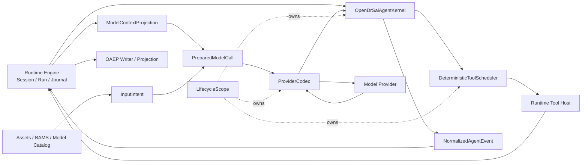

# DSH 启发的 OpenDrSai 内核演进方案 P1

> 状态：待实施方案
> 日期：2026-08-15
> 作用域：OpenDrSai 原生 Agent Core、Runtime 内核协作边界与模型调用链
> 参考基线：DeepSeek Harness `47f943859bef60e4160492346772ded9b24f765a`（v0.1.0-rc.5）
> 拆分来源：[原 DeepSeek Harness Inspired 混合方案](./opendrsai-deepseek-harness-inspired-runtime-evolution-plan.md)
> 平行方案：[DSH 作为 OAEP Agent Runtime 的集成方案 P1](./opendrsai-dsh-agent-runtime-integration-p1-plan.md)

## 1. 结论

本方案只处理 **DSH 启发的 OpenDrSai 原生内核演进**。它允许修改 OpenDrSai 底层，但不接入、启动或依赖 DeepSeek Harness。

P1 的目标不是复制 DSH 的 Cordis、插件名称或 TypeScript 实现，而是把以下已经被 DSH 证明有效的运行语义落实到 OpenDrSai 自己的架构中：

1. 模型上下文从可追溯的 Session 事实投影，而不是由第二套隐式消息历史长期漂移；
2. 模型调用在首个网络字节前冻结为 `PreparedModelCall`；
3. Provider 编解码与 Agent Loop、Runtime Journal 解耦；
4. 工具执行采用“先准入、可并发执行、确定性提交”；
5. 进程级、Session 级和 Run 级资源具有统一生命周期所有权；
6. OpenDrSai 原生 Agent 只有一条生产 Kernel 路径，legacy loop 不能成为隐式旁路。

本方案与 DSH Runtime 集成 P1 **没有实施依赖**：

- 内核 P1 即使没有安装 DSH 也必须完整工作；
- DSH Runtime 集成 P1 即使内核 P1 尚未实施也必须可以交付；
- 两者只共享 OAEP、Runtime Control、Workspace、Approval 等已经稳定的公共协议和产品术语，不共享私有实现。

## 2. 对现有 OpenDrSai 设计的再确认

### 2.1 总体架构边界

[OpenDrSai 总体架构 V1](../OpenDrSai总体架构V1.md) 已经冻结三层职责：

```text
Client Applications
  → Agent Runtime
      → Gateway / Protocol
      → Session / Run / Event + Runtime Engine
      → Agent Core
  → Workspace & Asset Management
```

因此本方案修改的是 Runtime 内部的原生 Agent Core 及其与 Runtime Engine 的协作方式，不改变以下外部事实：

- Client 不拥有权威运行状态；
- Run 在哪个 Runtime 执行，哪个 Runtime 就是 Run、Event 和 Checkpoint 的权威来源；
- Workspace、Permission、Approval、Audit 继续使用现有公共边界；
- Desktop、TUI、Android 和 Relay 继续消费统一 Runtime/OAEP 语义。

### 2.2 Runtime Journal 与 OAEP 边界

[OAEP Stable 1.0](../../cores/protocol/oaep/README.md) 是 Session、Run、Item 及其事件的公共语义协议。它不是模型上下文数据库，也不要求把模型私有推理暴露给客户端。

内核 P1 应遵循：

- Runtime Journal 是产品执行事实的 append-only 权威来源；
- OAEP Writer 从 Runtime/Normalized 事实生成公共投影；
- 模型可见但不可公开的 passback 使用受保护 payload，不伪装成公共 OAEP reasoning；
- Checkpoint 只用于加速恢复，不成为第二套可编辑历史。

### 2.3 Backend 与原生 Kernel 边界

现有 `AgentBackendRouter` 已将 `opendrsai`、`codex` 等执行后端置于 Runtime 合同之后。内核 P1 只改变 `opendrsai` Backend 内部，不改变外部 Backend：

- Codex Adapter 不得被迫使用 OpenDrSai 原生 Kernel；
- DSH Runtime 不得导入 OpenDrSai Kernel 私有类型；
- Backend 选择在 Session/Run 创建时固定，不在一个 Run 中隐式切换；
- Runtime 仍然负责 Run 状态、Approval、OAEP sequence 和最终收敛。

### 2.4 模型、BAMS 与运行证据边界

现有设计已经要求：

- 模型身份使用 `provider_id + model_id + catalog_revision`，Run 创建后不可漂移；
- BAMS 使用“资源注册表 + Agent 引用 + Run 不可变快照”；
- Run Manifest 记录实际 Backend、Adapter、mapping、模型、工具与 Workspace 证据；
- 凭据、Authorization Header、私有 Prompt 和 raw chain-of-thought 不进入普通 OAEP、Renderer 或安全摘要。

内核 P1 必须复用这些权威来源，不建立新的 Provider 目录、Tool Registry、Approval Store 或 Manifest 体系。

## 3. 当前问题与 DSH 启发

| 当前问题 | DSH 中值得借鉴的语义 | OpenDrSai P1 的落地方式 |
| --- | --- | --- |
| Runtime 事实、Agent 内存消息和恢复状态可能漂移 | Session Log 是模型上下文来源 | 从 canonical Runtime facts 构造受保护的 Context Projection |
| 模型、工具 schema、采样参数可能在调用过程中被不同模块修改 | 调用前形成不可变请求 | 引入 `InputIntent` 和 `PreparedModelCall` |
| Provider 协议逻辑散落在 Agent Loop 与客户端中 | Provider serializer/translator 独立 | 建立纯 `ProviderCodec`，首个实现为 DeepSeek Chat Codec |
| 工具批次虽可校验，但执行和结果提交语义不统一 | 工具可并发执行，结果按确定顺序回填 | 引入副作用分级与 `DeterministicToolScheduler` |
| callback、task、subscription、临时资源释放分散 | 生命周期 Effect 有统一所有者 | 引入分层 `LifecycleScope` |
| Gateway 组合根承担过多业务实现 | 能力通过明确模块边界组合 | 引入 `RuntimeModule`，逐步抽离功能实现 |
| legacy Agent loop 仍可能被生产路径调用 | 运行时只有明确 Agent spine | 冻结唯一 `OpenDrSaiAgentKernel` 生产入口 |

“借鉴”只表示采用语义，不表示复制上游代码。任何直接移植必须单独完成许可证、来源记录和代码归属审查。

## 4. P1 范围

### 4.1 P1 必须交付

1. 冻结 `InputIntent`、`PreparedModelCall`、`ModelContextProjection`、`ProviderCodec`、`ToolExecutionPlan`、`LifecycleScope` 六类内部契约；
2. OpenDrSai 原生 Kernel 从 canonical Runtime facts 构造模型上下文；
3. 每次模型调用形成不可变、可摘要、可复核的 Prepared Call；
4. DeepSeek/OpenAI-compatible 路由的编码、流翻译和终态校准进入独立 Codec；
5. 只读或已证明安全的工具支持有界并发，结果按确定性顺序提交；
6. Run/Session/Runtime 资源通过统一 scope 释放；
7. 原生 Kernel 成为唯一生产 loop，legacy 路径进入显式兼容隔离；
8. Run Manifest、OAEP、Snapshot、Replay 与当前客户端行为不回归。

### 4.2 P1 非目标

- 不安装、启动或连接 DeepSeek Harness；
- 不新增 `deepseek-harness` Backend 或 Runtime；
- 不修改 OAEP Stable 1.0 的已有字段含义；
- 不把 raw reasoning 或模型私有 passback 公开为 OAEP reasoning；
- 不重写 Runtime Engine、Workspace Registry、BAMS、Model Catalog 或 Approval 状态机；
- 不在 P1 自动并发未知副作用、写文件、Shell、外部控制或不可幂等 Tool；
- 不删除 legacy 数据；只有在双读、对比、回滚门禁完成后才允许移除旧执行入口。

## 5. 架构不变量

### K-INV-01：Runtime Journal 是产品事实权威

模型上下文、OAEP、Snapshot 和 Inspector 可以是不同投影，但不能分别维护互相可覆盖的事实源。

### K-INV-02：原生 Kernel 是唯一 OpenDrSai Agent 决策循环

生产 Run 必须经 `AgentBackendRouter → opendrsai Backend → OpenDrSaiAgentKernel`。任何 legacy loop 只能通过显式 compatibility flag 进入，并产生可审计告警。

### K-INV-03：模型可见内容必须有来源

进入模型请求的每个 message、tool result、resource summary 和 policy block 必须能定位到 Runtime fact、受保护 payload、固定 Asset revision 或明确的系统策略版本。

### K-INV-04：Prepared Call 在发送前冻结

首个网络字节发出后，模型身份、System Prompt、Context Projection、Tool schema、sampling、output limit 和资源 revision 不得原地改变。

### K-INV-05：先准入，后执行，再提交

Tool 必须先完成 schema 校验、Workspace/Permission/Policy 判断和必要 Approval，再进入调度器。

### K-INV-06：并发执行，确定性提交

允许并发不等于允许结果无序进入模型历史。回填顺序由冻结的 `ToolExecutionPlan.commit_index` 决定。

### K-INV-07：未知副作用不自动重放

进程或连接故障后，只读、幂等且有确定 receipt 的操作才可按策略重试；其他操作进入 `outcome_unknown` 并等待权威核对。

### K-INV-08：Checkpoint 不是第二事实源

Checkpoint 必须带 source waterline 和版本；无法证明与 Journal 一致时丢弃并重建。

### K-INV-09：所有注册可释放

callback、subscription、background task、temporary handle 和 Tool lease 必须绑定 scope，close 可幂等且有界。

### K-INV-10：公共证据不包含模型私有推理

只允许显式标记为 user-visible 的 reasoning summary 进入公共 OAEP；raw thinking 只进入受保护、受保留策略约束的模型上下文材料。

## 6. 目标架构



数据方向必须单向：事实先进入 Runtime Journal，再由 Context、OAEP 和 Inspector 投影读取；Agent 内存对象不得反向覆盖历史。

## 7. P1 内部契约

### 7.1 InputIntent

`InputIntent` 表示一次请求在进入 Kernel 前已解析的不可变意图：

```text
InputIntent
├─ session_id / run_id / correlation_id
├─ user content blocks + attachment/resource refs
├─ Agent Definition exact id@version
├─ effective ModelRef + catalog/config revision
├─ frozen BAMS resource snapshot
├─ workspace revision/fingerprint
├─ permission/policy snapshot
└─ request digest
```

它不包含 credential 明文、临时 signed URL 正文或 Provider 私有客户端对象。

### 7.2 ModelContextProjection

输入：

- Session Journal 的公开事实；
- 经授权读取的 `model_private` payload；
- 固定 Agent/Skill/Knowledge revision；
- 明确 compaction/checkpoint waterline。

输出：

```text
ModelContextProjection
├─ messages[]
├─ tool results[]
├─ resource summaries[]
├─ source_refs[]
├─ source_session_sequence
├─ projection_version
└─ digest
```

规则：

- 同一输入和 projection version 产生相同 digest；
- UI 隐藏、消息展示样式变化不得改变模型历史；
- 删除、归档或数据保留导致内容不可用时必须显式标记，不得静默拼接错误历史；
- Checkpoint 仅缓存 projection，水位不匹配时重新 fold。

### 7.3 PreparedModelCall

```text
PreparedModelCall
├─ call_id / run_id / attempt
├─ provider_id / upstream_model_id
├─ provider route/config/catalog revision
├─ encoded context source digest
├─ system/instruction asset digests
├─ tool schemas + tool policy digest
├─ generation parameters / token limits
├─ codec_id / codec_version
├─ safe request digest
└─ created_at
```

Prepared Call 的完整 wire payload可以只在内存或加密存储中存在；Manifest 保存安全摘要、digest 和缺失证据。重试必须产生新 `attempt`，不得覆盖旧尝试证据。

### 7.4 ProviderCodec

建议接口：

```python
class ProviderCodec(Protocol):
    codec_id: str
    version: str

    def encode(self, call: PreparedModelCall) -> ProviderRequest: ...
    def consume(self, state: CodecState, chunk: object) -> tuple[CodecState, tuple[NormalizedAgentEvent, ...]]: ...
    def finalize(self, state: CodecState, response: object) -> tuple[NormalizedAgentEvent, ...]: ...
```

P1 首个 `DeepSeekChatCodec` 覆盖：

- message/content block 编码；
- tool definition 与 tool call 参数；
- streaming text、公开 reasoning summary、usage 和 finish reason；
- incomplete JSON/tool argument 的有界缓冲和失败；
- provider error 到统一、脱敏错误；
- delta 累计结果与 completed Item 校准。

Codec 不读写数据库、不执行 Tool、不决定 Approval、不分配 OAEP sequence。

### 7.5 DeterministicToolScheduler

每个调用先形成：

```text
ToolExecutionPlan
├─ call_id
├─ capability_id / schema revision
├─ arguments digest
├─ effect_class
│  ├─ pure_read
│  ├─ idempotent_read
│  ├─ controlled_write
│  └─ unknown_effect
├─ admission/approval receipt
├─ execution_group
├─ commit_index
└─ timeout/cancellation policy
```

P1 调度规则：

- `pure_read` 和经 allowlist 证明安全的 `idempotent_read` 可在同批次有界并发；
- `controlled_write`、Shell、文件修改和 `unknown_effect` 默认串行；
- 任务完成顺序不改变提交顺序；
- 某个调用失败不伪造其他调用成功；是否继续由冻结 policy 决定；
- cancel 停止未开始任务，对已开始副作用只记录真实 outcome；
- Tool result 先写 Runtime fact/receipt，再进入下一次 Context Projection。

### 7.6 LifecycleScope

层级：

```text
RuntimeScope
└─ SessionScope
   └─ RunScope
      └─ ModelCallScope / ToolCallScope
```

每个 scope 支持：

- 注册 async task、callback、subscription、process/stream handle 和 disposer；
- 子 scope 先于父 scope 关闭；
- close 幂等、有界、可收集脱敏错误；
- 旧 generation 的 callback 不能向新 Run 写事件；
- Run terminal 前完成必要 flush，非必要后台任务不得阻塞无限时间。

### 7.7 RuntimeModule

Gateway 保持 composition root，模块通过 typed services 获取依赖：

```python
class RuntimeModule(Protocol):
    module_id: str
    async def start(self, services: RuntimeServices, scope: LifecycleScope) -> None: ...
    async def health(self) -> Mapping[str, object]: ...
```

P1 只抽离与 Kernel 改造直接相关的 model/context/tool/lifecycle wiring；不借此重写所有 Gateway route。

## 8. 模块与功能点

| 编号 | 模块 | P1 功能点 | 验收摘要 |
| --- | --- | --- | --- |
| K-P1-M01 | 契约与基线 | 六类内部契约、版本、digest、fixture | 契约评审通过；当前 OAEP/Runtime digest 固定 |
| K-P1-M02 | Context Projection | Journal fold、private payload、checkpoint waterline | 同一事实重建 digest 一致；无第二历史 writer |
| K-P1-M03 | Prepared Call | 请求冻结、attempt、Manifest evidence | 首字节后配置变更只影响下一次调用 |
| K-P1-M04 | Provider Codec | DeepSeek 编码、stream mapper、final calibration | fixture/replay/最终结果一致；Codec 无副作用 |
| K-P1-M05 | Tool Scheduler | effect admission、有界并发、确定提交、cancel | 完成顺序随机时提交 digest 稳定；未知副作用不重放 |
| K-P1-M06 | Lifecycle | scope tree、generation fence、bounded close | 零悬挂 task/subscription/process handle |
| K-P1-M07 | Kernel 收敛 | 唯一生产入口、legacy audit、兼容开关 | 新 Run 不进入 legacy loop；Codex Backend 不受影响 |
| K-P1-M08 | 证据与迁移 | dual-read compare、Manifest、rollback | 实时/Replay/Snapshot/重启收敛；一键回退旧 projection |

## 9. 建议代码落点

应优先在现有 Runtime/Kernel 结构内演进，避免再建一套平行 Agent 框架。

```text
cores/python/packages/drsai/src/drsai/backend/runtime/
  agent_kernel.py                    # 唯一原生 Kernel 接口
  agent_kernel_factory.py            # 生产构建入口
  journal.py                         # canonical fact/waterline 支持
  model_context_projection.py        # 建议新增
  prepared_model_call.py             # 建议新增
  provider_codec.py                  # 建议新增公共接口
  codecs/deepseek_chat.py            # 建议新增
  tool_execution_plan.py             # 建议新增
  deterministic_tool_scheduler.py    # 建议新增
  lifecycle_scope.py                 # 建议新增
  runtime_module.py                  # 建议新增最小接口
```

需要迁移或隔离的现有区域：

- `desktop_agent_kernel_adapter.py`、`desktop_kernel_run_stream.py`、`desktop_kernel_events.py`：继续作为 Runtime/产品适配层，不拥有第二 Kernel；
- `run_drsai_agent_factory.py`：逐步收敛为 factory/compatibility façade；
- `modules/components/model_context/*`：迁移为 Context Projection 的兼容读取源，停止新增独立历史写入；
- `modules/components/model_client/*`：Provider transport 可保留，协议序列化迁移到 Codec；
- `gateway.py`：只增加 wiring，不继续堆叠 Kernel 实现。

最终路径以代码审计结果为准；任何跨模块移动都必须保留兼容导入和删除门禁。

## 10. 实施顺序

### P1.0：冻结基线与契约

- 固定成功、失败、审批、取消、多 Tool、重启六类真实/fixture digest；
- 冻结内部契约、visibility、effect class 和版本规则；
- 建立 legacy 调用点静态清单与生产路径探针。

门禁：无未解释的 Session/Run/Event writer；OAEP、Codex Backend、模型收敛和 BAMS focused tests 通过。

### P1.1：Context Projection 与 Prepared Call

- 建立 canonical fact fold 与 source waterline；
- 接入受保护 `model_private` payload；
- 为每次 Provider 调用生成不可变 Prepared Call 和 Manifest evidence；
- 双读旧 Agent message context，对差异分类。

门禁：多轮、compaction、重启后的 context digest 一致；旧路径不再新增不可追溯内容。

### P1.2：DeepSeek Provider Codec

- 从 Agent Loop 移出 request serialization 和 stream translation；
- 建立 provider fixture、错误、usage、tool call 与完成校准；
- 新旧路径 shadow compare，不双写 Journal。

门禁：相同 fixture 产生相同 OAEP 最终投影；未知 provider chunk fail closed 或仅进有界诊断。

### P1.3：确定性 Tool 调度

- 建立 effect class、admission plan 和 allowlist；
- 只开放 read-safe 批次并发；
- 实现确定性 commit、cancel 和 outcome unknown；
- 与 Approval、side-effect ledger、BAMS receipt 对齐。

门禁：随机完成顺序的性质测试稳定；没有双执行、双审批或失败后盲重试。

### P1.4：Lifecycle 与唯一 Kernel

- 引入 Runtime/Session/Run/Call scope；
- 把 callback、subscription、task、stream 绑定 scope；
- 将生产 `opendrsai` Backend 固定到唯一 Kernel；
- legacy direct loop 仅保留显式 compatibility/debug mode。

门禁：重复 create/cancel/close/restart 后无资源泄漏；正常产品链路 legacy probe 为零。

### P1.5：迁移、回退与真实验收

- 开启新 Context/Codec/Scheduler 的分项 feature flag，不提供一个含义模糊的总开关；
- 完成 Windows packaged Runtime 和至少一个真实模型 smoke；
- 比较实时、Replay、Snapshot、Runtime 重启四条路径；
- 生成机器可读验收账本和回滚演练证据。

门禁：K-P1-M01～M08 全部 accepted；任何事实分叉、敏感信息泄漏或未知副作用重放都阻断发布。

## 11. 测试矩阵

| 层级 | 必测内容 |
| --- | --- |
| Unit | projection fold、Prepared digest、Codec chunk、effect classifier、commit order、scope close |
| Property | 任意 chunk 分片、Tool 完成排列、重复 cancel/close、Journal replay 等价 |
| Contract | OAEP schema、NormalizedAgentEvent、ModelRef、BAMS snapshot、Manifest |
| Integration | Runtime Engine ↔ Kernel ↔ Tool Host ↔ OAEP Writer |
| Regression | Codex Backend、Desktop/TUI/Android 同一 Runtime 行为、legacy history read |
| Fault | Provider EOF、malformed chunk、Tool timeout、cancel、restart、checkpoint stale |
| Security | secret/private reasoning/绝对路径扫描、外部 Tool result 注入、Workspace containment |
| Real E2E | 多轮、并行只读 Tool、审批写操作、取消、重启恢复、跨端显示 |

## 12. 迁移与回退

1. Context Projection 先 dual-read compare，只有新投影写入模型调用；禁止新旧路径同时写两个事实日志；
2. Codec 以 Provider/模型粒度灰度，失败可回退旧 transport adapter，但同一 attempt 不切换；
3. Scheduler 以 Tool capability allowlist 灰度，移除 allowlist 即恢复串行；
4. LifecycleScope 先包裹现有 disposer，再逐个迁移所有权；
5. legacy loop 删除至少需要一个稳定发布周期、生产调用探针为零和回滚演练通过；
6. 已完成 Run 的 Journal/OAEP 历史不因 mapper 或 projection 升级被静默重写。

## 13. 风险与应对

| 风险 | 应对 |
| --- | --- |
| 把 Context Projection 建成第二数据库 | 只保存 cache/checkpoint + source waterline；事实仍在 Runtime Journal |
| raw reasoning 泄漏 | visibility 类型化、加密/保留策略、公共 schema 与 secret scan 双门禁 |
| Provider Codec 重构引入流式重复 | ordinal/dedupe/final calibration + 任意分片性质测试 |
| 并发 Tool 改变模型语义 | 只并发 read-safe；确定性 commit；comparison digest |
| 写操作在取消后状态不明 | side-effect receipt + `outcome_unknown`，禁止自动重放 |
| 生命周期抽象扩大重构面 | 从 Kernel 直接拥有的资源开始，模块化不扩展到无关 Gateway 功能 |
| legacy 路径长期双活 | 生产探针、显式 compatibility flag、明确删除版本 |
| 影响 Codex/未来 DSH Runtime | Backend 契约回归；外部 Runtime 不导入内核私有类型 |

## 14. P1 完成定义

P1 只有同时满足以下条件才可完成：

1. OpenDrSai 原生生产 Run 只有一个 Kernel loop；
2. 模型上下文可以从有来源的 canonical facts 确定性重建；
3. 每个模型调用都有不可变 Prepared Call 和安全证据摘要；
4. DeepSeek 路由的 Provider wire 逻辑由独立 Codec 负责；
5. read-safe Tool 可以有界并发且提交顺序确定；
6. 写操作、未知副作用、取消和故障不会被自动重放；
7. Runtime/Session/Run/Call 资源关闭后没有悬挂任务或旧 generation 写入；
8. OAEP 实时、Replay、Snapshot 和重启后的最终投影一致；
9. Codex Backend、Runtime Relay、Desktop/TUI/Android 和现有 Workspace 行为无回归；
10. DSH 未安装时全部内核功能与验收仍可独立完成。

## 15. 参考资料

- [OpenDrSai 总体架构 V1](../OpenDrSai总体架构V1.md)
- [Desktop/TUI Runtime 统一方案](../desktop-tui-runtime-unification-plan.md)
- [OAEP Stable 1.0](../../cores/protocol/oaep/README.md)
- [Runtime Protocol Suite](../../cores/protocol/runtime/runtime-protocol-suite.json)
- [Agent Runtime 可追溯、可复现第一阶段方案](../desktop/agent-runtime-traceability-reproducibility-phase1-development-plan.md)
- [本地 Agent Runtime 模型收敛 P3](../desktop/opendrsai-local-agent-runtime-model-convergence-phase3-development-plan.md)
- [BAMS 资源配置架构](./opendrsai-bams-resource-configuration-architecture.md)
- [DeepSeek Harness Architecture](https://github.com/deepseek-ai/deepseek-harness/blob/47f943859bef60e4160492346772ded9b24f765a/docs/architecture.md)
- [DeepSeek Harness Agent Loop](https://github.com/deepseek-ai/deepseek-harness/blob/47f943859bef60e4160492346772ded9b24f765a/packages/core/agent-loop/src/agent.ts)
- [DeepSeek Harness Tool Scheduler](https://github.com/deepseek-ai/deepseek-harness/blob/47f943859bef60e4160492346772ded9b24f765a/packages/core/agent-loop/src/tool-calls.ts)
