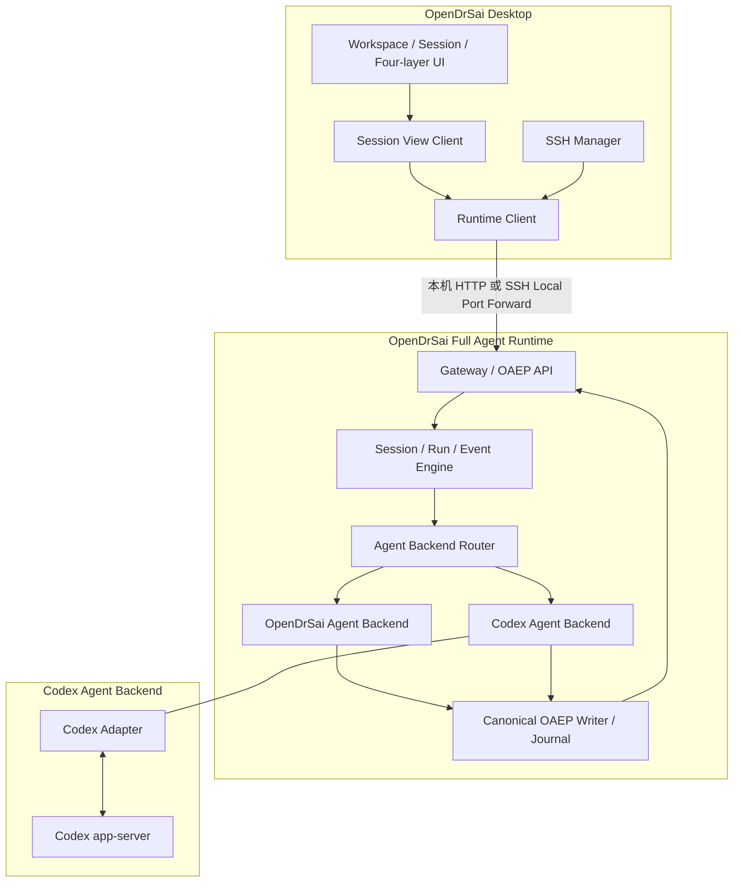
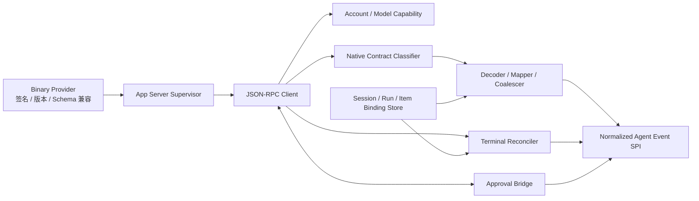

# OpenDrSai Codex Adapter OAEP P7：单会话数据通道与生产稳定性收敛开发方案

状态：待实施  
制定日期：2026-08-04  
阶段：Codex Adapter 第 7 阶段（P7）  
上游方案：

- `OpenDrSaiCodexAdapter_OAEP_V6实时语义一致性与统一流式渲染开发方案.md`
- `OpenDrSai_Codex用户体验_V5开发方案.md`
- `cores/protocol/oaep/README.md`
- `cores/protocol/codex-app-server-stable-contract.json`

> P7 是收敛阶段，不是 OAEP 7.0，也不是重新设计 OpenDrSai 架构。OAEP 继续使用
> Stable 1.0；Codex Agent Backend 继续等于 `Codex Adapter + Codex app-server`；
> Desktop 继续只连接 OpenDrSai Full Agent Runtime，不直接连接 Codex app-server。

## 1. 阶段定位

V6 已建立以下正确方向：

```text
Backend 私有输出
  -> Backend Adapter
  -> Normalized Agent Event
  -> Canonical OAEP Writer / Journal
  -> Snapshot + Replay + SSE
  -> OAEP Presentation Projector
  -> Structured Turn Store
  -> 四层统一输出栏
```

P7 保留这条主链路，集中修复代码审计发现的生产化缺口：

1. 名义上的共享 OAEP Controller 以 `RuntimeClient` 对象为键，而工作区连接每次创建新 Client，导致同一 Session 可能存在多个 SSE；
2. 每个 OAEP Event 都重新投影并发送整份会话历史，Renderer 根状态和 `localStorage` 随之反复更新；
3. 点击会话时 `get snapshot` 和 `subscribe snapshot` 会重复执行完整 Codex 历史同步；
4. Codex Native Notification 尚未形成穷举的语义、诊断、忽略、终止分类矩阵；
5. reasoning segment identity、Tool output 字段及部分 Delta 的实时/重放语义不完全一致；
6. JSON-RPC、SSE、Listener 或 Mapper 异常不能始终驱动 Active Run 收敛到唯一终态；
7. Codex Desktop 自动升级缺少与已验证协议基线的明确兼容策略；
8. 历史同步、Cursor 持久化、附件暂存和若干缓存存在重复工作或无界生命周期；
9. 当前 V6 release gate 能通过，但 Python Adapter、真实 IPC、Renderer 根更新和长会话交互没有进入同一个强制发布门禁。

P7 完成前暂停新增 Codex 表层功能。P7 完成后，新的模型选项、更多工具卡片、搜索、导出等能力才能继续进入产品层。

## 2. 实现目标

### 2.1 核心目标

1. 一个 Runtime Endpoint 下的一个 OAEP Session，在一个 Desktop 主进程内只有一个权威实时数据通道；
2. UI 初始化使用 Snapshot，后续只接收增量 Patch，不随每个 Delta 传输整份历史；
3. Codex 原始通知必须经过显式协议矩阵转换，Renderer 永远不理解 Codex 私有方法；
4. Run 在成功、失败、取消、审批等待、连接中断、Mapper 失败和 Desktop/Runtime 重启后均收敛到可解释状态；
5. 实时、Snapshot、Replay、历史导入和重启恢复产生相同的 OAEP/Structured Turn 语义；
6. 长会话运行期间，侧栏、右栏、输入框和滚动保持可交互；
7. 发布门禁按功能点验证真实行为，不能再用模块源码字符串代替功能证据。

### 2.2 非目标

P7 不做以下工作：

- 不改变 OpenDrSai Desktop、Runtime Client、SSH Manager、Remote Runtime 的既有拓扑；
- 不让 Desktop 直接连接 Codex app-server；
- 不创建 Codex 专用 UI 协议；
- 不把 Structured Turn 升格为第二套 Agent Event 协议；
- 不暴露模型隐藏思维链，只展示 Codex 允许公开的 commentary/reasoning summary；
- 不移除 Approval Bridge、签名验证、持久绑定和危险策略 fail-closed；
- 不在本阶段新增与收敛无关的表层产品功能。

## 3. 整体架构

### 3.1 产品与 Runtime 拓扑保持不变



本机 Windows 阶段：Desktop、Runtime 和 Codex app-server 均运行在本机；未来远程 Linux 阶段：Desktop 通过 SSH 隧道连接远程 Runtime，Codex Adapter 和 Codex app-server 在远程主机内部保持相同关系。OAEP 和 Workspace Operation Protocol 不因传输位置变化而改变。

### 3.2 P7 单会话数据通道

```mermaid
flowchart LR
    A["Codex app-server"] --> B["JSON-RPC Supervisor"]
    B --> C["Native Contract Classifier"]
    C --> D["Decoder / Mapper / Coalescer"]
    D --> E["Normalized Agent Event"]
    E --> F["Canonical OAEP Writer"]
    F --> G["OAEP Journal"]
    G --> H["Snapshot / Replay / SSE"]
    H --> I["RuntimeClientRegistry"]
    I --> J["OaepSessionHub\nendpointKey + sessionId"]
    J --> K["SessionViewStore"]
    K --> L["Initial Snapshot"]
    K --> M["Incremental Patch"]
    L --> N["Renderer Session Store"]
    M --> N
    N --> O["四层输出栏"]
```



### 3.3 唯一所有权

| 对象 | 唯一所有者 | 身份键 | 禁止行为 |
|---|---|---|---|
| Runtime Client | `RuntimeClientRegistry` | endpoint、认证身份、Runtime instance | 每次 API 调用新建 Client |
| OAEP Transport | `OaepSessionHub` | runtime endpoint key + session_id | Chat 与历史各开一条 SSE |
| Session OAEP State | `OaepSessionStore` | session_id | Listener 私自维护第二份协议状态 |
| UI View State | `SessionViewStore` | session_id + projection version | 每个 Delta 重新生成整份历史 |
| Renderer 活动会话 | Renderer Session Store | thread_id/session_id | 放入 App 根状态触发全应用更新 |
| Run terminal | Runtime Canonical OAEP Journal | run_id | Desktop 合成第二个 done/error |

### 3.4 Codex Adapter 内部边界



| Adapter 子模块 | 负责 | 不负责 |
|---|---|---|
| Binary Provider / Compatibility Gate | 发现可信 Codex、签名、版本和协议基线 | 安装 UI、OAEP 投影 |
| App Server Supervisor | 进程启动、停止、重启、stderr 脱敏和 generation | Session/Run 业务状态 |
| JSON-RPC Client | Framing、请求响应、通知、Server Request、连接失败广播 | 猜测 Codex Item 语义 |
| Native Contract Classifier | 对已知方法做穷举分类和版本覆盖 | 直接产生 UI Component |
| Decoder / Mapper / Coalescer | Codex 私有字段到 Normalized Agent Event、Backend identity、Delta 合批 | Runtime ID、OAEP sequence、Renderer 布局 |
| Binding Store | Runtime Session/Run/Item 与 Codex Thread/Turn/Item 的持久对应 | 保存第二份公开会话正文 |
| Approval Bridge | Codex Server Request 与 Runtime 用户审批闭环 | 绕过用户审批或自行执行工具 |
| Terminal Reconciler | 连接中断后的 Backend Turn 状态确认 | 合成未经验证的成功结果 |

`RuntimeClientRegistry`、`OaepSessionHub`、`SessionViewStore` 和 Renderer Store 不属于 Codex Adapter。它们是 Backend 无关的 Runtime/Desktop 消费层，必须同时服务 OpenDrSai 自身 Backend 和未来 Backend。

## 4. P7 强制不变量

1. 同一个 `{runtime_endpoint_key, session_id}` 同时最多一条 SSE；
2. Snapshot 成功后即允许调用方继续，SSE 暂时不可用不能让发送动作无限等待；
3. Event sequence 在 Session 内严格递增，Gap 必须 Replay 或 Resnapshot；
4. Listener 异常不能关闭共享 Transport，也不能让已推进 Cursor 的事件静默丢失；
5. 每个 Active Run 必须由 OAEP terminal、可验证的 Backend terminal 或明确的 interrupted/recovery 状态结束；
6. Renderer 私有 IPC 流量随本次 Patch 大小增长，不随历史总长度增长；
7. 实时事件不得触发整份 Thread 历史写入同步 `localStorage`；
8. Codex Stable Notification 必须在矩阵中标为 `semantic`、`diagnostic`、`known_ignored`、`server_request` 或 `fatal`；
9. `reasoning.segment.added` 必须保留稳定 `segment_id`，`tool.output.append` 必须更新 Tool `result`；
10. Terminal Item 是完整权威状态，校正 Delta 累积内容但不重复追加；
11. 找不到原 Codex Thread 时禁止静默创建新 Thread；新任务只能由用户明确选择；
12. 发布证据必须绑定当前 Commit、源码摘要、Adapter 版本、Codex 版本和 Schema 摘要。

## 5. 模块与功能点

P7 共 9 个模块、72 个功能点。每个功能点必须同时具备实现、自动测试和可追溯验收证据。

### M01 Runtime Client Registry 与单会话所有权（8 项）

| ID | 功能点 | 实现要点 | 测试与验收 |
|---|---|---|---|
| M01-F01 | 建立稳定 Runtime Endpoint Key | 本机使用 Runtime instance/token generation；远程使用 host/workspace/tunnel/runtime identity 的不可逆摘要 | 相同 Endpoint 100 次连接得到相同 Key；不同认证或 Runtime generation 不碰撞 |
| M01-F02 | 建立 `RuntimeClientRegistry` | 按 Endpoint Key 复用 Local/Remote RuntimeClient，提供引用计数和关闭接口 | 并发 50 次获取只创建 1 个 Client；最后一个引用释放后关闭 |
| M01-F03 | Client generation 失效 | Gateway 重启、Tunnel 重建、Token 更新时原 Client 明确失效并迁移订阅 | 故障注入后旧请求失败为结构化错误，新 generation 自动建立一次 |
| M01-F04 | 建立 Session Owner Key | 所有共享状态统一使用 `{endpointKey, sessionId}`，禁止以对象引用作为共享身份 | 架构扫描禁止 `WeakMap<RuntimeClient,...>` 成为唯一身份；多 Client fixture 仍只有一个 Owner |
| M01-F05 | Chat、历史和诊断复用 Session Owner | `runRuntimeBackendChat`、`subscribeRuntimeThreadSnapshot`、恢复与诊断从同一个 Hub 订阅 | 同一会话同时打开聊天、右栏和诊断时 SSE 连接计数恒为 1 |
| M01-F06 | 模型与账号缓存绑定 generation | Codex App Server 重启、账号变化或版本变化后刷新 model/account capability | 重启前后模型集合变化 fixture；不能继续使用旧缓存 |
| M01-F07 | 生命周期有界 | 清理无引用 Client、Session Owner、Run filter、cancelled set、lock、ordinal 和 retry timer | 10,000 个短 Run 后缓存数量回落到活动对象加固定 LRU 上限 |
| M01-F08 | 所有权诊断 | 输出脱敏的 Endpoint、Session、Subscriber、SSE、generation 和引用计数 | 诊断快照不含 Token/绝对敏感路径；可定位重复 Transport |

### M02 OAEP Session Stream 状态机（8 项）

| ID | 功能点 | 实现要点 | 测试与验收 |
|---|---|---|---|
| M02-F01 | 明确 Stream 状态机 | `idle -> snapshot -> replay -> connected -> retrying/resnapshot -> closed/fatal`，状态转换可观测 | 状态转换正反矩阵；非法跳转失败关闭 |
| M02-F02 | Snapshot-ready 与 Stream-ready 分离 | Snapshot+Replay 完成即可返回订阅；SSE 未连接时进入 retrying，不阻塞创建 Run | SSE 永久不可用 fixture 中发送操作在限定时间内得到可恢复状态而非无限等待 |
| M02-F03 | 关闭 Snapshot/SSE 竞态 | Snapshot 后 Replay 到最新 Cursor，再打开 SSE；重叠 Event 按 sequence/dedupe 去重 | 在三个边界注入 Event，最终一次不丢不重 |
| M02-F04 | Listener 故障隔离 | 单 Listener 异常进入诊断；Transport 继续，失败 Listener 接收 Resnapshot/Patch recovery | 两个 Listener 中一个抛错，另一个连续收到全部 Event；失败者恢复后 digest 相同 |
| M02-F05 | 有界 Ingest Queue 与背压 | Transport 读取和投影副作用解耦；按 Item 合并 Delta，队列溢出时 Resnapshot | 100k 小 Delta 不无限占用内存；无 silent drop；终态内容正确 |
| M02-F06 | Retry 分类 | 网络/EOF 可重试；401/403、Session missing、协议不兼容进入 fatal/action-required；指数退避有上限和抖动 | 各错误码 fixture 断言次数、状态和用户动作；fatal 不无限请求 |
| M02-F07 | Cursor Gap/Expired 恢复 | Gap 先 Replay；Cursor expired 或协议状态不可修复时原子 Resnapshot | 断线、410、乱序、重复和压缩矩阵，最终 Snapshot digest 一致 |
| M02-F08 | Abort 与引用释放 | Chat AbortSignal、切换会话、窗口销毁和 Runtime shutdown 均能停止无引用订阅及 Timer | 取消后无活动 Reader/Timer/Promise；进程退出无悬挂句柄 |

### M03 增量 Session View Store 与 IPC（8 项）

| ID | 功能点 | 实现要点 | 测试与验收 |
|---|---|---|---|
| M03-F01 | 建立主进程 `SessionViewStore` | 保存 OAEP State 和 Structured Projection，按 Session 独立更新 | 两个 Session 并发时状态、Cursor、Run 和 Item 完全隔离 |
| M03-F02 | 定义版本化 Initial Snapshot | 订阅首次只发送一次有 schema/projection/cursor 的完整视图 | 新订阅、重启和 Resnapshot fixture 能从零确定性恢复 |
| M03-F03 | 定义版本化 Incremental Patch | Patch 覆盖 run upsert、item upsert、delta、terminal、remove/correction、connection state | JSON Schema/TypeScript 正反例；未知 Patch 版本拒绝应用 |
| M03-F04 | Patch 复杂度与历史长度解耦 | 单 Event 只投影受影响 Run/Item/Part/Activity，不遍历所有历史 Run | 60、500、5,000 Run 下单 Delta CPU/IPC 大小近似常数 |
| M03-F05 | Chat 与 Thread Snapshot 共用 Store | Chat Structured Event 和会话历史订阅由同一 Store 派生，不再各自 Reducer/SSE | 活动 Run 只有一个 Item/Part；历史刷新不覆盖流式文本 |
| M03-F06 | Renderer 使用会话级外部 Store | 用 selector/useSyncExternalStore 或等价机制隔离活动会话，移出 App 根级全量快照 State | 1,000 消息流式时右栏组件无无关重渲染；React profiler 有上限 |
| M03-F07 | 终态权威替换 | Item terminal Patch 原位替换完整字段，Run terminal 只更新状态；不合成额外文本 | Delta 与 terminal 相同/不同/缺失矩阵均无重复文字 |
| M03-F08 | Legacy 边界隔离 | 旧 Conversation 协议进入独立 Compatibility Adapter；OAEP Renderer 不含 legacy 分支 | 最低支持旧 Runtime 回归通过；新 Runtime 路径架构扫描无 legacy chunk/reasoning/tool 判断 |

### M04 Codex Native Protocol 分类与映射（8 项）

| ID | 功能点 | 实现要点 | 测试与验收 |
|---|---|---|---|
| M04-F01 | 生成稳定方法清单 | 从已固定 Codex Schema 生成 Client Method、Server Request、Notification 清单及字段契约 | 清单覆盖 Adapter 实际调用的 `thread/list/archive/unarchive` 等方法；Schema drift 自动失败 |
| M04-F02 | Notification 五分类穷举 | 每个 Stable Notification 标记 semantic/diagnostic/known_ignored/server_request/fatal | 当前基线所有 Notification 100% 分类；新增类型未分类时 CI 失败 |
| M04-F03 | Message 与 phase 保真 | user 回显只绑定；assistant commentary/final 保持 parts、role、phase | 实时、历史和 replay 参数化 fixture 无对象字符串化或角色漂移 |
| M04-F04 | Reasoning segment 保真 | 使用 `summaryIndex/contentIndex` 生成稳定 segment_id；segment marker 与 text delta 正确归组 | 多 summary、多 content、空 marker、重放测试得到与 terminal 相同 segments |
| M04-F05 | Command/Tool 实时活动 | Command output、MCP progress 和可公开 Tool progress 映射到稳定 Activity/Delta | started/progress/output/completed/failed 原位更新；无通用 Notice 冒充工具进度 |
| M04-F06 | File/Diff/Plan/Subtask 语义 | FileChange、TurnDiff、PlanUpdated、Collab/SubAgent、Hook 使用 Item update 或诊断分类 | 真实脱敏 golden fixture 对应四层结构；已废弃且不再发出的通知标为 known_ignored |
| M04-F07 | Error/Warning/Compaction/Reroute | 错误驱动 Run failure/recovery；警告、上下文压缩、模型切换使用安全 Notice/metadata | 不泄露原始敏感内容；用户能区分失败、提醒和模型调整 |
| M04-F08 | Unknown 只进诊断 | 未分类 Runtime 通知不得直接创建用户可见 Notice；记录方法、摘要、版本和计数 | 注入带秘密的未知 Payload，UI 无内容，诊断仅含脱敏 digest |

### M05 OAEP 语义一致性与通用 Backend 兼容（8 项）

| ID | 功能点 | 实现要点 | 测试与验收 |
|---|---|---|---|
| M05-F01 | Delta 元数据完整透传 | Normalized Event 和 Writer 保留 kind、segment_id、stream、ordinal 及允许的扩展字段 | 七类 Delta round-trip 后字段无丢失 |
| M05-F02 | 修复 Reasoning Reducer | `reasoning.segment.added` 创建指定段；`reasoning.text.append` 只追加目标段 | Python/TypeScript Reducer 使用同一 golden，segments digest 相同 |
| M05-F03 | 修复 Tool Reducer | `tool.output.append` 更新 `content.result`，Command 才更新 `content.output` | Tool/Command 交叉反例防止字段混写 |
| M05-F04 | 七类 Delta 完整矩阵 | message、reasoning segment/text、plan、command、tool、subtask 均支持 live/replay/snapshot | 每类至少覆盖 started-before-delta、delta-before-started recovery、terminal correction |
| M05-F05 | Item/Run 状态机强化 | terminal 后 Delta 隔离；一个 Run 恰好一个 terminal；Item type/identity 不可变化 | Property-based 状态序列和非法反例 |
| M05-F06 | 四路径 Parity | live reduction、event replay、snapshot projection、restart recovery 产生相同 normalized digest | 10 类 Item × 7 类 Delta × 5 类终态组合测试 |
| M05-F07 | OpenDrSai Backend 对等验证 | OpenDrSai 自身 Backend 与 Codex Adapter 使用同一 Normalized Event/OAEP fixture 语义树 | 相同行为 fixture 的 OAEP 类型、状态和四层投影一致 |
| M05-F08 | OAEP 扩展兼容 | 新 Backend 扩展只能通过 additional properties/新版本能力声明，不在 Renderer 增加私有分支 | 模拟 Future Backend 扩展字段可保留、旧 Renderer 可安全忽略 |

### M06 Run 异常终态与恢复（8 项）

| ID | 功能点 | 实现要点 | 测试与验收 |
|---|---|---|---|
| M06-F01 | Active Turn 连接失败信号 | JSON-RPC Connection Failure 广播给所有 Active Turn，不能只拒绝 Pending RPC | `turn/start` 已返回后 EOF，Run 在门槛内进入 reconcile/failed，不无限等待 |
| M06-F02 | 统一等待集合 | 执行等待 OAEP terminal、Backend terminal、connection failure、cancel 和 deadline 中第一个有效结果 | 五路竞态参数化测试；最终只有一个公开 terminal |
| M06-F03 | Mapper/Listener 异常收敛 | Mapper 异常记录脱敏诊断并失败当前 Run；UI Listener 异常不影响 Backend/Transport | 注入 Decoder、Writer、Projector、Renderer Listener 异常，状态均可解释 |
| M06-F04 | Backend terminal reconciliation | 连接中断后用 `thread/read` 或受控恢复接口确认 Turn 状态；结果未知时标记 action-required | completed/failed/interrupted/still-running/missing 五状态测试 |
| M06-F05 | Cancel/Approval 竞态 | Cancel 与 Approval pending、Tool terminal、Turn terminal 并发时 fail closed 且可重复调用 | 100 次随机竞态无悬挂 Approval、无双 terminal |
| M06-F06 | 清理使用 `finally` | Route handler、Delta flush task、Timer、Approval context、Run lock 和 Subscription 全路径释放 | 成功、异常、取消、进程退出和 Task CancelledError 覆盖 |
| M06-F07 | Desktop 恢复动作模型 | 错误映射为 retry、resync、repair backend、explicit new task、view diagnostics；内部码只在详情显示 | `codex_session_resume_required` 等场景出现可点击动作，不显示开发者句子作为主错误 |
| M06-F08 | 重启恢复 | Desktop/Gateway/App Server 任一重启后按 Binding、Outbox、OAEP Cursor 和 Backend Turn 收敛 | 三类重启矩阵；不重发用户消息、不创建第二 Thread、不重复 Item |

### M07 工作区、历史同步与资源生命周期（8 项）

| ID | 功能点 | 实现要点 | 测试与验收 |
|---|---|---|---|
| M07-F01 | `thread/list cwd` 服务端过滤 | 使用原始和规范化工作区路径筛选 active/archived Thread，减少全账户扫描 | 633 Thread fixture 只返回目标工作区；请求参数合同断言含 cwd |
| M07-F02 | 元数据同步与内容同步分离 | 添加工作区先同步 Thread metadata；点击会话才按需同步内容 | 工作区可立即使用；不因大历史阻塞创建完成 |
| M07-F03 | 历史同步水位 | 持久化 backend updated_at、mapping version、schema/version 和内容摘要 | 未变化会话再次打开不调用完整 `thread/read` |
| M07-F04 | Get/Subscribe Singleflight | 初次快照和订阅共享同一个同步 Promise/Store；快速重复点击可取消等待但不重复后台工作 | 并发 20 次打开只有 1 次 `thread/read` 和 1 次投影 |
| M07-F05 | 大型 JSONL 与解析边界 | 统一本机/Bridge Frame 上限；大型响应异步解析、限制内存并给出可操作错误 | 4/16/32/128MB 边界 fixture；事件循环延迟和峰值内存达标 |
| M07-F06 | 真实取消和进度 | Workspace Sync/History Sync 接受 AbortSignal，报告 discovered/read/projected/persisted 阶段 | 点击取消后 RPC/解析/写入停止；UI 不再只忽略返回值 |
| M07-F07 | Migration 按需运行 | 仅 mapping version 变化、检测到旧数据或用户手动修复时 dry-run/reproject；删除未使用比较变量 | 正常重复打开零 migration scan；升级 fixture 可中断、可重跑 |
| M07-F08 | 附件与缓存生命周期 | 附件 stat/大小/磁盘预检、可取消复制、Run 后 TTL 清理；所有缓存有容量和失效策略 | 大文件、复制失败、取消、崩溃恢复和 24h 清理测试；不留下无界目录 |

### M08 Renderer 易用性与性能收敛（8 项）

| ID | 功能点 | 实现要点 | 测试与验收 |
|---|---|---|---|
| M08-F01 | 移除全历史同步 `localStorage` 写入 | 历史缓存迁到主进程持久层或按 Thread 的异步存储；Renderer 只保存轻量偏好 | 流式 10k Event 时历史 `localStorage.setItem` 调用为 0 |
| M08-F02 | 16ms 增量批处理 | 按 Session/Run/Item 合并 UI Patch；terminal、approval、error 立即刷新 | Fake timer 和 render count；文本无明显跳字，关键状态不延迟 |
| M08-F03 | 四层输出保持稳定 | 单行运行状态；处理过程、用户交互、最终结果原位更新，稳定 Item/Activity ID | reasoning/tool/file/subtask/approval/error 视觉 golden |
| M08-F04 | 长会话交互隔离 | Sidebar、Right Panel、Composer 不订阅正文 Delta；Message 列表继续虚拟化 | 活动 Run 中连续点击右栏 100 次，P95 响应满足门槛且无漏点 |
| M08-F05 | 缓存优先加载 | 先显示可信本地 Snapshot，再显示“后台同步”；只有无缓存时使用骨架屏 | 59/500 Run 会话点击后首屏时间自动验收 |
| M08-F06 | 连接与恢复状态易懂 | 一行状态区显示运行/重连/需操作；详情层提供技术码、Run ID 和诊断入口 | 普通模式无堆栈和源码路径；开发者模式可展开完整诊断 |
| M08-F07 | 用户动作明确 | Resume 缺失时提供“重新同步”“修复 Codex Backend”“明确新建任务”，不自动选择破坏连续性的动作 | 每个按钮调用唯一幂等命令；取消后可再次操作 |
| M08-F08 | 可访问性与滚动稳定 | Patch 更新不抢焦点；ARIA live 只播报有意义状态；用户离开底部时不强制滚动 | 键盘、屏幕阅读器、100/125/150% 缩放和窄窗口验收 |

### M09 测试、证据与发布门禁（8 项）

| ID | 功能点 | 实现要点 | 测试与验收 |
|---|---|---|---|
| M09-F01 | 功能点级证据账本 | 72 个功能点各自绑定测试 ID、源码范围、结果和证据文件；禁止按模块布尔值批量判定 | 删除任一关键测试或证据时对应功能点变为 missing，Release Gate 失败 |
| M09-F02 | Python Adapter 强制门禁 | Release Contract 必须运行 Decoder、Mapper、JSON-RPC、Backend Client、Supervisor、Security、OAEP tests | Python 任一失败均阻断；计时敏感 fixture 使用 readiness handshake 而非脆弱 150ms 假设 |
| M09-F03 | TypeScript Store/Stream/Projector 门禁 | 覆盖 Registry、单流、Listener 隔离、Patch reducer、七类 Delta 和 parity | 多 Client 同 Session 仍一条 SSE；Listener 抛错后无 Event 丢失 |
| M09-F04 | 真实 Electron 性能门禁 | 使用真实 Main/Preload/IPC/Renderer，不允许只测试内存 reducer | 输出 IPC bytes、Long Task、render count、点击延迟、内存和 Cursor 写次数 |
| M09-F05 | 长历史和高频流验收 | 59、500、5,000 Run；10k/100k Event；大 Tool output；Reasoning 多段 | 交互、内容、终态、内存和时间全部满足 SLO |
| M09-F06 | 故障注入矩阵 | JSON-RPC EOF、App Server crash、SSE EOF、Cursor gap/expired、Listener throw、SQLite fail、Cancel/Approval race | 每项证明无悬挂、无双终态、无重复用户消息、可恢复或可操作失败 |
| M09-F07 | 真实 Windows Host Codex E2E | 同一 Thread 至少三轮，覆盖 reasoning、command、file、tool/approval、cancel、archive、Gateway/App Server restart | Thread ID 不变、Turn ID 唯一、上下文保持、实时内容早于 terminal |
| M09-F08 | 证据绑定与时效 | Evidence 写入 commit SHA、dirty/source digest、Adapter/OAEP/Codex/Schema version、binary digest、OS、时间和命令 | 任一摘要不匹配或证据超期时 full release fail closed |

## 6. 需要移除、替换和保留的实现

### 6.1 P7 必须移除或替换

| 当前实现 | P7 处理 |
|---|---|
| `configureChatRemoteRouting()` 空实现和平台空接线 | 删除；RuntimeClientRegistry 成为唯一工作区 Runtime 路由入口 |
| 以 `WeakMap<RuntimeClient,...>` 作为 Session 共享身份 | 替换为稳定 Endpoint Key + Session ID Registry |
| Chat 与 Thread History 分别创建 OAEP 订阅 | 合并到 OaepSessionHub |
| 每个 Event 调用完整 `projectOaepThreadSnapshot` | 替换为受影响实体的增量 Projector |
| 每个 Event 经 IPC 发送完整 Thread Snapshot | 替换为 Initial Snapshot + Incremental Patch |
| App 根状态保存所有实时 Thread Snapshot | 替换为会话级外部 Store 和 selector |
| 每个 Snapshot 变化同步写完整 `localStorage` | 删除；改为异步、分会话、受限持久缓存 |
| `getThreadSnapshot` 与 `subscribeThreadSnapshot` 重复同步 | 合并为 Singleflight 初始同步和订阅 |
| 每个 Event 原子重写 `session-sync-state.json` | 改为内存 Cursor + debounce/checkpoint + terminal flush |
| 每次打开会话运行完整 history migration dry-run | 改为版本或异常驱动 |
| 未知 Codex Notification 自动成为用户 Notice | 改为脱敏诊断和 coverage counter |
| 首次 SSE 未打开时订阅无限等待 | 改为 Snapshot-ready、Stream-retrying/fatal 分离 |
| 无界 `_cancelled_runs`、entity locks、ordinals、Timer | 改为随 Run/Session 生命周期释放或有界 LRU |
| 模块源码字符串检查后宣称全部功能点完成 | 替换为功能点级行为证据 |

### 6.2 必须保留

- `Codex Agent Backend = Codex Adapter + Codex app-server`；
- Desktop 只连接 OpenDrSai Runtime；
- 本机 Runtime 与远程 Runtime 使用相同 OAEP 和 Workspace Operation Protocol；
- Normalized Agent Event SPI；
- Canonical OAEP Journal 唯一事实来源；
- Backend Session/Run/Item 持久绑定和幂等 Operation；
- Runtime 事务化 OAEP Writer；
- Terminal Item 权威校正；
- Approval Bridge、用户审批权和危险策略 fail-closed；
- Codex Desktop 签名验证和 Managed Artifact 校验；
- 四层输出栏；
- 找不到原 Codex Thread 时禁止静默新建；
- Append-only 审计和脱敏诊断。

### 6.3 分阶段退役

Legacy Runtime Conversation Protocol 暂不立即删除。P7 将其移动到独立 Compatibility Adapter，并满足：

1. 新 Runtime 的 Chat、历史和恢复不得进入 Legacy 路径；
2. 记录旧协议使用版本和次数，不记录用户正文；
3. 当最低支持 Runtime 全部具备 OAEP Session Stream 后，另立删除变更；
4. 删除前必须保留旧远程 Runtime 的只读兼容回归。

## 7. 关键时序

### 7.1 打开已有会话

```text
用户点击 Thread
  -> Renderer 立即读取可信缓存（如有）
  -> RuntimeClientRegistry 获取 Endpoint Client
  -> OaepSessionHub 获取或创建唯一 Session Owner
  -> HistorySyncCoordinator Singleflight 检查同步水位
     -> 未变化：跳过 thread/read
     -> 有变化：后台 thread/read + 增量持久化
  -> SessionViewStore 发送 Initial Snapshot
  -> Replay 到最新 Cursor
  -> SSE connected 或 retrying
  -> 后续只发送 Incremental Patch
```

### 7.2 发送多轮消息

```text
用户输入
  -> Preflight：Runtime / Codex / Session binding / model / account
  -> 记录 Outbox + source_message_id
  -> 复用 Session Owner 和已有 Codex Thread
  -> 幂等创建 Run
  -> Execute 当前用户输入
  -> Native Event -> OAEP -> SessionView Patch
  -> Run terminal
  -> terminal Cursor/checkpoint 立即持久化
  -> 清理 Run 级资源，Session Owner 按引用继续保留
```

### 7.3 JSON-RPC 或 SSE 中断

```text
连接中断
  -> 标记 connection failure / retry classification
  -> OAEP Journal 中已有事实保持不变
  -> Active Run 进入 reconcile
  -> 可重试：Replay/Resnapshot/Reconnect
  -> Backend 已终止：写入对应唯一 terminal
  -> Backend 仍运行：恢复订阅
  -> 无法确认：action-required，不自动重发输入或新建 Thread
```

## 8. 性能和易用性门槛

| 指标 | P7 门槛 |
|---|---:|
| 同一 Endpoint/Session 的并发 SSE | 1 |
| Adapter 可见事件到 OAEP Commit P95 | <= 50ms |
| OAEP Event 到 Main SessionViewStore P95 | <= 75ms |
| Main Patch 到 Renderer 可见 P95 | <= 100ms |
| Backend 首个公开过程/回答到 UI P95 | <= 250ms |
| Renderer Patch 合批窗口 | 约 16ms；terminal/approval/error 立即 |
| 单 Delta IPC Payload | 与 Delta/受影响实体成正比，不与历史总量成正比 |
| 实时历史 `localStorage` 写入 | 0 |
| Cursor 常规磁盘写频率 | <= 4 次/秒/进程；terminal 立即 flush |
| 500 Run 活动会话右栏点击 P95 | <= 50ms |
| 5,000 Run 缓存会话首个可见内容 | <= 300ms |
| 10,000 Event | 无丢失、无重复、顺序连续、无全量 IPC |
| 100,000 小 Delta | 内存有界；允许合批或 Resnapshot，不 silent drop |
| SSE/JSON-RPC 中断后用户状态出现 | <= 1s |
| 用户取消同步后后台停止 | <= 1s；不可取消的 OS 操作必须明确显示收尾中 |

性能门禁必须使用生产构建或等价真实 Main/Preload/Renderer 链路。单独调用 Reducer 的微基准只能作为单元测试，不能作为长会话验收替代品。

## 9. 测试体系

### 9.1 单元测试

- Python：Native Contract、Decoder、Mapper、Coalescer、JSON-RPC、Backend Client、Approval、Supervisor、History Sync、OAEP Reducer；
- TypeScript：RuntimeClientRegistry、OaepSessionHub、SessionViewStore、Patch Reducer、Presentation Projector、Renderer Store；
- Property-based：OAEP Item/Run 状态序列、重复/乱序/迟到 Event、随机 Cancel/Approval 竞态；
- Fake clock：40ms Adapter 合批、16ms Renderer 合批、Cursor debounce、Retry backoff 和证据超期。

### 9.2 Contract 测试

1. Codex Schema -> Stable Contract Manifest 生成和 drift；
2. Adapter 实际请求方法必须是 Manifest 子集；
3. Bridge allowlist 必须由相同 Manifest 生成；
4. Stable Notification 100% 分类；
5. OAEP Schema、Generated Types、Patch Schema 和 Structured Conversation 类型一致；
6. Renderer 不得导入 Codex Native Type/Method；
7. 新 Runtime 路径不得发送 legacy chunk/reasoning/tool_timeline terminal。

### 9.3 集成测试

- Fake Codex app-server：完整 JSONL、乱序响应、Server Request、EOF、重启、大 Frame；
- Runtime SQLite：事务回滚、Binding、Dedupe、Cursor、Snapshot/Replay parity；
- Desktop Main/Preload：Initial Snapshot/Patch IPC、取消、窗口销毁和 Singleflight；
- Renderer：Patch 原位更新、四层结构、焦点、滚动、折叠和错误动作。

### 9.4 自动用户场景

| 场景 | 输入和操作 | 必须证明 |
|---|---|---|
| A 最小消息 | `hello` | User/Assistant 各一次；首字早于 terminal；无对象字符串 |
| B 多轮连续 | 同一会话 3 轮互相引用 | Codex Thread ID 不变，Turn ID 唯一，上下文保持 |
| C Reasoning 多段 | 触发多个 summary segment | segment_id 稳定，实时/历史段落一致 |
| D 命令和工具 | 命令输出、MCP progress | Activity 原位更新；Command output 与 Tool result 不混写 |
| E 文件变更 | 读取并修改工作区文件 | File activity、审批、最终回答和实际文件一致 |
| F 归档 | 归档、查看、取消归档 | OpenDrSai/Codex 状态往返一致，活跃列表不混入归档 |
| G Resume 缺失 | 删除/失效 Runtime binding | 提供重新同步/修复/明确新建；不静默新建 |
| H 断线 | SSE、Gateway、App Server 分别中断 | 单一终态、不重发输入、不重复 Item、可恢复状态 |
| I 大历史 | 59/500/5,000 Run | 缓存优先、后台同步、右栏和输入框流畅 |
| J 高频输出 | 10k/100k Delta | 有界队列、增量 IPC、内容与 terminal 一致 |

### 9.5 手工验收

手工验收继续使用：

```powershell
cd C:\Users\win11\VSProjects\drsai\apps\desktop
.\windows-desktop-dev.cmd
```

手工清单：

1. 打开 `drsai` 等已有 Codex 历史工作区；
2. 快速切换 5 个会话，展开/收起右栏；
3. 在 59 轮以上会话继续发送 3 轮；
4. 展开“已处理”查看 commentary、reasoning、tool、file、subtask；
5. 触发审批、拒绝和取消；
6. 运行期间重启 Codex app-server 或 Gateway；
7. 检查无新 Thread、无重复消息、无原始字典、无假终态；
8. 在任务管理器和诊断页确认 SSE、内存、IPC、Cursor 写入和缓存有界。

## 10. 发布证据格式

P7 Full Release Evidence 至少包含：

```json
{
  "schema": "opendrsai.codex-adapter-p7.release-evidence.v1",
  "generated_at": "ISO-8601",
  "source": {
    "commit": "git sha",
    "dirty": false,
    "source_digest": "sha256"
  },
  "versions": {
    "desktop": "x.y.z",
    "runtime": "x.y.z",
    "codex_adapter": "mapping version",
    "oaep": "1.0",
    "codex": "x.y.z",
    "codex_binary_digest": "sha256",
    "codex_schema_digest": "sha256"
  },
  "feature_ledger": {
    "accepted": 72,
    "total": 72
  },
  "single_session_transport": {},
  "semantic_parity": {},
  "fault_matrix": {},
  "performance": {},
  "live_windows_codex": {}
}
```

以下任一情况必须失败关闭：

- 功能点缺少独立测试或证据；
- 当前源码摘要与证据不一致；
- Codex Binary/Schema 版本与证据不一致；
- Live Evidence 超过发布策略允许时效；
- 单 Session SSE 数量大于 1；
- 存在无终态 Run、重复 User Item、重复 final 或对象字符串化；
- 真实 Electron 性能门禁未执行；
- Python Adapter 测试未执行或存在失败。

## 11. 实施阶段

### P7.0 基线与可证伪测试

1. 固化当前重复 SSE、双 `thread/read`、全量 IPC、Cursor 写入和 `localStorage` 写入证据；
2. 为 reasoning segment、Tool result、Listener throw、JSON-RPC EOF 建立失败测试；
3. 将 72 个功能点写入真实 feature ledger；
4. 当前实现应在相应 P7 测试上失败，防止先写“完成”再补证据。

完成门槛：P7 关键缺陷均有稳定红测，V6 原有正确功能继续通过。

### P7.1 Client Registry 与单 Session Hub

范围：M01、M02。

1. Endpoint Key 和 RuntimeClientRegistry；
2. OaepSessionHub；
3. Snapshot-ready/Stream-ready；
4. Listener 隔离、Retry 分类和 Abort；
5. Chat/History/Diagnostics 切换到同一 Owner。

完成门槛：同一 Session 所有并发场景只有一条 SSE，无无限等待和悬挂资源。

### P7.2 增量 Store、IPC 与 Renderer

范围：M03、M08 基础。

1. SessionViewStore；
2. Initial Snapshot + Patch Schema；
3. 增量 Projector；
4. Renderer 会话级 Store；
5. 移除全量 IPC、App 根级实时快照和同步 `localStorage` 历史写入；
6. Cursor debounce/checkpoint。

完成门槛：500 Run 活动会话右栏点击 P95 <= 50ms，单 Delta IPC 与历史长度解耦。

### P7.3 Native Contract 与 OAEP Parity

范围：M04、M05。

1. 生成 Stable Contract Manifest；
2. Notification 五分类；
3. reasoning segment、tool、file、diff、subtask 等映射；
4. 七类 Delta 和通用 Reducer 修复；
5. Codex/OpenDrSai Backend parity。

完成门槛：当前 Stable Notification 100% 分类，四路径 parity suite 全部通过。

### P7.4 异常终态与恢复

范围：M06。

1. Connection Failure -> Active Turn；
2. 统一等待集合和 terminal reconciler；
3. Mapper/Listener fault isolation；
4. Cancel/Approval race；
5. Desktop/Gateway/App Server restart；
6. 用户恢复动作。

完成门槛：故障矩阵无悬挂 Run、无双终态、无自动重发和静默新建 Thread。

### P7.5 历史、资源与易用性

范围：M07、M08 完整项。

1. `thread/list cwd`；
2. 同步水位和 Get/Subscribe Singleflight；
3. 真实取消、进度和大型 Frame；
4. 按需 Migration；
5. 附件/缓存生命周期；
6. 四层输出、滚动和可访问性回归。

完成门槛：59/500/5,000 Run 场景达到加载、交互、内存和正确性门槛。

### P7.6 全自动与真实发布验收

范围：M09。

1. Python/TypeScript/Contract 全门禁；
2. 真实 Electron 性能；
3. 故障注入；
4. Windows Host Codex 三轮及真实工具任务；
5. 证据绑定；
6. Legacy 最低支持回归；
7. 72/72 feature ledger。

完成门槛：Contract 和 Full Release Gate 均通过，证据与当前源码、Codex Binary 和 Schema 完全匹配。

## 12. 主要代码范围

### 12.1 Codex Adapter / Runtime

- `cores/python/packages/drsai/src/drsai/backend/codex_adapter/backend_client.py`
- `cores/python/packages/drsai/src/drsai/backend/codex_adapter/jsonrpc_client.py`
- `cores/python/packages/drsai/src/drsai/backend/codex_adapter/app_server_process.py`
- `cores/python/packages/drsai/src/drsai/backend/codex_adapter/binary_provider.py`
- `cores/python/packages/drsai/src/drsai/backend/codex_adapter/bridge_transport.py`
- `cores/python/packages/drsai/src/drsai/backend/codex_adapter/models.py`
- `cores/python/packages/drsai/src/drsai/backend/codex_adapter/native_decoder.py`
- `cores/python/packages/drsai/src/drsai/backend/codex_adapter/event_mapper.py`
- `cores/python/packages/drsai/src/drsai/backend/codex_adapter/security.py`
- `cores/python/packages/drsai/src/drsai/backend/runtime/normalized_events.py`
- `cores/python/packages/drsai/src/drsai/backend/runtime/normalized_writer.py`
- `cores/python/packages/drsai/src/drsai/backend/runtime/oaep.py`
- `cores/python/packages/drsai/src/drsai/backend/runtime/agent.py`
- `cores/python/packages/drsai/src/drsai/backend/runtime/engine.py`

### 12.2 Protocol

- `cores/protocol/codex-app-server-stable-contract.json`
- `cores/protocol/codex-app-server/<version>/`
- `cores/protocol/oaep/README.md`
- `cores/protocol/oaep/oaep.schema.json`
- 新增 Codex Stable Method/Notification Classification Manifest
- 新增 Session View Snapshot/Patch Schema 与生成类型

### 12.3 Desktop Main / Renderer

- `apps/desktop/shared/main/runtimeClient.ts`
- `apps/desktop/shared/main/oaepSessionStream.ts`
- `apps/desktop/shared/main/threadRuntimeSubscription.ts`
- `apps/desktop/shared/main/threadRuntimeProjection.ts`
- `apps/desktop/shared/main/oaepPresentationProjector.ts`
- `apps/desktop/shared/main/sessionSyncState.ts`
- `apps/desktop/shared/main/chat.ts`
- `apps/desktop/shared/renderer/src/App.tsx`
- `apps/desktop/shared/renderer/src/adapters/useDesktopChatAdapter.ts`
- `apps/desktop/shared/renderer/src/components/ChatWorkspace.tsx`
- `apps/desktop/shared/renderer/src/components/StructuredMessageParts.tsx`
- 新增 RuntimeClientRegistry、OaepSessionHub、SessionViewStore 和 Renderer Session Store

### 12.4 Tests / Release

- `cores/python/packages/drsai/tests/test_codex_*.py`
- `cores/python/packages/drsai/tests/test_runtime_conversation_journal.py`
- `cores/python/packages/drsai/tests/test_oaep_*.py`
- `apps/desktop/windows/scripts/verify-oaep-*.mts`
- `apps/desktop/windows/scripts/verify-codex-p7-*.mjs|mts`
- Windows Host Codex E2E、真实 Electron 性能和 Fault Matrix Runner
- P7 feature ledger 与 release evidence

## 13. 风险与控制

| 风险 | 控制措施 |
|---|---|
| 单流 Registry 改动影响本机和远程 Runtime | Endpoint Key 传输无关；本机/SSH fixture 同时验证 |
| 增量 Patch 与 Snapshot 暂时不一致 | 每个 Patch 带 cursor/version；定期 digest；异常立即 Resnapshot |
| Listener 隔离掩盖 UI 错误 | 错误进入脱敏诊断和 per-listener recovery，不影响 Transport，但 Release Gate 对错误计数设为零 |
| Cursor debounce 导致进程崩溃后少量水位未落盘 | OAEP Journal 是事实来源；重启从较旧 Cursor Replay；terminal 立即 flush |
| Codex 新版本增加通知 | 生成矩阵 drift fail；未知内容只诊断，不污染用户输出 |
| 大 Thread 单帧内存压力 | Metadata-first、同步水位、受限 Frame、异步解析、可取消和明确错误 |
| Legacy 兼容被过早移除 | 独立 Adapter、最低版本策略、使用遥测和只读回归 |
| 重构期间双通道并存产生重复 | Feature flag 只允许整 Session 选择旧或新通道，禁止同 Session 双写/双订阅 |
| 性能门禁在 Mock 中假阳性 | 强制真实 Electron Main/Preload/IPC/Renderer 指标和 trace |

## 14. 完成定义

P7 只有同时满足以下条件才算完成：

1. 9 个模块、72 个功能点均有独立实现、测试和证据；
2. 同一 Runtime Endpoint/Session 在 Chat、History、Diagnostics 并发时只有一条 SSE；
3. Renderer 只接收 Initial Snapshot 和 Incremental Patch，普通 Delta 不传整份历史；
4. 实时过程中不再同步写完整 Thread Snapshot 到 `localStorage`；
5. 右栏、侧栏、输入框和滚动达到长会话性能门槛；
6. Codex Stable Notification 100% 分类，Unknown 不污染用户内容；
7. reasoning segment、Tool result 和七类 Delta 在 live/replay/snapshot/restart 中一致；
8. JSON-RPC、SSE、Mapper、Listener、SQLite、Cancel/Approval 故障矩阵无悬挂 Run 和双终态；
9. 同一 Codex Thread 至少三轮连续对话，重启后仍能继续且不创建第二 Thread；
10. 历史同步使用 cwd、Singleflight、水位、真实取消和按需 Migration；
11. Python Adapter、TypeScript、真实 Electron 性能和 Windows Host Codex E2E 全部进入发布门禁；
12. Full Release Evidence 与当前 Commit、源码、Adapter、Codex Binary 和 Schema 摘要一致；
13. Approval Bridge、签名校验、持久绑定、OAEP 唯一事实和四层输出架构没有被削弱；
14. P7 完成前不以新增表层功能掩盖任何未通过的收敛项。

## 15. 实施报告规则

实施时每轮统一报告：

```text
P7 第 N 轮
总体进度：xx%（完成点 / 72）
本轮完成：模块和功能点 ID
自动测试：通过 / 失败 / 未运行
真实验收：证据路径或阻塞原因
新增风险：无 / 具体风险
下一轮：明确功能点 ID
```

百分比只能按已同时具备代码、自动测试和证据的功能点计算。只有源码、只有测试脚本存在、或按模块源码字符串扫描，均不得计为完成。
