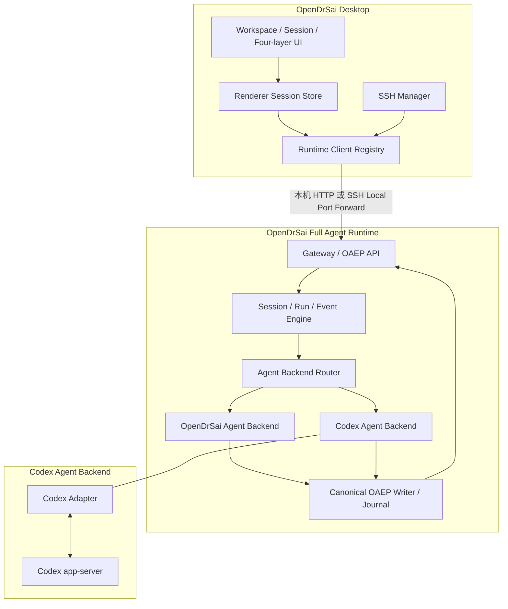
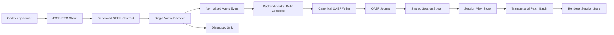

# OpenDrSai Codex Adapter OAEP P8：可靠性与证据闭环开发方案

状态：待实施  
制定日期：2026-08-04  
阶段：Codex Adapter 第 8 阶段（P8）  
上游方案：

- `OpenDrSaiCodexAdapter_OAEP_P7收敛开发方案.md`
- `OpenDrSaiCodexAdapter_OAEP_V6实时语义一致性与统一流式渲染开发方案.md`
- `cores/protocol/oaep/README.md`
- `cores/protocol/codex-app-server-stable-contract.json`

> P8 不修改 OpenDrSai 的产品拓扑，不新增 Codex 专用 UI 协议，也不推翻 P7 的单会话数据通道。P8 解决 P7 代码复审确认的九类可靠性问题，完成一套可执行的移除与兼容退场工作，使“代码、协议、运行行为、自动测试和发布证据”形成闭环。OAEP 继续保持 Stable 1.0；Codex Agent Backend 继续等于 `Codex Adapter + Codex app-server`。

## 1. 阶段定位

P7 已完成以下基础能力：

```text
Codex app-server
  -> Codex Native Decoder / Mapper
  -> Normalized Agent Event
  -> Canonical OAEP Writer / Journal
  -> Snapshot + Replay + SSE
  -> Session View Store
  -> Incremental Renderer Patch
  -> 四层统一输出栏
```

P8 不再扩展表层功能，集中处理九个已确认问题：

1. Codex Stable Contract 存在 JSON 与 Python 双重来源，且合同基线落后于实际 Codex 版本；
2. unknown/diagnostic 事件被写入正式 OAEP 会话流，可能污染 Journal 和 UI；
3. Renderer 增量 Patch 的 cursor 提交、批处理和 hydrate 存在竞态，`run.replace` 粒度仍偏粗；
4. 发布证据未完整绑定源码内容、Desktop 构建、Codex 二进制和真实 Electron 链路；
5. `item/agentMessage/delta` 同时由 Mapper 和 Decoder 理解，存在双重协议入口；
6. Run 异常终态不能保证清理 Delta buffer、ordinal、phase 和临时任务；
7. 外层订阅 Supervisor 吞掉错误并固定 100ms 无限重试，与 OAEP Stream 内部恢复职责重叠；
8. Desktop Agent Catalog 硬编码 Codex 模型，未使用 Runtime 的真实 `model/list` 能力；
9. Runtime Client Registry 的身份与生命周期仍可能产生无意义 generation 或旧 Client 重新登记。

P8 同时执行一套明确的移除策略：立即移除重复、错误或危险路径；暂时保留 Legacy、Snapshot 和恢复路径；通过遥测和发布周期决定后续退场。

## 2. 总体目标

### 2.1 核心目标

1. Codex 原生协议只有一个受审查、可生成、可比较的 Stable Contract；
2. 只有具有用户会话语义的事件进入 OAEP Journal，诊断与 unknown 使用独立有界通道；
3. Renderer Patch 的接收、应用、cursor 提交和 hydrate 替换具备原子性与 generation 隔离；
4. 所有 Codex 原生事件只经过一个 Decoder，Delta 合批只处理 Normalized Event；
5. completed、failed、cancelled、timeout、disconnect 和 shutdown 都通过同一个 Run Finalizer；
6. OAEP Stream 负责普通网络恢复，外层只处理明确的 Runtime generation 变化；
7. Desktop 展示的 Codex 模型、默认模型和推理级别全部来自 Runtime capability；
8. Runtime Client 的 endpoint identity、generation、retain、invalidate 和 dispose 不可冲突；
9. 发布证据可以证明当前源码、当前构建和当前 Codex 二进制实际完成了验收；
10. P8 完成后，立即移除项不再存在，延后移除项有可量化的退场条件。

### 2.2 用户结果

- 用户在已有 Codex 会话中连续发送消息，不会因为同步、重连或模型目录漂移而创建新 Thread；
- 思考摘要、工具调用、文件变化和最终回答按 OAEP 顺序及时出现，不显示原始字典或诊断噪声；
- Runtime 或 Codex 重启时，界面显示明确的重连、恢复或需用户操作状态，不无限转圈；
- 长会话中侧栏、右栏、输入框和滚动保持可交互；
- 用户选择的模型一定是当前 Codex app-server 真正支持的模型；
- 自动验收报告能够回答“哪份代码、哪个 Desktop 构建、哪个 Codex 二进制、在哪台主机上通过了哪些行为”。

### 2.3 非目标

P8 不做以下工作：

- 不改变 Desktop -> Runtime -> Agent Backend 的既有架构；
- 不让 Desktop 直连 Codex app-server；
- 不修改 Workspace Operation Protocol 的传输抽象；
- 不创建 OAEP 之外的第二套公开 Agent 输出协议；
- 不暴露模型隐藏思维链，只展示 Backend 允许公开的 commentary/reasoning summary；
- 不新增会话搜索、导出、更多工具卡片等表层能力；
- 不立即删除 `conversation/1`、完整 Snapshot hydrate 或 `run.replace` 恢复补丁；
- 不静默降级模型、不静默创建新 Codex Thread、不把失败合成为成功。

## 3. 整体解决方案

### 3.1 保留的产品架构



### 3.2 P8 内部数据链



### 3.3 三类事件出口

| 类别 | 条件 | 出口 | 用户可见性 |
|---|---|---|---|
| Semantic | 明确影响消息、reasoning summary、计划、工具、文件、审批、Run 状态 | Normalized Event -> OAEP Journal | 四层输出栏或运行状态层 |
| User Notice | 模型切换、上下文压缩、弃用警告等影响用户理解的受审事件 | OAEP Notice Item | 处理过程或状态提示 |
| Diagnostic/Unknown | 仅用于排障，或尚未受审的 Codex method/item | 有界 Diagnostic Sink / Metrics | 仅 Run Inspector；默认聊天区不可见 |

### 3.4 Patch 双 cursor 与 generation

```text
receivedSequence  仅表示 IPC 已收到
acceptedSequence  表示验证通过并进入当前 Batch
appliedSequence   表示 Batch 已原子应用到 Renderer Store
snapshotGeneration 表示当前 hydrate/resnapshot 世代
```

只有成功应用 Batch 后才能推进 `appliedSequence`。任何校验失败、计数不一致或 generation 变化都取消旧 Batch，执行一次 singleflight hydrate；旧 hydrate 结果不得覆盖更新 generation。

### 3.5 发布证据链

```text
Git commit + dirty content digest
  + Contract/schema digest
  + Adapter source digest
  + Desktop source/build digest
  + Codex package/binary digest
  + Runtime identity/platform
  + Contract/unit/integration/Electron/live results
  -> P8 Release Evidence Manifest
```

## 4. P8 强制不变量

1. Stable Contract 只能有一个可编辑源，生成物不得手工修改；
2. 实际 Codex schema 与受审 Contract 的差异必须在 CI 中显式失败；
3. unknown/diagnostic 不得创建公共 OAEP Session Event 或改变会话 message count；
4. 同一 Codex method 只能由一个 Native Decoder 解释；
5. Delta Coalescer 不得依赖 Codex method 名或私有字段；
6. 每个 Run 无论如何结束都必须执行一次且仅一次 Finalizer；
7. applied cursor 不得领先于 Renderer 已提交状态；
8. 旧 generation 的 Patch、hydrate、Client 和订阅不得修改新 generation 状态；
9. 普通网络重试只有一层所有者；外层不得固定间隔无限重试；
10. Desktop 不得硬编码 Codex 模型或静默替换用户模型；
11. disposed/invalidated Runtime Client 不得被 retain 或重新登记；
12. 正常实时 Patch 大小随本次变化增长，不随完整会话历史增长；
13. 完整 Snapshot 和 `run.replace` 只承担初始化、恢复和纠错；
14. Release Evidence 必须散列实际文件内容，不得只散列修改文件名；
15. Full Release 必须证明 live run 使用了报告中的同一 Codex binary 和 Desktop build。

## 5. 模块总览

P8 共 10 个模块、60 个功能点。

| 模块 | 名称 | 对应问题 | 功能点数 |
|---|---|---:|---:|
| M01 | Codex Stable Contract 单一来源 | 1 | 6 |
| M02 | Diagnostic/Unknown 语义隔离 | 2 | 6 |
| M03 | Transactional Incremental Patch | 3 | 6 |
| M04 | 发布证据与真实 Electron 验收 | 4 | 6 |
| M05 | Single Decoder 与标准化 Delta | 5 | 6 |
| M06 | Run Finalizer 与异常终态清理 | 6 | 6 |
| M07 | Generation-aware Stream Recovery | 7 | 6 |
| M08 | 动态 Codex 模型能力目录 | 8 | 6 |
| M09 | Runtime Client Identity 与生命周期 | 9 | 6 |
| M10 | 移除、兼容与退场治理 | 一套移除内容 | 6 |

## 6. 模块、功能点与逐点验收

### M01 Codex Stable Contract 单一来源（6 项）

主要更新：

- `cores/protocol/codex-app-server-stable-contract.json`
- `cores/protocol/codex-app-server/<version>/`
- `cores/python/packages/drsai/src/drsai/backend/codex_adapter/stable_contract.py`（改为生成物或薄加载器）
- 新增 Contract 生成、schema 导出与 diff gate 脚本

| ID | 功能点 | 实现要点 | 自动测试与验收 |
|---|---|---|---|
| M01-F01 | 唯一可编辑 Contract Manifest | JSON 明确 contractVersion、Codex baseline、client methods、server requests、notifications、item types 和分类 | 修改生成的 Python 文件后 generator check 失败；仓库扫描确认没有第二份手工列表 |
| M01-F02 | 生成语言绑定 | 从 Manifest 生成 Python enum/set/classifier 和测试 fixture；生成物带 source digest | 删除后可一键重建且字节一致；生成物 digest 与 Manifest 一致 |
| M01-F03 | 当前 Codex schema 导出 | 从已安装 Codex app-server 导出并规范化 schema，记录 package/binary version 与 bundle digest | 在 Windows 当前 Codex 上导出成功；重复导出 deterministic；敏感路径不进入文件 |
| M01-F04 | Schema/Contract 差异门禁 | 对新增、删除、参数变化、枚举变化和通知变化分类；未受审差异 fail-closed | 合成新增 method、删除字段和枚举变化 fixture 均阻止发布；仅顺序变化不误报 |
| M01-F05 | 兼容版本策略 | 定义 exact、reviewed-compatible、blocked 三种状态；Runtime capability 暴露 baseline 与实际版本 | 0.142.5 baseline、当前版本、未知 major/minor fixture 得到预期状态；blocked 不能启动 Turn |
| M01-F06 | Contract 覆盖率报告 | 每个已知通知和 Item 必须映射 semantic、notice、diagnostic、ignored、server_request 或 fatal | 覆盖率 100%；任何未分类项使 `verify:codex-p8-contract` 失败 |

### M02 Diagnostic/Unknown 语义隔离（6 项）

主要更新：

- `native_decoder.py`
- `normalized_events.py`
- `normalized_writer.py`
- OAEP Runtime metrics / Run Inspector 数据源
- Desktop 普通会话与诊断视图边界

| ID | 功能点 | 实现要点 | 自动测试与验收 |
|---|---|---|---|
| M02-F01 | Diagnostic Sink | 建立有界、内容脱敏、按 backend/method 聚合的诊断出口，不使用 OAEP Session Journal | 10,000 个 diagnostic 后内存和条目数不超过上限；OAEP sequence/message count 不变化 |
| M02-F02 | Unknown Notification 隔离 | 未知 method 只记录 method、count、first/last time 和安全 digest | unknown fixture 不创建 `event.session.updated`；Run 不崩溃；聊天区无未知字典 |
| M02-F03 | Unknown Item 隔离 | 未知 Item 不伪装成 Session Updated；保留 Backend identity 与覆盖率计数 | 新 Item 类型 fixture 可诊断且不污染消息；升级门禁仍因未分类而失败 |
| M02-F04 | User Notice 白名单 | model reroute、context compaction、deprecation 等经 Contract 明确批准后映射为 OAEP Notice | 每种 Notice 的实时、Snapshot、Replay 内容一致；普通 diagnostic 不进入 Notice |
| M02-F05 | Fatal 与 Run 关联 | 有 turn identity 的 fatal 收敛 Run；无 turn identity 的 fatal 标记 Backend/Session health，不伪造 Run | 两类 fatal fixture 的终态和 Inspector 信息正确；不会生成重复 terminal |
| M02-F06 | 脱敏与可观测性 | Diagnostic payload 只保留类型、长度、digest 和有限字段；提供 unknown rate/coverage 指标 | token、cookie、命令正文和大输出 canary 扫描为零；指标可定位 method 但不可还原内容 |

### M03 Transactional Incremental Patch（6 项）

主要更新：

- `apps/desktop/shared/api/desktopApi.ts`
- `apps/desktop/shared/main/sessionViewStore.ts`
- `apps/desktop/shared/renderer/src/threadSnapshotPatch.ts`
- `apps/desktop/shared/renderer/src/threadPatchFrameBatcher.ts`
- `apps/desktop/shared/renderer/src/App.tsx`
- Renderer Session Store

| ID | 功能点 | 实现要点 | 自动测试与验收 |
|---|---|---|---|
| M03-F01 | 双 cursor 与 Patch generation | 维护 accepted/applied cursor 和 snapshot generation；旧世代事件直接拒绝 | 延迟 Patch、乱序 Patch、旧 hydrate 和会话切换矩阵最终 digest 一致 |
| M03-F02 | 原子 Frame Batch | 一帧内先验证全部 Patch，再复制/应用/提交；任一失败则整批不提交并触发一次恢复 | 多 Run 同帧、第二项失败 fixture 不出现半提交；applied cursor 保持旧值 |
| M03-F03 | Patch v2 操作集合 | 增加 `item.upsert`、`item.delta`、`item.remove`、`run.state`、`connection.state`；`run.replace` 保留纠错 | 每种操作的 schema、decode、apply 和逆序拒绝测试；正常流不再持续发送整个 Run |
| M03-F04 | 深层校验与边界 | 校验 structuredTurn、parts、inputRequest、附件、数量、嵌套深度和总字节；超限 fail-closed/resnapshot | 畸形对象、超大 parts、原型污染和 16MB 边界测试；Renderer 不崩溃 |
| M03-F05 | Singleflight Hydrate | 同一 thread/generation 同时最多一次 hydrate；新 generation 取消旧请求和旧结果提交 | 连续 100 次失败只产生一次活动 hydrate；恢复后无旧内容回跳 |
| M03-F06 | 性能预算 | 活跃 Delta 只更新目标 Item/Run，稳定消息保持引用；Patch IPC 与渲染耗时有指标 | 1k Run/100k Delta 下 P95 Patch apply、侧栏开合、输入延迟达到第 9 节预算；内存有界 |

### M04 发布证据与真实 Electron 验收（6 项）

主要更新：

- `verify-codex-p7-release.mjs`（演进为 P8 gate）
- `prepare-codex-p7-live-evidence.mjs`（由原生 P8 live runner 取代）
- `verify-long-conversation-performance.mjs`（明确为 Renderer-only）
- 新增真实 Electron Main/Preload/IPC E2E
- P8 feature ledger 与 evidence manifest

| ID | 功能点 | 实现要点 | 自动测试与验收 |
|---|---|---|---|
| M04-F01 | 内容级源码摘要 | 对 ledger 引用的 source、test、schema、lockfile 和脚本逐文件散列；dirty diff 散列内容 | 同文件列表修改一个字节后 digest 必变；路径顺序不影响结果 |
| M04-F02 | Build/Binary 绑定 | 记录 Desktop 构建产物、Runtime package、Codex package 和 Codex binary digest | 任一产物替换后 full gate 拒绝复用旧 evidence |
| M04-F03 | 原生 P8 Live Runner | 不再转换 V6 evidence；直接完成同 Thread 三轮、流式、审批、取消、重启、归档和工作区文件操作 | Windows 宿主 Codex 实跑全部通过；threadId 稳定、turnId 唯一、首个增量早于 terminal |
| M04-F04 | 真实 Electron IPC 性能验收 | 启动 Electron Main/Preload/Renderer，通过真实 IPC 注入 Snapshot/Patch 并测量交互 | 不使用 mock Desktop API；验证 Main/Preload/Renderer build；输出机器可读 latency/memory 结果 |
| M04-F05 | Evidence 新鲜度与一致性 | evidence 包含 observedAt、host、runtime instance、versions、digests；full gate 逐项比对当前环境 | 超时、换 binary、换 build、换 schema 或换 Runtime instance 均 fail-closed |
| M04-F06 | 逐功能点可执行证据 | 60 个 Feature ID 一一绑定 source、test command、result artifact；release gate 验证命令确实执行 | ledger 缺项、重复、伪造命令、未执行命令或 artifact digest 不一致均失败 |

### M05 Single Decoder 与标准化 Delta（6 项）

主要更新：

- `native_decoder.py`
- `event_mapper.py`
- 新增 Backend-neutral Delta Coalescer
- Normalized Agent Event 类型与 property tests

| ID | 功能点 | 实现要点 | 自动测试与验收 |
|---|---|---|---|
| M05-F01 | 唯一 Native Decoder | 所有 Codex notification 先进入 Decoder；Mapper 不再按 method 名提前分支解释正文 | 静态扫描禁止 Mapper 使用 `item/agentMessage/delta` 等 Codex method；golden fixture 行为不变 |
| M05-F02 | Delta Normalized Event | Decoder 为 message、reasoning、plan、tool output 产生统一 Delta，保留 binding、phase、segment 和 ordinal | 全 Delta 类型参数化测试；相邻相同文本不误去重；重放 dedupe key 稳定 |
| M05-F03 | Backend-neutral Coalescer | 合批器只理解 item_id、run_id、delta_kind、text/bytes 和 terminal boundary | OpenDrSai Backend 与 Codex Backend 共用 fixture；不依赖 Codex 字段也能合批 |
| M05-F04 | Flush 策略 | 达到字节、时间、Item terminal、Run terminal、cancel 或 failure 时按声明策略 flush/discard | 40ms、4KB、64KB、terminal 和异常矩阵；最终文本逐字一致且首屏及时 |
| M05-F05 | Live/Replay/Snapshot 同构 | 相同 native fixture 的实时合批、未合批重放和 terminal correction 投影一致 | 三路径 Structured Turn canonical digest 相同；没有重复最终回答 |
| M05-F06 | Mapper 可观测性 | 记录收到、解码、合批、flush、忽略 echo、mapping error 和 active buffer，不记录内容 | 指标计数与 fixture 精确一致；secret canary 不出现在日志和 metrics |

### M06 Run Finalizer 与异常终态清理（6 项）

主要更新：

- `backend_client.py`
- `event_mapper.py`
- `native_decoder.py`
- Approval Bridge、Binding Store 与 Runtime Terminal Reconciler

| ID | 功能点 | 实现要点 | 自动测试与验收 |
|---|---|---|---|
| M06-F01 | 统一 `finalize_run` | completed、failed、cancelled、timeout、disconnect、mapping failure、shutdown 进入同一幂等 Finalizer | 每种出口执行次数等于 1；重复调用不产生第二 terminal 或第二清理 |
| M06-F02 | Delta/Decoder 状态清理 | Finalizer flush 或 discard Delta，并清除 message-seen、ordinal、phase 和 item state | 10k 异常 Run 后 active buffer/decoder state 回到基线；成功 Run 内容不丢 |
| M06-F03 | 临时任务与订阅清理 | 取消 flush task、RPC route、connection failure listener、approval waiter 和 active turn future | 每类故障后无悬挂 asyncio task/listener；close 可在限定时间完成 |
| M06-F04 | Binding 与 Runtime 终态一致 | Backend Turn、Binding operation 和 Runtime Run 只能收敛到兼容终态；未知结果进入 recovery-required | 响应前断线、响应后丢包、terminal 丢失和重启矩阵不重复 prompt、不误报成功 |
| M06-F05 | Approval/Cancel 竞态 | cancel、approval response、Backend terminal 同时发生时以确定性优先级结束并清理 waiter | 全排列测试只产生一个终态；用户拒绝不会被显示为普通失败 |
| M06-F06 | Finalizer 诊断 | 记录 outcome、cleanup counts、remaining state 和 recovery result，不记录正文 | Run Inspector 可见清理异常；正常聊天不增加诊断卡；内容脱敏测试通过 |

### M07 Generation-aware Stream Recovery（6 项）

主要更新：

- `threadRuntimeSubscription.ts`
- `oaepSessionStream.ts`
- `sessionSyncState.ts`
- Runtime connection state 与用户恢复动作

| ID | 功能点 | 实现要点 | 自动测试与验收 |
|---|---|---|---|
| M07-F01 | 单一普通重试所有者 | 网络 EOF、超时、cursor gap 只由 OAEP Session Stream 恢复；删除外层无条件 100ms 重试 | 断网 30 秒期间请求次数符合退避预算；不存在双重 retry loop |
| M07-F02 | Generation invalidation Supervisor | 外层只响应结构化 `runtime_client_generation_invalidated`，重新解析 endpoint/client/session owner | Gateway、Token、Tunnel 和 Runtime restart fixture 都只创建一个新 generation |
| M07-F03 | 退避、jitter 与熔断 | 指数退避有上下限；连续失败进入 `sync_degraded`，保留手动重试/诊断动作 | fake clock 验证间隔和上限；fatal 不重试；恢复后 attempt 清零 |
| M07-F04 | 错误不再静默吞噬 | subscribe、cursor persistence、hydrate 和 Patch apply 失败产生结构化、去重诊断 | 故障能在 Inspector 定位；相同错误风暴被聚合；普通聊天区不刷屏 |
| M07-F05 | Connection State Patch | connected/retrying/degraded/action-required 通过 Backend-neutral Patch 更新状态栏，不伪装成消息 | 重连状态一行显示；最终恢复后消失；历史 Snapshot 不永久保存瞬态 retrying |
| M07-F06 | 本机/SSH 同构恢复 | 本机 Gateway restart 与远程 SSH tunnel rebuild 使用相同 generation/Session 恢复接口 | 两种 transport 的自动化矩阵结果一致；远程离线不回落到本地 Runtime |

### M08 动态 Codex 模型能力目录（6 项）

主要更新：

- `models.py`
- Runtime `AgentBackendCapability`
- Gateway capabilities endpoint
- `apps/desktop/shared/main/agents.ts`
- 模型选择与会话标题栏

| ID | 功能点 | 实现要点 | 自动测试与验收 |
|---|---|---|---|
| M08-F01 | Capability 暴露模型目录 | Runtime 返回 model id、display name、default、hidden、reasoning efforts、modalities 和 generation | Contract/schema 测试；字段缺失有兼容默认；不暴露 raw 敏感扩展 |
| M08-F02 | 移除 Desktop 硬编码模型 | Agent Catalog 完全使用 Runtime capability；无目录时显示“模型信息不可用”而非伪造值 | 静态扫描不存在 `gpt-5.4` 产品硬编码；mock catalog 动态变化可见 |
| M08-F03 | Generation-bound Cache | Codex app-server restart、账号变化或 Contract version 变化后刷新模型目录 | 前后模型集合不同 fixture 不使用旧缓存；并发刷新 singleflight |
| M08-F04 | 模型选择校验 | 创建/继续 Run 前验证用户模型仍受支持；不静默切换；提供重新选择动作 | 模型删除、隐藏、权限变化 fixture 返回可操作错误，不创建 Turn |
| M08-F05 | 默认模型语义 | 新会话可使用服务端明确 default；已有会话保持绑定模型或要求用户确认迁移 | default 改变不会改写历史会话；新旧会话行为测试通过 |
| M08-F06 | 本机/远程一致 UI | 本机和 SSH Runtime 使用同一 capability 结构，标题栏显示实际 Backend/模型/连接状态 | 两种 location fixture 渲染一致；断线时保留最后目录只读并标注 stale |

### M09 Runtime Client Identity 与生命周期（6 项）

主要更新：

- `runtimeClient.ts`
- Gateway/SSH Runtime access descriptor
- Runtime Client Registry diagnostics
- Session owner retain/release 集成

| ID | 功能点 | 实现要点 | 自动测试与验收 |
|---|---|---|---|
| M09-F01 | 显式 Endpoint Identity | identity 由 runtime instance、location、tunnel/workspace routing 和 auth generation 组成；不散列全部 header | 增加 diagnostic header 不换 generation；Token/tunnel/runtime 变化必须换 generation |
| M09-F02 | Client Lifecycle 状态机 | `active -> invalidated -> disposed` 单向转换；公开只读 generation/lifecycle | 非法回转失败；close 幂等；请求使用 disposed Client 返回结构化错误 |
| M09-F03 | 禁止旧 Client 复活 | retain 前验证 registry entry、generation 和 lifecycle；invalidated/disposed Client 不可重新登记 | invalidate 与 retain 竞态 10k 次无旧 entry；引用计数不负数 |
| M09-F04 | Registry 原子切换 | 新 generation 注册、旧 generation invalidation、Session owner 迁移按固定顺序发生 | 并发 50 个调用只创建一个新 Client；旧请求被 Abort，新请求正常 |
| M09-F05 | 有界 Registry 与泄漏检测 | LRU 只回收零引用 Client；活跃 entry 不因上限被移除；测试输出 reader/timer/ref 数 | 100 个 endpoint churn 后大小回落；活跃订阅不断开；进程无悬挂句柄 |
| M09-F06 | 脱敏诊断 | 诊断只显示 endpoint digest、generation、location、references、lifecycle 和 session owners | token/header/完整远程地址 canary 不出现；可识别重复或残留 Client |

### M10 移除、兼容与退场治理（6 项）

主要更新：

- 删除或生成重复实现
- `legacyConversationAdapter.ts`
- Legacy capability negotiation 与 telemetry
- P8 architecture/import scan
- 迁移与回滚说明

| ID | 功能点 | 实现要点 | 自动测试与验收 |
|---|---|---|---|
| M10-F01 | 立即移除重复 Contract | 删除手工 Python method/notification 表，由 Manifest 生成或加载 | 仓库扫描只剩一个可编辑源；生成检查和 Contract suite 通过 |
| M10-F02 | 立即移除错误数据路径 | 删除 unknown/diagnostic -> Session Updated、Mapper 直读 Codex Delta、Desktop 硬编码模型 | 静态扫描和行为测试同时证明旧路径不存在 |
| M10-F03 | 立即移除危险恢复路径 | 删除外层 100ms 无限重试与关键 `.catch(() => null/undefined)`；用结构化恢复替代 | retry/failure fixture 无静默失败；错误码和恢复动作可追踪 |
| M10-F04 | 暂时保留兼容恢复 | `conversation/1`、完整 Snapshot hydrate、`run.replace`、历史导入保留但集中到兼容模块 | OAEP 不可用时 Legacy fixture 可工作；正常 OAEP 路径不调用 Legacy projector |
| M10-F05 | Legacy 遥测与退场条件 | 记录协议使用率、fallback 原因和版本；满足连续两个正式版本使用率为零且无受支持 Runtime 依赖后方可删除 | telemetry 脱敏；模拟仍有旧 Runtime 时 release gate 禁止删除 |
| M10-F06 | 架构守卫与回滚 | import/layer scan 禁止 Renderer 理解 Codex、Desktop 直连 app-server、Adapter 写 UI；提供 Patch v1/Legacy 回滚开关 | 违规 fixture 阻止 CI；P8 回滚演练能恢复读取已有会话且不丢 OAEP Journal |

## 7. 更新、实现与移除的模块清单

### 7.1 新增模块

| 模块 | 责任 |
|---|---|
| Contract Generator | 从唯一 Manifest 生成语言绑定和覆盖率 fixture |
| Codex Schema Exporter/Diff Gate | 导出当前 app-server schema，生成语义差异报告并 fail-closed |
| Adapter Diagnostic Sink | 聚合 unknown/diagnostic，不进入公共 OAEP Journal |
| Normalized Delta Coalescer | Backend-neutral 的时间/字节/terminal 合批 |
| Run Finalizer | 统一终态、flush/discard、binding 收敛和资源清理 |
| Transactional Patch Applier | 批量验证、原子应用、cursor 提交和 generation 隔离 |
| P8 Live Runner | 直接运行当前 Desktop/Runtime/Codex 的真实验收矩阵 |
| P8 Evidence Manifest Builder | 内容级摘要、命令结果和产物绑定 |

### 7.2 重点更新模块

| 现有模块 | 更新内容 |
|---|---|
| `native_decoder.py` | 生成 Contract、三类出口、唯一协议解释入口、显式 discard |
| `event_mapper.py` | 移除 Codex method 特判，只接收 Normalized Event；接入 Coalescer/Finalizer |
| `backend_client.py` | 所有执行出口进入 Finalizer；公开 RPC generation；恢复结果结构化 |
| `normalized_writer.py` / OAEP | 拒绝 diagnostic/unknown 公共写入；新增受审 Notice 语义 |
| `sessionViewStore.ts` | Patch v2、目标 Item 投影、snapshot generation、恢复补丁 |
| `threadSnapshotPatch.ts` | 深层校验、字节/数量边界、原子 apply |
| `threadPatchFrameBatcher.ts` | Batch 事务、accepted/applied cursor、失败不半提交 |
| `App.tsx` / Renderer Store | singleflight hydrate、generation fence、错误诊断 |
| `oaepSessionStream.ts` | 唯一普通重试层、连接状态、退避和熔断 |
| `threadRuntimeSubscription.ts` | 只处理 Runtime generation invalidation，移除通用 retry loop |
| `runtimeClient.ts` | 显式 endpoint identity、生命周期状态机、禁止 stale retain |
| `models.py` / Runtime capabilities | 动态模型目录、generation cache、模型失效错误 |
| `agents.ts` | 移除模型硬编码，消费 Runtime capability |
| Release scripts | P8 ledger、内容 digest、真实 Electron 与 live evidence |

### 7.3 立即删除的实现

1. Python 中手工重复维护的 Stable Contract 集合；
2. unknown notification/item 到正式 `SESSION_UPDATED` 的映射；
3. 普通 diagnostic 到正式 OAEP Session Journal 的映射；
4. Event Mapper 对 `item/agentMessage/delta` 的私有解析；
5. Desktop Agent Catalog 的 Codex 模型硬编码；
6. 外层订阅器固定 100ms、无分类、无上限的通用 retry loop；
7. 关键 subscribe/cursor/hydrate/patch 路径中的静默异常吞噬。

### 7.4 暂时保留但受控的实现

1. `conversation/1` Legacy Adapter；
2. 完整 Snapshot hydrate/resnapshot；
3. `run.replace` 纠错 Patch；
4. Codex 历史导入兼容逻辑；
5. 旧 Patch v1 的一个发布周期读取兼容。

这些内容必须有调用 telemetry、兼容 owner、删除条件和最迟复审版本，不得再次扩散到新代码。

## 8. 测试体系

### 8.1 Contract 与单元测试

- Contract generator deterministic test；
- 当前 Codex schema export 和 semantic diff test；
- Native Decoder 全 method/item/delta 参数化测试；
- Diagnostic/Unknown 不进入 Journal 测试；
- Delta Coalescer property/fuzz test；
- Finalizer 全终态与幂等测试；
- Runtime Client lifecycle 和 identity 并发测试；
- Patch v2 schema、深层 validator 和 atomic apply 测试；
- 动态模型 capability 与 generation cache 测试。

### 8.2 Runtime 集成测试

至少覆盖：

1. 同 Session 三轮连续对话，Codex Thread ID 稳定；
2. message/reasoning/plan/tool/file/approval/notice 的实时、Replay、Snapshot 一致；
3. unknown/diagnostic 风暴不改变 OAEP message count；
4. Delta 中断、terminal 丢失、mapping failure、timeout、cancel 和 shutdown；
5. Codex app-server restart、Gateway restart、Runtime restart；
6. 模型目录变化、模型删除、默认模型变化；
7. cursor gap、expired、duplicate 和 out-of-order；
8. 归档/取消归档与历史同步不创建重复会话。

### 8.3 Desktop Main/Preload/IPC/Renderer 测试

- 真实 Electron 进程，不使用 mock Desktop API；
- Snapshot 初始化后通过真实 IPC 连续发送 Patch v2；
- 同帧多 Run Patch 的原子提交；
- Patch apply 失败触发 singleflight hydrate；
- 旧 generation hydrate/patch 不覆盖新状态；
- 输入框输入、侧栏选择、右栏开合、滚动和取消保持可用；
- connection state 一行显示，普通诊断不进入聊天正文；
- Renderer-only Playwright fixture 保留为快速性能回归，但不替代 Electron E2E。

### 8.4 Windows 宿主 Codex Live 验收

P8 full release 必须使用当前安装 Codex app-server，自动完成：

1. 读取 Runtime identity、Codex version、binary digest 和 Contract status；
2. 导入或创建测试 Workspace；
3. 创建一个 Session，在同一 Codex Thread 完成至少三轮连续对话；
4. 证明首个 commentary/reasoning/message Delta 早于 Run terminal；
5. 执行一次可控工作区文件读取和修改；
6. 执行一次用户审批并验证 waiting/resumed；
7. 执行一次取消并验证唯一 cancelled terminal；
8. 重启 Codex app-server 或 Runtime 后继续同一 Thread；
9. 完成归档/取消归档 round trip；
10. 比较 live、Replay、Snapshot 的 canonical digest；
11. 检查 unknown/diagnostic 未污染 OAEP Journal；
12. 输出绑定全部源码、构建和二进制摘要的证据文件。

### 8.5 本机与远程同构测试

本阶段以 Windows 本机为完成门槛，同时保留 transport-parameterized 自动测试：

| 场景 | 本机 | SSH 远程 Fixture |
|---|---|---|
| Endpoint generation | Gateway restart | Tunnel/runtime restart |
| Session owner | Local Runtime | Remote Runtime |
| OAEP retry | HTTP EOF/timeout | Tunnel break/reconnect |
| 模型目录 | Local Codex model/list | Remote Codex model/list |
| 禁止回落 | 不适用 | Remote offline 时不得使用 Local Runtime |

远程 Linux 真实主机验收可作为 P8 后续扩展，但不能改变协议和模块边界。

## 9. 性能与稳定性预算

以下预算在 release 基准机上执行，并在 evidence 中记录硬件与系统信息：

| 指标 | 门槛 |
|---|---:|
| 同一 endpoint/session 的活动 SSE | 1 |
| Patch frame batch 周期 | <= 16.7ms 目标；终态/审批可立即 flush |
| Patch apply P95（1k Run fixture） | <= 8ms |
| 右栏展开/收起 P95 | <= 100ms |
| 输入事件处理 P95（流式期间） | <= 50ms |
| 首个公开增量 | 产生后 <= 200ms 进入 Renderer IPC |
| 普通网络重试最小间隔 | >= 250ms，指数增长并有 jitter |
| Client/Session/Run 临时状态 | 完成后回落到活动对象 + 固定 LRU 上限 |
| 100k Delta 峰值内存 | 由现有 V6/P7 基线定义，P8 不得回退超过 15% |
| unknown/diagnostic 10k 风暴 | OAEP message count 与 sequence 不增加 |
| 应用退出资源 | 无活动 Reader、Timer、async task 或 Electron handle 泄漏 |

绝对时间门槛如受 CI 硬件影响，可采用固定基准机加相对回退门禁；是否通过必须由机器读取的报告决定，不接受人工主观判断。

## 10. 自动验收门禁

### 10.1 快速门禁

每次提交执行：

1. TypeScript typecheck；
2. Python Codex Adapter 单元测试；
3. Contract generation/diff；
4. unknown/diagnostic isolation；
5. Patch v2 validator/atomic batch；
6. Finalizer terminal matrix；
7. Runtime Client lifecycle；
8. Dynamic model catalog；
9. architecture/import scan；
10. P8 feature ledger 完整性。

### 10.2 Release 门禁

候选发布执行：

1. 快速门禁全部通过；
2. OAEP Snapshot/Replay/SSE parity；
3. restart/reconnect/cursor matrix；
4. 10k Run、100k Delta 和大 Tool output stress；
5. Renderer-only 性能回归；
6. 真实 Electron Main/Preload/IPC/Renderer 性能验收；
7. secret/canary scan；
8. 内容级 source/build/binary digest；
9. 60/60 feature ledger evidence；
10. P8 release evidence manifest 生成成功。

### 10.3 Full Release 门禁

正式发布还必须满足：

- 当前 Windows Codex Live Runner 全部通过；
- live evidence 在有效时间窗口内；
- evidence 中 Codex binary、Desktop build、Adapter source、OAEP schema 与当前候选完全一致；
- 同 Thread 多轮、流式先于 terminal、审批、取消、重启、归档和工作区操作全部有机器证据；
- known failures 为空；
- 立即移除清单的静态扫描为零；
- Legacy 删除条件未满足时兼容测试仍通过。

任一条件不满足时必须 fail-closed，不允许以手工说明覆盖。

## 11. 实施轮次与进度定义

| 轮次 | 范围 | 完成后累计目标 |
|---|---|---:|
| 第 1 轮 | M01 Contract 单一来源、生成器、当前 schema export/diff | 10% |
| 第 2 轮 | M02 Diagnostic/Unknown 隔离与 OAEP Notice 白名单 | 20% |
| 第 3 轮 | M05 Single Decoder、Normalized Delta Coalescer | 32% |
| 第 4 轮 | M06 Finalizer、异常终态与资源清理 | 44% |
| 第 5 轮 | M07 单层重试、generation recovery、错误可见性 | 56% |
| 第 6 轮 | M09 Runtime Client identity/lifecycle | 66% |
| 第 7 轮 | M08 动态模型目录与 Desktop 消费 | 74% |
| 第 8 轮 | M03 Patch v2、原子 Batch、singleflight hydrate | 86% |
| 第 9 轮 | M10 移除、Legacy 遥测、架构守卫 | 92% |
| 第 10 轮 | M04 Evidence、真实 Electron、Windows Live 与 Full Release | 100% |

进度按已完成且有自动证据的功能点计算：

```text
进度 = accepted feature points / 60 * 100%
```

代码完成但测试未通过、测试通过但 evidence 未登记、或只完成文档，均不能标记 accepted。

## 12. 风险与控制

| 风险 | 控制措施 |
|---|---|
| Codex schema 导出接口变化 | 导出器版本化；保留原始 bundle digest；失败即阻止升级 |
| Diagnostic 隔离后遗漏用户重要提示 | User Notice 必须由 Contract 白名单审批；golden fixture 覆盖模型切换/压缩/弃用 |
| Patch v2 增加主进程和 Renderer 复杂度 | v1 读取兼容一个周期；v2 使用事务和 canonical digest；失败回到 resnapshot |
| Finalizer 重构影响正常完成文本 | 正常 terminal 前强制 flush；live/replay/snapshot digest 对比 |
| 删除外层 retry 后恢复能力下降 | OAEP Stream 承担完整 retry；generation invalidation 保留专门 Supervisor |
| 动态模型目录暂时不可用 | 已缓存目录只读并标 stale；发送前必须重新验证，绝不伪造模型 |
| Registry identity 改变影响远程 Workspace | transport-parameterized 测试；远程离线禁止本地回落 |
| Evidence gate 运行时间增加 | 快速、release、full 三级门禁；只有 full 执行真实 live matrix |
| 工作区已有未提交改动 | evidence 散列实际 dirty content；实现时只修改 P8 范围，不覆盖用户改动 |

## 13. 完成定义

P8 只有同时满足以下条件才算完成：

1. 10 个模块、60 个功能点全部 accepted；
2. Codex Stable Contract 只有一个可编辑源，当前 Codex schema diff 已受审；
3. unknown/diagnostic 不再进入公共 OAEP Session Journal；
4. 所有 Codex 原生事件只经过 Single Decoder；
5. 所有 Run 出口通过一次且仅一次 Finalizer，异常后状态和资源回到基线；
6. Patch v2 原子应用，applied cursor 不超前，旧 generation 不覆盖新状态；
7. 普通网络恢复只有一层 retry owner，持续故障对用户和 Inspector 可见；
8. Desktop 不再硬编码 Codex 模型，模型选择来自当前 Runtime capability；
9. invalidated/disposed Runtime Client 无法复活，Registry 长期运行有界；
10. 立即移除项的代码和行为扫描为零，延后移除项具有 telemetry 和退场条件；
11. 真实 Electron E2E 和 Windows 宿主 Codex Live Runner 通过；
12. Full Release Evidence 与当前源码、Desktop build、Runtime、OAEP schema 和 Codex binary 完整绑定；
13. 已有 OpenDrSai Backend、Codex 历史导入、归档/取消归档、同 Thread 多轮、审批、取消和恢复回归全部通过；
14. known failures 为空，P8 release gate fail-closed 通过。

P8 完成后，Codex Adapter 才从“功能可用且基本稳定”进入“协议可升级、状态可证明、故障可恢复、发布证据可信”的生产阶段。此后可以恢复模型体验、工具卡片、搜索、导出等表层功能开发。
