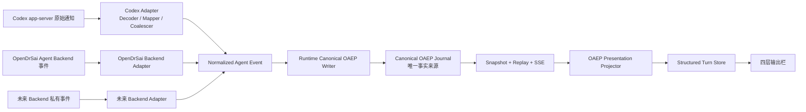

# OpenDrSai Codex Adapter OAEP V6：实时语义一致性与统一流式渲染开发方案

状态：实施完成，80/80 功能点通过验收
制定日期：2026-08-04  
完成日期：2026-08-04
上游方案：

- `OpenDrSaiCodexAdapter_OAEP重构开发方案V2.md`
- `OpenDrSaiCodexAdapter_OAEP重构开发方案V2_第二阶段.md`
- `OpenDrSaiCodexAdapter_OAEP_V3用户产品化开发方案.md`
- `OpenDrSaiCodexAdapter_OAEP_V4会话语义一致性与结构化渲染开发方案.md`
- `OpenDrSai_Codex用户体验_V5开发方案.md`
- `cores/protocol/oaep/README.md`

> 版本说明：这里的 V6 是 OpenDrSai Codex Adapter 开发方案版本，不是 OAEP
> 协议 6.0。OAEP 继续使用 Stable 1.0 及已经确定的向后兼容扩展。本方案首先落实
> 现有协议已经规定、但实时执行链路尚未满足的身份、顺序、终态和渲染不变量。

## 1. 版本定位

### 1.1 既有版本解决的问题

| 版本 | 核心目标 | 与 V6 的关系 |
|---|---|---|
| V2 | Codex App Server 私有协议经 Adapter 转换为 OAEP | 奠定 Adapter、Mapper、Runtime 边界 |
| V2 第二阶段 | 类型、安全、恢复、压力和发布门禁 | 提供生产化基础 |
| V3 | Codex Backend 用户产品化 | 提供状态、操作和故障恢复入口 |
| V4 | 历史会话顺序、Message Parts 和静态结构化渲染 | 静态历史基本可读，但实时链路尚未完全复用 |
| V5 | 普通用户的同步、归档、导航、多轮、诊断和易用性 | 用户操作框架已具备，需要修复实时语义事实 |
| V6 | 实时输入、OAEP 写入、流式传输、结构化投影与恢复统一 | 本方案 |

### 1.2 V6 要解决的核心矛盾

当前系统已经能够正确同步和静态显示大部分 Codex 历史，但用户发送新消息后，实时
执行仍经过另一条兼容路径。该路径会产生以下问题：

1. 已由 Codex Session 保存的历史被 Desktop 再次拼成普通文本发送；
2. Codex `userMessage` 在 Runtime 中被改成 assistant Message；
3. Message delta 与 completed 使用不同 Item ID；
4. 短 delta 在 Item completed 之后才 flush；
5. 结构化 Message Parts 被转换为 Python 字典字符串；
6. OAEP 与旧 Conversation Journal 双写，产生无意义的 Run resumed；
7. Desktop 实时 Chat 使用轮询和兼容 `chunk/reasoning/tool_timeline`，历史则使用
   OAEP Snapshot/Stream Projector；
8. 实时、历史、重连、重启恢复不能保证得到相同的 Structured Turn。

V6 的目标不是增加一个 Codex 专用 UI，而是让所有 Runtime Agent Backend 使用同一条：

```text
Backend 私有输出
  -> Backend Adapter
  -> Normalized Agent Event
  -> Canonical OAEP Writer / Journal
  -> Snapshot + Replay + SSE
  -> OAEP Presentation Projector
  -> Structured Turn Store
  -> 四层统一输出栏
```

## 2. 已确认的真实故障证据

本方案不是根据截图猜测，而是以 2026-08-04 本机真实 Run 为基线：

```text
Runtime Run:
run-330f478d-217c-402d-b36c-3eff22aef843

Runtime Session:
session-d6fac7ed-ecb3-4acb-8724-25b3bd05891a

Codex Turn:
019fc86d-170d-7692-926e-c7a6a0b31421
```

Runtime 实际保存的本轮输入为：

```text
user: user: hello

assistant: Hello.

user: hello
```

这证明 Desktop 把已有上下文和本轮输入再次编码成普通字符串。该 Run 的 OAEP 事件
还出现了以下顺序：

| Session sequence | 事件 | 实际结果 |
|---:|---|---|
| 29 | Runtime User Message | 内容是被拼接的完整 transcript |
| 35/37 | Codex userMessage started/completed | 被错误投影为 assistant，内容被字符串化为字典列表 |
| 41 | Codex Assistant Message completed | 最终文本 `Hello.` |
| 43 | Message delta | 文本 `Hello.`，但 Item ID 与 sequence 41 不同 |
| 45 | 另一个 Assistant Message completed | 再次产生 `Hello.` |
| 46 | Run completed | Run 结束 |

因此 UI 最终显示为：

```text
[{'text': ...}]Hello.Hello.
```

同一个 Run 中还存在 8 个没有真实等待/恢复语义的 `event.run.resumed`，说明当前
兼容 Journal 包装事件被错误投影成公开 OAEP Run 状态。

## 3. 根因分析

### 3.1 Desktop 输入污染

当前 `runRuntimeBackendChat` 对 Codex 使用：

```ts
request.messages
  .map((message) => `${message.role}: ${message.content}`)
  .join("\n\n")
```

但 Runtime Session 已绑定 Codex Thread，Codex 自己维护多轮上下文。Desktop 再次发送
完整 transcript 会造成：

- 角色标签进入真实用户输入；
- 已有回答被重复当作新提示；
- 多轮会话随轮次增长而重复膨胀；
- 导入历史中的兼容文本、结构化序列化文本被重新喂给模型；
- Runtime `input_message` 不再表示本轮真实用户输入。

### 3.2 Runtime 覆盖 Adapter 已正确识别的角色

Codex Native Decoder 已能把 `userMessage` 映射为 `role=user`，但
`RuntimeEngine._record_runtime_event_item_in_transaction` 对 Message 使用硬编码 assistant
角色，并对 Message delta 使用 `assistant:{run_id}` 固定 ID。于是：

- User Message 变成 Assistant Message；
- Runtime 已创建的 User Item 和 Codex 回显 User Item 无法合并；
- Codex completed Item 与 delta Item 无法关联。

### 3.3 Message Parts 被错误字符串化

Codex App Server 的 Message `content` 可以是结构化数组。OAEP 要求 `parts` 保存结构化
内容，`text` 只保存纯文本兼容投影。当前 OAEP 投影优先读取 `payload.content`，再对非
字符串调用 `str(value)`，因此 Python 对象显示进入最终回答。

### 3.4 Delta Coalescer 只有大小阈值，没有最大延迟

当前 Codex Mapper 默认等累计到 4096 bytes 才写入 Message delta。短回答永远无法达到
阈值，只会在 `turn/completed` 时被 flush。与此同时 `item/completed` 已经提前写入，造成：

```text
event.item.completed
event.item.delta
event.run.completed
```

这违反 OAEP 标准 Run 事件序列。

### 3.5 Runtime 双重事实写入

当前 `append_normalized_event` 仍先转换成兼容 Runtime Event，然后同时：

1. 向 `runtime_events` 写一条 Backend Event；
2. 向 Session Journal 写一条包装事件；
3. 再更新 Conversation Item 并写一条 Item Event；
4. 从 Session Journal 二次投影 OAEP。

因此一个 Backend 事实会产生多条公开变化，包装事件缺少 Item 身份时又被错误映射为
`event.run.resumed`。这与“OAEP 是唯一事实来源”的目标不一致。

### 3.6 实时与静态投影双轨

静态历史已经使用 `projectOaepThreadSnapshot`，实时 Chat 却每 100ms 调用
`listOaepEvents()`，并把事件降级为旧 `ChatEvent`：

```text
chunk
reasoning
tool_timeline
input_request
done
```

后果包括：

- 只处理部分 OAEP Delta；
- started/completed 不能稳定更新同一个 UI 对象；
- 实时内容与刷新后的静态内容可能不同；
- 重启恢复再次使用另一套兼容投影；
- 已经存在的 OAEP SSE 与重连能力没有被实时 Chat 复用。

### 3.7 当前自动测试存在假阳性

现有部分 Desktop 验证只检查源码是否包含 `message.text.append`、reasoning、command、
file change 等字符串，没有执行真实事件归并，因此不能发现：

- `item.completed` 在 delta 前；
- delta 与 completed Item ID 不同；
- role 被 Runtime 改写；
- Message Parts 被字符串化；
- 同一文本被终态 fallback 和迟到 delta 各追加一次；
- 同一工具 started/completed 在 UI 中变成两行。

## 4. 目标架构



### 4.1 边界职责

| 层 | 只负责 | 禁止负责 |
|---|---|---|
| Backend Adapter | 私有协议解码、语义归一、Backend identity | Runtime ID、OAEP sequence、UI 布局 |
| Canonical OAEP Writer | Runtime identity、状态机、事务、顺序、幂等和持久化 | 猜测 Backend 私有协议 |
| OAEP Stream Controller | Snapshot、Replay、SSE、cursor 和重连 | 改写业务语义 |
| Presentation Projector | OAEP Item/Event 到 Structured Turn 的确定性投影 | 执行工具或读取 Backend 私有字段 |
| Renderer | 四层布局、交互、增量显示和可访问性 | 理解 Codex、Hermes 等私有事件 |

### 4.2 唯一事实规则

1. OAEP Journal 是 Session、Run、Item 和 Event 的唯一公开事实来源。
2. Runtime Event、Conversation Snapshot、OpenAI-compatible SSE、Desktop ChatEvent 均只能是
   OAEP 派生视图。
3. 不允许 OAEP 和 legacy 各自独立双写状态机。
4. Backend 原始事件可进入脱敏诊断存储，但不能直接进入 UI。
5. Structured Turn 是 UI View Model，不是第二套 Agent 事件协议。

## 5. V6 强制不变量

### 5.1 输入与上下文

- 一个 Run 只接受一个明确的本轮用户输入。
- Session/Backend Thread 负责历史上下文。
- Desktop 不把历史消息重新拼入当前用户输入。
- Runtime User Item 与 `source_message_id` 一一对应。
- 同一 `source_message_id` 重试不会生成第二个 User Item 或第二个 Run。

### 5.2 Item 身份

- 一个 Backend Item 在一个 Run 内只绑定一个 Runtime OAEP Item ID。
- started、delta、updated、completed/failed/cancelled 必须使用同一个 Item ID。
- Backend Item ID 只出现在 `source.backend_item_id` 或绑定表，不直接充当跨 Runtime 公共身份。

### 5.3 事件顺序

```text
event.run.created
event.item.created/completed   User Message
event.run.started
event.item.started
event.item.delta/updated       zero or more
event.item.completed/failed/cancelled
event.run.completed/failed/cancelled
```

- terminal 后禁止继续产生 delta 或 updated。
- 每个 Run 恰好一个 Run terminal Event。
- `event.run.resumed` 只表示真实 waiting -> running，不得作为未知包装事件 fallback。

### 5.4 内容正确性

- Message `text` 必须是字符串，不能是对象或数组的字符串表示。
- Message `parts` 保存结构化 text/image/audio/file/resource_ref。
- `role` 和 `phase` 必须保留 Adapter 识别结果。
- reasoning 只承载允许向用户展示的摘要，不暴露模型隐藏思维链。
- terminal Item 是最终权威状态；Reducer 用 terminal 内容校正当前投影，不重复追加。

### 5.5 实时、静态与恢复一致性

对同一个 Session：

```text
normalize(live event reduction)
== normalize(snapshot projection)
== normalize(replay projection)
== normalize(restart recovery projection)
```

## 6. 模块与功能点

V6 共 9 个模块、80 个功能点。

### M01 本轮输入与 Session 连续性（7 项）

| ID | 功能点 | 验证方法 |
|---|---|---|
| M01-F01 | Runtime Execute API 明确区分 `current_user_input` 与历史消息 | API contract 正反例 |
| M01-F02 | Desktop 对 Runtime Agent 只发送最新用户输入 | 真实三轮 Run 检查 `input_message` |
| M01-F03 | `source_message_id` 成为 User Item 幂等身份 | 同请求重试 10 次仍只有一个 User Item |
| M01-F04 | Runtime 在执行 Backend 前创建权威 User Message Item | OAEP 顺序测试 |
| M01-F05 | 实时 Codex `userMessage` 只补充 Backend binding，不重复公开 Item | User 回显 fixture |
| M01-F06 | 导入历史中的 Codex `userMessage` 正常投影为 role=user | 历史同步 fixture |
| M01-F07 | 附件、开发指令、模型参数使用独立结构字段，不拼进角色 transcript | 请求体与隐私测试 |

### M02 Codex Native Decoder、Mapper 与流式合并（10 项）

| ID | 功能点 | 验证方法 |
|---|---|---|
| M02-F01 | 覆盖当前 Codex Thread/Turn/Item/Server Request 类型矩阵 | 版本匹配 golden fixture |
| M02-F02 | 保留 Message role 与 commentary/final phase | role/phase 参数化测试 |
| M02-F03 | Message content 数组规范化为 `parts + text`，禁止对象字符串化 | JSON/Python legacy/嵌套 parts 测试 |
| M02-F04 | Thread/Turn/Item 私有身份稳定输出到 BackendBinding | 重放绑定一致性测试 |
| M02-F05 | 同一 Item 的 started/delta/updated/terminal 使用相同绑定 | 生命周期 fixture |
| M02-F06 | Delta Coalescer 同时支持最大等待时间和最大批大小 | 虚拟时钟 1 字符及 64KiB 测试 |
| M02-F07 | `item/completed` 前 flush 对应 Item，Run terminal 前 flush 全部 Item | 顺序断言 |
| M02-F08 | `turn/started` 只有一个事件生产者 | 单 Run started 计数 |
| M02-F09 | Approval、error、unknown notification 安全映射为 Interaction/Notice | Server Request/未知类型测试 |
| M02-F10 | 字段上限、秘密脱敏、绝对路径和大输出保护 | 安全与压力测试 |

### M03 Runtime Canonical OAEP Writer（10 项）

| ID | 功能点 | 验证方法 |
|---|---|---|
| M03-F01 | `append_normalized_event` 直接写 Canonical OAEP，不经 legacy 语义推断 | 架构边界测试 |
| M03-F02 | Event、Item、Run 状态和 Snapshot 在一个 SQLite 事务中提交 | 故障注入回滚测试 |
| M03-F03 | 新增 Backend Session/Run/Item 到 Runtime ID 的持久绑定 | 重启后绑定恢复测试 |
| M03-F04 | Runtime 分配 Session Event sequence 和 Run 内 Item sequence | 多 Run 交错顺序测试 |
| M03-F05 | Delta 与 terminal 通过 Backend Item binding 落到同一 Runtime Item | 身份一致性测试 |
| M03-F06 | 删除 normalized event 的包装 Journal 双写及虚假 Run resumed | 每个输入事件的公开事件计数测试 |
| M03-F07 | legacy Runtime Events 由 OAEP 投影生成，只保留兼容读取 | legacy client 回归测试 |
| M03-F08 | OAEP Snapshot 直接读取 Canonical Item/Run 状态 | Event 0 重建 digest 测试 |
| M03-F09 | Backend dedupe key、客户端 idempotency key 和 source message identity 协同 | 重放/重试/崩溃矩阵 |
| M03-F10 | OpenDrSai 自身 Backend 改用相同 Normalized Event SPI | Codex/OpenDrSai 同 fixture 语义树对比 |

### M04 OAEP 状态机与一致性校验（8 项）

| ID | 功能点 | 验证方法 |
|---|---|---|
| M04-F01 | 强制 Item created/started/delta/update/terminal 生命周期 | 状态转换正反矩阵 |
| M04-F02 | 强制 Delta kind 与 Item type 匹配 | 七类 Delta 参数化测试 |
| M04-F03 | terminal 后拒绝或隔离迟到 delta/update | `oaep_delta_after_terminal` 测试 |
| M04-F04 | terminal Item 为权威完整状态，Reducer 不重复追加 | delta + terminal parity 测试 |
| M04-F05 | Message role、phase 和 content 类型严格验证 | Schema + semantic validator |
| M04-F06 | 禁止 list/dict/object 被隐式转换为 Message text | property-based 测试 |
| M04-F07 | Schema 增加 Item Event 必须含 run_id/item_id 等条件约束 | Draft 2020-12 正反例 |
| M04-F08 | 协议违规进入结构化诊断和覆盖率统计，不污染用户回答 | 诊断快照测试 |

### M05 共享 OAEP 实时流控制器（9 项）

| ID | 功能点 | 验证方法 |
|---|---|---|
| M05-F01 | 一个 Runtime Session 使用一个共享 Stream Controller | 并发订阅计数测试 |
| M05-F02 | 抽取并复用 Snapshot -> Replay -> SSE 状态机 | 单元状态机测试 |
| M05-F03 | 创建 Run 前记录 Session cursor | Run 创建竞态测试 |
| M05-F04 | 订阅与 execute 并行启动，Replay 兜住订阅前事件 | 首事件竞态测试 |
| M05-F05 | cursor 保持 Session 作用域，Chat 投影按 run_id 过滤 | 多 Run 交错测试 |
| M05-F06 | SSE 断开后从最后 sequence 自动续接 | 网络故障测试 |
| M05-F07 | cursor expired 时加载 Snapshot 后继续新事件 | 410/压缩恢复测试 |
| M05-F08 | Run 终态只由 OAEP Run terminal 驱动，不额外合成 done | 单终态测试 |
| M05-F09 | 删除实时 Chat 100ms OAEP 轮询和完成后补拉分支 | 架构扫描 + 延迟测试 |

### M06 OAEP Presentation Projector（10 项）

| ID | 功能点 | 验证方法 |
|---|---|---|
| M06-F01 | 建立唯一 `OaepEvent/Snapshot -> StructuredTurnState` Projector | 依赖边界测试 |
| M06-F02 | Run 状态投影到单行运行状态层 | 状态 golden |
| M06-F03 | commentary Message 投影到处理说明，final Message 投影到最终回答 | phase fixture |
| M06-F04 | reasoning/plan 投影到推理摘要和计划进度 | reasoning/plan fixture |
| M06-F05 | command/tool 投影为稳定可更新的 Activity | started/output/completed fixture |
| M06-F06 | file_change 投影为文件活动，保留安全 diff 摘要与资源引用 | 文件 fixture |
| M06-F07 | subtask/interaction/artifact/notice 使用专用 Part 或 Activity | 十类 Item golden |
| M06-F08 | 七类 Delta 全部支持，不认识的 Delta 安全诊断 | Delta 覆盖矩阵 |
| M06-F09 | Part/Activity ID 使用 OAEP item_id；terminal 替换权威字段而非追加 | 重复防护测试 |
| M06-F10 | 实时、Snapshot、Replay、重启恢复使用同一 Reducer 并保持 digest 相等 | 四路径 parity suite |

### M07 四层结构化输出栏与增量体验（9 项）

| ID | 功能点 | 验证方法 |
|---|---|---|
| M07-F01 | Runtime Agent 实时路径只发送 Structured Event，不混发 legacy chunk | IPC contract 测试 |
| M07-F02 | 保持运行状态、处理过程、用户交互、最终结果四层结构 | 组件结构测试 |
| M07-F03 | 状态层在常见窗口宽度和缩放下保持单行 | 100/125/150% 截图验收 |
| M07-F04 | 运行中出现过程活动时展开，完成后按设计收起 | 状态交互测试 |
| M07-F05 | 文本、reasoning 和 output delta 以约 16ms 批次刷新 | fake timer + render count |
| M07-F06 | Tool/File started 与 terminal 原位更新，重型输出按需展开 | 稳定 ID 视觉测试 |
| M07-F07 | 最终回答独立流式显示，不等待整个 Run 结束 | 首字与终态测试 |
| M07-F08 | OAEP Snapshot 更新与活动 Turn 合并，不覆盖正在生成的内容 | 订阅竞态测试 |
| M07-F09 | 键盘、屏幕阅读器、滚动锚点和长会话性能满足可用性要求 | Accessibility + 性能测试 |

### M08 历史纠正、迁移与可观测性（7 项）

| ID | 功能点 | 验证方法 |
|---|---|---|
| M08-F01 | 新投影写入 adapter/mapping version | Snapshot 字段测试 |
| M08-F02 | 识别受错误 role、对象字符串化和重复 Item 影响的 Codex 派生记录 | 迁移扫描 dry-run |
| M08-F03 | 从 Codex 原始历史重新投影受影响 Run | 脱敏真实历史 fixture |
| M08-F04 | 使用更高 Item revision 和 event.item.updated 纠正 Snapshot | append-only 审计测试 |
| M08-F05 | 客户端从纠正后的 Snapshot cursor 接续，不重新闪现旧错误投影 | 老库升级 UI 测试 |
| M08-F06 | 迁移可中断、可重跑、可回滚且不改变 Session/Thread 绑定 | 故障注入与幂等测试 |
| M08-F07 | 记录 Adapter 延迟、事件覆盖、协议违规、重连和投影 parity 指标，默认脱敏 | 诊断报告测试 |

### M09 自动测试、真实验收与发布门禁（10 项）

| ID | 功能点 | 验证方法 |
|---|---|---|
| M09-F01 | 保存当前 Codex 版本真实、脱敏的原始通知 golden fixtures | fixture schema 校验 |
| M09-F02 | Decoder 覆盖 role、phase、parts、reasoning、tool、file、unknown | Python 参数化单测 |
| M09-F03 | Mapper 覆盖短 delta 延迟、flush 顺序、同 Item ID 和单 Run started | 虚拟时钟测试 |
| M09-F04 | Runtime 覆盖事务、sequence、binding、dedupe 和单一 OAEP 写入 | SQLite 故障注入测试 |
| M09-F05 | OAEP Conformance 覆盖所有非法状态、迟到事件和对象字符串化 | 正反合同套件 |
| M09-F06 | Projector 覆盖十类 Item、七类 Delta 和四路径 digest parity | TypeScript bundled tests |
| M09-F07 | Renderer 覆盖四层布局、实时更新、折叠、错误和无重复文本 | 自动视觉截图验收 |
| M09-F08 | Windows 宿主真实 Codex 完成同 Thread 至少三轮连续对话 | Host Codex E2E |
| M09-F09 | 真实任务覆盖 reasoning、命令、文件读取/修改、审批、取消、断线和重启恢复 | 场景化 E2E |
| M09-F10 | 建立延迟、10k 事件、长会话和 release-ready fail-closed 门禁 | 性能与发布账本 |

## 7. OAEP 到四层输出栏的最终映射

### 7.1 第一层：运行状态

来源：Run Event、Run Snapshot 和连接状态。

示例：

```text
生成中 · 18 秒                         处理过程 ▼
已完成 · 28 秒                         处理过程 ▼
等待审批                              处理过程 ▼
失败 · 可重试                          查看详情
```

运行状态尽量保持一行。技术性的 cursor、sequence、transport 和 trace 只进入展开详情或
诊断面板。

### 7.2 第二层：处理过程

折叠内容按以下稳定顺序组织：

```text
处理说明
推理摘要
计划与进度
工具调用
文件读取和修改
子任务
运行提示
```

映射：

| OAEP Item | UI 位置 |
|---|---|
| Message phase=commentary | 处理说明 |
| Reasoning | 推理摘要 |
| Plan | 计划与进度 |
| CommandExecution | 工具调用 |
| ToolCall | 工具调用 |
| FileChange | 文件读取和修改 |
| Subtask | 子任务 |
| Notice | 运行提示 |

“推理摘要”只展示 Backend 明确允许公开的摘要，不展示原始 chain-of-thought。

### 7.3 第三层：用户交互

来源：Interaction Item 与 Run waiting/resumed。

包括：

- 审批；
- 确认；
- 选项；
- 文本输入；
- 超时与已响应状态。

Interaction 不能被降级成普通文本，也不能隐藏在调试日志中。

### 7.4 第四层：最终结果

来源：

- Message phase=final；
- Artifact；
- Citation；
- 与最终结果直接关联的安全 FileChange 摘要。

最终回答必须独立于处理过程流式显示。处理过程折叠或展开不能改变最终回答内容、顺序
或复制行为。

## 8. 流式时序设计

### 8.1 正常 Message

```text
Codex item/started(agentMessage)
  -> OAEP event.item.started(message, running)

Codex item/agentMessage/delta
  -> Coalescer <= 40ms 或 <= 4KiB
  -> OAEP event.item.delta(message.text.append)
  -> Structured part.delta(markdown.append)
  -> Renderer 约 16ms 合批

Codex item/completed(agentMessage)
  -> flush pending delta
  -> OAEP event.item.completed(authoritative full Item)
  -> Structured part.completed(replace authoritative fields)

Codex turn/completed
  -> flush all items
  -> OAEP event.run.completed
  -> Structured turn.completed
```

### 8.2 终态与 delta 一致性

Reducer 维护每个 Item：

```text
item_id
item_type
status
accumulated_content
last_event_sequence
terminal_sequence
```

规则：

1. delta 只追加到同一个 item_id；
2. completed 到达时使用完整 Item 校正 `accumulated_content`；
3. 如果两者不一致，以 completed 为权威并记录 parity warning；
4. completed 后的 delta 不显示，只记录协议违规；
5. 重放相同 dedupe_key 不改变状态；
6. Renderer 不再用“未见 delta 就把 terminal text 当新 chunk 追加”的启发式逻辑。

### 8.3 Tool/Command/File

```text
event.item.started     -> 创建一条 running Activity
event.item.delta       -> 原位追加 output/result/summary
event.item.updated     -> 原位更新计划、审批或结构字段
event.item.completed   -> 原位切换为 completed
event.item.failed      -> 原位切换为 error，并保留安全错误摘要
```

所有生命周期事件使用 `item_id` 作为 UI 稳定身份，不能使用每次变化都不同的 `event_id`。

## 9. Transport 与恢复设计

### 9.1 Run 启动

推荐顺序：

1. 确认/创建 Runtime Session；
2. 读取当前 Session OAEP cursor；
3. 幂等创建 Runtime Run；
4. 为当前 Run 注册 Presentation Listener；
5. 打开或复用 Session OAEP SSE；
6. 发起 Execute；
7. Replay 补齐 cursor 之后、SSE 连接之前产生的事件；
8. 持续消费直到 Run terminal。

### 9.2 断线

```text
SSE disconnected
  -> 保留 last_session_sequence
  -> GET oaep-events?after_sequence=last
  -> 严格连续 replay
  -> reconnect SSE
```

### 9.3 Cursor 过期

```text
cursor_expired
  -> GET oaep-snapshot
  -> 原子替换本地 OAEP projection state
  -> 使用 snapshot_sequence 继续 SSE
```

### 9.4 Desktop 重启

Desktop 不从旧 `ChatRunJournal` 猜测结构化结果。它应：

1. 从 Thread 找到 Runtime Session/Run；
2. 读取 OAEP Snapshot 或该 Run 的 Replay；
3. 使用同一 Presentation Projector 重建 Structured Turn；
4. 如果 Run 仍在运行，继续共享 SSE；
5. 如果 Run 已终止，直接恢复权威终态。

## 10. 数据迁移策略

### 10.1 受影响数据特征

迁移 dry-run 至少识别：

- source.backend=codex 且 native type=userMessage，但 OAEP role=assistant；
- Message text 形如 Python/JSON 对象数组字符串；
- 同一 Backend Item 被映射为多个 Runtime Item；
- `assistant:{run_id}` delta Item 与 Codex completed Item 并存；
- 同一 Run 最终文本重复；
- 无 waiting/resumed 原因的密集 `event.run.resumed`。

### 10.2 纠正原则

1. 不修改或删除 append-only 审计事件；
2. 优先从 Codex `thread/read(includeTurns=true)` 重新生成正确语义；
3. 以更高 Item revision 写入纠正；
4. 更新 mapping version；
5. Snapshot 只暴露当前有效 projection；
6. 普通客户端从纠正后的 Snapshot cursor 继续，旧错误事件只保留审计用途；
7. 无法可靠恢复的内容降级为 Notice，不猜测角色或正文。

## 11. 测试与验收方案

### 11.1 Adapter 单元测试

必须覆盖真实 Codex 通知组合，而不是只覆盖单个方法：

```text
turn/started
item/started(userMessage)
item/completed(userMessage)
item/started(reasoning)
reasoning delta(s)
item/completed(reasoning)
item/started(commandExecution)
command output delta(s)
item/completed(commandExecution)
item/started(agentMessage)
agentMessage delta(s)
item/completed(agentMessage)
turn/completed
```

断言：

- role/phase 正确；
- 一个 Backend Item 对应一个 OAEP Item；
- delta 在 terminal 前；
- terminal 后无 delta；
- 无字典字符串；
- 无秘密、绝对路径和无限字段。

### 11.2 Runtime 事务与状态测试

在以下位置注入故障：

- Event 写入前；
- Event 写入后、Item 更新前；
- Item 更新后、Snapshot 更新前；
- sequence 分配后、事务提交前；
- Backend binding 写入后；
- Run terminal 写入时。

每次失败后验证 Event、Item、Run、binding 和 cursor 要么全部可见，要么全部不可见。

### 11.3 OAEP Conformance 反例

必须拒绝或隔离：

- Message completed 后的 delta；
- command Item 携带 `message.text.append`；
- Item Event 缺 run_id/item_id；
- 同一 Item ID 在两个 Run 中复用；
- role 非 user/assistant/system；
- Message text 为数组或对象；
- Run completed 两次；
- Session sequence 重复、倒退或跨 gap；
- 未等待却发 Run resumed。

### 11.4 Desktop Projector 测试

每个 OAEP golden fixture 同时走：

1. Event 实时逐条 reduce；
2. Event 全量 replay；
3. Snapshot 直接投影；
4. 中途崩溃后恢复。

四个结果必须得到相同：

- Part 顺序；
- Activity 顺序；
- 文本；
- reasoning summary；
- Tool/File 状态；
- Turn 状态；
- stable ID；
- normalized digest。

### 11.5 用户场景自动验收

#### 场景 A：最小消息

输入：`hello`

预期：

- 一个 User Bubble：`hello`；
- 一个 Final Answer：`Hello.`；
- 不包含 `user:`、`assistant:`；
- 不包含 `[{'text':` 或 `[{"text":`；
- 不出现 `Hello.Hello.`；
- OAEP 恰好一个 User Item、一个 Assistant Final Item。

#### 场景 B：多轮连续对话

连续发送三轮，预期：

- Runtime Session ID 不变；
- Codex Thread ID 不变；
- 每轮一个 Runtime Run；
- 每次 `input_message` 只等于本轮用户输入；
- 前轮回答不作为字符串重新进入新 Turn；
- 三轮刷新和重启后顺序不变。

#### 场景 C：文件读取与命令

要求 Codex 读取一个文件并执行只读命令，预期：

- 处理说明及时出现；
- reasoning summary 在推理摘要中；
- 命令 started 立即显示 running；
- output delta 原位追加；
- 文件活动显示相对路径；
- 最终回答独立流式输出；
- 完成后工具活动原位变为 completed。

#### 场景 D：修改、审批和取消

覆盖：

- FileChange；
- Approval waiting/resumed；
- 用户同意/拒绝；
- Run cancel；
- Item cancelled；
- 最终状态与 Codex 一致。

#### 场景 E：断线和重启

在 reasoning、command output 和 final answer 三个阶段分别断线/重启，预期：

- 已显示内容保留；
- cursor 连续；
- 无重复工具、文件和文本；
- Run 不被重新执行；
- 恢复后的结果与不中断运行 digest 相同。

### 11.6 性能门槛

| 指标 | 门槛 |
|---|---:|
| Adapter 收到 Backend 可见事件到 OAEP 提交 P95 | <= 50ms，排除 SQLite 受控压力场景 |
| OAEP Event 到 Desktop Store P95 | <= 100ms |
| Backend 首个过程事件到 UI 可见 P95 | <= 250ms |
| Renderer delta 合批窗口 | 约 16ms |
| 10,000 Session Events | 无丢失、无重复、顺序连续 |
| SSE 断线恢复 | 不重新执行 Run，不重复 Item |
| 长会话侧栏交互 | 不因活动 Run 事件数量产生明显卡顿 |

## 12. 实施阶段

### P0：阻断当前错误输出

范围：M01、M02、M03 的关键正确性项，M09 最小回归。

1. Codex 只接收最新用户输入；
2. Runtime User Item 与 Codex User 回显去重；
3. role/phase 保真；
4. Message Parts 不再字符串化；
5. delta/completed 使用同一 Item ID；
6. completed 前 flush；
7. terminal Reducer 防止重复追加；
8. 用真实故障 Run fixture 建立回归测试。

完成门槛：`hello` 场景完全通过，截图中的错误不再出现。

### P1：Canonical OAEP Writer

范围：M03、M04、M08 基础。

1. normalized event 原生事务写 OAEP；
2. Backend binding 持久化；
3. Item/Run 状态机；
4. 删除包装 Journal 双写；
5. legacy 从 OAEP 派生；
6. 消除虚假 Run resumed；
7. OpenDrSai Backend 接入相同 SPI。

完成门槛：OAEP Event 0 可确定性重建 Snapshot，所有故障注入原子回滚。

### P2：实时流与 Presentation 统一

范围：M05、M06。

1. 提取共享 Session Stream Controller；
2. Chat 改用 SSE；
3. 删除 100ms 轮询；
4. 建立唯一 OAEP Presentation Projector；
5. 十类 Item 和七类 Delta 全覆盖；
6. 实时、历史、Replay、恢复 parity。

完成门槛：四条投影路径 digest 完全一致。

### P3：四层 UI 与大型会话体验

范围：M07。

1. Runtime Agent 只发送 Structured Event；
2. 四层输出栏完整映射；
3. 稳定 ID 原位更新；
4. 处理过程和最终回答独立流式；
5. 大输出延迟展开；
6. 可访问性、缩放和滚动稳定。

完成门槛：真实命令、文件、reasoning、subtask、interaction 自动视觉验收通过。

### P4：迁移、真实 E2E 与发布门禁

范围：M08、M09。

1. 受影响历史 dry-run；
2. Codex 历史幂等重新投影；
3. Windows 宿主 Codex 三轮连续对话；
4. 断线、重启、取消和审批；
5. 10k Event 和长会话性能；
6. 机器可读验收账本；
7. 缺少任何关键证据时 release-ready fail closed。

完成门槛：80/80 功能点具备实现、自动测试和真实验收证据。

## 13. 主要代码范围

### Backend / Runtime

- `cores/python/packages/drsai/src/drsai/backend/codex_adapter/native_decoder.py`
- `cores/python/packages/drsai/src/drsai/backend/codex_adapter/event_mapper.py`
- `cores/python/packages/drsai/src/drsai/backend/codex_adapter/backend_client.py`
- `cores/python/packages/drsai/src/drsai/backend/runtime/normalized_events.py`
- `cores/python/packages/drsai/src/drsai/backend/runtime/normalized_writer.py`
- `cores/python/packages/drsai/src/drsai/backend/runtime/engine.py`
- `cores/python/packages/drsai/src/drsai/backend/runtime/journal.py`
- `cores/python/packages/drsai/src/drsai/backend/runtime/oaep.py`
- `cores/python/packages/drsai/src/drsai/backend/runtime/agent.py`

### OAEP Contract

- `cores/protocol/oaep/README.md`
- `cores/protocol/oaep/oaep.schema.json`
- `cores/protocol/oaep/examples.json`
- 三端生成类型与 drift gate

### Windows Desktop

- `apps/desktop/shared/main/chat.ts`
- `apps/desktop/shared/main/runtimeClient.ts`
- `apps/desktop/shared/main/threadRuntimeSubscription.ts`
- `apps/desktop/shared/main/threadRuntimeProjection.ts`
- 新增共享 OAEP Stream Controller
- 新增 OAEP Presentation Projector
- `apps/desktop/shared/api/structuredConversation.ts`
- `apps/desktop/shared/renderer/src/adapters/useDesktopChatAdapter.ts`
- `apps/desktop/shared/renderer/src/components/StructuredMessageParts.tsx`

### Tests

- Codex Native Decoder/Mapper/Backend Client Python tests
- Runtime Journal/OAEP/Conformance Python tests
- Desktop bundled projector/reducer tests
- Structured Renderer tests
- Windows Host Codex E2E
- 自动视觉、性能、恢复和 release-ready gates

## 14. 风险与控制

| 风险 | 控制措施 |
|---|---|
| Codex App Server 版本变化 | 版本匹配 schema、真实 golden fixture、unknown Notice 和 coverage gate |
| Delta 数量过多导致 SQLite/IPC 压力 | 有最大延迟的有界 Coalescer、Renderer 16ms 合批、10k 压测 |
| Canonical Writer 改动影响旧客户端 | legacy 只读投影回归、分阶段切换、双读但禁止双事实写 |
| 历史纠正破坏用户数据 | append-only 保留、dry-run、Item revision、幂等与可回滚 |
| SSE 和 Snapshot 竞态 | Session cursor、Replay、严格 sequence、Snapshot 原子替换 |
| Raw reasoning 泄露 | Adapter 只接受公开 summary/commentary，安全测试禁止 raw chain-of-thought |
| UI 再次产生私有 Backend 分支 | 架构测试禁止 Renderer 引用 codex native type/method |

## 15. 完成定义

V6 只有同时满足以下条件才算完成：

1. 本轮输入不再包含历史 transcript 或角色前缀；
2. 同一 Codex Thread 至少三轮连续对话不创建新 Thread；
3. Runtime User Item、Codex User 回显和 Assistant Item 身份正确且不重复；
4. 所有 Item lifecycle 顺序符合 OAEP；
5. Message Parts 永远不显示为 Python/JSON 对象字符串；
6. 短回答与长回答都能及时流式显示；
7. reasoning、plan、command、tool、file、subtask、interaction、artifact、notice 均正确显示；
8. OAEP 是唯一事实来源，不再产生兼容双写导致的虚假 Run 状态；
9. 实时、静态、Replay 和重启恢复结果 digest 一致；
10. 四层输出栏在运行、完成、等待、失败和取消状态下均正确；
11. 真实 Windows Host Codex E2E、断线恢复、10k Event、长会话和自动视觉验收通过；
12. 80/80 功能点均有代码、测试和可追溯验收证据。

## 16. 首轮实施检查单

开始写代码时第一轮必须先完成并报告：

1. 固化本次真实故障 Run 的脱敏 fixture；
2. 新增 `hello` 不重复端到端回归；
3. 新增 latest-user-input contract test；
4. 新增 User Message role/binding test；
5. 新增 Message Parts 非字符串化 test；
6. 新增 short delta -> flush -> completed 顺序测试；
7. 新增 delta/completed same item_id 测试；
8. 输出 P0 当前通过项、失败项和下一轮百分比。

## 17. 实施完成记录

### 17.1 模块完成度

| 模块 | 功能点 | 状态 | 主要完成结果 |
|---|---:|---|---|
| M01 输入边界与 User 身份 | 7 | 7/7 | Desktop 只发送最新用户输入，Runtime User Item 具有稳定幂等身份，Codex 用户回显不再重复 |
| M02 Codex Native Decoder 与 Mapper | 10 | 10/10 | role、phase、parts、十类 Item、生命周期、40ms/批大小 Coalescer、脱敏与未知事件诊断完成 |
| M03 Canonical OAEP Writer | 10 | 10/10 | Normalized Event 直接事务化写入 Canonical Item/Event，Backend Binding 持久化，legacy 仅为下游兼容投影 |
| M04 OAEP 一致性约束 | 8 | 8/8 | Item 状态机、七类 Delta、terminal 权威覆盖、对象字符串化防护和协议违规诊断完成 |
| M05 Session Stream Controller | 9 | 9/9 | Snapshot → Replay → SSE 统一，Session cursor、自动续接、过期恢复和单一 OAEP Run 终态完成 |
| M06 Presentation Projector | 10 | 10/10 | 十类 Item、七类 Delta、四路径相同 Reducer、稳定 Item ID 和安全未知事件投影完成 |
| M07 Desktop 四层流式渲染 | 9 | 9/9 | 单行状态、处理过程、用户交互、最终结果四层结构，约 16ms 合批和终态清理完成 |
| M08 迁移、版本与可观测性 | 7 | 7/7 | `oaep-codex/2.0`、历史 dry-run/重投影、幂等纠正和脱敏指标完成 |
| M09 测试与发布门禁 | 10 | 10/10 | 80 项机器账本、10k Event、长会话、视觉、真实宿主 Codex 和 fail-closed 发布门禁完成 |
| 合计 | 80 | 80/80 | 完成 |

### 17.2 最终数据链路

```text
当前用户输入
  → Codex app-server 原生通知
  → Native Decoder
  → Codex Mapper / Delta Coalescer
  → Normalized Agent Event SPI
  → Canonical OAEP Writer（同一事务）
  → OAEP Snapshot / Replay / SSE
  → 唯一 Presentation Projector
  → Desktop 四层 Structured Turn Renderer
```

实时、历史加载、SSE Replay 和 Gateway 重启恢复不再使用各自的 Backend 私有渲染分支。Codex 与
OpenDrSai 自身 Backend 均通过 Normalized Agent Event SPI 进入同一 OAEP 与 UI 链路。

### 17.3 关键收口项

1. Runtime 执行成功、失败和取消只接受 OAEP `event.run.*` 终态，禁止再补发 legacy `done/error/aborted`；
2. 终态到达后立即释放 Renderer 的 streaming、delta、sequence 和请求映射，避免长会话内存增长；
3. Session 归档、取消归档和删除与公开 OAEP Event 在同一事务完成，一个 Backend 通知只产生一个公开事件；
4. `message/reasoning/plan/command/tool/subtask` Delta 使用 OAEP Stable 1.0 正式名称，未知 Delta 只进入诊断；
5. Codex `thread/start` 与 `thread/resume` 显式使用用户审批审阅者，使 OAEP Approval Bridge 保持最终审批权；
6. Desktop 订阅在创建 Run、诊断、附件暂存、执行、Outbox 完成和异常路径均能释放；
7. 打包 Backend 源归档已重新生成，并从空临时目录成功构建、安装 `drsai-1.5.3` wheel。

### 17.4 自动验收结果

| 验收项 | 结果 |
|---|---|
| Python 全量回归 | `1021 passed, 4 skipped, 81 subtests passed` |
| Codex Mapper/Backend 定向回归 | `30 passed` |
| Desktop TypeScript | Node 与 Web typecheck 通过 |
| OAEP Projector | 10 类 Item、7 类 Delta、实时/历史 parity、未知事件安全诊断通过 |
| 结构化视觉 | 20 张截图通过；100%/125%/150% 与窄窗口状态层保持单行 |
| 长会话性能 | 60 Run/120 消息与 500 Run/1000 消息通过；右栏切换分别约 12.8ms、22ms |
| Backend 打包 | source 校验、wheel 构建及空目录安装通过 |
| V6 Full Release Gate | 8 个合同门禁和真实证据 fail-closed 校验通过 |

全量 Python 回归仅保留一个来自现有 FastAPI TestClient 的 `httpx2` 迁移警告，不影响本方案功能与验收。

### 17.5 真实宿主机 Codex 验收

最终验收使用 Windows 本机 Codex 和一次全新的 OpenDrSai Runtime 状态目录，完成：

- 同一 Codex Thread 连续 3 轮，3 个 Turn ID 唯一且上下文保持；
- 首轮和第二轮均在终态前产生 OAEP Delta；
- Session 归档与取消归档往返；
- 1 次真实 Approval Bridge 审批；
- 1 次运行中取消并收敛为 `cancelled`；
- Gateway 关闭后重新启动，继续原 Thread，恢复轮仍产生 OAEP Delta；
- 最终状态为 4 个 `completed` 和 1 个 `cancelled`。

本次证据 Thread：`019fc8d2-f88f-7840-8c21-8fab38e422ff`。机器可读摘要保存在
`docs/remote_workespace/evidence/codex-adapter-oaep-v6-release-evidence.json`；详细临时运行数据位于
`.artifacts/v6-live-exact-20260804/`，该目录不进入版本库。

### 17.6 完成结论

V6 的 9 个模块、80 个功能点和完成定义均已实现。发布门禁在缺少真实恢复、连续多轮、流式 Delta、
审批、取消或归档证据时会失败关闭；当前无 V6 遗留功能点。
