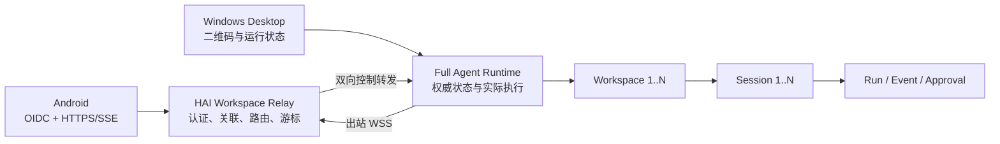

# OpenDrSai 移动远程工作区开发方案 V2

> 制定日期：2026-07-26
> 目标客户端：Android / Mobile
> 远端执行端：Windows OpenDrSai Full Agent Runtime
> 开发环境：`https://ai-dev.ihep.ac.cn/api/runtime-relay`
> 方案规模：**10 个模块、80 个功能点**
>
> 实施进度：[OpenDrSai 移动远程工作区开发进度 V2](./OpenDrSai移动远程工作区开发进度V2.md)

## 0. 当前实施快照（2026-07-26）

| 口径 | 数量 | 说明 |
| --- | ---: | --- |
| 功能点总数 | 80 | 10 个模块，每模块 8 项 |
| `local_pass` | 71 | 已有实现和自动测试证据，但不等同于三端最终验收 |
| `unverified` | 9 | M01-F07、M05-F04、M09-F08、M10-F03～F08 |
| `full_pass` | 0 | 只有完成真实 Android + ai-dev + Windows 全链路及 1 小时稳定性后才升级 |

> 设备级配对扩展加入后，以上 `local_pass=71` 仅代表扩展前基线。M02-F08、
> M04-F02/F05、M05-F03/F06/F07、M09-F04 的原有证据没有覆盖 `device_id`、
> 设备名、设备密钥绑定和单设备撤销，必须在合同、实现和测试完成后重新生成验收账本；
> 不得沿用旧 `local_pass` 宣称设备级能力已经通过。

当前已完成到真实链路的目录阶段：Windows Runtime 2.0.0 已通过出站 WSS 接入
ai-dev；真实 Android 已完成 OIDC 登录、扫码关联、主机/Workspace/Session
目录与会话内容读取；真实 Workspace 分页、Session/Conversation DTO、身份归一化、
路径脱敏和跨 Runtime/Workspace 负向门禁均已取得证据。Android 真机的“扫码前不可见”
也已通过。

当前尚未完成的是交互和最终发布阶段：发送消息、受控 Approval、Windows Tool 执行、
SSE/Conversation 一致性、Runtime/Relay/Android 故障恢复、撤销后断流与重新关联，以及
完整 1 小时稳定性。最近一次真机交互复测发现 Android 长会话使用了已过期 bearer；
目录客户端具备刷新接口，但资源请求和 SSE 尚未统一接入。统一的
`401 → OIDC refresh → 单次重试` 已写入 Android 目录、Repository、SSE 和真机测试，
相关单元测试也已补充，但本批改动仍须完成 Gradle 编译、APK 安装和真机复验，因此
不提前计入 `local_pass` 或 `full_pass`。

验收期间同一个 `runtime_id` 只允许一个 Gateway/Runtime owner。2026-07-26 真机超时的
直接原因已经确认：安装版 Gateway（`127.0.0.1:18642`）和仓库开发 Gateway
（`127.0.0.1:18643`）使用同一个 `runtime_id`，持续抢占 Relay ownership。当前已停止
开发 Gateway PID 31300/41368，只保留安装版；服务端连续 12 秒 generation 固定为
46066，Android 真机目录恢复 200 并显示 `ZZD-Matebook-B7`。最终 E2E 不得直接启动
18643 的开发 Gateway；确需使用时，必须先停止安装版，或使用隔离的 `runtime_id`、
enrollment、状态目录和端口。
ai-dev 受控故障注入当前保持关闭，只有在正常交互链路通过后才对目标 Runtime 临时启用，
并在每次成功或失败后立即恢复关闭。

## 1. 交付目标

用户在 Android 登录 HAI 账号后，扫描 Windows Desktop 生成的一次性二维码，建立当前 HAI 身份与该 Windows Runtime 的授权关联。关联成功后：

1. Android 主界面显示已关联且未移除的主机；
2. 主机下显示该 Runtime 管理的未归档、未移除 Workspace；
3. 点击 Workspace，显示其中未归档、未移除的 Session，包括原先在 Windows 创建的 Session；
4. 点击 Session，显示完整历史消息、实时增量、工具执行及待审批内容；
5. Android 可以向该 Session 发送消息、取消 Run、批准或拒绝 Approval；
6. Agent、Shell、工具、文件和模型调用始终在 Windows Full Agent Runtime 中执行；
7. Android 断网、退到后台或被系统回收，不中断 Windows 上的 Run。

V2 不实现 Android 到 Windows 的 SSH，也不复制远端文件或 Agent 到手机。Android 只通过 HAI Workspace Relay 使用 HTTPS/SSE；Windows Runtime 只主动建立出站 WSS，不开放公网入站端口。

## 2. 统一架构



权威关系：

```text
HAI Identity 1 ── N RuntimeAssociation
Host 1 ── 1 Full Agent Runtime
Runtime 1 ── N Workspace
Workspace 1 ── N Session
Session 1 ── N Run
Run 1 ── N Event / Approval
```

- Runtime 是 Workspace、Session、Run、Event、Approval 的唯一权威来源。
- Relay 负责身份验证、授权关联和消息路由，不建立第二套运行状态。
- Android Room 只保存带 subject/issuer/runtime_id 的非权威投影。
- “主机名”在产品界面中使用 Runtime `display_name`；初始值来自 Windows 计算机名，但不暴露 IP、SSH 地址或本地绝对路径。
- `runtime_id` 是稳定安装身份；`instance_id` 每次 Runtime 进程启动变化。

## 3. 已有基础与必须修正的缺口

### 3.1 可复用基础

- Android 已有 Runtime → Workspace → Session → Session 内容的页面和路由。
- Android 已有 Run 创建、Event 拉取/SSE、取消及 Approval 决策代码。
- Windows Desktop 已有二维码配对 UI、类型化 IPC 和本地 Runtime 调用。
- Full Runtime 已有 Relay 出站连接器、心跳、Workspace 发布和控制请求处理器。
- 仓库已有 Runtime Relay Schema/OpenAPI、参考 Relay 服务和自动验收夹具。
- Runtime Engine 已有 Session `archived` 字段和默认排除归档 Session 的查询。

### 3.2 V2 起始关键缺口

1. ai-dev 目前将“Runtime 注册所有者”误当作“已扫码关联用户”，同账号未扫码也能看到 Runtime。
2. Windows Runtime 尚未在 ai-dev 形成稳定在线、心跳和 Workspace 发布闭环，Android 当前看到的是离线登记记录。
3. 当前 Relay 控制层只列出 `relay_sessions` 中由移动端创建并绑定的 Session，不能满足“查看 Windows 已有全部未归档 Session”。
4. Workspace 当前只有 open/closed 语义，Relay DTO 也没有明确的 archived/removed 生命周期和删除墓碑。
5. 会话内容主要由 Runs + Events 临时重建，缺少面向多客户端、可分页和可恢复的统一 Conversation Projection 合同。
6. ai-dev 的 Relay 实现仍需完成持久化关联、Runtime WSS 路由、完整业务接口、多实例和审计；现有本地参考实现不能代替生产验收。
7. 以往的 96/96 和 54/54 验收主要证明本地协议、模拟器和夹具成立，不能视为本 V2 的真实 HAI + Windows + Android 真机验收。

上述条目记录的是 V2 启动时的缺口，不代表当前仍全部存在。当前状态以“0. 当前实施快照”
和独立进度文档为准；尤其 enrollment/association 分离、在线心跳、权威 Session、
Workspace 生命周期、Conversation Projection、HAI 多实例 Relay 与审计均已有实现和
本地/公网分层证据，剩余工作集中在真实交互、故障恢复和最终稳定性门禁。

## 4. 开发任务总表

| 模块 | 名称 | 功能点 | 主责 |
| --- | --- | ---: | --- |
| M01 | 领域模型与权威边界 | 8 | 本任务 + 三端共同确认 |
| M02 | Relay Protocol V2 与生成客户端 | 8 | 本任务 |
| M03 | Windows Full Runtime 在线与资源发布 | 8 | 本任务 |
| M04 | HAI Workspace Relay 生产服务 | 8 | HAI 平台任务 |
| M05 | 二维码配对、身份与授权 | 8 | 本任务 + HAI + Android |
| M06 | Android 主机/工作区/会话导航 | 8 | Android 任务 |
| M07 | 会话内容投影与实时同步 | 8 | 本任务 + Android |
| M08 | 消息、Run 与 Approval 远程控制 | 8 | 本任务 + Android + HAI |
| M09 | 可靠性、安全与可观测性 | 8 | 三端联合 |
| M10 | 自动化联调、真机与发布门禁 | 8 | 三端联合 |
| **合计** | **10 个模块** | **80** |  |

标记说明：

- **复用增强**：已有主要代码，但必须补齐 V2 语义及真实链路验收。
- **新建**：当前没有满足需求的实现。
- 自动验收必须产生 JUnit/pytest/JSON/日志/截图等机器可核验证据；人工观察不能替代自动断言。

## 5. 详细功能点与自动验收

### M01 领域模型与权威边界（8 项）

| ID | 类型 | 功能 | 自动测试验收 |
| --- | --- | --- | --- |
| M01-F01 | 复用增强 | 定义 Host、Runtime、Workspace、Session、Run、Event、Approval 的 1:N 层级和复合主键 | Schema 单测创建两个 Runtime 下同名 Workspace/Session，断言互不串线 |
| M01-F02 | 复用增强 | `runtime_id` 跨重启稳定，`instance_id` 每次启动变化 | 连续重启 Runtime 两次，断言 runtime_id 相同、instance_id 不同 |
| M01-F03 | 新建 | Runtime `display_name` 初始来自 Windows 主机名并允许安全重命名 | 固定主机名夹具注册后断言 UI DTO 名称正确，响应中不含 IP/绝对路径 |
| M01-F04 | 新建 | Workspace 统一为 active/archived/removed，并为 removed 保留墓碑 | 生命周期状态机单测覆盖合法/非法迁移；缓存同步后 removed 项不复活 |
| M01-F05 | 复用增强 | Session 统一为 active/archived/removed，列表默认只返回 active | 创建三种状态 Session，API 与 Android DAO 均只返回 active |
| M01-F06 | 复用增强 | Runtime 是运行事实权威；Relay 和 Android 不得自行推进 Run 状态 | 注入伪造 Relay/缓存终态，重新同步后断言以 Runtime 状态覆盖 |
| M01-F07 | 新建 | 扫码建立 `issuer + subject + device_id → Runtime` 的设备级关联，并在 scope 内访问其 active Workspace 与已有 Session | 同一账号两台 Android 分别配对后产生两个 association；撤销其中一台只使该设备返回 403/不可见 |
| M01-F08 | 复用增强 | 固化 Android=HTTPS/SSE、Runtime=出站 WSS、无 SSH/公网入站依赖 | 架构规则测试扫描 Android 依赖和二维码字段，断言无 SSH 库、host/port/private_key |

### M02 Relay Protocol V2 与生成客户端（8 项）

| ID | 类型 | 功能 | 自动测试验收 |
| --- | --- | --- | --- |
| M02-F01 | 新建 | 在 Schema/OpenAPI 中补齐 Runtime、Workspace、Session 生命周期及分页字段 | JSON Schema 正反例测试通过，缺字段或非法状态必须失败 |
| M02-F02 | 复用增强 | 正式定义 Runtime 列表和详情合同，含 status、display_name、last_seen_at、capabilities | Python/Kotlin/TypeScript 合同测试反序列化同一 fixture 且值一致 |
| M02-F03 | 复用增强 | 正式定义 active Workspace 列表合同及服务端过滤参数 | 三状态 Workspace fixture 请求默认列表，断言只返回 active |
| M02-F04 | 复用增强 | Session 列表改为查询 Runtime 的全部授权 Session，不依赖 `relay_sessions` 创建记录 | 先在 Windows 创建 Session、从未通过 Relay 创建，再由 Relay 列表断言可见 |
| M02-F05 | 新建 | 定义 Session detail 与分页 Conversation Projection 合同 | 1000 条混合消息/工具事件分页，断言顺序稳定、无丢失、无重复 |
| M02-F06 | 复用增强 | 定义 Run 创建/读取/取消及 Idempotency-Key 合同 | 同幂等键并发提交 100 次，Runtime 中只存在一个 Run |
| M02-F07 | 复用增强 | 定义 Event SSE `after_sequence`、心跳、gap/expired 和全量恢复合同 | 丢弃一段 Event 后重连，断言自动补齐或显式触发 snapshot，不静默跳过 |
| M02-F08 | 复用增强 | 定义 Approval、设备级 Association 列表/撤销、统一错误信封，并生成三端客户端 | Python/Kotlin/TypeScript 均生成 DeviceAssociation DTO；运行生成器后 `git diff --exit-code` |

### M03 Windows Full Runtime 在线与资源发布（8 项）

| ID | 类型 | 功能 | 自动测试验收 |
| --- | --- | --- | --- |
| M03-F01 | 复用增强 | 持久化 Runtime 设备身份、注册信息和安全凭据引用 | 升级及重启后自动连接，磁盘 Secret 扫描不出现明文 token/private key |
| M03-F02 | 复用增强 | Desktop 启动/登录后拉起 Full Runtime，并建立 ai-dev 出站 WSS | 从冷启动到 Relay status=online 自动轮询，限定时间内成功 |
| M03-F03 | 复用增强 | 上报 heartbeat、instance_id、版本、能力和 Backend health | 停止心跳后变 offline；恢复连接后 generation 增加且重新 online |
| M03-F04 | 复用增强 | 发布当前 Runtime 的 active Workspace 及 display_name/lifecycle/revision | 新建、归档、恢复、移除 Workspace 后 Relay 目录与 Runtime 一致 |
| M03-F05 | 新建 | 发布 Windows 已有 active Session，不再只发布移动端创建的绑定 | Windows UI 建三个 Session、归档一个，Android 合同测试只得到另外两个 |
| M03-F06 | 新建 | 建立统一 Conversation Projection，覆盖历史用户/助手消息、工具、Approval 和终态 | 将同一 Session 的 SQLite/Event 数据投影两次，断言结果确定且游标稳定 |
| M03-F07 | 复用增强 | WSS 控制请求严格路由到 runtime_id/workspace_id/session_id 并校验 scope | 交叉替换任一 ID 的负向测试均返回结构化 403/404，目标无副作用 |
| M03-F08 | 复用增强 | Approval 决策和 Run 命令进入原 Windows Runtime 状态机及审计链 | Android fixture 批准后原 Run 恢复，审计含 subject/correlation_id 且只执行一次 |

### M04 HAI Workspace Relay 生产服务（8 项）

| ID | 类型 | 功能 | 自动测试验收 |
| --- | --- | --- | --- |
| M04-F01 | 复用增强 | 在 ai-dev 挂载完整 `/api/runtime-relay/v2` HTTPS、SSE、WSS 路由和独立 OpenAPI | 公网 smoke：health/openapi=200，未认证业务接口=401，不得为 404 |
| M04-F02 | 新建 | 持久化 Runtime、instance、设备级 association、grant、workspace projection 和撤销状态 | 服务重启后 device_id/name/last_seen 与撤销状态仍在；数据库迁移 up/down/up 测试通过 |
| M04-F03 | 新建 | 实现 Runtime 出站 WSS 鉴权、唯一活跃 generation 和双向 request/response 路由 | 两连接抢占测试断言旧 generation 失效，请求只到新连接 |
| M04-F04 | 新建 | 支持多实例 Relay 路由；可用 HepAI DDF/Redis 作内部通道但不改变外部协议 | 两个 Relay 实例分别接 Android/Runtime，跨实例请求和 SSE 均成功 |
| M04-F05 | 复用增强 | 所有目录和控制 API 统一执行 issuer/subject/device_id/association/scope 校验 | 权限矩阵覆盖跨账号、跨 issuer、跨设备、跨 Runtime、跨 Workspace；被撤销设备不能借同账号其他设备继续访问 |
| M04-F06 | 复用增强 | 服务端分页、active 过滤、稳定排序、opaque cursor 和查询限额 | 插入 10k 资源并翻页，断言全集等于期望集合且无重复 |
| M04-F07 | 新建 | Event 转发支持断线续传、背压、限流和 cursor 过期响应 | 慢消费者/断网故障注入，Relay 内存有界且恢复后 Event 完整 |
| M04-F08 | 复用增强 | Run/Approval 幂等、结构化审计、指标、健康和关联追踪 | 重放请求不重复执行；按 correlation_id 可串起 Android→Relay→Runtime 日志 |

### M05 二维码配对、身份与授权（8 项）

| ID | 类型 | 功能 | 自动测试验收 |
| --- | --- | --- | --- |
| M05-F01 | 复用增强 | Windows 为在线 Runtime 创建短时、一次性 access grant | 冻结时钟测试 TTL，过期后消费返回 grant_expired |
| M05-F02 | 复用增强 | 二维码只含 version/environment/issuer/opaque code，不含长期凭据和主机地址 | 二维码 fixture/Secret scanner 断言无 token、IP、端口、路径、SSH 字段 |
| M05-F03 | 复用增强 | Android 严格校验 scheme、版本、issuer、环境，以已登录 OIDC 身份和应用设备身份消费 | 参数化恶意二维码全部拒绝；合法请求携带稳定随机 device_id、规范化 device_name，只发往 ai-dev |
| M05-F04 | 新建 | 分离 Runtime enrollment owner、用户身份和物理 Android association；同账号的每台设备也必须分别扫码 | 同账号两台设备扫码前均不可见；分别扫码后各有独立 association，不能共享另一台的设备凭据 |
| M05-F05 | 新建 | 关联生成最小权限 scope：目录读取、会话读取、Run 发送、Approval 决策 | 删除某一 scope 后，对应 API=403，其余能力仍可用 |
| M05-F06 | 复用增强 | Grant 单次消费、并发防重放、状态轮询和 Desktop 设备名反馈 | 两台客户端并发消费仅一个 200；Windows 显示成功设备名且不显示原始 OIDC subject |
| M05-F07 | 新建 | 支持 Android 自撤销、Windows 单设备断开和“撤销此电脑”全量撤销 | 单设备撤销不影响同账号其他设备；撤销电脑后全部 association、stream、控制请求和 enrollment 均失效 |
| M05-F08 | 复用增强 | 配对日志、诊断包和崩溃信息全链路脱敏 | 运行固定 canary secret 后扫描日志、DB、截图 OCR 和诊断 ZIP，零命中 |

#### M05 设备级配对扩展

该扩展纳入上述 M01-F07、M02-F08、M04-F02/F05、M05-F03/F04/F06/F07，
不增加功能点总数。目标是让 Windows 能识别和单独撤销同一 HAI 账号下的不同
Android 安装实例。

设备身份模型：

```text
RuntimeEnrollment
    └─ RuntimeAssociation 1..N
         ├─ issuer + subject
         ├─ device_id
         ├─ device_name
         ├─ device_public_key / key_thumbprint
         ├─ platform + app_version
         ├─ created_at + last_seen_at
         └─ status + revoked_at
```

- `device_id` 由 Android 应用随机生成并存入安全存储，不使用 IMEI、Android ID、
  MAC、电话号码等硬件或广告标识；卸载重装后默认视为新设备。
- `device_name` 默认取规范化后的系统市场名称，允许用户修改；它只是展示信息，
  不能作为认证、授权或数据库唯一键。
- 每个 association 必须绑定 `issuer + subject + device_id + runtime_id`；推荐同时
  绑定 Android Keystore 生成的不可导出私钥公钥指纹，防止复制本地状态冒充设备。
- Device DTO 对 Windows 只返回 `association_id`、安全设备名、脱敏主体摘要、
  platform/app_version、created_at、last_seen_at、status；不返回 OIDC subject、
  token、Grant code 或设备公钥原文。
- 设备名必须执行长度、控制字符、路径、URL/IP 和双向文本字符校验，避免 UI 欺骗、
  日志注入和路径泄露。
- `last_seen_at` 只由通过完整 bearer、device binding、association 和 scope 校验的
  成功请求更新，并进行写入节流。

Windows Desktop 交互：

```text
Android 端                    [已启用] [撤销此电脑] [连接 Android]
让 OpenDrSai Android 安全连接此电脑的 Runtime。

    Galaxy S24 Ultra       最近访问 10:32                 [断开]
    ZZD 的 MatePad         离线 · 昨天 18:10              [断开]
```

- Android 主行展示真实 readiness 状态图标：`ready=已启用`，其他状态显示
  `未启用/凭据失效/离线`，不能仅依据前端缓存推断。
- “撤销此电脑”位于“连接 Android”左侧，必须二次确认；它撤销 enrollment 和全部
  Android association，是电脑丢失或凭据泄露时使用的高风险操作。
- 已配对设备作为 Android 主行下方的缩进列表；每项显示设备名、状态/最近访问时间和
  “断开”。单项断开只撤销对应 `association_id`。
- 设备列表为空时显示“尚未配对设备”，不得显示历史 revoked 设备；刷新和撤销失败
  需要明确错误与重试入口。

### M06 Android 主机/工作区/会话导航（8 项）

| ID | 类型 | 功能 | 自动测试验收 |
| --- | --- | --- | --- |
| M06-F01 | 复用增强 | 远程工作区首页提供扫码入口及配对进度/成功/失败状态 | Compose 测试注入四种状态，断言按钮、错误和成功跳转正确 |
| M06-F02 | 复用增强 | 首页按 Runtime 显示主机名、在线状态、版本和最后在线时间 | Fake Relay 返回多 Runtime，截图/语义树断言分组和状态正确 |
| M06-F03 | 复用增强 | 主机节点只显示 active Workspace，支持展开、刷新、分页和空状态 | archived/removed fixture 不出现；两页数据完整且顺序稳定 |
| M06-F04 | 复用增强 | 点击 Workspace 打开其 active Session 列表 | Navigation 测试断言携带 runtime_id+workspace_id，跨 Workspace 不串数据 |
| M06-F05 | 复用增强 | Session 列表显示标题、更新时间、运行/待审批状态并排除归档项 | 混合状态 fixture 的 Compose/DAO 测试只渲染预期 Session |
| M06-F06 | 复用增强 | 点击 Session 打开会话内容并保留完整复合远端引用 | 进程重建后恢复同一 runtime/workspace/session，不退回本地 Runtime |
| M06-F07 | 复用增强 | 对 loading/empty/offline/auth_required/incompatible/error 提供明确状态与恢复动作 | 状态矩阵 UI 测试覆盖每种状态并执行相应按钮 |
| M06-F08 | 复用增强 | Room 缓存按 issuer+subject+runtime 隔离，登出、撤销和墓碑同步正确 | A/B 账号切换及 removed 同步后，数据库与 UI 均无越权残留或复活 |

### M07 会话内容投影与实时同步（8 项）

| ID | 类型 | 功能 | 自动测试验收 |
| --- | --- | --- | --- |
| M07-F01 | 新建 | 打开 Windows 已有 Session 时加载完整 Conversation Projection | Windows 预置多轮历史，Android 首屏与 Runtime golden fixture 一致 |
| M07-F02 | 复用增强 | 统一展示 user/assistant/system、markdown、reasoning 摘要和终态 | 各消息类型 golden/Compose 测试通过，未知类型安全降级 |
| M07-F03 | 复用增强 | 工具调用、输出、文件变更、错误和 Approval 使用结构化卡片 | 事件 fixture 映射测试断言字段、折叠状态和风险标识 |
| M07-F04 | 复用增强 | 历史分页使用稳定 cursor，按权威 sequence 排序并按 event_id 去重 | 乱序、重复、分页边界测试最终得到严格连续唯一序列 |
| M07-F05 | 复用增强 | 进入 Session 后订阅 SSE，增量更新当前 Run 和消息内容 | MockWebServer 分片发送 delta，UI 最终文本和 Runtime 终态一致 |
| M07-F06 | 复用增强 | SSE gap/过期时自动补取或 snapshot 重建，不静默缺消息 | 删除中间 sequence 后恢复，断言出现恢复流程且最终无缺口 |
| M07-F07 | 复用增强 | 后台、断网和进程回收后按 last_sequence 恢复，Run 在 Windows 继续 | instrumentation 杀进程/切网，重开后终态和全部 Event 恢复 |
| M07-F08 | 新建 | Windows Desktop 与 Android 同时查看同一 Session 时投影最终一致 | 双客户端 E2E 比较规范化 transcript hash，断言完全一致 |

### M08 消息、Run 与 Approval 远程控制（8 项）

| ID | 类型 | 功能 | 自动测试验收 |
| --- | --- | --- | --- |
| M08-F01 | 复用增强 | Android 可在已有 Session 输入并发送消息，创建绑定该 Workspace 的 Run | 真机/夹具发送唯一文本，Windows Runtime 数据库只出现一个对应 Run |
| M08-F02 | 复用增强 | 发送使用 Idempotency-Key，并处理响应丢失、重试和发送中状态 | 注入响应丢失后自动查询，断言一个 Run、一个用户消息 |
| M08-F03 | 复用增强 | Agent Loop、模型、Tool/Skill/MCP、Shell 均在 Windows 执行 | 测试 Tool 写入 Windows Workspace canary；Android 文件系统扫描无 canary |
| M08-F04 | 复用增强 | Android 实时显示 queued/running/waiting_approval/completed/failed/cancelled | 状态机合同测试覆盖所有合法转换，非法倒退被拒绝 |
| M08-F05 | 复用增强 | 支持取消当前 Run，重复取消幂等且不影响其他 Session | 并发取消 20 次，目标 Run 仅一次取消，邻接 Run 正常完成 |
| M08-F06 | 复用增强 | 显示当前 subject 有权处理的待 Approval 和风险摘要 | 两账号/两 Runtime fixture 只返回当前关联范围内的 Approval |
| M08-F07 | 复用增强 | Android 支持 approve/reject，决策恢复或终止 Windows 上的原 Run | 两类决策 E2E 断言 Runtime 状态、工具副作用和审计结果正确 |
| M08-F08 | 复用增强 | 多客户端审批竞争采用原子单决策；失败方刷新权威结果 | Android 与 Windows 同时决策，断言仅一方成功、操作仅执行一次、双方最终一致 |

### M09 可靠性、安全与可观测性（8 项）

| ID | 类型 | 功能 | 自动测试验收 |
| --- | --- | --- | --- |
| M09-F01 | 复用增强 | Wi-Fi/蜂窝/VPN/短时断网只重建传输，不重复 Run/Approval | 网络切换故障注入后统计 Runtime 对象数，断言无重复 |
| M09-F02 | 复用增强 | Runtime 重启后重新握手、刷新 capabilities、核对活跃 Run | 重启 Windows Runtime，Android 自动恢复且不复用旧 generation |
| M09-F03 | 新建 | Relay 重启和多实例切换不丢 association，运行状态从 Runtime 恢复 | Run 中途滚动重启 Relay，最终 transcript/event hash 不变 |
| M09-F04 | 复用增强 | 跨 issuer/subject/device/runtime/workspace/session 的 IDOR 与票据重放防护 | 安全参数化测试全部返回 401/403/404；复制另一设备的 device_id 或 association_id 不能获得访问 |
| M09-F05 | 复用增强 | OIDC token、设备凭据、grant、消息和命令参数在日志/缓存中脱敏 | canary secret 扫描 APK、日志、Room、Relay DB、Runtime DB 和诊断包零泄漏 |
| M09-F06 | 新建 | 全链路 correlation_id、Runtime 在线指标、请求延迟、SSE gap、Approval 延迟可观测 | 自动执行一次 Run，并从三端日志/指标查询到同一 correlation_id |
| M09-F07 | 复用增强 | 目录、Session 首屏和 Event 延迟达到 P95 门槛并限制内存 | 100 Workspace/10k Session/10k Event 压测：目录和首屏 P95<2s，Event P95<500ms |
| M09-F08 | 复用增强 | 完成 1 小时真实链路稳定性测试，无持续资源增长和状态漂移 | 自动运行 1 小时，连接/进程/句柄/内存斜率在阈值内，所有最终 hash 一致 |

### M10 自动化联调、真机与发布门禁（8 项）

| ID | 类型 | 功能 | 自动测试验收 |
| --- | --- | --- | --- |
| M10-F01 | 复用增强 | 建立 Protocol V2 单元、Schema、生成零漂移 CI | Windows/Android/Python CI 一键执行，合同变更未生成时失败 |
| M10-F02 | 复用增强 | 本地可控 Relay + Windows Runtime + Android Emulator 闭环 | 一条脚本从注册、扫码、浏览、发消息到审批全部通过并输出 JSON |
| M10-F03 | 新建 | ai-dev 公网合同与部署 smoke 纳入自动门禁 | health/openapi/WSS/401/分页/错误信封自动探测，任何 404 或漂移失败 |
| M10-F04 | 新建 | 使用真实 HAI 测试账号和两台设备完成“未扫码不可见、扫码后按设备可见”验收 | 同账号 A/B 设备分别扫码；撤销 A 后 A=403、B 继续 200，Windows 设备列表只剩 B |
| M10-F05 | 新建 | Windows Desktop + ai-dev + Android 真机完成设备名、主机/Workspace/Session 浏览 | Windows 语义树断言启用图标、两台设备名和单独断开；Android UIAutomator 断言 active 资源过滤正确 |
| M10-F06 | 新建 | 真机完成历史查看、发送消息、实时输出和 Approval 决策 | 唯一 canary 消息触发受控 Approval，真机批准后 Windows Tool 成功并返回结果 |
| M10-F07 | 新建 | 真机执行断网、后台、杀进程、Runtime/Relay 重启及越权负向矩阵 | 自动收集每项结果，断言无重复 Run、无丢 Event、无越权、可恢复 |
| M10-F08 | 新建 | 形成 80 项机器可读验收清单、证据包和发布阻断规则 | 汇总器校验 80/80、三端 commit/version、测试报告、截图和 1h 稳定性报告齐全 |

## 6. 分阶段实施顺序

| 阶段 | 模块 | 交付物 | 进入下一阶段条件 |
| --- | --- | --- | --- |
| P0 合同冻结 | M01、M02 | ADR、V2 Schema/OpenAPI、三端 fixture | 16/16 合同测试通过 |
| P1 Windows 在线 | M03 | Runtime 稳定出站、资源/会话发布、内容投影 | ai-dev 显示 online 且能读 Windows 已有 Session |
| P2 平台闭环 | M04 | 持久化 Relay、WSS 路由、授权、多实例 | Relay 重启/跨实例/越权测试通过 |
| P3 扫码安全 | M05 | 强制扫码关联、scope、撤销 | 未扫码不可见，扫码/撤销全链路通过 |
| P4 Android 体验 | M06、M07 | 三级导航、历史和实时内容 | 模拟器和真机能读取 Windows 已有会话 |
| P5 远程控制 | M08 | 发送、取消、Approval | Windows 实际执行且多客户端最终一致 |
| P6 发布验收 | M09、M10 | 故障、安全、性能、1h 稳定性、80 项证据 | 80/80 且无 P0/P1 缺陷 |

关键路径：

```text
M01 → M02 → M03 → M04 → M05 → M06/M07 → M08 → M09/M10
```

M03 与 M04 可在 M02 合同冻结后并行；M06 可使用合同 Fake 提前开发，但不得用 Fake 结果宣告真实链路完成。

## 7. 三个开发任务的协作边界

### 7.1 本任务：远程工作区与 Windows

- 主责 M01、M02、M03；
- 负责 Full Runtime 出站连接、资源/Session 发布、Conversation Projection、控制处理和 Windows 配对 UI；
- 维护协议源、生成器和本地全链路测试；
- 向另外两个任务提供固定版本的 Schema、fixtures、测试 Runtime 和验收脚本。

### 7.2 Android 任务

任务 ID：`019f4fa6-b70a-7a53-a9a9-018a11e0a836`

- 主责 M06 及 M07/M08 的 Android 部分；
- 维护已连接 Android 真机；
- 按 V2 生成客户端接入，不自行扩展平台私有 DTO；
- 执行真机扫码、导航、历史、发消息、Approval、断网和进程恢复验收。

### 7.3 HAI 平台任务

任务 ID：`019f5208-0f19-7883-b3e2-4dcc8ffa4b61`

> 环境归属：该任务管理 `ai-dev.ihep.ac.cn`。任务
> `019f9a52-b494-7461-a589-27e24d64e526` 管理的是
> `opendrsai-dev.ihep.ac.cn`，不得用于本方案的 ai-dev 部署与故障注入。

- 主责 M04 及 M05 的服务端部分；
- 在 ai-dev 热加载 `/api/runtime-relay/v2`；
- 实现 association 与 enrollment 分离、持久化、多实例 Runtime 通道、OIDC/scope 和审计；
- 提供开发环境健康、OpenAPI、WSS 和测试数据清理接口。

三方每次联调必须记录：

```text
protocol_version
Windows commit + Runtime version
Android commit + APK version/SHA-256
HAI commit + deployment revision
runtime_id + instance_id
issuer + subject hash
correlation_id
acceptance report path
```

## 8. 自动验收拓扑与数据集

### 8.1 本地确定性拓扑

```text
Android Emulator
    ↓ HTTPS/SSE
Controllable Relay Fixture
    ↑ WSS
Windows Full Runtime
    ├─ Workspace Active A
    │  ├─ Session Active（Windows 预创建）
    │  └─ Session Archived
    ├─ Workspace Active B
    ├─ Workspace Archived
    └─ Workspace Removed Tombstone
```

### 8.2 真实开发拓扑

```text
Android 真机
    ↓ HAI OIDC + HTTPS/SSE
https://ai-dev.ihep.ac.cn/api/runtime-relay/v2
    ↑ 出站 WSS
Windows Desktop + Full Agent Runtime
```

固定验收数据至少包括：

- 2 个 HAI 测试主体；
- 同一 HAI 主体下至少 2 个独立 Android device_id，其中一台用于单设备撤销；
- 2 个 Runtime，其中一个在线、一个离线；
- 5 个 Workspace：2 active、1 archived、1 removed、1 与另一 Runtime 同名；
- 每个 active Workspace 至少 3 个 Session：Windows 预创建、Android 创建、archived；
- 1 个长 Run、1 个失败 Run、1 个需要 Approval 的受控 Tool Run；
- 至少 10,000 个 Event 的恢复数据集。

## 9. 完成定义

V2 只有同时满足以下条件才算完成：

- 80/80 功能点的机器可读验收全部通过；
- 未扫码时，即使 Android 与 Windows 使用同一个 HAI 账号，也看不到该 Runtime；
- 同一 HAI 账号的每台 Android 必须独立配对；Windows 能显示安全设备名并单独撤销，
  被撤销设备立即失效且不影响其他仍授权设备；
- 扫码后真机显示正确主机、active Workspace 和 Windows 已有 active Session；
- Android 能读取完整会话、发送消息、取消及处理 Approval；
- Agent 和 Tool 的实际进程与副作用均发生在 Windows；
- 断网、后台、Android 进程回收、Runtime 重启和 Relay 重启后无重复 Run、无静默 Event 缺失；
- 撤销关联后目录、流和控制权限立即失效；
- ai-dev 的真实链路通过 1 小时稳定性测试；
- 合同、三端版本、测试报告、日志、截图和安全扫描证据完整；
- 不以 Mock、同账号自动可见、手工数据库预置关联或本地参考 Relay 代替最终验收。
