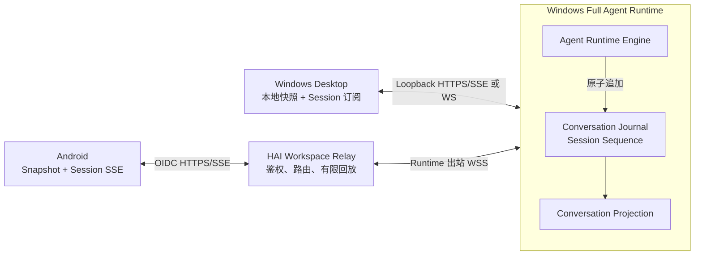
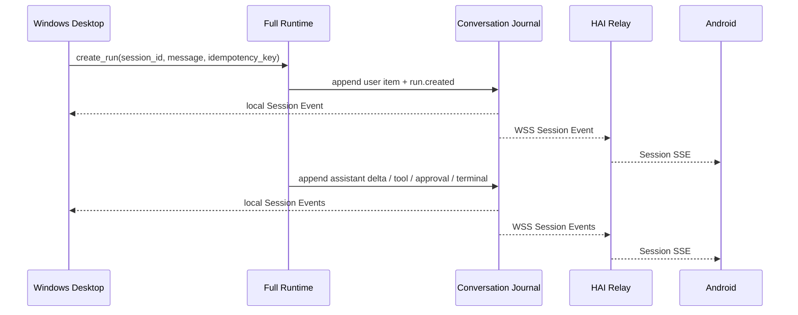
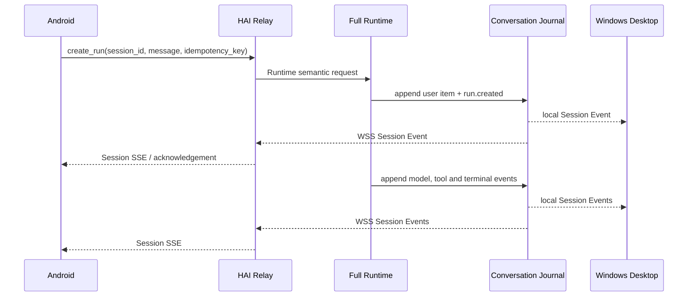

# OpenDrSai 移动远程工作区开发方案 V3

> 制定日期：2026-07-27
> 继承方案：[OpenDrSai 移动远程工作区开发方案 V2](./OpenDrSai移动远程工作区开发方案V2.md)
> 目标客户端：Windows Desktop / Android
> 权威执行端：Windows OpenDrSai Full Agent Runtime
> 开发环境：`https://ai-dev.ihep.ac.cn/api/runtime-relay`
> 方案规模：**16 个模块、104 个功能点**
>
> 实施进度：[OpenDrSai 移动远程工作区开发进度 V3](./OpenDrSai移动远程工作区开发进度V3.md)

## 0. V3 定位与当前口径

V3 是 V2 的正式继承版，不另起一套远程工作区。V2 解决了扫码关联、主机与
Workspace/Session 浏览、历史 Conversation 读取、Android 发起 Run 以及
Run 级 Event SSE 等基础能力；V3 补齐多客户端共同使用一个 Session 时的实时一致性。

当前已经确认的缺口是：

- Android 打开 Session 时主要拉取一次 Conversation 快照；
- Android 只订阅“当前已知 active Run”的 Run 级 SSE，Run 结束后订阅随之结束；
- Windows 新建下一轮时，Android 不知道出现了新 Run，也不会自动订阅；
- Windows Desktop 没有通过统一事件源订阅 Android 发起的消息和 Run；
- Windows 的历史快照文件可以支持事后读取，但不是可续传的实时多客户端日志。

V3 的核心增量是：

```text
Runtime Conversation Journal
        + Session 级事件流
        + Windows / Android 两端共同订阅
```

累计进度口径如下：

| 口径 | 数量 | 说明 |
| --- | ---: | --- |
| V2 继承功能点 | 80 | M01～M10 全部保留 |
| V3 新增功能点 | 24 | M11～M16，每模块 4 项 |
| V3 功能点总数 | 104 | 新发布门禁按 104 项统计 |
| V2 `local_pass` 基线 | 71 | 仅表示已有代码和自动测试证据 |
| V2 继承未验证 | 9 | M01-F07、M05-F04、M09-F08、M10-F03～F08 |
| V3 新增待实现/验收 | 24 | M11-F01～M16-F04 |
| 当前待闭环 | 33 | 9 个 V2 遗留 + 24 个 V3 新增 |
| 当前 `full_pass` | 0 | 完成真实三端、故障恢复和 1 小时稳定性后才升级 |

> V2 的 71 个 `local_pass` 不等于 V3 发布通过。涉及 Conversation、Event、
> SSE、消息发送、多客户端一致性和故障恢复的旧证据必须在 V3 总门禁中重跑。
> Run 级 SSE 通过不能替代 Session 级事件流验收。

## 1. 交付目标

在同一个远程 Session 中，Windows Desktop 和已授权 Android 都是交互客户端，
Windows Full Agent Runtime 是唯一执行者和会话事实权威：

1. Android 未打开 Session 时，Windows 新增任意轮次；Android 之后打开该 Session，
   能读取全部新增内容；
2. Android 已打开 Session 时，Windows 输入消息后，Android 实时看到用户消息、
   模型增量、工具行为、Approval、Artifact 和终态；
3. Windows 已打开 Session 时，Android 发送消息后，Windows 实时看到相同内容；
4. 任一客户端断线、退后台、被回收或重启后，按 Session 游标恢复，不丢失、不重复；
5. 两端同时操作时，由 Runtime 统一排序和裁决，不由客户端时间戳决定顺序；
6. Agent Loop、模型、Tool/Skill/MCP、Shell 和文件操作继续只在 Windows Runtime 执行。

## 2. V3 统一架构



### 2.1 权威边界

- **Runtime Engine**：Session、Run、Approval 和执行状态的唯一状态机。
- **Runtime Conversation Journal**：跨客户端会话变化的权威有序日志。
- **Conversation Projection**：由 Journal 确定性生成的当前会话快照。
- **HAI Relay**：验证身份、路由请求、短期回放事件；不生成会话事实。
- **Windows Desktop / Android Room**：非权威投影，可删除并由 Runtime 重建。
- 现有 `threads.json`、`thread-snapshots.json` 作为迁移输入和兼容缓存，不再作为
  多客户端实时同步的权威源。

### 2.2 为什么必须是 Session 级事件流

一个 Session 可以连续产生多个 Run。Android 如果只订阅已知 `run_id`，无法发现
Windows 后续创建的新 Run；Windows 也无法仅凭本地 UI 状态发现 Android 发起的 Run。
因此订阅对象必须是稳定的 `session_id`，Run 只是 Session 事件中的一个维度。

```text
Session
  ├─ Run A → message / delta / tool / approval / terminal
  ├─ Run B → message / delta / tool / terminal
  └─ Run C → ...

共同游标：session_sequence = 1, 2, 3, ...
```

## 3. V3 数据与协议模型

### 3.1 Conversation Item

每个可展示对象至少包含：

```json
{
  "item_id": "ci_...",
  "session_id": "session_...",
  "run_id": "run_... or null",
  "kind": "message|reasoning|tool|approval|artifact|error",
  "role": "user|assistant|system|tool|null",
  "revision": 3,
  "session_sequence": 108,
  "source_client": "windows|android|runtime",
  "source_message_id": "client generated id or null",
  "created_at": "RFC3339",
  "updated_at": "RFC3339",
  "payload": {}
}
```

- `item_id` 是跨客户端稳定身份；
- `revision` 只允许递增，旧 revision 不覆盖新 revision；
- `session_sequence` 由 Runtime 分配且严格递增；
- `source_message_id` 与 Idempotency-Key 用于消除发送重试产生的重复消息；
- 客户端时间只用于展示，不能用于裁定顺序。

### 3.2 Session Event

```json
{
  "event_id": "se_...",
  "runtime_id": "runtime_...",
  "workspace_id": "workspace_...",
  "session_id": "session_...",
  "run_id": "run_... or null",
  "session_sequence": 109,
  "kind": "conversation.item.upsert",
  "timestamp": "RFC3339",
  "payload": {
    "item_id": "ci_...",
    "revision": 4
  }
}
```

首批事件类型：

- `session.updated`
- `run.created`、`run.state.changed`
- `conversation.item.created`、`conversation.item.delta`、
  `conversation.item.upsert`
- `tool.state.changed`
- `approval.created`、`approval.decided`
- `artifact.created`
- `session.archived`、`session.removed`

对外可见的每个事件都必须先进入 Journal，再发送给订阅者。允许在终态后对高频 delta
做压缩，但必须保留可重建的 checkpoint、水位和 cursor 过期语义。

### 3.3 Snapshot 与订阅

Conversation 快照响应增加：

```json
{
  "session_id": "session_...",
  "snapshot_sequence": 108,
  "items": [],
  "next_cursor": null
}
```

新增公开 Session 事件流：

```http
GET /api/runtime-relay/v2/runtimes/{runtime_id}/workspaces/{workspace_id}/sessions/{session_id}/events/stream?after_sequence=108
Authorization: Bearer <OIDC token>
```

Runtime 本地提供等价的 loopback 订阅，供 Windows Desktop 使用。外部 Relay WSS
沿用 `type=event`，新增 `scope=session`；未带 `scope` 的旧帧继续按 `run` 处理：

```json
{
  "type": "event",
  "scope": "session",
  "session_id": "session_...",
  "session_sequence": 109,
  "event": {}
}
```

协议最终字段由 M11 合同冻结；V3 只允许 additive 兼容，不破坏现有 V1/V2 Run SSE。

### 3.4 无竞态启动算法

两端进入 Session 时统一执行：

1. 请求 Conversation Snapshot，保存 `snapshot_sequence=S`；
2. 原子写入本地 items 和水位 S；
3. 订阅 Session SSE：`after_sequence=S`；
4. 按 `event_id` 去重、按 `session_sequence` 连续应用；
5. 发现 gap 或 `cursor_expired` 时重新拉 Snapshot；
6. SSE 断线指数退避，恢复后从已提交水位继续。

Snapshot 与建立 SSE 之间发生的事件由 Relay/Runtime 从 S 后回放，因此不会形成
“页面刚打开时漏一条消息”的窗口。

## 4. 累计开发模块

| 模块 | 名称 | 功能点 | 状态/主责 |
| --- | --- | ---: | --- |
| M01～M10 | V2 远程工作区基础能力 | 80 | 继承；71 有本地证据、9 未验证 |
| M11 | Session Conversation 合同 | 4 | 新增；三端共同冻结 |
| M12 | Runtime Conversation Journal | 4 | 新增；Windows Runtime |
| M13 | Windows Desktop 共同订阅 | 4 | 新增；Windows Desktop |
| M14 | HAI Relay Session 通道 | 4 | 新增；HAI 平台 |
| M15 | Android Session Sync Engine | 4 | 新增；Android |
| M16 | 一致性、故障与发布门禁 | 4 | 新增；三端联合 |
| **合计** | **16 个模块** | **104** |  |

## 5. V2 继承的未完成项

以下 9 项从 V2 原编号继承到 V3，只有产生对应真实证据后才能升级：

| ID | 未完成能力 | V3 自动验收 |
| --- | --- | --- |
| M01-F07 | 扫码建立设备级 association，并按 scope 访问 active Workspace 和已有 Session | 同账号两台 Android 分别配对；撤销 A 后 A 对目录、Conversation 和 Session SSE 均为 403，B 继续 200 |
| M05-F04 | enrollment owner、用户身份与物理 Android association 分离 | A/B 扫码前均不可见；分别扫码后各有独立 association，复制另一设备凭据不能访问 |
| M09-F08 | 1 小时真实链路稳定性 | 真机、ai-dev、Windows 连续运行 3600 秒；连接、进程、句柄和内存斜率在阈值内，最终 snapshot/event/transcript hash 一致 |
| M10-F03 | ai-dev 公网合同和部署 smoke | 自动验证 health、OpenAPI、WSS、401/403、opaque cursor、错误信封、Run SSE 和 Session SSE；404 或合同漂移即失败 |
| M10-F04 | 真实 HAI 账号与两台设备的可见性/撤销 | 清理关联后不可见；A/B 分别扫码；撤销 A 后 A 目录与已建流失效，B 不受影响 |
| M10-F05 | Windows Desktop + ai-dev + Android 真机目录浏览 | Windows 语义树断言启用状态和设备列表；Android UIAutomator 断言主机、active Workspace、active Session 与生命周期过滤 |
| M10-F06 | 真机历史、发送、实时输出和 Approval | 唯一 canary 从任一端发送，另一端实时显示；真机批准后 Windows Tool 只执行一次，双方 transcript hash 一致 |
| M10-F07 | 真机断网、后台、杀进程及 Runtime/Relay 重启 | 每项自动断言无重复 Run、无丢失 Session Event、无越权，按 session_sequence 恢复 |
| M10-F08 | 机器可读证据包和发布阻断 | V3 汇总器改为校验 104/104、三端版本/commit、JUnit、真机截图、故障矩阵与 1 小时报告 |

### 5.1 V2 已有证据的复验原则

V2 账本中的 71 项保留为实施基线，不要求无意义地重写已有功能。但下列能力必须在
V3 链路中重新验收：

- Conversation Projection 和历史分页；
- Event 顺序、gap、cursor 过期与恢复；
- Windows/Android 消息发送和幂等；
- Run、Tool、Approval 的实时状态；
- 双客户端最终一致；
- 断网、后台、进程回收、Runtime/Relay 重启；
- 撤销 association 后既有 Session SSE 立即终止。

## 6. V3 新增 24 个功能点

### M11 Session Conversation 合同（4 项）

| ID | 功能 | 自动测试验收 |
| --- | --- | --- |
| M11-F01 | 定义 Runtime 权威的 `session_sequence`，覆盖跨多个 Run 的全部可见变化 | 两个客户端并发产生 10,000 个事件，Runtime 分配的 sequence 严格递增、唯一、无空洞；客户端时间乱序不影响结果 |
| M11-F02 | 定义 Conversation Item 的稳定 ID、revision、kind、source_client 和 source_message_id | Python/Kotlin/TypeScript 使用同一 fixture；重复 item 只保留最大 revision，同 source_message_id 重试不新增用户消息 |
| M11-F03 | Conversation Snapshot 返回 `snapshot_sequence`，定义 Session SSE、gap、heartbeat 和 `cursor_expired` | Schema 正反例、OpenAPI 生成零漂移；Snapshot 后插入事件再订阅，仍能从 S+1 完整回放 |
| M11-F04 | 定义 Session Event 类型、能力发现、最低版本和 V1/V2 additive 兼容规则 | 老客户端继续使用 Run SSE；新客户端对缺少 `session_event_stream` capability 的 Runtime fail closed 并提示更新 |

### M12 Runtime Conversation Journal（4 项）

| ID | 功能 | 自动测试验收 |
| --- | --- | --- |
| M12-F01 | 在 Runtime SQLite 中建立按 Session 分区的持久 Journal、sequence 分配和必要索引 | 100 并发 writer 下 sequence 唯一；进程崩溃重启后继续递增，SQLite integrity check 通过 |
| M12-F02 | Session、Run、消息、模型 delta、Tool、Approval、Artifact 与终态先原子写 Journal，再向外发布 | 在“提交前/提交后/发布前”注入崩溃；提交前不可见，提交后可重放，任何状态只出现一次 |
| M12-F03 | 提供 Conversation Snapshot、Session Event replay 和本地实时订阅接口 | 预置多 Run 混合会话，Snapshot hash 与从 sequence=0 回放所得投影 hash 完全一致 |
| M12-F04 | 将既有 Desktop thread snapshot/Runtime 数据幂等迁移到 Journal，并支持 checkpoint/压缩 | 同一历史库迁移两次结果不重复；压缩前后 Conversation hash 一致，过旧游标明确返回 `cursor_expired` |

### M13 Windows Desktop 共同订阅（4 项）

| ID | 功能 | 自动测试验收 |
| --- | --- | --- |
| M13-F01 | Windows 输入消息统一调用 Runtime 语义 `create_run`，不再只更新 Desktop 私有状态 | UI 自动化发送唯一消息，Journal 中恰好一个用户 item 和一个 Run，Relay/Android 可读 |
| M13-F02 | Desktop 通过 Runtime 本地 Session 流更新模型输出、Tool、Approval、Artifact 和终态 | 注入分片 delta 和 Tool 生命周期，Windows 语义树在 P95<2 秒内出现且顺序与 Journal 一致 |
| M13-F03 | Desktop 能实时显示 Android 发起的新消息、新 Run 和 Approval 决策 | Android fixture 发消息并决策，Windows 无手动刷新在 P95<2 秒内更新；Windows 不创建重复 Run |
| M13-F04 | 实现本地 cursor/outbox、断线重连和 Session 列表未读/更新时间同步 | Desktop 在流中途重启，恢复后无重无漏；打开/未打开 Session 的列表状态和最后更新时间均正确 |

### M14 HAI Relay Session 通道（4 项）

| ID | 功能 | 自动测试验收 |
| --- | --- | --- |
| M14-F01 | Runtime 出站 WSS 接收和转发 `scope=session` 事件，同时保持旧 Run Event 兼容 | 同一连接混发 Run/Session Event，Relay 分流正确；未知 scope 被结构化拒绝且不污染缓存 |
| M14-F02 | 提供按 runtime/workspace/session 授权的公开 Session SSE 和 Snapshot 水位透传 | Android bearer 请求正确资源为 200；跨 issuer/device/runtime/workspace/session 矩阵均在访问缓存前返回 401/403/404 |
| M14-F03 | 使用 Redis 实现多 worker 有界 replay、generation fencing、去重、背压和 cursor 过期 | Runtime 与 Android 落在不同 worker；抢占旧 generation 后旧事件被拒绝，10k 事件回放无重无漏，内存有界 |
| M14-F04 | 撤销、scope、限流、结构化日志和 Session SSE 指标完整接入 | 单设备撤销使匹配的既有流立即关闭、后续请求 403；日志不含正文/token，指标可查询连接数、gap、延迟和重连 |

### M15 Android Session Sync Engine（4 项）

| ID | 功能 | 自动测试验收 |
| --- | --- | --- |
| M15-F01 | 进入 Session 执行 Snapshot + `after_sequence` 订阅，Room 原子保存 items、events 和 cursor | 在 Snapshot 与 SSE 建连之间插入事件，最终无丢失；事务失败后 cursor 不前移 |
| M15-F02 | 订阅 Session 而非单个 active Run，实时渲染新 Run、消息、delta、Tool、Approval、Artifact 和终态 | Android 保持页面打开，Windows 连续创建两个新 Run；无需刷新即可显示全部事件，P95<2 秒 |
| M15-F03 | Android 发送采用 source_message_id/Idempotency-Key、乐观状态和 Runtime 回执归并 | 丢失 HTTP 响应并重试 20 次，Room、Runtime、Windows 各只有一个用户消息和一个 Run |
| M15-F04 | 后台、换网、token refresh、进程回收、gap 和 cursor 过期时自动恢复 | 真机依次执行后台 5 分钟、断网、401 refresh、杀进程和历史截断；重新打开后 transcript hash 与 Runtime 一致 |

### M16 一致性、故障与发布门禁（4 项）

| ID | 功能 | 自动测试验收 |
| --- | --- | --- |
| M16-F01 | 由 Runtime 统一排序并处理双端并发发送、取消和 Approval 单决策 | Windows/Android 同时发送 100 次，最终顺序按 session_sequence 一致；同时审批只有第一方成功且 Tool 只执行一次 |
| M16-F02 | 实施能力/版本门禁、协议降级提示和三端合同漂移 CI | Runtime/Relay/Android 版本组合矩阵自动运行；缺 capability、预发布版本或 schema 漂移均 fail closed |
| M16-F03 | 完成真实 Windows ↔ Android 双向实时 E2E，并比较 Session 快照、事件和 transcript | 两个方向各创建至少两个 Run，双方页面事件在 P95<2 秒出现；最终三份规范化 SHA-256 完全相同 |
| M16-F04 | 完成 1 小时稳定性、故障矩阵、脱敏扫描和 V3 机器发布门禁 | 3600 秒内注入换网/后台/进程/Runtime/Relay 重启，104/104、三端 JUnit、截图和 digest 齐全且 secret scan 零命中 |

## 7. 关键交互流程

### 7.1 Windows 发起，Android 实时接收



### 7.2 Android 发起，Windows 实时接收



## 8. 一致性与安全规则

1. **单写入权威**：所有会话事实必须由 Runtime Journal 分配 sequence。
2. **至少一次传输、幂等应用**：网络层允许重送，客户端按 event_id、item_id/revision 去重。
3. **写请求幂等**：`issuer + subject + device_id + session_id + idempotency_key`
   唯一；Runtime 仍是最终幂等兜底。
4. **先持久化后发布**：不得先把 delta 发给客户端再尝试写 Journal。
5. **快照水位**：Snapshot 与 `snapshot_sequence` 必须来自同一读事务。
6. **撤销优先**：association 被撤销后清空待发业务事件、关闭现有流，禁止新请求。
7. **路径与正文脱敏**：Relay 日志、指标和发布证据只保存 ID 摘要、sequence、耗时和 hash。
8. **一个 Runtime owner**：同一 `runtime_id` 只允许一个 active generation；安装版 18642
   与开发版 18643 不得使用同一 enrollment 同时连接。

## 9. 实施顺序与协作边界

| 阶段 | 内容 | 完成条件 |
| --- | --- | --- |
| P0 | 冻结 M11 合同、fixture、OpenAPI 和 migration ADR | 三端合同生成零漂移 |
| P1 | 实现 M12 Runtime Journal 与历史迁移 | Snapshot hash = Journal replay hash |
| P2 | 实现 M13 Desktop 本地订阅 | Android 发起内容能实时进入 Windows |
| P3 | 实现 M14 Relay Session 通道 | 跨 worker Session SSE、回放、撤销通过 |
| P4 | 实现 M15 Android Sync Engine | Windows 连续新建多个 Run，真机无需刷新实时显示 |
| P5 | 完成 9 个 V2 遗留项和 M16 联合验收 | 104/104、故障矩阵、1 小时门禁全部通过 |

任务边界：

- **本任务**：M11、M12、M13；维护 Windows Desktop、Full Runtime、共享协议与总验收。
- **Android 任务 `019f4fa6-b70a-7a53-a9a9-018a11e0a836`**：M15 及 M16 真机部分。
- **ai-dev 任务 `019f5208-0f19-7883-b3e2-4dcc8ffa4b61`**：M14 及 M16 Relay 部分。
- `019f9a52-b494-7461-a589-27e24d64e526` 管理
  `opendrsai-dev.ihep.ac.cn`，不得部署或验收本方案的 ai-dev 服务。

合同冻结后允许三方并行开发，但任何一端不得私自扩展 DTO；变更必须先更新共享 Schema、
fixtures 和生成客户端。

## 10. 自动验收拓扑

### 10.1 本地确定性闭环

```text
Windows Desktop Test Driver
        ↕ local Session stream
Windows Full Runtime + SQLite Journal
        ↕ WSS
Controllable Multi-worker Relay + Redis
        ↕ HTTPS / Session SSE
Android Emulator
```

必须可自动注入：

- Snapshot 与 SSE 建连间隙；
- 重复、乱序、gap、cursor expired 和慢消费者；
- Windows/Android 同时发送和同时审批；
- Runtime commit 前后崩溃；
- Relay worker/owner 抢占与 Redis 短时不可用；
- 401 refresh、association 撤销、Android 后台和进程回收。

### 10.2 真实发布闭环

```text
Samsung Android 真机
        ↕ HAI OIDC + HTTPS / Session SSE
https://ai-dev.ihep.ac.cn/api/runtime-relay/v2
        ↕ Runtime 出站 WSS
Windows Desktop + Full Runtime + Conversation Journal
```

真实验收至少包含：

- Android 关闭页面期间，Windows 新增两轮；Android 再打开后完整可见；
- Android 保持页面打开，Windows 新增两轮，消息/模型/Tool/Approval 实时出现；
- Windows 保持页面打开，Android 新增两轮，Windows 实时出现；
- 两端同时发送、同时审批；
- Android 后台 5 分钟、断网、杀进程后恢复；
- Runtime 和 Relay 分别重启；
- 单设备撤销后既有 Session SSE 立即关闭；
- 连续运行 1 小时，最终 Conversation Snapshot、Journal replay、Windows UI 投影和
  Android Room 投影的规范化 hash 全部一致。

## 11. 证据与机器账本

V3 新建独立证据目录，不能覆盖 V2：

```text
release/product-evidence/mobile-remote-workspace-v3/
  acceptance.json
  protocol/
  windows/
  relay/
  android/
  e2e/
  stability/
  security/
```

`acceptance.json` 必须：

- 恰好包含 104 个唯一 ID；
- 继承 M01-F01～M10-F08，并增加 M11-F01～M16-F04；
- 区分 `unverified`、`local_pass`、`full_pass`；
- 每项记录代码 revision、命令、机器报告和脱敏 artifact；
- 对旧证据标记来源 V2，不将其冒充 Session 级实时链路证据；
- `--require-release-ready` 只有在 104/104 `full_pass`、三端版本一致、
  真实真机证据和 3600 秒稳定性报告齐全时返回 0。

## 12. V3 完成定义

V3 只有同时满足以下条件才算完成：

- 104/104 功能点机器验收为 `full_pass`；
- V2 固定 9 个未验证项全部闭环；
- Android 事后打开 Session 能看到 Windows 后续产生的所有轮次；
- Windows 与 Android 同时打开 Session 时，任一端的消息、模型输出、Tool、
  Approval、Artifact 和终态都能在另一端实时出现；
- 两端只消费 Runtime 权威 Journal，不形成互相覆盖的第二套会话状态；
- 断网、后台、进程回收、Runtime/Relay 重启后无重复 Run、无静默 Event 缺失；
- 单设备撤销和电脑级撤销立即终止相应目录、控制请求与 Session 流；
- 真实 ai-dev + Windows + Android 链路稳定运行 1 小时；
- 三端最终 snapshot/event/transcript hash 一致，安全扫描零敏感信息泄漏；
- 不以 Mock、Run 级 SSE、手工刷新、轮询 Conversation 或人工观察代替最终验收。
