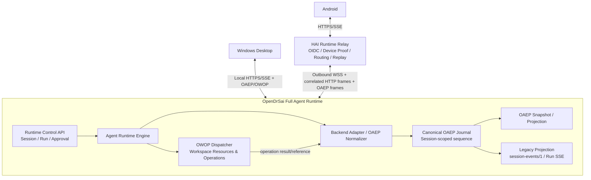

# OpenDrSai 移动远程工作区开发方案 V4

> 制定日期：2026-08-02  
> 继承方案：[OpenDrSai 移动远程工作区开发方案 V3](./OpenDrSai移动远程工作区开发方案V3.md)  
> 协议基线：OAEP 1.0 / OWOP 1.0 / Runtime Relay 2.0  
> 目标客户端：Windows Desktop / Android，后续兼容 TUI / SDK  
> 权威执行端：OpenDrSai Full Agent Runtime  
> 方案规模：**12 个模块、80 个功能点**

## 0. V4 定位

V4 不是重做远程工作区，而是在 V3 已实现的扫码关联、目录浏览、双向会话、
Session 级实时同步和故障恢复基础上，完成协议收敛：

```text
Agent 会话与执行语义    -> OAEP
工作区资源与操作        -> OWOP
Session/Run 控制命令    -> Runtime Control API
认证、路由与传输        -> Runtime Relay / Local Transport
```

核心判断：**OAEP 与 OWOP 是正交、协同的协议，不是互相替代的协议。**

- OAEP（OpenDrSai Agent Event Protocol）描述 `Session → Run → Item` 以及状态变化；
- OWOP 描述 Workspace、Files、Git、Process、PTY、Checkpoint、Artifact 等资源操作；
- Runtime Control API 负责创建 Session/Run、取消 Run、提交 Approval 决策等命令；
- Relay 只负责身份验证、授权、路由、连接管理和有限回放，不创造业务事实。

V4 最关键的重构是：将 V3 的 `Conversation Journal + session-events/1` 收敛为
OAEP 权威事实与兼容投影，避免长期存在两套 Session 事件语义。

## 1. 已有实现审计

### 1.1 已经可以直接复用的实现

| 领域 | 当前实现 | 判断 |
| --- | --- | --- |
| OAEP 协议 | `cores/protocol/oaep/README.md`、`oaep.schema.json`、examples | 可复用；仍是 Draft 1.0，需冻结远程同步语义 |
| Runtime OAEP 投影 | `backend/runtime/oaep.py`，提供 Session/Run/Item/Event 投影 | 可复用算法；当前仍由旧 Conversation Journal 二次投影 |
| Runtime OAEP API | `/oaep-snapshot`、`/oaep-events`、`/oaep-events/stream` | 可复用路由与恢复框架 |
| Desktop OAEP | RuntimeClient、Snapshot→Replay→SSE、gap/cursor 恢复、OAEP UI 投影 | 基本可复用；手写类型需改为生成类型 |
| Relay OAEP 路由 | OAEP capability 和三个公开 endpoint 已登记 | 可复用鉴权和路由骨架 |
| OWOP 协议 | 1.0 schema、Python/TypeScript/Kotlin 生成物、44 个操作 | 成熟基线，继续独立演进 |
| OWOP Runtime | Workspace、Files、Git、Worktree、Process、PTY、Checkpoint、Artifact | 直接复用 |
| OWOP Desktop | Terminal 已通过 OWOP 执行；远程主机 capability 检查已接入 | 直接复用 |
| V3 安全与关联 | device-bound association、scope、撤销、幂等、三端 secret scan | 直接复用 |

当前聚焦基线测试：Python OAEP/Journal/Gateway/OWOP/Relay 合同
`45 passed + 46 subtests passed`；Android OAEP 路径、SSE 与 capability 聚焦测试通过。
这些结果证明现有骨架可运行，但不等于端到端 OAEP 合同已经一致。

### 1.2 必须重构或澄清的实现

| 问题 | 当前表现 | V4 处理 |
| --- | --- | --- |
| 两套事实语义 | V3 Journal 保存 `conversation.item.*`，OAEP 在读取时再次投影 | OAEP 成为规范语义；旧事件只由 OAEP 投影 |
| Sequence 作用域不清 | OAEP 文档同时出现 Run 内 sequence 与 Session 级游标；代码实际使用 Session sequence | 冻结 Event `sequence` 为 Session 内严格递增；Item `sequence` 为 Run 内展示顺序 |
| Relay 合同缺 OAEP DTO | Relay schema 有 OAEP capability/endpoint，但 `$defs` 没有 OAEP Snapshot/Event | 引用 OAEP schema 并生成三端 DTO |
| WSS 仍发旧事件 | Runtime bridge 发 `scope=session` + `session_sequence/kind/payload` | 增加明确 `protocol=oaep/1` 的 OAEP frame；旧 frame 仅兼容 |
| Android 合同漂移 | 请求 OAEP endpoint，却按 V3 `GeneratedSessionEvent` 和 Conversation DTO 解码 | 改为原生 OAEP Session/Run/Item/Event 模型与 Room 投影 |
| 测试假阳性 | Android mock 在 OAEP 路径返回旧 shape，因此单测仍通过 | fixture 必须直接来自 OAEP schema，禁止端点名替代合同验证 |
| Endpoint alias 语义错误 | legacy `/events` 与 OAEP `/oaep-events` 被指向同一处理但输出合同不明确 | 两套路径输出各自合同；兼容只允许显式投影 |
| 协议版本表达单一 | Relay 顶层仍写 `protocol_version=owop/1` | 增加协议集合与 profile；保留旧字段只作兼容 |
| OAEP 类型手写 | Desktop 手写 Oaep 类型，Android 无 OAEP 生成 DTO | OAEP schema 生成 Python/TypeScript/Kotlin 类型并做 drift gate |
| OAEP/OWOP 关联缺失 | Agent Item 与实际 Workspace 操作缺少统一引用 | 通过 `operation_id/resource_ref` 关联，不复制资源正文 |

### 1.3 不应改动的边界

- 不把 OAEP 变成网络传输协议；SSE、WSS、IPC、SSH 仍属于 Transport。
- 不把 OWOP 变成 Agent 会话协议；它不保存 Session、Run、消息或审批历史。
- 不让 Relay 推断 Backend 私有事件或自行生成 OAEP 终态。
- 不让 Android/Desktop 直接理解 Codex、Hermes、OpenDrSai Agent 私有事件。
- 不用 OAEP Event 代替控制命令；Event 是已发生事实，不是 `create_run` 请求。
- 不在 OAEP 中复制绝对路径、完整文件、命令秘密参数或大块 Artifact 数据。

## 2. V4 统一协议架构



### 2.1 四类接口的职责

| 接口 | 负责 | 不负责 |
| --- | --- | --- |
| Runtime Control API | 创建/读取 Session、创建/取消 Run、Approval 决策、目录控制 | 实时输出语义、文件操作 |
| OAEP | 消息、推理、计划、工具、命令、文件变化、Artifact、Interaction、终态与重放 | 执行文件/PTY 操作、身份认证 |
| OWOP | Workspace/Files/Git/Process/PTY/Checkpoint/Artifact 的请求响应和资源事件 | Agent 会话历史、Run 状态机 |
| Relay Transport | OIDC、device proof、scope、WSS ownership、Redis replay、SSE | 业务映射、Backend 私有协议 |

### 2.2 权威数据边界

- Runtime OAEP Journal 是 Session/Run/Item/Event 的唯一权威事实。
- Workspace Registry 和 OWOP Provider 是资源状态与操作的权威。
- OAEP Snapshot 必须可由 OAEP Event 确定性重建。
- Android Room、Desktop Store 和 Relay Redis 都是可删除投影或有限缓存。
- 旧 Conversation Journal 可以保留物理表，但新写入必须先符合 OAEP 语义；
  不允许 OAEP 与 legacy 两套独立双写状态机。

## 3. OAEP 与 OWOP 的协同规则

### 3.1 共同身份

两套协议共享以下稳定身份，但各自只管理自己的领域：

```text
runtime_id
workspace_id
session_id         # OAEP/Control 使用
run_id             # OAEP/Control 使用
item_id            # OAEP 使用
operation_id       # OWOP 使用，OAEP 可引用
resource_ref       # OWOP 资源引用，OAEP 可引用
correlation_id     # 跨协议追踪
```

### 3.2 Agent 调用工作区操作

```text
Agent Runtime
  -> OWOP operation(operation_id, workspace_id, ...)
  -> OAEP event.item.started(tool_call/command_execution)
  -> OWOP result / resource_ref
  -> OAEP event.item.completed 或 failed
```

OAEP Item 保存用户可见的安全摘要、状态和 OWOP 引用；文件正文、PTY 缓冲和
大型 Artifact 继续通过 OWOP 按需读取。

### 3.3 文件与 Artifact

- OAEP `file_change` 只保存 Workspace 相对路径、操作类型、摘要和可选 diff 摘要；
- OWOP `files.*` 负责真实读写，必须再次校验 `workspace_id` 和权限；
- OAEP `artifact` 保存 metadata 与 `resource_ref`；
- OWOP `artifact.metadata/chunk` 负责按授权下载；
- Android 收到 OAEP Item 不代表自动获得对应 OWOP 读取权限。

## 4. 版本与兼容策略

### 4.1 Capability 协商

Runtime 应返回协议集合，而不是只返回一个模糊 `protocol_version`：

```json
{
  "protocols": {
    "oaep": {"version":"1.0","profiles":["oaep.session-stream/1"]},
    "owop": {"version":"1.0","capabilities":["workspace","files","git","pty"]},
    "relay": {"version":"2.0.0"}
  }
}
```

旧 `protocol_version: "owop/1"` 在兼容期保留，但不再代表整个 Runtime。

### 4.2 客户端选择顺序

1. OAEP schema/version/profile 全部兼容：使用 OAEP Snapshot + OAEP Event Stream；
2. OAEP 不完整但 `session-events/1` 可用：显式使用 V3 legacy 链路；
3. 只有 Run SSE：只读兼容并提示 Runtime 需要升级；
4. 不允许“请求 OAEP 路径、按 legacy DTO 猜测解码”。

### 4.3 兼容期

- V4 首个版本：Runtime/Relay 双栈，Desktop/Android 优先 OAEP；
- 后续至少两个发布周期：保留 legacy 读取投影与 capability fallback；
- 新语义只进入 OAEP，legacy 只做降级投影；
- 删除 legacy 前必须有使用率指标、回滚包和历史数据迁移证明。

## 5. 模块与功能点

V4 共 **12 个模块、80 个功能点**。

### M01 协议边界与能力协商（6 项）

| 编号 | 功能点 | 自动验收 |
| --- | --- | --- |
| M01-F01 | 冻结 OAEP、OWOP、Control、Relay 四层职责 | 架构规则测试扫描路由和依赖，禁止跨层私有事件 |
| M01-F02 | 冻结 OAEP Event sequence 为 Session 作用域 | 两个 Run 交错产生事件，sequence 全 Session 连续唯一 |
| M01-F03 | 冻结 OAEP Item sequence 为 Run 内展示顺序 | 多 Item/多 Run fixture 验证顺序互不串线 |
| M01-F04 | 定义统一身份与 correlation 规则 | 交叉替换 runtime/workspace/session/run/operation 任一 ID 均拒绝 |
| M01-F05 | Runtime 返回协议集合和 profile | Python/TS/Kotlin 反序列化同一 capability fixture 完全一致 |
| M01-F06 | 形成协议 ADR 与依赖规则 | CI 检查 ADR、schema、代码 capability 无漂移 |

### M02 OAEP 合同与三端类型生成（7 项）

| 编号 | 功能点 | 自动验收 |
| --- | --- | --- |
| M02-F01 | 冻结 OAEP 1.0 Session/Run/Item/Event schema | Draft 2020-12 正反例全部通过 |
| M02-F02 | 为十类 Item 定义可判别 content schema | 每种 Item 正例通过，错 type/content 组合失败 |
| M02-F03 | 强化 Event 状态机与 delta 约束 | delta 只能在 `event.item.delta`，终态必须携带最终 Item |
| M02-F04 | 增加安全的 OWOP `operation_ref/resource_ref` | 未授权引用、绝对路径和内联秘密 fixture 失败 |
| M02-F05 | 从 OAEP schema 生成 Python/TypeScript/Kotlin 类型 | `--check` 模式零 diff，禁止手写重复 DTO |
| M02-F06 | 建立跨语言黄金 fixtures | 三端规范化 JSON 与 SHA-256 完全一致 |
| M02-F07 | Relay/OpenAPI 直接引用 OAEP schema | OAEP endpoint response 和 WSS frame 均有完整 schema，漂移即失败 |

### M03 Runtime Canonical OAEP Journal（7 项）

| 编号 | 功能点 | 自动验收 |
| --- | --- | --- |
| M03-F01 | 新事件以 OAEP 为规范写入语义 | 数据库事务失败时 Event、Item、Run 状态全部不可见 |
| M03-F02 | Session sequence 原子分配 | 100 并发 writer 无重无漏、重启后继续递增 |
| M03-F03 | Item revision 与状态机 | 非法回退、终态后更新和跨 Run Item 更新均拒绝 |
| M03-F04 | event_id/dedupe_key 幂等 | 同 Backend 事件重放 100 次只产生一个规范 Event |
| M03-F05 | Snapshot 与 replay 等价 | 从 0 重放所得 Session/Run/Item hash 等于 Snapshot hash |
| M03-F06 | cursor_expired 与 checkpoint/compaction | 截断前游标明确 409，Snapshot 恢复后无重无漏 |
| M03-F07 | V3 Journal 到 OAEP 的幂等迁移 | 历史库迁移两次结果一致，原始表不被破坏 |

### M04 Backend Adapter 与控制状态机（7 项）

| 编号 | 功能点 | 自动验收 |
| --- | --- | --- |
| M04-F01 | OpenDrSai Backend 私有事件一次映射为 OAEP | message/reasoning/tool/command/error fixture 全覆盖 |
| M04-F02 | Codex Backend 映射 OAEP | Thread/Turn/Item、delta、command、file、cancel 契约通过 |
| M04-F03 | Hermes/未来 Backend 使用同一 Adapter SPI | 示例 Adapter 不修改客户端即可通过 OAEP fixture |
| M04-F04 | 用户输入与附件先形成 OAEP Item | Desktop/Android 同 source_message_id 重试不重复 |
| M04-F05 | Run created/started/waiting/resumed/终态完整 | 失败、取消、超时、审批等待均无悬挂 Run |
| M04-F06 | Approval 统一为 Interaction Item | 两端并发决策只有一个成功，Run 只恢复一次 |
| M04-F07 | legacy Conversation/Run SSE 从 OAEP 投影 | 旧客户端文本兼容，新语义不新增 legacy 私有类型 |

### M05 OAEP 与 OWOP 协同（6 项）

| 编号 | 功能点 | 自动验收 |
| --- | --- | --- |
| M05-F01 | 每次 Agent Workspace 操作分配 operation_id | OAEP Item、OWOP request/result、审计日志 correlation 一致 |
| M05-F02 | tool_call/command_execution 引用 OWOP operation | 重放 OAEP 不会再次执行 OWOP 副作用 |
| M05-F03 | file_change 只保留相对路径和摘要 | Windows/Unix 绝对路径、UNC、逃逸路径均 fail closed |
| M05-F04 | artifact Item 使用 OWOP resource_ref | 未授权客户端只能看到 metadata，chunk 读取返回 403 |
| M05-F05 | OWOP 失败映射结构化 OAEP Error | code/retryable/source 一致且不泄露参数或 traceback |
| M05-F06 | OWOP watch/resource event 与 OAEP 分离 | 文件外部变化不伪造 Agent Item；Agent 变化可建立明确引用 |

### M06 Runtime OAEP API 与出站 Bridge（7 项）

| 编号 | 功能点 | 自动验收 |
| --- | --- | --- |
| M06-F01 | OAEP Snapshot API 严格返回 OAEP shape | schema 校验并拒绝 legacy `item_id/kind/payload` shape |
| M06-F02 | OAEP Event page 使用 exclusive `after_sequence` | 10k 分页稳定、无重无漏、cursor 绑定 Session |
| M06-F03 | OAEP SSE 持续订阅而非单页后关闭 | 跨两个新 Run 持续收流，heartbeat 不结束业务流 |
| M06-F04 | 定义 `protocol=oaep/1` Runtime WSS frame | frame 严格校验 session/event identity 和 sequence |
| M06-F05 | Runtime 断线后从持久游标补发 | 断线期间事件在重连后完整补齐且不重复 |
| M06-F06 | generation fencing 与单 owner | 旧连接的 OAEP frame 被拒绝，新 generation 独占 |
| M06-F07 | Control request/response 与 OAEP Event 分帧 | 乱序并发请求和主动事件不串 correlation |

### M07 HAI Relay OAEP 数据面（7 项）

| 编号 | 功能点 | 自动验收 |
| --- | --- | --- |
| M07-F01 | 入站 OAEP frame 做 schema 与 identity 校验 | malformed、跨 Runtime/Session frame 在缓存前拒绝 |
| M07-F02 | Redis 保存按 Runtime+Session+generation 的有限 replay | 10k Event、跨 worker 回放无重无漏且有界 |
| M07-F03 | 公网 OAEP Snapshot/Event/SSE 原样语义代理 | 真实 Runtime 与公网 response 规范化 hash 一致 |
| M07-F04 | cursor_expired 统一错误信封 | 历史截断返回 409，Android 自动转 Snapshot |
| M07-F05 | scope 与 device association 在缓存前校验 | issuer/subject/device/runtime/workspace/session 全矩阵通过 |
| M07-F06 | 撤销立即终止匹配 OAEP SSE | A 被撤销流立即关闭且后续 403，B 继续接收 |
| M07-F07 | 多 worker 路由、背压和指标 | owner/caller 不同 worker；延迟、gap、reconnect 指标可查 |

### M08 Android OAEP 客户端与本地投影（8 项）

| 编号 | 功能点 | 自动验收 |
| --- | --- | --- |
| M08-F01 | 使用生成的 OAEP Session/Run/Item/Event DTO | 直接读取官方 OAEP fixture，不再使用 V3 DTO 猜测 |
| M08-F02 | Repository 严格解码 OAEP Snapshot/Event page | 同名 legacy shape 必须失败，防止测试假阳性 |
| M08-F03 | SSE 解码 OAEP Event 与 event type | 未知可选字段忽略，未知 type 安全降级为 Notice/不误判 |
| M08-F04 | Room 升级为 OAEP Event/Item/Run 投影 | migration 保留历史、cursor 和 optimistic item |
| M08-F05 | Snapshot→Replay→SSE 原子恢复 | 插入竞态、进程回收、换网、401、cursor_expired 均无重无漏 |
| M08-F06 | OAEP Item 原生 UI 投影 | message/reasoning/plan/tool/command/file/artifact/interaction/notice 可见 |
| M08-F07 | source_message_id 乐观合并与幂等 | HTTP 响应丢失重试 20 次只保留一个用户 Item/Run |
| M08-F08 | OAEP/legacy capability 双栈与 OWOP 按需读取 | 新 Runtime 选 OAEP；旧 Runtime 明确 fallback；Artifact 只按授权加载 |

### M09 Desktop OAEP 收敛（5 项）

| 编号 | 功能点 | 自动验收 |
| --- | --- | --- |
| M09-F01 | RuntimeClient 改用 OAEP 生成类型 | schema 更新后 `--check` 和 node/web typecheck 通过 |
| M09-F02 | Desktop OAEP Projector 覆盖十类 Item | 同一 fixture 与 Android 语义树一致 |
| M09-F03 | Snapshot/replay/SSE 使用同一 reducer | 刷新、重连和实时流最终 hash 一致 |
| M09-F04 | OAEP 优先、legacy 显式回退 | capability 组合矩阵无静默混用和半兼容状态 |
| M09-F05 | OWOP 资源按引用打开 | Terminal/File/Artifact 不从 OAEP content 读取真实资源正文 |

### M10 数据迁移、兼容与回滚（6 项）

| 编号 | 功能点 | 自动验收 |
| --- | --- | --- |
| M10-F01 | 盘点并标记 legacy Session/Run/Event 数据 | 迁移报告给出总量、可投影、降级 Notice 和失败数 |
| M10-F02 | 历史数据懒投影/后台迁移 | 两种模式输出相同 OAEP hash，迁移可中断恢复 |
| M10-F03 | legacy endpoint 保持 legacy contract | `/events` 与 `/oaep-events` 各自通过不同 schema |
| M10-F04 | Runtime/Relay/Desktop/Android 版本矩阵 | 旧新组合均有预期：OAEP、fallback 或明确升级提示 |
| M10-F05 | 数据库 up/down/up 与回滚包 | 有新 OAEP 数据时禁止破坏性 down；应用回滚仍可 legacy 读取 |
| M10-F06 | legacy 删除门槛 | 使用率、迁移率、错误率达到门槛前 CI 禁止删除兼容代码 |

### M11 安全、性能、可观测性与故障恢复（6 项）

| 编号 | 功能点 | 自动验收 |
| --- | --- | --- |
| M11-F01 | OAEP/OWOP/Control 权限矩阵 | 每个 endpoint/operation 在副作用前验证最小 scope |
| M11-F02 | 三端敏感信息扫描 | token、正文 canary、绝对路径、命令参数不进入日志/缓存/产物 |
| M11-F03 | OAEP 审计与 correlation trace | HTTP→Relay→WSS→Runtime→OWOP→OAEP Event 全链可追踪 |
| M11-F04 | 10k Session Event 性能门禁 | P95、RSS、队列、Redis 占用满足方案阈值 |
| M11-F05 | 五故障恢复 | Android 后台/杀进程/换网、Runtime/Relay 重启均无重复/丢失 |
| M11-F06 | 协议降级与漂移告警 | schema hash、版本、fallback 原因和 unknown type 指标可查 |

### M12 V3 遗留真实验收与 V4 发布门禁（8 项）

| 编号 | 功能点 | 自动验收 |
| --- | --- | --- |
| M12-F01 | 两台 Android 独立 device association | A/B 分别扫码、目录各自可见，凭据复制失败 |
| M12-F02 | 单设备撤销与 OAEP 断流 | 撤销 A 后 A 目录/Snapshot/SSE 为 403，B 继续 200 |
| M12-F03 | 真实主机/Workspace/Session 目录 UI | 生命周期过滤正确且不暴露路径 |
| M12-F04 | Windows→Android 两轮 OAEP 实时同步 | 新用户消息、delta、Tool、终态 P95<2 秒 |
| M12-F05 | Android→Windows 两轮与 Approval 单执行 | 两端 hash 一致、Tool 只执行一次 |
| M12-F06 | 正式五故障联合验收 | 在同一 OAEP Session 中验证 sequence、dedupe、generation |
| M12-F07 | 3600 秒真实稳定性 | 五故障均在窗口内，内存/句柄/延迟和 transcript hash 通过 |
| M12-F08 | V4 finalizer | 80/80、V3 遗留清零、三端 JUnit/截图/secret scan/digest 全部通过 |

## 6. 实施阶段与依赖顺序

### P0 合同冻结

完成 M01～M02。先解决 sequence 作用域、OAEP DTO、协议集合和 schema 引用，
禁止在合同未冻结时继续扩展客户端手写映射。

### P1 Runtime 单一事实

完成 M03～M05。OAEP 写入、Adapter、Run/Interaction 终态和 OWOP 引用先在
Runtime 内闭环；legacy 从 OAEP 投影，不先改 Relay/Android。

### P2 Bridge 与 Relay

完成 M06～M07。上线严格 OAEP frame、Redis replay、SSE 和 scope；保留旧
`scope=session` frame 双栈，真实 ai-dev 先 canary 一个 Runtime。

### P3 Android 与 Desktop

完成 M08～M09。Android Room migration 和 Desktop generated type 同步落地，
用同一 OAEP fixture 驱动两端 reducer 与 UI。

### P4 迁移与发布验收

完成 M10～M12。执行历史迁移、版本矩阵、A/B 撤销、双向实时、五故障和
一小时稳定性，最后运行 V4 finalizer。

## 7. 自动测试与验收体系

### L0 Schema 与代码生成

- OAEP、OWOP、Relay JSON Schema 正反例；
- Python/TypeScript/Kotlin codegen `--check`；
- OpenAPI 引用解析与 backward compatibility；
- OAEP endpoint 返回 legacy shape 的负向测试。

### L1 Runtime

- Journal 原子性、sequence、revision、dedupe；
- OpenDrSai/Codex/Hermes Adapter fixtures；
- Snapshot/replay hash 等价；
- OAEP→legacy 投影；
- OAEP Item↔OWOP operation/resource 引用。

### L2 Relay

- WSS frame schema、generation fencing、乱序 request/response；
- Redis 双 worker replay、背压和 cursor expired；
- issuer/subject/device/runtime/workspace/session/scope 负向矩阵；
- 撤销已建 OAEP SSE。

### L3 客户端

- Desktop/Android 使用同一 OAEP golden fixture；
- Snapshot→Replay→SSE reducer 一致；
- Room/Store 迁移与进程死亡；
- OAEP/legacy capability fallback；
- OWOP resource_ref 按需读取权限。

### L4 真实链路

```text
Windows Desktop
    ↕ Local OAEP/OWOP
Windows Runtime
    ↕ Outbound WSS
HAI Relay
    ↕ OIDC HTTPS/SSE
Android A / Android B
```

必须记录协议版本、schema hash、runtime/instance/generation、Session sequence、
规范化 transcript hash 和 P95；不得记录令牌、正文、绝对路径或完整 subject。

## 8. V3 遗留项如何进入 V4

V3 当前账本为 `96 local_pass + 8 unverified`。V4 不把这 8 项作废，也不以新
协议单测替代真实验收：

| V3 遗留 | V4 收口位置 |
| --- | --- |
| M01-F07、M05-F04、M10-F04：两设备关联/撤销 | V4 M12-F01～F02 |
| M09-F08：一小时稳定性 | V4 M12-F07 |
| M10-F03：公网合同与部署 | V4 M07、M12-F08 |
| M10-F05：目录 UI | V4 M12-F03 |
| M10-F06：双向历史、发送、Approval | V4 M12-F04～F05 |
| M10-F07：真实五故障 | V4 M12-F06 |

V4 发布通过要求：V4 80 项全部通过，同时 V3 8 个未验证项全部获得对应真实证据。

## 9. 关键风险与控制

| 风险 | 后果 | 控制 |
| --- | --- | --- |
| OAEP sequence 语义不冻结 | 多 Run 重放错序 | P0 先冻结 Session 作用域并做并发 fixture |
| OAEP 与 legacy 双写 | 两端内容漂移 | 单一 OAEP Journal，legacy 只投影 |
| Android 同名 endpoint 假兼容 | 真机解析失败 | 直接使用 schema fixture，旧 shape 负向测试 |
| Relay 转换 OAEP 语义 | Runtime/Relay 事实不一致 | Relay 只验证和缓存完整 OAEP Event |
| OAEP Item 内联资源正文 | 泄密与数据膨胀 | OWOP resource_ref + 二次授权 |
| 过早删除 legacy | 旧 Runtime/客户端断裂 | capability 双栈、指标门槛、至少两个周期 |
| 大量 delta 导致存储/渲染压力 | 延迟和内存增长 | batching、checkpoint、completed Item 校准、性能门禁 |
| 新协议掩盖 V3 未验收项 | 发布证据失真 | V3 遗留显式映射到 M12，finalizer fail closed |

## 10. 完成定义

V4 完成必须同时满足：

1. OAEP、OWOP、Control API 与 Relay 的边界写入协议和代码规则；
2. OAEP schema 是三端 Session/Run/Item/Event 的单一合同源；
3. Runtime 原生维护可重放的 OAEP 权威事实，legacy 仅为兼容投影；
4. OAEP Event 使用 Session 级连续游标，Snapshot 与 replay 最终 hash 一致；
5. OAEP 与 OWOP 通过 operation/resource 引用协同，不复制资源正文；
6. Runtime 出站 WSS、Relay Redis/SSE、Desktop、Android 全链使用真实 OAEP DTO；
7. 新旧 Runtime/Relay/Desktop/Android 版本矩阵均能 OAEP、明确 fallback 或拒绝；
8. 两台设备关联、撤销、双向两轮、Approval、五故障和 3600 秒稳定性通过；
9. 三端合同、单测、集成测试、secret scan 和 artifact digest 进入 release gate；
10. V4 `80/80` 且 V3 遗留 `0 unverified`，才允许标记移动远程工作区完成。

## 11. 结论

V4 的统一描述应是：

> OpenDrSai Runtime 通过 Control API 接收命令，以 OAEP 提供统一 Agent 会话事实，
> 以 OWOP 提供统一工作区资源能力；HAI Relay 在不理解 Backend 私有协议的前提下，
> 完成安全路由、有限回放和多客户端分发。Windows Desktop 与 Android 使用同一
> OAEP Snapshot/Event reducer，并通过 OWOP 引用按需访问远端资源。

这样既保留 V3 已完成的真实远程执行和多端同步能力，又消除 Conversation Journal、
Session Events、OAEP 三套语义长期并存的风险。

## 12. 实施进度

> 最近更新：2026-08-03；完成口径只统计已有代码和自动验收证据的功能点。

| 轮次 | 已完成内容 | 验收证据 | 累计进度 |
| --- | --- | --- | --- |
| 第 1 轮 | 四层协议职责、Session/Run 两级 sequence、协议集合与 capability、OAEP Snapshot/EventPage、Relay OAEP frame、Python/TypeScript/Kotlin 类型生成 | OAEP/Relay/能力与 codegen 聚焦测试通过；生成器 `--check` 零漂移；Android Kotlin 编译通过 | 11/80（13.75%） |
| 第 2 轮 | Runtime Canonical OAEP Item/Event 同事务存储、Run 内 Item sequence、状态机、幂等迁移、cursor/compaction、Snapshot 从 Event 0 重建；V3 表保留为兼容投影 | Journal/OAEP/Relay 聚焦 `46 passed`；Runtime/Gateway 回归 `30 passed`；注入 OAEP 投影失败后 legacy/OAEP/sequence 全部回滚 | 18/80（22.5%） |
| 第 3 轮 | 十类可判别 Item content、OAEP/OWOP 安全引用、三端强类型 content、Backend Adapter SPI、Codex/OpenDrSai 映射、Backend 私有 ID 隔离、Workspace 绑定；Agent command 通过 OWOP `process.start` 执行并产生 operation/resource 引用；Artifact resource_ref 与结构化 OWOP Error | 合同/Journal/Adapter/Codex 聚焦 `64 passed`；Agent Runtime `13 passed + 12 subtests`；Runtime/Gateway `30 passed`；Android Kotlin 编译通过 | 33/80（41.25%） |
| 第 4 轮 | Runtime OAEP Snapshot/10k exclusive replay/持续 SSE 收口；OAEP 与 legacy 独立持久游标；WSS 严格 `oaep/1` frame；成功写帧后才 ack，断线安全补发；generation fencing；Control response 与主动 Event 串行写入、分帧隔离。新增参考 Relay 的严格校验、有界 replay、cursor_expired 和授权前置实现，供 HAI Redis 数据面复用 | Runtime/Relay 聚焦回归 `67 passed`，随后发送锁与隔离回归 `55 passed`；10,000 Event 无重无漏；同一 SSE 跨两个后续 Run；断线前未 ack；旧 generation、跨 Workspace、malformed、gap/collision 均 fail closed；codegen `--check` 与 `git diff --check` 通过 | 40/80（50%） |
| 第 5 轮 | Android 改用原生 OAEP Snapshot/Event/EventPage 与十类 Item；严格拒绝 legacy lookalike；Room v11 增加 OAEP Run/Item/Event 投影；Snapshot、Event、cursor 同事务；`source_message_id` 合并乐观消息；Snapshot→Replay→Session SSE 与 OAEP/legacy capability 双栈 | Android JVM 全量回归 `287 passed`；官方 OAEP fixture、Repository、SSE、capability 聚焦测试通过；模拟器 Room 原子事务 `5/5`；v10→v11 迁移保留 V3 投影并新增 OAEP 表 `1/1`；Kotlin main/androidTest 编译通过 | 48/80（60%） |
| 第 6 轮 | Desktop RuntimeClient 删除手写 OAEP DTO并使用生成类型；TypeScript Item 改为十类判别联合；Snapshot/replay/SSE 共用同一 OAEP reducer 与投影；完整 capability/profile 协商和 explicit legacy fallback；Artifact 仅由 OWOP `resource_ref` 形成 metadata 请求 | Desktop node/web typecheck 通过；OAEP Runtime contract 与 Session subscription gate 通过；Desktop/Android 共用十类官方 fixture；OAEP complete/partial/legacy 矩阵通过；OWOP Artifact 请求不携带 path/正文；OAEP schema 聚焦 `6 passed` | 53/80（66.25%） |
| 第 7 轮 | 增加 OAEP 迁移审计账本、总量/可投影/降级/失败报告；启动迁移与首次读取懒修复输出相同 Item hash；迁移中断状态可见且重启幂等续跑；legacy/OAEP endpoint 严格分离；四端版本矩阵；空库 down/up、有数据禁止 down、旧应用继续读 legacy；量化 legacy 删除门槛 | Python Journal/Gateway/OAEP/compatibility/codegen `66 passed`；迁移失败注入、lazy/startup hash、up/down/up、独立 wire shape 均通过；Desktop node/web typecheck 与两项 OAEP gate 通过；Android 全量 JVM 回归通过 | 59/80（73.75%） |
| 第 8 轮 | 完成 M11-F02/F04/F05/F06：Desktop OAEP 日志去除 Event 正文和命令内容，只保留 shape 元数据；复用三端 canary 扫描；参考 Relay 10k Event 有界性能门禁；Android 后台/进程/换网/401/cursor、Runtime 重连与 generation 恢复回归；增加 schema hash、gap/collision/overflow/eviction/cursor-expired/unknown-type 指标与只读 metrics endpoint | Secret scan、Runtime bridge、OAEP replay/performance 聚焦 `37 passed`；10k Event 性能测试 `1 passed`，ingest<30s、分页 P95<100ms、峰值<128MiB；Android 恢复聚焦测试通过；Desktop typecheck/合同 gate 通过；metrics 内容不含 Event/payload/body/token | 63/80（78.75%） |
| 第 9 轮 | 建立 V4 机器可读验收账本与 fail-closed finalizer；账本严格映射 12 模块 80 项并保留 `63 local_pass + 17 unverified`；finalizer 强制验证正确 ai-dev 环境、OAEP schema hash、10k 跨 worker 回放、权限前置、撤销断流、双设备、双向两轮、Approval 单执行、五故障、3600 秒、十类敏感源、三端 JUnit/截图/digest，以及 V3 八项遗留清零 | V4 ledger/finalizer 正反测试 `9 passed`；账本 `--check` 零漂移；`--require-release-ready` 在缺少生产及真机证据时按预期拒绝并报告 `full_pass=0/80`，未产生假完成 | 63/80（78.75%） |
| 第 10 轮 | 对正确 ai-dev 做公开只读 OAEP preflight 并形成生产 HAI 交接合同；修复参考 Relay 三个 OAEP endpoint 的空 OpenAPI 响应、legacy lookalike 误接受和 SSE cache miss 错误回退；Python TypedDict 改用 Pydantic 兼容的 `typing_extensions`，Snapshot/EventPage/Event 进入 OpenAPI components；Runtime 返回在响应前执行完整 OAEP schema 与 Workspace/Session identity 校验 | ai-dev health/OpenAPI 200，但 35 条生产路径中缺 3 条 OAEP endpoint 和 3 个 OAEP schema，preflight 按预期失败并生成脱敏报告；本地 Relay/OAEP/OpenAPI/V4 gates `52 passed`；三项 codegen/OpenAPI `--check` 零漂移 | 63/80（78.75%） |
| 第 11 轮 | 建立 Python/TypeScript/Kotlin 统一 OAEP Item 规范化摘要，固定可选字段默认值、Run 内顺序和安全字段集合；新增 Desktop stdin 摘要驱动、Android `oaep-session-proof` 真机阶段及 V4 三端收敛采集脚本；修复 legacy Conversation/Event 路径误调 OAEP operation，确保 legacy 与 OAEP 双栈不混用 | 官方十类 Item 黄金摘要三端一致；Python 摘要与真机驱动 `8 passed`，Android 摘要单测通过且 androidTest 编译通过，Desktop node typecheck 通过；最终 OAEP/Relay/OpenAPI/V4 聚焦 `60 passed`，三项 codegen/OpenAPI 零漂移 | 63/80（78.75%） |
| 第 12 轮 | 将权威 OAEP Schema 及 SHA-256 同步到正确的 ai-dev 管理线程，解除生产 M07 的合同来源阻塞；新增 V4 OAEP 一小时稳定性驱动；Android debug 探针按显式 `protocol=oaep/1` 读取原生 Snapshot/EventPage，输出 schema hash、规范化 Item hash、watermark 与无重无漏计数；五种故障逐项验证 hash、sequence、计数和进程/generation 身份转换 | V4 新旧稳定性监控与 finalizer 聚焦 `24 passed`；Android `compileDebugKotlin` 与 OAEP 摘要单测通过；旧 V3 稳定性证据经复核仅 2399.735 秒且有 1 次 probe error，已明确拒绝沿用为 V4 通过证据 | 63/80（78.75%） |
| 第 13 轮 | 恢复唯一的 1.5.4 源码 Runtime owner并重新完成三星 device-bound association；定位并修复 65.9 万条历史事件导致的冷启动重复 OAEP 全量迁移；为 legacy Session、OAEP Session 和 Run Event 建立持久水位，空闲轮询不再逐 Workspace/Session 扫描；生产真链路同时暴露 HAI workspace projection 首次为空及 M07 完整嵌套 Schema 校验两个剩余阻塞，均已交由正确 ai-dev 线程继续实施 | Journal/Runtime Relay/Gateway/OAEP 聚焦 `107 passed`；真实 Gateway `ready=true`，优化后 20 秒空闲 CPU 从 `11.922s` 降到 `0.234s`；HAI presence=`1.5.4` 且 generation 更新；独立 Hub 只读确认 Runtime 有 11 个规范化 Workspace，但公网 projection 尚待同步修复，因此本轮不增加通过项 | 63/80（78.75%） |
| 第 14 轮 | 生产 HAI Relay 接入权威 OAEP Draft 2020-12 Schema，在 Redis journal、跨 worker publish 与 SSE 入队前完整校验嵌套 Event；空 Workspace projection 在鉴权和 generation fencing 后从在线 Runtime 单飞首次同步，后续读取直接分页持久投影；修复 Relay 测试中同步 FastAPI 路由与旧 TestClient/ASGITransport 组合造成的假死，并将相关变更选择性提交、部署到正确 ai-dev | HAI Relay/OIDC 聚焦 `153 passed`；四类嵌套非法 Event 均验证 journal、publish、SSE 零副作用；Workspace empty→sync→page、并发单飞、旧 generation 拒绝及 offline/timeout fail-closed 通过；部署提交 `f4cd087ff74b7fc7fc098912ed31411ee491cdf4`；公开 health/OpenAPI/OAEP schema hash/匿名 401 smoke 通过；真实 Windows 1.5.4 presence generation=70，独立 Hub identity 200、Workspace 11 项且无 `path`；三星 ADB 当前离线，device-bound 公网 post 尚未执行，因此本轮不增加通过项 | 63/80（78.75%） |
| 第 15 轮 | 闭合生产 Relay 的真实 Redis 双 caller 10k replay、cursor-expired、device/scope 前置、双 Hub 撤销断流、OAEP 背压指标与完整 correlation trace；建立最小脱敏 Relay partial report；为 Python、Android JVM、Desktop 生成 finalizer 可直接读取的正式 JUnit | 10k Event P95=`0.059 ms`；撤销后 Snapshot/Event/SSE 均 403 且 Runtime 调用为 0；257 Event 队列溢出不阻塞并可从 replay 恢复；HTTP→Relay→WSS→Runtime→OWOP→OAEP 六阶段 correlation 一致且日志/审计无正文；Python `896 passed + 4 skipped`、JUnit 900；Android JVM 294、0 failure；Desktop OAEP 四门禁 JUnit 4、0 failure；账本/finalizer `9 passed`，账本更新为 71 local_pass + 9 unverified | 71/80（88.75%） |
| 第 16 轮 | 补齐 V4 真机证据编排缺口：新增统一 real-evidence 聚合器，严格合并配对目录、两设备、双向两轮、OAEP 三端 hash、Approval、撤销和 3600 秒五故障；Android instrumentation 新增只输出不可逆摘要的 `device-proof` 与真实 OAEP SSE `revocation-monitor`；新增双设备自动编排器，通过 Windows Runtime Gateway 配对 B、同时建立 A/B 流、按 association 撤销 A 并验证 A<5秒断流/后续403、B持续200 | real-evidence、device-proof、two-device 聚焦 `35 passed`；五类负向输入（重复设备证明、短时长、缺故障、hash 漂移、P95越界）全部 fail closed；Android `assembleDebugAndroidTest` 通过；本机 OAEP Runtime online smoke 通过。三星仍未被 ADB 发现，模拟器曾恢复并升级到 1.5.4 后退出，故不增加生产通过项 | 71/80（88.75%） |
| 第 17 轮 | 完成 HAI Relay 端 V4 一次性 secret canary 隔离扫描并纳入本地证据链；补充 Windows Runtime 端数据库、日志、转储和诊断四类真实扫描；三端最终聚合仍等待 Android 端设备内扫描 | Relay 日志、Redis、PostgreSQL 三类来源均非空且零命中，Redis 随机键、临时 PostgreSQL schema 和临时目录均确认清理，未修改真实 enrollment/association；Windows 四类来源零命中；Relay 报告通过本地 fail-closed attestation 校验。第二台 AVD 的正常启动需要桌面授权且本轮授权超时，三星仍未被 ADB 发现，故不增加真机通过项 | 71/80（88.75%） |
| 第 18 轮 | 恢复三星真机并关闭真实主机/Workspace/Session 目录 UI 验收；新增不可逆 `device-proof`、最新活动 Session `target-proof` 与 Snapshot/EventPage/SSE `oaep-public-proof`；修复 Android OWOP 对 root/`error`/`detail`/`detail.error` 四种结构化错误 envelope 的解包，避免缺失项目指令被误显示为 `owop_failed` | 三星 1.5.4 真机 post：1/1，通过在线状态、5 个 active Workspace、31 个 Session、87 个会话项、Opaque cursor、篡改拒绝、403/404 IDOR、目录与会话 UI；真实截图 SHA 已入库；OWOP 聚焦 5/5，通过且主/Test APK 均构建成功。主 APK 安全升级后 OIDC 状态要求用户重新登录，故 OAEP 公网 proof 与双向轮次延续到下一轮 | 72/80（90%） |
| 第 19 轮 | 完成 device-bound 三星公网 OAEP Snapshot/EventPage/SSE 验收；修复 Relay EventPage 公网投影误把 Backend 内部 Runtime ID 当作 enrollment ID、SSE 空 journal 不回填历史，以及 WSS OAEP 入站同类身份漂移；Android 对有限 SSE collector 的主动取消不再误报 HTTP/2 `CANCEL`，真实异常仍 fail-closed | HAI 两次选择性部署 `79ec2785…`、`cdc4198f…`；Relay/OIDC 回归分别 `160 passed`、`162 passed`；Android SSE 聚焦回归通过；三星 Acceptance 实链路 1/1：Snapshot sequence=9、EventPage 9 Event、SSE 首帧 sequence=1、无重无漏，规范化 OAEP hash 已写入 `samsung-oaep-public-proof.json` | 73/80（91.25%） |
| 第 20 轮 | 修复真实撤销后的鉴权/授权次序：撤销设备仍用已保存公钥完成 device proof，随后由 active association 门禁返回 `403 association_required`；增强 Android Acceptance 撤销失败阶段证据；把双向两轮真机驱动从旧 Session 流升级为 OAEP Snapshot + Session SSE，并对 Windows→Android 两轮强制验证用户项、delta、Tool、终态和两次审批；新增 device-bound 受控 OAEP Session 创建；同步加固 assembler/finalizer，缺 delta、Tool、终态、即时断流或另一设备存活均 fail closed | HAI 提交并部署 `dd604c85…`，Relay/OIDC `163 passed`；三星撤销态复测目录不可见且 Workspace/Conversation 均 403；Android Acceptance 编译通过；V4 evidence/finalizer/readiness/two-device 聚焦 `29 passed`。本轮重新配对后三星 USB 物理掉线，第二台 Acceptance OIDC 同时过期，故不把 M12-F01/F02 提升为通过 | 73/80（91.25%） |

| 第 21 轮 | 补齐 Windows Desktop 旧 AgentRun 流到 Runtime Canonical OAEP Journal 的实时镜像：Desktop 继续只执行一次既有 Agent，Gateway 为同一 Session 幂等创建 Runtime Run，将用户可见消息、模型 delta、Tool 与终态同步写入 OAEP；用户可见消息与内部执行提示分离；网络重试复用同一 Run 并按字符游标去重；Workspace/Session 不一致 fail closed。同步修复 OAEP 连续消息 delta 的权威 Item 只保留末段问题，使 Snapshot 保存累计全文而 Event 保持单段 append；V4 真机驱动默认包统一为 Acceptance，避免误用 Debug | Desktop bridge/Gateway/Journal/OAEP 聚焦 `99 passed + 12 subtests`，新增桥接专项与入口集成 `17 passed`；V4 device driver `36 passed`；Windows node/web typecheck、OAEP Runtime contract、Session subscription gate、OAEP codegen `--check` 均通过；验证内部执行提示和绝对 Workspace 路径不进入公开 Snapshot。真实双设备尚未恢复，因此不提升 M12 状态 | 73/80（91.25%） |

| 第 22 轮 | 恢复两台隔离的 Android Acceptance 验收机与当前源码 V4 Gateway：API 35、API 26 模拟器均安装 `ai.drsai.remote.acceptance` 1.5.4，且未安装/调用 Debug 验收路径；排除旧 Gateway 占用后，以源码 Gateway 连接既有 Runtime 状态，并确认 Desktop OAEP bridge 请求字段已进入实际 OpenAPI。预检双设备、双向、五故障、稳定性及 finalizer 驱动的命令合同 | 源码 Gateway 单一监听 `127.0.0.1:18642`，数据库迁移、Runtime Relay bridge 与启动钩子成功；OpenAPI 的 `display_message`、`source_message_id` 均存在；Acceptance 账本 `73 local_pass + 7 unverified` 且 `valid=true`；两台 Acceptance 当前均等待用户手动完成 HAI OIDC 登录，因此本轮尚不以设备准备工作替代 M12 的真实公网证据 | 73/80（91.25%） |

| 第 23 轮 | 用户完成三星 Acceptance OIDC 登录并重新建立 device-bound association；清除 `dev.ps1 -WithGateway` 自动重启链，恢复唯一源码 V4 Gateway；修复 Runtime 辅助 Tool 审计事件错误投影为缺少 Item 身份的 `event.item.updated`，新写入与历史回放统一规范为 Session 事件；受控 Desktop Turn 增加只含安全相对路径元数据的 `file_change` Item。生产 Relay 补齐 Snapshot、EventPage、SSE backfill 与 WSS Event 内所有嵌套 `source.runtime_id` 的公网 enrollment ID 归一化 | 三星配对与受控 OAEP Session 创建通过；本地 Snapshot/EventPage Draft 2020-12 校验均为 0 error；Windows Journal/Gateway/V4 驱动聚焦回归分别 `94 passed`、`88 passed`；HAI Relay/OIDC `168 passed`，部署提交 `bbe494eaee79267c0aafa601b729c342f858833d`，health/OpenAPI/匿名 401 smoke 通过。部署后的 Windows→Android 两轮真机复测因本机外部执行授权器异常拒绝启动，尚未形成 M12-F04 真实证据，故不增加通过项 | 73/80（91.25%） |

第 23 轮后状态：M02～M11 已具备实现和自动证据；M07-F03、M12-F03 已有真实公网/真机证据。三星 Acceptance 已登录、已配对且能创建受控 OAEP Session；Runtime 与生产 Relay 的两处 OAEP 合同漂移均已修复并部署，但 M12-F04 仍须由部署后的真实 Windows→Android 两轮 P95、Tool、file-change 与终态证据验收，不能以本地测试替代。当前剩余 7 项仍为 M12-F01～F02、M12-F04～F08；设备端继续使用 `ai.drsai.remote.acceptance`，不使用 Debug。第二台独立设备仍是 M12-F01/F02 的外部前置；自动化不得读取或代填凭据。
跨语言黄金 fixture 已覆盖
十类 OAEP Item，Android 与 Desktop 均直接消费生成类型。M07 已在仓库参考 Relay 中完成严格入站、generation fencing、
有界 replay、结构化 `cursor_expired`、授权前置和持续 SSE 的可复用语义；生产 HAI Relay
也已部署 Redis 多 worker、撤销广播、背压指标、完整 OAEP 嵌套 Schema 入站校验、首次
Workspace projection 同步、EventPage 公网身份规范化、WSS 入站身份规范化和 generation-fenced
Redis 单飞回填。当前不得宣称移动远程工作区 V4 完成；剩余 7 项仍需要第二台独立 Android、
双向两轮、Approval、单设备撤销、五故障和 3600 秒稳定性证据。
