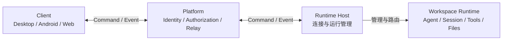
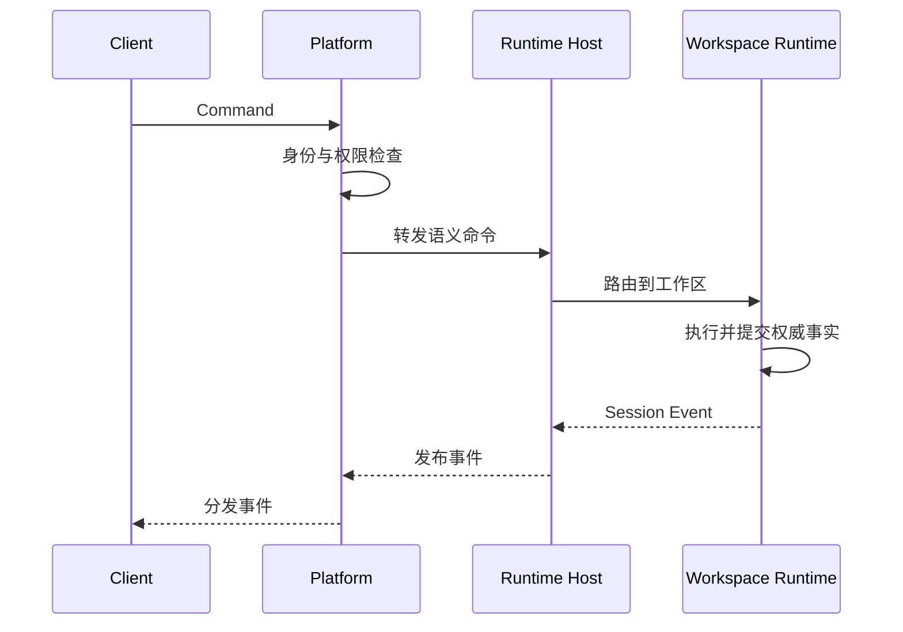

# OpenDrSai 远程工作区架构

> 核心定义：Client 通过 Platform 连接目标计算机上的 Runtime Host，由 Runtime Host
> 管理 Workspace Runtime；所有 Agent 执行和会话事实都保留在 Workspace Runtime。

## 1. 架构目标

OpenDrSai 远程工作区让用户可以从 Desktop、Android、Web 等客户端访问另一台计算机上
的工作区，并继续查看和操作同一组 Session。

无论客户端位于本机还是远端，系统都遵循以下原则：

1. Agent 始终在工作区所在计算机执行。
2. 不同客户端使用相同的领域对象、命令和事件。
3. 客户端只负责交互，不拥有权威执行状态。
4. 网络和部署方式不能改变各组件的职责边界。

远程工作区传输的是 Workspace、Session、Run、Event 和 Approval 等结构化对象，不是
远程桌面画面、鼠标或键盘输入。

## 2. 四层架构



### 2.1 Client

Client 负责人和 Agent 的交互：

- 选择计算机、工作区和会话；
- 创建会话、发送消息和取消执行；
- 显示模型输出、工具行为、审批和产物；
- 提交 Approval 决策；
- 保存可删除并重建的本地缓存。

Client 不执行远端 Agent，不直接操作远端进程，也不保存权威 Session、Run 或
Conversation 状态。

### 2.2 Platform

Platform 负责身份、授权、发现和跨网络连接：

- 用户与组织身份；
- 设备关联、访问范围和撤销；
- Runtime Host 注册、在线发现和路由；
- Client 与 Runtime Host 之间的网络中继；
- 有界的事件重放。

Platform 不读取工作区文件，不执行 Agent，不决定 Run 或 Approval 的业务状态，也不生成
Conversation 事实。

### 2.3 Runtime Host

Runtime Host 代表一台可连接的计算机，是机器级管理层：

- 保存稳定的机器身份；
- 主动连接 Platform；
- 发现和注册本机工作区；
- 启动、停止、升级和隔离 Workspace Runtime；
- 将命令路由到正确的 Workspace Runtime；
- 汇聚 Workspace Runtime 产生的事件。

机器身份与具体进程实例分离。开发版、安装版和不同 Workspace Runtime 不得共享同一个
未隔离的运行实例身份。

### 2.4 Workspace Runtime

Workspace Runtime 是一个工作区的 Agent 执行环境：

- 管理 Session、Run 和 Approval；
- 执行 Agent、Tool、Skill、MCP 和 Subagent；
- 操作工作区文件、Git 和进程；
- 保存 Conversation Journal；
- 生成 Session Event 和 Artifact。

Workspace Runtime 是其工作区中 Session、Run、Conversation 和执行结果的唯一权威来源。

## 3. 核心对象模型

```text
Runtime Host
  └─ Workspace Runtime
       └─ Session
            └─ Run
```

核心身份：

| 标识 | 含义 |
| --- | --- |
| `host_id` | 一台已注册计算机的稳定身份 |
| `workspace_id` | Runtime Host 上一个工作区的稳定身份 |
| `session_id` | 工作区中的一段持续会话 |
| `run_id` | Session 中的一次确定执行 |

客户端只使用不透明 ID，不使用主机名、IP、进程 PID、端口或绝对路径作为对象身份。

Session 创建时绑定 Workspace，Run 继承 Session 的 Workspace。一次 Run 创建后不能隐式
切换 Workspace。

用户和设备通过授权关系访问 Runtime Host 或 Workspace：

```text
User / Device ── Association + Scopes ──> Runtime Host / Workspace
```

## 4. 统一交互模型

所有客户端只执行两类操作：

1. 向 Workspace Runtime 发送命令；
2. 接收 Workspace Runtime 发布的 Session 事件。



### 4.1 Command

Command 表达客户端意图，例如：

```text
create_session
create_run
cancel_run
resolve_approval
archive_session
```

每个可重试写命令必须携带请求标识和幂等键。公网 API 不能直接映射到 Runtime 内部 REST
请求；Platform 和 Runtime Host 必须将其转换为稳定的语义命令。

Command 响应只表示请求的接收或提交结果。Client 仍通过 Session Event 获取权威状态，
不能根据响应自行构造权威 Conversation。

### 4.2 Event

Event 表达已经由 Workspace Runtime 提交的事实，例如：

```text
session_changed
message_changed
run_changed
tool_changed
approval_changed
artifact_changed
```

一个 Session 中的持久事件具有 Runtime 分配的严格顺序。Client 通过
Snapshot、Replay 和 Live Event 恢复并持续更新本地投影。

高频模型增量和工具进度可以使用瞬时流；最终消息、Run 状态、Tool 结果、Approval 和
Artifact 元数据必须写入持久 Journal。断线恢复保证最终事实一致，不要求重放每一个
瞬时 token。

## 5. 权威边界

系统只有三个权威边界：

1. **Platform** 是身份、授权和连接关系的权威。
2. **Runtime Host** 是计算机、工作区发现和运行实例状态的权威。
3. **Workspace Runtime** 是 Session、Run、Conversation 和 Agent 执行事实的权威。

Client 的本地数据库、Desktop 快照和 Platform 的事件缓存都是可重建投影，不得反向覆盖
Workspace Runtime 的权威状态。

## 6. 本地与远程统一

不同部署形态共享相同的对象、Command 和 Event 语义，只改变传输方式。

### Desktop 本机

```text
Desktop Client → Runtime Host → Workspace Runtime
```

### Desktop 远程

```text
Desktop Client → SSH Transport → Runtime Host → Workspace Runtime
```

### Android / Web 远程

```text
Android / Web Client → Platform Relay → Runtime Host → Workspace Runtime
```

SSH、Loopback HTTP、SSE 和 WSS 都是传输实现，不进入领域模型。Android 不需要 SSH，
Runtime Host 也不需要开放公网入站端口。

## 7. 架构不变量

1. Agent 在 Workspace 所在计算机执行。
2. Client 发出命令并接收事件，但不拥有执行事实。
3. Platform 管理身份、授权和连接，不执行 Agent。
4. Runtime Host 管理计算机和 Workspace Runtime，不实现会话业务。
5. Workspace Runtime 是 Session、Run 和 Conversation 的唯一权威来源。
6. 所有客户端共享相同的 Workspace、Session、Run、Command 和 Event 语义。
7. 本地访问、SSH 访问和 Relay 访问只改变传输，不改变领域模型。
8. 公网请求必须转换为语义命令，不能直接代理 Runtime 内部接口。
9. 写命令必须幂等，Session 事件必须有序且可恢复。
10. 客户端缓存和 Platform 回放可以删除并重建，不能产生第二份权威事实。

## 8. 专题设计边界

主架构只定义稳定的组件职责、对象关系和交互语义。以下内容属于专题设计：

- Runtime Host 生命周期、升级和多实例隔离；
- Platform enrollment、扫码关联、设备证明与撤销；
- Command/Event 协议、版本协商和幂等；
- Conversation Journal、Snapshot、Replay 和 Live Event；
- SSH、Loopback、HTTPS、SSE 和 WSS 传输；
- Android Room 与 Desktop 本地投影；
- 凭据存储、日志脱敏和审计；
- Relay 多 Worker、generation fencing 和故障恢复；
- 稳定性测试、故障注入和发布门禁。

专题设计可以演进，但不能改变本文件定义的四层职责和三个权威边界。
