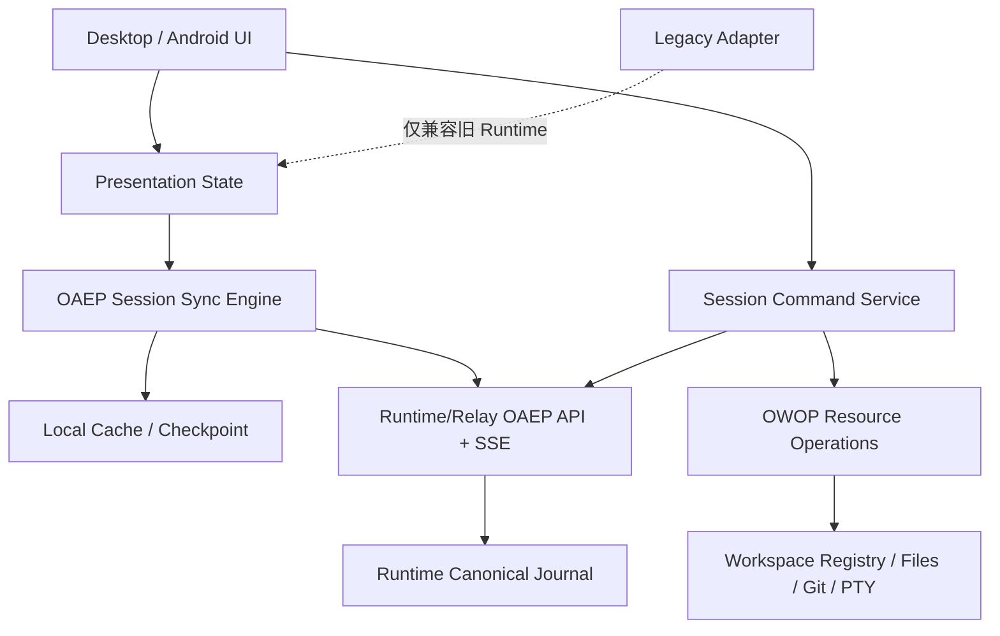

# OpenDrSai 移动远程工作区 P5 产品收敛与易用性开发方案

> 状态：开发中（第 73 轮）  
> 日期：2026-08-05  
> 前置方案：`OpenDrSai移动远程工作区开发方案V4.md`  
> 阶段定位：V4 解决“协议正确、链路可靠、可验证”，P5 解决“实现收敛、用户易懂、长期可维护”。

## 0. 实施进度

当前完成 **29/48（60.42%）**。只有代码、自动测试和对应门禁均通过的功能点才计为完成。

| 轮次 | 已完成 | 本轮完成 | 验收证据 |
|---|---:|---|---|
| 第 1 轮 | 8/48（16.67%） | M01-F01～F06；M02-F01、M02-F03 | Desktop Node typecheck、OAEP Session Stream、Session Conversation matrix；Android clean compile、Relay matrix 与 SingleFlight 定向测试；Python OAEP selection/protocol 10 passed；四端 schema `--check`；P5 architecture gate |
| 第 2 轮 | 16/48（33.33%） | M02-F02、M02-F04～F06；M05-F02、F03、F05、F06 | Desktop pairing Host Context API、暂停/注销危险操作分层、脱敏设备详情、安全重命名和连接诊断；Desktop Web/Node typecheck、配对 controller/security/UI 门禁、5 类诊断 fixture；Android 生命周期全状态转换矩阵、离线缓存 TTL/来源/过期原因/容量门禁、飞行模式缓存回退、100 次资源租约释放、paused 状态兼容；Python Relay/Mobile Pairing 54 passed；Android 定向矩阵通过 |
| 第 3 轮 | 21/48（43.75%） | M03-F01～F03、M03-F05～F06 | Android 主机/工作区/会话活动聚合和优先级 fixture；连接状态唯一 CTA 与原始异常清除；账号/Runtime/Session 三重隔离加密草稿、100 次切换及重建恢复；10k Item 虚拟列表、过滤、未读分界与不打断阅读；在线目录和本地缓存消息统一搜索及来源标签。JVM Remote 全量通过；Emulator 真实加密存储/Room/Compose 22 passed；Android APK/Test APK 构建通过。M03-F04 已完成共享合同、Reference Relay、Windows Gateway Control、Android UI/Client 与本地测试，但仍等待 HAI Relay 部署和 Windows/Android 双端实时 E2E，暂不计入。 |
| 第 4 轮 | 22/48（45.83%） | M08-F03 | 新增唯一发布入口 `remote-workspace accept <phase>`，`--list` 明确列出 architecture/local/real-device/two-device/stability/secret-scan/finalize 及 OAEP+OWOP 协议；CI/package 发布入口禁止直接调用 V2/V3/V4 驱动，CLI 测试 2 passed。同步完成 P5 evidence schema/finalizer、消息交付/Approval/Run 控制、按 Runtime 清理缓存以及 Android 协议遥测候选代码；Python Relay/Runtime 73 passed、P5 finalizer 4 passed，但 Android Gradle 后续验收被平台额度门禁拒绝，候选项暂不计入。 |
| 第 5 轮 | 22/48（45.83%） | 无新增正式完成项 | 完成 M06-F03/F05/F06 候选实现：Android 文本 delta 按 16ms 帧合并，32KiB 强制无损冲刷，终态/Approval 作为屏障；Desktop 帧合并门禁通过。补齐 OAEP/Session journal 容量上限以及账号、Runtime、Workspace 三级数据清理；后台停止 SSE 重连循环；蜂窝大文件需确认且有绝对大小上限。Android 单元、Room 与真机门禁因平台 Gradle 执行额度不可用而待验收，因此不计入完成数。 |
| 第 6 轮 | 23/48（47.92%） | M08-F04 | 完成唯一 P5 evidence schema/ledger/finalizer：严格校验 48 个功能、Release 构建、HTTPS Relay、环境指纹、八类非空证据与两台不同物理设备；缺证据、混环境、旧 schema、Debug 包、模拟器和重复设备均 fail closed，JSON Schema 与 finalizer 正反测试 4 passed。同步完成 M07-F04 候选安全修复：公网审计不再返回原始 subject，Android 使用用户可读动作和安全 actor label；Relay 40 passed，但 Android UI 构建门禁待恢复。M06-F02 审计确认现有 checkpoint 尚未满足 100k Event 窗口化冷启动，保持未完成。 |
| 第 7 轮 | 23/48（47.92%） | 无新增正式完成项 | 完成密钥生命周期与历史证据复核：Runtime key rotation/replay 与 Android device proof 已有基础，但缺少“移动设备 key rotation + 旧 association 原子换钥”合同，M07-F03 不提前计入。V3 `fault-matrix.json` 通过，但 `real-stability-1h.json` 的最终 `passed=false`，因此不能复用为 M06-F04/M08-F06 证据。Relay/registry/finalizer/CLI 60 passed，Desktop Node/Web typecheck 通过。 |
| 第 8 轮 | 23/48（47.92%） | 无新增正式完成项 | 完成 M06-F02 候选实现：OAEP Snapshot 固定检查点、1～500 Item 有界窗口、Runtime 本机密钥认证的不透明 keyset cursor、Relay 精确转发、Android 最近窗口与按需加载更早历史；OAEP 检查点使用独立持久表并通过 SQLite 游标流式计算规范哈希。25 Item 多页无重无漏、新 Event 不污染旧检查点、篡改/跨 Session 游标 fail closed；100,000 Item 冷启动仅返回 100 Item、响应小于 256 KiB、峰值内存小于 32 MiB且最终全量 OAEP hash 一致。共享 Schema/fixture/三端生成类型已更新；Python 定向回归 91 passed、100k 门禁通过、OAEP/Relay codegen `--check` 与 Desktop typecheck 通过。Android codec/Room/UI 测试已编写，但 Gradle 配额门禁尚未恢复，故严格保持未完成。ADR：`ADR-P5-001-OAEP-Snapshot检查点与窗口化历史.md`。 |
| 第 9 轮 | 24/48（50.00%） | M08-F02 | Runtime 的 legacy Conversation/Snapshot/Event/SSE 路由、Relay 对应 4 个公网路由以及 Conversation/Session Event DTO 已物理迁入 `drsai.compatibility`；原函数名继续作为冻结别名，旧 URL、OIDC/Workspace 授权、SSE wire shape 和 Pydantic 合同不变。架构门禁禁止 Runtime/Relay 主 API 重新声明旧路由、禁止 OAEP core 反向 import compatibility，并验证旧 DTO 只能定义在兼容模块。Runtime/Relay/Journal/OpenAPI 联合回归 102 passed；P5 architecture、Relay codegen、OpenAPI drift 与 backward-compatibility 检查全部通过。 |
| 第 10 轮 | 24/48（50.00%） | 无新增正式完成项 | 完成 M08-F01 候选闭环：Desktop 协议选择遥测按 protocol/version/枚举 fallback reason 有界持久化，未知原因统一折叠为 `other`，不允许形成用户或正文维度；新增 OAEP/legacy/unavailable 比例、版本分布、fallback 分布、迁移率及两版本删除门槛报告。10k 观测、重启恢复、128 版本上限、secret canary、99.9%/0.1% 边界与删除决策正反门禁通过；Desktop typecheck 通过。Android 同口径脱敏与 instrumentation 测试已补齐，但 Gradle 门禁仍待恢复，故暂不计入 M08-F01。 |
| 第 11 轮 | 25/48（52.08%） | M05-F01 | 复核并闭合可逆暂停/恢复：Relay enrollment `paused` 时 Runtime 目录保留可见状态但所有身份/代理访问 fail closed 为 `runtime_paused`，新配对被拒绝，已有 association 不撤销；恢复后原 association 立即可用，无需重新扫码。Desktop 普通开关只调用 pause/resume，永久 enrollment revoke 保持独立危险入口；Android 已有 paused 状态与唯一恢复说明。Registry/API/Mobile Pairing 55 passed；Desktop controller、安全与 UI 共 44 项门禁及独立二维码解码通过。 |
| 第 12 轮 | 26/48（54.17%） | M05-F04 | 完成 Host 级配对验收：Desktop pairing controller、API 与二维码 payload 均不接收或携带 Workspace 目标；新增状态化本地 E2E，从未注册冷启动且 Workspace catalog 为空开始，经过显式启用 Runtime、生成一次性二维码、模拟已认证 Android 原子消费、查询已授权设备列表，确认 association 仅绑定 Runtime host。Host E2E、controller 竞态、安全 19 项、UI 25 项及独立二维码解码全部通过。 |
| 第 13 轮 | 26/48（54.17%） | 无新增正式完成项 | 完成 M06-F01 本地聚合核心候选：定义 Journal append、Runtime WSS send、Relay fanout、client receive、client render 五个固定阶段；每段使用组件本地耗时，避免跨机器时钟偏差；同一 correlation/stage 重放幂等，30 天有界保留。报告仅输出完整/缺失样本数、阶段 P95/最大值及自动定位的 P95 瓶颈，不输出 correlation、资源标识或正文。100 条完整 trace + 缺段 trace、重放、非法阶段、NaN、正文维度拒绝共 5 tests passed。实际四组件埋点及跨端汇聚尚未闭合，故保持未完成。 |
| 第 14 轮 | 26/48（54.17%） | 无新增正式完成项 | 完成 M07-F03 服务端与 Android 候选：Reference Relay 的生产 OIDC 数据请求新增 Ed25519 设备 proof、60 秒时间窗、body/token hash 绑定和每 association nonce 防重放；新增由旧密钥签名覆盖的原子换钥端点，换钥成功后旧 key 立即 fail closed。Android 使用“内存生成新 key→旧 key 发请求→Relay 成功后才落盘”的两阶段提交，失败/进程终止保留旧 key；device_id 从旧版公钥派生值一次迁移为稳定标识，换钥不改变 association identity。共享 capability/endpoint、Python/Kotlin 生成类型与 OpenAPI 已同步；合同、Registry、API 51 passed。Android 成功/失败换钥测试已编写，仍待 Gradle/真机执行及跨设备复制验收，因此不计入完成数。 |
| 第 15 轮 | 27/48（56.25%） | M07-F01 | 完成设备绑定的 Workspace 授权范围：可信 device principal 贯穿 Runtime/Workspace 授权；一次性 access grant 原子绑定 `all/selected` 与 allowlist，Android 上报范围必须与 grant 完全一致，不能自行扩大；Runtime 目录按 device association 过滤，Workspace 目录按 allowlist 过滤，所有 Session/Run/Event/Approval/OWOP 入口继续在 `runtime_call` 前调用统一 Workspace 门禁。Desktop 配对弹窗明确选择“全部/指定工作区”，只展示工作区名称，切换范围会撤销旧 pending grant 并生成新二维码。A 仅见 W1、B 见 W1/W2、A 访问 W2 在代理前 403；Relay/合同/Mobile Pairing 69 passed，Desktop Node typecheck、controller/scope/竞态、安全 19 项、UI 25 项、Host E2E 全通过。Web 全局 typecheck 仅剩并行 Agent Square 未完成符号，与本功能无交叉。 |
| 第 16 轮 | 28/48（58.33%） | M07-F02 | 完成设备权限说明与只减不增的授权变更：association 显式持久化 `read/send/approve/files`，Desktop 设备列表同时展示权限和 Workspace 范围，并提供“设为只读”；授权变更只能缩减，扩大权限或 Workspace 范围均返回 `authorization_expansion_forbidden`。Relay 在缩减后向该 Runtime 的现有 OAEP 订阅注入控制标记并立即断流，重连请求按新权限在 Runtime 代理前 fail closed。共享 capability/endpoint、Python/Kotlin 生成合同和 OpenAPI 已同步；Python Relay/API/Registry/Mobile Pairing/合同 70 passed，Desktop Node typecheck、controller、security 21 项、UI 26 项与 Host E2E 全通过。 |
| 第 17 轮 | 28/48（58.33%） | 无新增正式完成项 | 完成 M07-F05 候选闭环：用户主动解除、Windows 单设备撤销、Runtime 注销和暂停均立即终止既有 OAEP 流；新增 A/B 设备隔离验证，A 解除后新请求 403，B 的原 association 与 Workspace 访问不受影响。Android 已提供“仅解除关联/同时清除本机缓存、草稿和历史投影”选择，账号退出同步取消订阅并按 subject 清除 OAEP、Conversation、Session Event、Approval、Run、Session、Workspace 与 Runtime 投影；本地清理失败不会伪装成撤权失败。Python/CLI/架构 73 passed，OpenAPI 与兼容门禁通过；因本轮 Android 源码尚待 Gradle 恢复后编译和真机复核，严格保持未完成。 |
| 第 18 轮 | 28/48（58.33%） | 无新增正式完成项 | 完成 M06-F01 候选跨端闭环：Runtime Journal 在权威事务内记录 `journal_append`，Outbound Connector 在真实写入 WSS 后记录 `runtime_wss_send` 并以独立无正文 telemetry 帧发送；Relay 只接受已进入当前 generation replay 的 Event 观测并记录 `relay_fanout`；Android SSE 解码与投影刷新分别记录 `client_receive/client_render`。五阶段统一使用 OAEP `event_id` 作为内容无关 correlation，各组件只提交本地 duration，规避跨机器时钟偏差；Relay 报告只输出样本数、阶段 P95/最大值与瓶颈，不输出事件、资源或正文。Python 联合回归 149 passed，架构/Relay/合同收口 78 passed；Android 上报代码和单测已补齐，仍待 Gradle 编译后转正。 |
| 第 19 轮 | 28/48（58.33%） | 无新增正式完成项 | 复核 M06-F02 候选闭环：Runtime 的固定 checkpoint、1～500 Item 有界窗口、认证且防篡改的不透明 keyset cursor、Relay 精确转发以及 Android 最近窗口首屏/按需加载更早历史保持一致。100k Event 冷启动、完整 OAEP hash、分页无重无漏、游标篡改和跨 Session 复用 fail closed 等 25 tests passed；Android checkpoint hash/count/sequence、window cursor 与“加载更早历史”入口纳入架构门禁并通过。仍待 Gradle/Room 真机门禁恢复后转正。 |
| 第 20 轮 | 28/48（58.33%） | 无新增正式完成项 | 修正 M06-F03 候选实现的主路径缺口：旧实现仅对 legacy Run stream 做 16ms 合并，OAEP 仍逐 Event 全量刷新。现改为每个 OAEP Event 继续原子提交 Room/游标，但 `event.item.delta` 只按 16ms 帧刷新投影；任一非 delta（含终态和 Approval Item）先取消待处理帧并从权威投影刷新，保证屏障不丢失。Desktop 10,000 delta 单帧无损合并、终态立即冲刷和 Node typecheck 通过，P5 架构门禁禁止 OAEP 回退为逐事件渲染。Android 仍待 Gradle 编译和真机性能复核后转正。 |
| 第 21 轮 | 28/48（58.33%） | 无新增正式完成项 | 修正 M06-F05 候选容量缺口：旧实现仅裁剪 OAEP/Session/legacy Event，权威 OAEP Item 投影可无限增长。现按账号同时限制 Event 与已终态且非 optimistic 的 Item；运行中、等待中和本地待发送 Item 永不被后台治理误删，被裁剪历史可由 checkpoint + Snapshot 按需重建。Android Room 测试新增 A/B 账号隔离、运行中保留、终态上限和完整账号清理断言；P5 架构门禁及 100k Snapshot 门禁通过，待 Gradle/Room 真机复跑后转正。 |
| 第 22 轮 | 28/48（58.33%） | 无新增正式完成项 | 完成 M06-F06 候选实现：Android 仅在前台且在线时维持 Session 事件流，退到后台立即停止 SSE，回到前台或换网后从已提交游标恢复；重连改为有上限的指数退避和抖动，仅对网络异常、429 与 5xx 重试，业务错误 fail closed，并限制单次恢复窗口。大文件下载继续执行蜂窝网络确认与 256 MiB 绝对上限。P5 架构门禁通过，Relay/CLI 回归 28 passed；待 Android Gradle 编译及真机前后台/换网验收后转正。 |
| 第 23 轮 | 28/48（58.33%） | 无新增正式完成项 | 完成 M04-F03 候选收敛：Approval UI 已展示风险、作用域、过期时间和决策中状态；本轮补齐跨设备终态收敛，Session 流收到 `approval.resolved` 后立即映射 approved/denied/cancelled/expired、移除可操作卡片，并明确提示“可能由另一台已授权设备处理”。本机提交遇到竞态或响应异常时不再盲目恢复为待确认，而是查询脱敏审计并收敛到权威终态；仅无法取得终态时允许重试。P5 架构门禁通过，Runtime/Relay/Approval 竞态回归 32 passed；待 Android 编译与两端并发 1 秒内收敛真机验收后转正。 |
| 第 24 轮 | 28/48（58.33%） | 无新增正式完成项 | 完成 M04-F04 候选修正：此前状态枚举虽存在，但发送前的 Session 查询失败会导致用户消息根本不落本地，且 optimistic 状态未真实出现。本轮将用户 Item 在任何网络请求前原子落为 optimistic，进入有副作用的 Run create 前转为 sending，服务端接收后为 accepted，权威 Snapshot/Event 再推进 running/completed。明确记录副作用边界：请求发出前失败为 failed；请求发出后遇到网络异常或 5xx 才为 uncertain，禁止把确定失败误报成不确定。`source_message_id` 继续作为去重键。P5 架构门禁通过，Relay/幂等回归 44 passed；待 Android 编译、断网前后及 UI 文案真机验收后转正。 |
| 第 25 轮 | 28/48（58.33%） | 无新增正式完成项 | 完成 M04-F05 候选实现：Run create 遇到响应丢失、Relay 5xx 或 Runtime 重启时不再重新 POST，而是以原 `idempotency_key/source_message_id` 有界查询权威结果；短暂离线返回“尚未确定”而不是伪造失败。Android 将 uncertain Item 持久化，前台重连时逐项查询 idempotency result，找到权威 Run 后推进 accepted 并继续用 OAEP Snapshot/Event 收敛；查不到时保留 uncertain，绝不盲目重执行 Tool/Approval。恢复响应继续校验 Runtime/Workspace/Session 三重作用域。P5 架构门禁通过，Relay/Runtime 幂等回归 51 passed；待 Android 编译及 504、Runtime 重启、响应丢失真机故障注入后转正。 |
| 第 26 轮 | 28/48（58.33%） | 无新增正式完成项 | 完成 M04-F06 候选收敛：取消请求响应异常时，Android 立即读取权威 Run；若另一端已完成、失败或取消则直接收敛，不显示误导性失败。OAEP 任一终态事件都会清除取消/重试中的 UI 状态。重试的幂等键统一派生为 `retry:{failed_run_id}`，Reference Runtime 与 Windows Gateway Control 均在服务端强制此规则，因此 Android/Desktop 即使携带不同 request id，同时重试也只产生一个替代 Run；Approval 继续复用上一轮的权威终态收敛。P5 架构门禁通过，Run/Approval 竞态回归 33 passed；待 Android 编译及双端同时 cancel/retry 真机验收后转正。 |
| 第 27 轮 | 28/48（58.33%） | 无新增正式完成项 | 完成 M04-F01 本仓库候选边界：Reference Relay 在 OAEP Event 通过 generation/sequence/identity 校验后，仅为完成、失败、取消和等待处理生成有界、去重的通知 outbox；固定载荷只含 version/kind/runtime/workspace/session/event/item 等 opaque identity，不含正文、命令、路径或 reasoning。Android 新增 UID 私有通知接收器，通知只显示“任务需要处理/已完成/需要查看”和“打开 OpenDrSai 查看详情”，点击后用 opaque identity 进入对应 Session，再由前台按 OIDC/device proof 拉取正文。P5 架构门禁通过，通知/Relay/OAEP 回归 31 passed。仍缺 HepAI Platform 的真实推送供应商适配、Android 编译及杀进程真机证据，因此不转正。 |
| 第 28 轮 | 28/48（58.33%） | 无新增正式完成项 | 完成 M04-F02 候选导航闭环：通知深链固定指向 Runtime/Workspace/Session，并携带可选 Event/Item opaque identity；App 进入 Session 后在权威投影出现目标 Item 时自动切换到完整时间线并滚动定位。待恢复路由与 Item id 存入独立本地导航状态，登录过期时不提前消费，只有 OIDC 恢复且进入 Chat 主界面后才一次性消费并清除，因此支持锁屏、冷启动、已登录与登录跳转期间进程被杀。外部入口仍只允许既有 `opendrsai` host，内部通知 receiver 保持不可导出。P5 架构门禁及通知/Relay/OAEP 回归 31 passed；待 Android 编译与四场景真机验收后转正。 |
| 第 29 轮 | 28/48（58.33%） | 无新增正式完成项 | 完成 M07-F06 候选工具收敛：新增 P5 唯一跨边界 secret scan assembler，严格要求 Android APK/log/Room/backup、Windows DB/DPAPI/log/dump、Relay PostgreSQL/Redis/log 共 11 个非空来源；三端报告必须绑定同一 environment 与一次性 canary run，原始产物不得跨信任边界。Android/Windows endpoint collector 已拆分 Room/backup 与 DB/DPAPI，诊断内容并入 Windows log 边界扫描。P5 evidence schema/finalizer 现在强制校验 11 来源、3 份边界报告哈希、零命中及环境一致性；缺来源、空来源、泄漏、混环境、混 canary、原始导出均 fail closed。架构门禁、schema/finalizer/assembler 9 tests 与 Python 语法门禁通过；待三端真实 canary 报告后转正。 |
| 第 30 轮 | 28/48（58.33%） | 无新增正式完成项 | 完成 M07-F04 候选加固：Reference Relay 新增有界、无正文的设备动作归因表，按 Runtime/Workspace/Run/action 记录 opaque device identity；审计查询仅返回“此设备/另一台已授权设备/已授权设备”，不返回 device id。Android 审计页现在逐项展示用户可读动作、操作方、工作区和时间，移除内部 correlation id，并继续禁止命令参数、正文和路径进入 UI。未知或被容量淘汰的归因安全降级为“已授权设备”。P5 架构门禁及 Relay/Audit 45 passed；待 HAI 持久化适配、Android 编译与跨设备真实操作验收后转正。 |
| 第 31 轮 | 28/48（58.33%） | 无新增正式完成项 | 加固 M08-F05 条件删除门禁，但未执行 Legacy 删除：统一阈值为连续至少 2 个发布周期、14 天观测、OAEP 选择率 ≥99.9%、Legacy 请求率严格低于 0.1%、迁移率 100%、fallback 错误率 ≤0.1%。删除前还必须提供可读取且 SHA-256 匹配的回滚包、数据库迁移实证，以及迁移前后相同的规范化 transcript hash；只在 JSON 中声明“已验证”不再有效。阈值边界、缺物理回滚包、摘要漂移、迁移证据漂移均 fail closed。架构门禁及兼容/物理证据 13 tests 通过。因真实遥测尚未达到并冻结门槛，按方案要求不删除旧 DTO/表/路由，M08-F05 保持未完成。 |
| 第 32 轮 | 28/48（58.33%） | 无新增正式完成项 | 完成 M06-F04 的 P5 稳定性硬门禁与证据汇聚候选：最终账本必须绑定同一环境的 3600 秒报告、Android 后台/进程死亡/换网/Runtime 重启/Relay 重启五类故障、零 sequence 重复与缺口、零副作用再次执行、Relay P95 <2 秒、Windows 内存与句柄斜率阈值，以及 Android/Desktop/Runtime 三端完全相同的规范化 transcript SHA-256。端侧只输出无正文摘要，原始 transcript 不跨信任边界；短时、混合环境、摘要不一致、故障不完整和副作用重放全部 fail closed。稳定性汇聚及 P5 finalizer 7 tests、Python 编译和架构门禁通过；仍需真实两台物理设备完成一小时联合故障运行，故暂不转正式完成。 |
| 第 33 轮 | 28/48（58.33%） | 无新增正式完成项 | 完成 M08-F01 Reference Relay 遥测候选：OAEP snapshot 与隔离的 Legacy Conversation/Snapshot/Event 路由现在进入同一个 SQLite 聚合器，只按 protocol、Runtime version、标准化 fallback reason 计数，最多保留固定维度且计数有上界；公开报告给出 OAEP/Legacy 请求占比和“尚缺发布周期、观测天数、迁移实证”的删除决策，不包含 subject、Workspace、Session、token 或正文。非法协议拒绝，危险版本/reason 归一为 unknown/other。Relay、Registry、选择矩阵及遥测 31 tests 和架构门禁通过；HAI Platform 生产适配与至少两个发布周期的真实遥测仍未冻结，因此保持候选。 |
| 第 34 轮 | 28/48（58.33%） | 无新增正式完成项 | 完成 M04-F01 Relay 可靠推送边界候选：accepted OAEP 终态先生成无正文 opaque intent，再按当前 active association 的稳定 device_id 扇出到 SQLite delivery queue；`(event_id, device_id)` 唯一约束防重复，claim 使用租约支持进程崩溃恢复，失败采用有界指数退避，成功不再重投，达到上限进入 dead。Platform provider 仅接收 device_id 与 opaque payload，token 解析留在平台边界；message/command/path/reasoning 不进入载荷。通知、Replay、Relay API、Registry 51 tests 和架构门禁通过；真实 HepAI push provider、系统通知到三星冷启动四场景仍待联调，故保持候选。 |
| 第 35 轮 | 28/48（58.33%） | 无新增正式完成项 | 加固 M07-F05 Android 清理候选：发现 `clearSubject` 漏掉 7 张 workbench 表，且退出未清通知深链、系统通知和已接受的远程指令版本。现已在同一 Room 事务删除 OAEP/Legacy/目录/Approval 之外的 workbench workspace/session/run/event/approval/grant/audit；退出同步清空 durable deep link 与可见导航状态、取消系统通知、按 subject 清指令版本；“解除并清缓存”同时按 Runtime 清草稿、活动状态、指令版本与全部 Runtime 投影，另一账号数据保持隔离。架构 fail-closed 门禁和 diff 检查通过；Room schema 编译、真实 A 退出→B 登录与可选清理实机测试受 Android Gradle 门禁限制，暂不转正。 |
| 第 36 轮 | 28/48（58.33%） | 无新增正式完成项 | 修复 M03-F04 的真实同步缺口：此前 Android 已有重命名/归档/取消归档 UI 与 PATCH API，但 Workspace 会话目录没有实时订阅，Windows 操作后只能手动刷新。新增 Relay 所有的 `session-catalog-events/stream`，每个可见 Workspace 仅一条 SSE；OAEPReplayHub 只扇出 `event.session.*` 的 event_id/session_id/type/sequence，无正文且授权变更立即断流。Android 连接成功先权威刷新，目录事件触发 single-flight 刷新，EOF/弱网按 0.5～15 秒有界退避；默认仍只列 active，可切换 archived 并恢复。共享 schema、Python/Kotlin generated types、OpenAPI 已再生；Relay/Runtime/合同 96 tests、架构与 diff 门禁通过，Android MockWebServer 测试已补但待 Gradle 执行和 Windows→三星实链路，因此保持候选。 |
| 第 37 轮 | 28/48（58.33%） | 无新增正式完成项 | 加固 M07-F04 审计持久性并启动跨仓联调：设备动作归因从进程内 `OrderedDict` 迁为有界 SQLite；只持久化 Runtime/Workspace/Run opaque ID、动作、时间和 device_id 的 SHA-256，Relay 重启后仍能显示“此设备/另一台已授权设备/已授权设备”，原始 device_id、命令参数和正文不落盘，容量超限按最旧记录淘汰。Windows 文件句柄泄漏专项修复后 Relay/API 28 tests 与架构门禁通过。已向正确的 ai-dev 任务发送生产 HAI 适配清单，并向 Android 真机任务发送编译与 Room/MockWebServer 验收清单；等待其独立回传，正式进度暂不增加。 |
| 第 38 轮 | 28/48（58.33%） | 无新增正式完成项 | 解除跨仓合同阻塞并取得首批 Android 编译证据：Android `compileDebugKotlin` 通过，6 个聚焦 JVM 类 41/41，通过 instrumentation 源码编译；三星未出现在 ADB，故没有用模拟器冒充真机。ai-dev 邻接仓库因无法读取 Windows 脏工作树而看到旧 OpenAPI，现新增自包含 `p5-platform-adapter.contract.json`，冻结 catalog SSE、usage report、opaque push、授权、租约/重试及全部 DTO，SHA-256 为 `ffd2eceb…ecfa`；Draft 2020-12、自引用和额外正文拒绝 2 tests 通过，并已把逐字节压缩 JSON 直接交给正确 ai-dev 任务核验摘要后实施。正式进度等待生产适配与真机，不提前增加。 |
| 第 39 轮 | 28/48（58.33%） | 无新增正式完成项 | 加固 M03-F04 的 HTTP/背压验收：未获授权的 catalog SSE 在创建 queue 前即 403/404，不能据订阅状态推断 Workspace；每 Workspace queue 固定容量 64，慢消费者溢出只增加 content-free 指标，客户端断开后 unsubscribe 回到零；授权缩减/撤销通过统一 runtime invalidation 注入控制帧并立即结束流，客户端重连先权威刷新，因此不依赖丢失的目录事件。新增授权前置、慢消费者、无残留订阅测试；Relay/API/Platform 合同 34 tests 与架构门禁通过。Android 真机与 HAI 生产适配仍待回传，正式进度不变。 |
| 第 40 轮 | 28/48（58.33%） | 无新增正式完成项 | 完成跨增量大回归与合同字节修正：Android 完整 JVM 415 项中 413 passed、2 个真实模型服务项 skipped、0 failed，AndroidTest APK 构建成功；三星仍 ADB 离线。ai-dev 对压缩 JSON 与格式化摘要不一致正确 fail closed，随后已发送权威文件原始 Base64，要求解码后严格匹配 `ffd2eceb…ecfa`。本机首轮 286 项组合回归发现 OpenAPI 漂移和 4 个旧 reasoning segment 断言；确认 OAEP schema 已要求 kind/visibility/source 后保留实现语义、更新过期测试，并重新生成 OpenAPI。同一 Relay/OAEP/Journal/Gateway/P5 集合最终 286/286 passed。正式进度仍等待生产和真机证据。 |
| 第 41 轮 | 28/48（58.33%） | 无新增正式完成项 | 将 `p5-platform-adapter.contract.json` 的实际 SHA-256 纳入 P5 最终账本和 JSON Schema。finalizer 不再只接受任意合法摘要，而是逐字节计算本仓库权威平台合同并要求环境证据精确匹配；缺摘要、格式错误或 HAI 部署合同漂移均 fail closed 为 `p5_platform_contract_*`。Schema/finalizer 与平台合同正反 4 tests passed。已要求正确的 ai-dev 任务仅回传生产 revision、端点、测试和未完成项；在生产证据返回前不增加正式完成数。 |
| 第 42 轮 | 28/48（58.33%） | 无新增正式完成项 | 关闭唯一残留的 Android SDK emulator，确认三星当前未连接，继续禁止以模拟器替代物理设备证据。审计发现现有 Android secret collector 依赖 debug receiver/run-as，而最终账本要求 Release 构建，存在“扫描 Debug APK、验收另一个 Release APK”的替换漏洞。现将端侧报告绑定精确安装 APK SHA-256，P5 assembler 保留该摘要，finalizer 强制它与 Release build SHA-256 相同；Android 摘要缺失、非法或不同 APK 均 fail closed。Secret assembler/schema/finalizer/platform contract 共 11 tests passed。仍需实现并执行可扫描正式产物的端侧入口，故 M07-F06/M08-F06 不转正。 |
| 第 43 轮 | 28/48（58.33%） | 无新增正式完成项 | 新增 Android 正式产物端侧扫描入口 `P5ReleaseSecretScanTest` 与无原始导出的 collector：instrumentation 首先强制目标 APK `debuggable=false`，在设备内生成一次性随机 canary，仅在设备内扫描精确安装 APK、Room/WAL/SHM 所在目录、files/no-backup/shared-prefs 备份面和目标 PID 日志；外部只接收四来源非空计数、零命中与 APK SHA-256。模拟器默认拒绝，Debug APK 默认拒绝，原始文件和日志不再拉到 Windows。Debug AndroidTest 与真实 Release AndroidTest 两种 Kotlin 编译均成功；collector/assembler/finalizer 15 tests 和架构门禁通过。因三星未在线，尚未执行非调试安装包端侧测试，正式进度不增加。 |
| 第 44 轮 | 28/48（58.33%） | 无新增正式完成项 | 加固端侧与最终验收防伪：物理设备判定同时检查 fingerprint/model/product/hardware；Android endpoint 必须证明 `debuggable=false`、`allowBackup=false`、APK SHA-256 合法且四来源均非空 clean；P5 finalizer 额外拒绝重复或超过 48 行的功能证据，不能用重复 passed 行绕过完整集合。加固后的 Release AndroidTest 编译成功，collector/assembler/finalizer 17 tests passed。ai-dev P5 适配已完成 12/12 新增集成测试，现有定向回归无断言失败但存在 ASGITransport 退出挂起，仍在分组定位且尚无部署 revision，因此不增加正式进度。 |
| 第 45 轮 | 28/48（58.33%） | 无新增正式完成项 | 生成可与已登录 Debug App 并存的非调试 MVP 内部发布产物及其同变体 AndroidTest：主 APK 继承 Release 的 R8/资源压缩、`allowBackup=false` 且无 debuggable 标志，SHA-256=`07283fdc…06d4`；测试 APK SHA-256=`6d8c21b1…0ca9`。`:app:assembleMvp` 与 `:app:assembleMvpAndroidTest` 共 87 个任务成功。它们已准备在三星恢复 ADB 后执行设备内 P5 扫描，且 finalizer 会把扫描 APK 摘要与 build 摘要精确绑定；目前未在物理设备执行，因此不计正式完成。 |
| 第 46 轮 | 28/48（58.33%） | 无新增正式完成项 | 收敛 secret scan 的唯一操作入口：`remote-workspace accept secret-scan android|windows|assemble` 分别路由到 P5 Android 设备内 collector、Windows endpoint collector 和 P5 跨边界 assembler，发布操作不再要求直接调用 V3 文件名；`--list` 已显示新的 P5 driver。修正 Release-only instrumentation 在 Debug 测试套件中为显式 skip 而非破坏全套测试，MVP R8 后类名/方法仍可由 runner 精确发现；最终测试 APK SHA-256=`c265f086…677f`。CLI/collector/assembler/finalizer 20 tests、Debug AndroidTest 编译、MVP AndroidTest 打包和架构门禁全部通过。三星仍未连接，正式进度不变。 |
| 第 47 轮 | 28/48（58.33%） | 无新增正式完成项 | HAI Platform P5 additive adapter 已在正确的 ai-dev 环境选择性提交并部署，完整 SHA=`ab95414434bc4ecf2ce4ab0f746da0ead2905d53`；新增 P5 12/12、P5+OIDC 31/31，既有 Relay 排除已知 ASGITransport 退出挂起后连续 116 项无断言失败。本任务独立公网复核：v2 health/OpenAPI 均 200、OpenAPI 2.0.0，目录 SSE 和 protocol-usage 端点存在，SSE 为 `text/event-stream` 且 `SessionCatalogEvent` schema 存在，权威合同哈希 `ffd2eceb…ecfa` 出现 2 次；两个新增端点无凭据均 401。仍缺真实已授权设备目录 SSE、Android protocol telemetry instrumentation 和外部系统推送 provider，因此相关候选不转正。 |
| 第 48 轮 | 28/48（58.33%） | 无新增正式完成项 | 新增公开部署合同取证器，不再依赖人工把期望哈希抄入 ledger：仅允许 HTTPS，直接读取目标 Relay v2 OpenAPI，要求目录 SSE、protocol-usage 两个 operation 同时携带本地权威合同 SHA-256，且 SSE media type 和 `SessionCatalogEvent` schema 完整；缺端点、单端漂移、HTTP、媒体类型或 schema 缺失均 fail closed。ai-dev 实际取证通过：OpenAPI 70,526 bytes，SHA-256=`7cdffdbe…ec9`，平台合同 SHA-256=`ffd2eceb…ecfa`；证据已写入 P5 evidence 目录。取证器/合同/finalizer 10 tests passed。该证据闭合生产合同部署，但不替代已授权设备和真机功能验收，正式进度不变。 |
| 第 49 轮 | 28/48（58.33%） | 无新增正式完成项 | 复跑 Desktop 当前完整 P5 相关静态与组件门禁：Node/Web TypeScript 均零错误，OAEP Session Stream、Host 级配对冷启动 E2E、controller scope/竞态、21 项安全检查、26 项 UI+独立二维码解码全部通过。HAI 全套测试挂起已定位为协议用量遥测在业务响应路径同步等待真实 Redis，不是 ASGITransport 自身；这也是潜在生产延迟问题，正确任务正在改为可回收、失败隔离的异步遥测写入并复跑全套。正式进度等待修复提交与真机证据。 |
| 第 50 轮 | 28/48（58.33%） | 无新增正式完成项 | 将生产合同报告升级为 P5 ledger 的结构化必填项，而非仅接受一个附件哈希：必须包含 `p5-contract-evidence/1`、HTTPS Relay URL、环境 ID、权威平台合同摘要、非空 OpenAPI 字节数与摘要、两个精确验证端点和 `passed=true`；并与 environment 的 URL、环境和合同哈希逐项一致。缺报告、混环境、缺端点、空 OpenAPI 或摘要漂移均 fail closed。Schema/finalizer/公网取证器/稳定性汇聚 15 tests 与架构门禁通过。正式进度不变。 |
| 第 51 轮 | 28/48（58.33%） | 无新增正式完成项 | 本仓库 Relay/OAEP/Journal/Gateway/P5 广回归 300/300 passed（仅 1 条既有 Starlette 弃用警告）。HAI 测试挂起通过目录级测试依赖隔离修复，未改变生产语义；选择性提交 `dd12c562b5d218f12280be1219f1f79439bc4df5` 已部署 ai-dev，完整 Relay+OIDC+P5 185 passed、5.62 秒正常退出，root/v2 health=200、fault injection=false。只读盘点确认 HAI 当前没有 FCM/APNs/WebPush SDK、设备 push token registry 或发送 worker，现有 middleware webhook/站内通知不能冒充 Android 系统推送。因此 M04-F01 仍需选定并配置真实移动推送供应商，正式进度不变。 |
| 第 52 轮 | 28/48（58.33%） | 无新增正式完成项 | 冻结并实现供应商无关的设备推送注册基础设施：共享 Relay 合同新增 `notification.push.registration`、设备绑定的注册/撤销端点及 generation 合同；Reference Relay 对同代重放幂等、同代冲突和旧代写入 fail closed，association/enrollment 撤销同步清除注册，仅保存 token SHA-256 摘要且响应、审计不回显原始 token。Android 新增 Repository PUT/DELETE、供应商 token 协调器和仅持久化摘要+generation 的状态存储，失败不提交、轮换单调递增。Python 合同/API/Registry 定向 31 passed，平台合同/finalizer 10 passed，Android Repository+Coordinator 25 passed；新平台合同 SHA-256=`6169389e…417d` 已交给正确 ai-dev 任务实施。由于尚未配置真实系统推送供应商且三星未连接，M04-F01 仍为候选，正式进度不变。 |
| 第 53 轮 | 28/48（58.33%） | 无新增正式完成项 | Android 已接入真实 FCM SDK 的可配置适配层，但默认严格关闭：四项 Firebase 构建配置或 Google Play 服务任一缺失即 `NOT_CONFIGURED/PLAY_SERVICES_UNAVAILABLE`，不注册假 token。`FirebaseMessagingService` 仅接收固定无正文 envelope，WorkManager 在登录且联网后读取 SDK 当前 token、分页发现声明 capability 的 active Runtime，并按 issuer+subject 隔离地同步摘要/generation；原始 token 不进入 WorkManager、SharedPreferences、日志或诊断。应用启动、扫码成功和 SDK token 轮换会调度同步，解除 association 后清理本机 checkpoint；完整 Android JVM 421 项中 419 passed、2 个真实外部模型服务项 skipped、0 failed，instrumentation 源码编译及 P5 架构门禁通过；Python/平台合同定向 68 passed。HAI 已核验新合同哈希并开始 migration/provider fail-closed 实施。尚缺 Firebase 项目配置、服务端凭据和三星系统通知真链路，故不转正 M04-F01。 |
| 第 54 轮 | 28/48（58.33%） | 无新增正式完成项 | 完成可配置 FCM 适配的发布构建门禁，并修复内部 MVP 错误继承稳定版 1.5.5、低于 `push-notifications/1` 所需 Android 1.5.6 的身份漂移；MVP 现在绑定当前 development train，生成 versionName=1.5.6/versionCode=10506。`:app:assembleMvp :app:assembleAndroidTest` 共 87 个任务成功；非调试主 APK SHA-256=`f5fdaf3d…dd35`，同变体测试 APK SHA-256=`852d21b9…0d15`。Provider readiness 明确区分 READY、缺配置和 Play Services 不可用；后台注册只处理声明 `notification.push.registration` capability 的 active Runtime，401/403 等待未来账户事件、409 fail closed、网络/5xx 有界重试；通知载荷只接受固定 opaque identity 字段并忽略正文类额外字段。公网合同取证器和最终账本同时升级为强制验证 push-registration PUT/DELETE、合同哈希和请求/响应 schema，正反 11 tests 与架构门禁通过。三星当前未连接，且 ai-dev provider 与真实 Firebase 项目/服务端凭据仍待完成，因此本轮不将构建证据计作 M04-F01 真机验收。 |
| 第 55 轮 | 28/48（58.33%） | 无新增正式完成项 | ai-dev 完成设备推送注册持久层并部署 revision `552f8df1…4dd88`、migration `b31e7ac29d84`，Relay/OIDC/P5 197/197 passed；新版公网取证器独立验证 root/v2 health、74,408-byte OpenAPI、push-registration PUT/DELETE、请求/响应 schema 与合同 SHA-256=`6169389e…417d` 全部一致，无凭据写入均 401。Android 补齐 Android 13+ 通知权限产品入口：只有 provider 已配置且 Play Services 可用时才请求通知权限；远程工作区页明确区分“允许系统通知”“安装包未配置”“Play Services 不可用”，不再静默失效，拒绝通知仍不遮挡前台实时同步。注册 Worker 明确使用 30 秒起步的指数退避且最多 8 次，避免服务端未就绪时无限重试；完整 JVM 421 项中 419 passed、2 个真实外部模型服务项 skipped、0 failed，instrumentation 源码编译和架构门禁通过。包含这些修正的非调试 1.5.6 MVP 主 APK SHA-256=`dfb5340e…603f`、测试 APK SHA-256=`dadae02a…b0f7`，87 个构建任务完成。ai-dev 已进入真实 FCM HTTP v1 adapter、AES-GCM keyring 与投递 worker 第二阶段；当前 provider readiness 仍为 false，三星也未连接，故 M04-F01 不转正。 |
| 第 56 轮 | 28/48（58.33%） | 无新增正式完成项 | ai-dev 完成真实 FCM HTTP v1 Provider 与可靠投递 Worker，最终 revision=`9df9417a…8737`、migration=`d51b63c7a924`，Relay/OIDC/P5 `208/208 passed`。FCM token 使用独立 AES-256-GCM keyring 加密，issuer/subject/runtime/device 作为 AAD，支持 active key 写入和旧 key 解密；Redis outbox 提供 `(event_id,device_id)` 去重、租约、崩溃恢复、有界退避和死信，撤销前再次校验 active association，固定 payload 不含正文、命令、路径或 reasoning。部署后 health/OpenAPI/readiness/metrics 均 200、fault injection=false、Worker running=true；因尚未配置真实 Firebase project、ADC/service account 与 keyring，Provider readiness 正确保持 false。新增唯一 CLI `accept push-preflight android|relay|public`，对 Android 四项 Firebase 配置、Relay 凭据路径与 32-byte keyring、HTTPS 公网 readiness 做无密钥输出的 fail-closed 检查；11 tests passed，公网诊断明确 `provider_fcm=false` 而非伪通过。部署与真机验收清单已冻结；在配置真实凭据并完成三星杀进程通知/深链/撤销测试前，M04-F01 仍不转正。 |
| 第 57 轮 | 28/48（58.33%） | 无新增正式完成项 | 修复 M07-F03 多 Runtime 密钥生命周期的两处真实缺陷：Reference Relay 过去只轮换目标 Runtime，导致同一 Android device 在全局目录出现 key conflict；现由目标 association 旧钥先认证，再在锁内对同 issuer/subject/device 的全部 active association 校验旧钥一致并原子轮换。Android 新钥先写入 EncryptedSharedPreferences pending slot，服务器提交后才原子 promote；若进程死在响应窗口，重启会以 pending 新钥对相同 body 幂等确认，普通接口仍立即拒绝旧钥；网络/5xx 保留 pending，确定的 400/409/422 才清理。新增 90 天自动轮换、single-flight 与失败可见重试。Reference Relay/API 48/48、Android 完整 JVM 426 passed + 2 skipped + 0 failed、instrumentation 编译和 P5 架构门禁通过；非调试 1.5.6 MVP 主 APK SHA-256=`e5f0f58b…4500`，同变体测试 APK=`5d5fddc5…b9af`。HAI 以 revision=`e96a1087…b830`、migration=`e72c41a9d305` 部署等价 SQL 事务、pending-key 幂等恢复、持久设备动作归因和 UTC 日级协议遥测；`229 passed, 2 skipped`，隔离 secret scan matches=0。独立公网复核 v2 health=200、OpenAPI 2.0.0，device-actions、deletion-decision、device-key 三路由均存在。M07-F03/F04 仍需两台真实已关联设备验证，M08-F01 仍需真实两个发布周期和 14 天冻结遥测，故正式进度不增加。 |
| 第 58 轮 | 28/48（58.33%） | 无新增正式完成项 | 加固 M08-F04/P5 发布验收的物理证据绑定：此前每个功能点只要求一个形似 SHA-256 的字符串，未强制它对应 evidence 清单和真实文件，存在伪摘要通过风险。现在 48 个功能必须逐项映射到唯一证据摘要，证据清单必须完整覆盖全部功能；CLI 以 ledger 所在目录为信任根，拒绝绝对路径、路径穿越、重复文件/摘要、缺失或空文件，并逐字节核对声明大小与 SHA-256。未绑定功能、覆盖不全、物理文件被替换、畸形字段或声明与文件漂移均 fail closed。finalizer/push-preflight/CLI 18 tests 与 P5 架构门禁通过。只读实机协调确认三星 ADB 当前离线；Firebase 项目、Android/Relay 凭据也尚未具备，因此没有把模拟配置或静态构建冒充真实系统推送/双真机验收，正式进度保持不变。 |
| 第 59 轮 | 28/48（58.33%） | 无新增正式完成项 | 继续关闭 M08-F06 的“摘要存在但产物不存在”替换漏洞：P5 ledger 现在必须为 Release APK、生产 OpenAPI、两台物理设备证明、稳定性报告和 secret-scan 报告分别声明安全相对路径、非零字节数与 SHA-256；最终 CLI 在 ledger 目录内读取这些文件并逐字节验证，任何缺失、空文件、路径逃逸、大小漂移或内容替换均拒绝发布。证据清单的每项功能绑定保持同时生效。schema/finalizer/contract collector/push-preflight/CLI 27 tests 与架构门禁通过。ai-dev 只读复核 health=200、fault injection=false、推送 worker 正常但 provider readiness=false；真实 Firebase project、ADC/服务账号、token keyring 与 active key 均不存在，服务正确 fail closed。三星仍离线，因此本轮不新增正式完成项。 |
| 第 60 轮 | 28/48（58.33%） | 无新增正式完成项 | 新增唯一物理 evidence assembler，消除发布人员手工拼接 ledger 和抄写摘要的误配空间。`remote-workspace accept evidence` 从 `p5-manifest/1` 的安全相对路径读取 Release APK、生产合同报告及原始 OpenAPI、两台真机证明、稳定性/secret-scan 报告和八类功能证据，自动计算大小与 SHA-256、由 evidence feature_ids 反向生成 48 行功能摘要，并立即调用 finalizer 独立复核；预填摘要漂移、同一功能重复映射、缺覆盖、路径逃逸或物理文件异常均 fail closed。生产合同取证器同步要求 `--openapi-output`，防止只保存报告而丢失被哈希原文。统一 CLI、assembler、finalizer、稳定性/secret 汇聚、合同取证与架构共 41 tests passed。推送清单已更新为 evidence→finalize 唯一发布流程；真实设备与 Firebase 条件仍未满足，正式进度不变。 |
| 第 61 轮 | 28/48（58.33%） | 无新增正式完成项 | 修复最终发布路径未实际执行 JSON Schema 的绕过：此前 Schema 只在单测中验证，直接调用 CLI 时 `additionalProperties:false`、必填字段和类型约束并未生效。现在 finalizer 在任何语义判断和物理文件验真之前加载权威 Draft 2020-12 Schema；Schema 缺失/损坏、未知字段或结构漂移全部 fail closed。另为不可信 ledger 增加异常封装，畸形数字、不可哈希对象、权限/文件错误不再令发布脚本崩溃或产生半结果，而是稳定返回 `p5_evidence_malformed`。统一 CLI、evidence/finalizer、稳定性/secret 汇聚、合同取证及推送预检 46 tests 与架构门禁通过。真实设备/Firebase 阻塞不变，正式进度仍为 28/48。 |
| 第 62 轮 | 29/48（60.42%） | M08-F01 | 对 M08-F01 做生产实证复核后发现 ai-dev 旧日聚合为空，`observation_days/release_cycles=0`，且没有独立 migration 分子/分母，因此先修复再转正。共享平台合同新增严格删除决策端点，最终权威文件为 9,236 bytes、SHA-256=`1772c047…814`；Schema 强制区分 `no_data/history_gap/insufficient_window/threshold_failed/eligible` 并约束 14 天、2 发布周期和四项阈值。Reference Relay 补齐 UTC 日聚合、显式零流量 observation day、migration/release evidence、30 天保留、128 版本上限、失败隔离和 Windows SQLite 句柄关闭；具名 OpenAPI 模型 `ProtocolDeletionDecision` 绑定同一合同哈希并在响应层再次校验状态机。HAI 生产适配以 revision=`1ea9c385a430c3184e0f5c566729c779cc4d2c84`、migration=`f83d52b6c410` 部署 ai-dev，Relay+OIDC `242 passed, 2 skipped`；公网 root/v2 health 与 OpenAPI 均 200，operation hash 精确匹配，fault injection=false。真实删除判定为 `insufficient_window`：观察 1 天、0 发布周期、OAEP/Legacy/fallback 比率均为 0、migration ratio=null、eligible=false；未伪造历史，也未修改 association/enrollment。M08-F01 的“无高基数遥测并能生成真实删除决策报告”已闭合；M08-F05 的实际删除仍须连续无缺口 14 天、2 个显式发布周期及真实流量阈值，最早证据日期为 2026-08-17。三星 ADB 仍为空，Firebase provider 尚未 READY。 |
| 第 63 轮 | 29/48（60.42%） | 无新增正式完成项 | 修复 M08-F05 长期验收无法自然达标的发布周期缺口：ai-dev 原来只读取未配置的 release-cycle 环境变量，实际部署后周期始终为 0。HAI 启动脚本现显式注入当前部署 revision，同 revision 多 worker/多次重启由数据库唯一键幂等，只有另一个真实部署 revision 才增加周期；零流量 UTC observation heartbeat 独立于请求持续写入。revision=`db01c89d37a73b69a8970c8f2514bd7c5032c610` 已部署，无新 migration，Relay+OIDC `245 passed, 2 skipped`，health/OpenAPI 均 200、fault injection=false；真实决策仍为 `insufficient_window`，但已从 0 周期推进为观察 1 天、1 个真实发布周期，eligible=false。同步发现并关闭最终发布门禁替换漏洞：P5 finalizer 过去未读取 M08-F05 的真实判定、回滚包和迁移文件；ledger/schema/assembler 现强制绑定三份物理产物，删除判定必须通过权威合同且为 `eligible`，迁移前后 transcript hash 必须一致，migration 必须引用同一回滚包摘要，物理 JSON 必须与 ledger 内嵌内容逐项相同。边界、篡改、未满窗口和物理替换均 fail closed；evidence/finalizer/CLI 52 tests 与架构、diff 门禁通过。三星 ADB 与 Firebase 配置仍不可用，因此正式进度不增加。 |
| 第 64 轮 | 29/48（60.42%） | 无新增正式完成项 | 关闭 M08-F06“人工体验/无障碍只靠任意附件摘要即可通过”的漏洞。P5 evidence schema 新增必填 `p5-experience/1`：必须与当前环境一致，绑定最终 ledger 中全部物理设备 proof，完整覆盖 TalkBack 导航、48dp 触控目标、200% 动态字体、对比度、连接状态主操作、Approval 风险播报、通知深链和离线/过期语义；同时要求扫码配对、目录浏览、打开会话、发送消息、审批、取消/重试、撤销设备和重启恢复八个真实人工场景全部通过，accessibility violations=0 且不得导出敏感正文。Assembler 从物理报告生成 attestation，finalizer 独立核对文件字节、SHA-256、内嵌内容和两台设备 proof；缺检查、失败场景、设备替换、报告篡改或混环境均 fail closed。evidence/finalizer/CLI 53 tests、架构与 diff 门禁通过。三星 ADB 仍为空且 Firebase provider 未配置，故无法生成真实双设备报告，正式进度不增加。 |
| 第 65 轮 | 29/48（60.42%） | 无新增正式完成项 | 继续关闭 M08-F06 结构化字段与物理报告可分离的替换窗口。此前 stability 与 secret-scan 虽验证了物理文件 SHA-256，但没有确认 ledger 内的 P95、故障、transcript、来源和零命中字段确实来自该文件；contract report 本身甚至没有保留物理 attestation。现在 contract report 新增安全相对路径、非零字节数和 SHA-256；assembler 保留原始报告并生成 attestation，finalizer 对 contract、stability、secret-scan 三类报告逐项比较磁盘 JSON 与 ledger 内嵌结构，同时继续独立验证 OpenAPI、阈值、故障集合和 secret 来源。手改 `passed`、P95、canary、endpoint 或其他字段而不改变被哈希文件时必然 fail closed；报告缺失、非 JSON、摘要/大小漂移也拒绝。evidence/finalizer/CLI 54 tests、架构与 diff 门禁通过。真实双设备、Firebase 和时间窗口条件未变化，正式进度不增加。 |
| 第 66 轮 | 29/48（60.42%） | 无新增正式完成项 | 根据产品决策，移除“至少 14 日观察”和“两个真实发布周期”作为 Legacy 删除及 P5 验收的硬门槛；`observation_days/release_cycles/gap_days` 继续保留为兼容和运维观察字段，但 requirements 固定为 0/0，也不再影响 `eligible`。新的删除资格只由真实聚合阈值决定：OAEP ≥99.9%、Legacy <0.1%、migration=100%、fallback ≤0.1%；无协议或迁移数据仍为 `no_data`，缺迁移证据或阈值不达标为 `threshold_failed`。共享平台合同更新为 9,080 bytes、SHA-256=`f29e5ed6…be62`，Reference Relay、兼容门禁、OpenAPI 和 P5 finalizer 已同步；本地 P5/evidence 76 tests、Relay/API 51 tests、codegen/兼容/架构门禁通过。HAI 以 revision=`1cd1e40dc8814e8847d9efbe2a6dc56d8bba3251` 部署 ai-dev，无新 migration，Relay+OIDC `247 passed, 2 skipped`；health/v2 health/OpenAPI 均 200，公网合同 hash 精确一致，fault injection=false。真实判定已变为 `threshold_failed`：OAEP=0、Legacy=0、migration=null、fallback=0、eligible=false；观察 2 天、2 周期仅为信息。时间窗口历史记录只作为当时决策留档，本轮规则优先。真实非空比例、物理回滚包和迁移一致性证据尚未齐备，故不提前完成 M08-F05。 |

| 第 67～70 轮 | 29/48（60.42%） | 无新增正式完成项 | 恢复三星真机与 Windows `.drsai-dev` Runtime 的真实关联并执行 M03-F04 生命周期验收。首次有效观察证明 Windows 重命名/归档/取消归档/回滚均成功，但 Android 实时目录无变化；分层追踪定位为 Runtime Journal 使用机器本地 Runtime ID，而 Relay enrollment 使用公网 Runtime ID，`RuntimeOutboundConnector` 的严格 OAEP 身份门禁因此丢弃事件，目标 Session cursor 停在 1、待发 12。修复 `GatewayRuntimeControlHandler`：Journal 保持本地权威身份不变，只在经认证的 Relay 导出副本上绑定 enrollment Runtime ID，不放宽 fail-closed 校验；Gateway Control、Connector、Replay、Windows↔Android 与 Session Event 联合回归 73 passed，真实 cursor 1→13、后续新事务 13→17→21，pending 始终归零。真机最终语义验收仍未转正：前几轮观察器分别暴露截图参数、启动竞态、内存收尾和硬编码坐标缺陷；均明确记为 observer failure，未冒充产品结果。随后发现三星主 App 被验收流程卸载，仅剩测试包；已恢复当前 debug 1.5.6 主 APK，等待用户重新登录后用“原子 checkpoint + Activity 校验 + 语义节点切换”的 READY-7 重跑。 |
| 第 71 轮 | 29/48（60.42%） | 无新增正式完成项 | 用户已在恢复的 debug 1.5.6 主 App 完成 OIDC 登录；三星硬件真机、OIDC 和 Device Proof 存储均正常，Remote 页面可加载。但卸载重装生成了新的设备身份，旧 device-level association 不再适用，权威 Host Catalog=0。按安全边界未自动扫码、未启动 READY-7、未重装或清数据。Windows Runtime 同期只读核验在线，OAEP Journal/Relay cursor 均为 21、pending=0。下一步由用户扫描 Windows 新生成的一次性二维码，关联成功后立即启动 durable READY-7 并执行最终实时目录 E2E。 |
| 第 72 轮 | 29/48（60.42%） | 无新增正式完成项 | 新的一次性二维码已消费，三星权威目录恢复为 1 台授权主机；目标 Workspace Sessions 基线 active=7、archived=4、临时项=0。新增带 `finally` 强制回滚的 READY-7 Runtime 事务脚本并通过 PowerShell 语法门禁。durable observer 启动时连续触发前台 fail-closed；独立只读诊断确认屏幕保持唤醒，但前台被第三方应用页面占用且 OpenDrSai 进程不存活，因此未执行产品事务，也未将观察器失败误报为 SSE 失败。等待用户把 OpenDrSai 目标会话列表保持在前台后继续。 |
| 第 73 轮 | 29/48（60.42%） | 无新增正式完成项 | 用户将 OpenDrSai Debug 保持前台后执行低扰动前置检查；屏幕 Awake/interactive、App 进程正常，但语义树确认当前仍是远程主机/Workspace 首页，而非目标 Workspace Sessions 列表（会话页头与会话操作均不可见）。验收继续 fail-closed：未执行 10 秒页面稳定性证明、未 arm READY-7、未运行任何 Runtime 写事务，电源设置已恢复原值。等待用户进入顶部含“刷新/已归档/新会话”的具体会话列表。 |

未完成项继续保持未完成状态；不得以“已有部分代码”替代验收。

### 当前剩余 19 项验收矩阵

| 功能 | 当前代码状态 | 转正仍缺的权威证据 |
|---|---|---|
| M03-F04 | OAEP 公网身份绑定缺陷已修复；73 项回归及真实 cursor/pending 闭环通过；三星已重新登录 | 重新扫描一次性二维码建立新 Device Proof 的 association，再以 durable READY-7 observer 完成重命名、归档、恢复的目录 SSE 实时 E2E |
| M04-F01～F02 | FCM/opaque payload/深链候选完整 | 真实 Firebase 配置；App 被杀、锁屏、冷启动、登录有效/过期通知 E2E |
| M04-F03～F06 | 状态机、幂等恢复和竞态候选完整 | Android/Desktop 双端 Approval、断网前后、504/重启/响应丢失、cancel/retry 真链路 |
| M06-F01 | 五阶段埋点候选完整 | 真实 Journal→WSS→Relay→Android receive/render 同 correlation P95 报告 |
| M06-F02～F03 | checkpoint/窗口和帧级 delta 候选完整 | 三星 100k 历史冷启动、10k delta/s、终态完整性与内存门禁 |
| M06-F04 | 稳定性工具完整 | 两台真机 + Windows + Relay 五故障连续 1 小时，零重复/缺口/副作用重放 |
| M06-F05～F06 | 容量、电量、弱网候选完整 | 真机 Room 裁剪后重建、前后台/换网、蜂窝大文件确认和无忙循环证据 |
| M07-F03～F04 | 全局换钥与持久审计候选完整 | 两台独立真机旧钥拒绝、跨 Runtime 新钥恢复和“此设备/另一设备”展示 |
| M07-F05 | 清理与退出候选完整 | A/B 账号与设备的真实退出、可选清缓存、另一主体不受影响 |
| M07-F06 | 三边界工具完整 | 同一 canary 的 Android/Windows/Relay 11 个非空来源零命中报告 |
| M08-F05 | 时间/发布周期硬门槛已移除；阈值与物理证据门禁完整 | OAEP ≥99.9%、Legacy <0.1%、migration=100%、fallback ≤0.1%；物理回滚包、迁移 hash 与 transcript 一致性 |
| M08-F06 | assembler/finalizer 与结构化体验门禁完整 | 上述 19 项全部转正、两台真机、人工体验/无障碍和最终物理 ledger 通过 |

表中任何一项只具备源码、mock 或静态构建时均保持未完成；真实证据必须由当前发布 APK、生产 Relay 和物理设备生成。

## 1. 结论

现有远程工作区架构方向正确，核心能力不应推倒重来：Runtime 是会话和执行的权威端，OAEP 承载会话语义，OWOP 承载工作区资源操作，Relay 负责跨网路由、身份与授权，Desktop/Android 共同订阅同一 Session。

当前主要问题不在底层协议，而在产品实现尚未完全收敛：

1. Android、Desktop、Runtime 同时保留 OAEP 与 V3 Conversation 两套读取、缓存和恢复路径，容易在新链路中误调用旧合同。
2. Desktop 的“允许 Android 连接”开关实际调用 enrollment 永久撤销，会清空全部设备授权；其行为与普通启停开关的用户预期不一致。
3. Android 已能查看、发送和审批，但缺少后台通知、清晰的同步状态、草稿恢复、未读聚合和完整的异常恢复动作。
4. Android 多个 ViewModel 各自创建数据库、认证协调器和 HTTP Client，生命周期、连接池和错误映射重复。
5. Desktop 的 Run 实时订阅、Thread 订阅和 outbox 完成判断没有完全复用同一 OAEP Session Sync Engine，仍存在 OAEP 执行后调用 legacy Snapshot 判断完成的交叉路径。
6. V2/V3/V4 验收驱动和 finalizer 同时处于活跃目录。近期真实验收已经出现“OAEP 双轮次成功后，V3 驱动继续解析旧 Snapshot”的假失败，说明测试工具本身已成为风险源。
7. 长会话仍主要依赖全量 Snapshot，移动端内存、首屏速度、增量渲染和历史定位需要产品级方案。
8. 设备授权目前主要是 Runtime 级，用户难以限制某台 Android 只能访问指定 Workspace，也缺少清晰的授权范围说明。

因此下一阶段定为 **P5：产品收敛与易用性**。P5 共 **8 个模块、48 个功能点**。

## 2. 代码审计依据

### 2.1 应保留的实现

| 能力 | 当前实现 | 判断 |
|---|---|---|
| Runtime 权威状态 | `runtime/journal.py`、`runtime/engine.py`、`runtime/oaep.py` | 保留；继续作为 Session/Run/Item/Event 单一事实来源 |
| OAEP/OWOP 分层 | OAEP 会话语义与 OWOP 工作区资源引用分离 | 保留；禁止把文件正文、命令参数重新塞入 OAEP |
| Session 级恢复 | Snapshot → replay → SSE，exclusive cursor、gap/collision fail closed | 保留；抽成跨客户端一致的同步内核 |
| Relay 设备关联 | OIDC、device proof、association、scope、generation fencing、撤销断流 | 保留；增加工作区级授权和暂停状态 |
| Android 本地投影 | Room 中 OAEP Event/Item 与 cursor 原子提交 | 保留；统一数据库实例并移除新链路对 V3 DTO 的依赖 |
| Desktop OAEP 订阅 | `oaepSessionStream.ts` 的共享 Session controller | 保留；作为 Run 和 Thread 两类 UI 的唯一订阅内核 |
| Desktop 设备管理 UI | 授权设备列表、在线状态、单设备撤销、二维码配对 | 保留；修正总开关语义并补充授权范围 |
| 自动验收账本 | 机器可读 ledger、evidence assembler、fail-closed finalizer | 保留；合并为单一 P5 工具入口 |

### 2.2 必须完善或重构的实现

| 问题 | 代码表现 | 影响 | P5 处理 |
|---|---|---|---|
| 双协议交叉调用 | Android `conversationSnapshot/sessionEvents` 与 `oaepSnapshot/oaepEvents` 同类方法并存；Desktop OAEP Run 结束后仍可能读取 legacy Snapshot | 合同漂移、假失败、重复缓存模型 | OAEP 主路径与 Legacy Adapter 物理隔离 |
| 同步逻辑过大 | `RemoteSessionViewModel.kt` 约 900 行，兼有协议选择、缓存、SSE、审批、Artifact 和 UI 投影 | 难测、易形成生命周期竞态 | 拆为 SessionSyncEngine、SessionCommandService、PresentationReducer |
| 依赖重复创建 | Home、Workspace、Session ViewModel 各自创建 Room/Auth/HTTP | 多连接池、重复刷新、关闭次序复杂 | Application 级 RemoteWorkspaceContainer |
| Desktop OAEP reducer 越界 | 缺少最终 Item 时用 Event sequence 构造临时 Item sequence | 混淆 Session Event 顺序与 Run 内 Item 顺序 | Delta shadow 与规范 Item 分离，最终 Item 才进入权威 Map |
| 开关语义错误 | Android remote toggle 的关闭操作调用 enrollment revoke | 用户以为暂停，实际所有设备需重新扫码 | 新增 pause/resume；永久注销放入二级危险操作 |
| 配对 API 残留参数 | `DesktopMobilePairingTarget` 仍传 workspaceId/path，但 Main IPC 已忽略 target | API 误导、暗示配对依赖当前 Workspace | 改为 Runtime Host 级 API，删除 target 参数 |
| 错误不可操作 | UI 多数只显示“加载失败/连接中断”，个别路径直接显示 `failure.message` | 用户不知道该登录、重试、更新还是重新配对 | 统一 ErrorCode → 状态 → CTA 映射 |
| 无后台提醒 | 前台 SSE 可实时审批，App 后台或进程退出后不会提醒 | 移动审批价值不完整 | 平台推送/系统通知，不依赖常驻 SSE |
| 长会话全量读取 | OAEP Snapshot 包含全部 Run/Item | 首屏慢、内存高、UI 滚动困难 | Checkpoint/窗口化投影和按需历史加载 |
| 授权范围过宽 | association 主要绑定 Runtime 与通用 scopes | 一台手机默认可见该 Runtime 下全部 Workspace | 增加 Workspace allowlist 与可见范围说明 |

### 2.3 需要移除的内容

移除分为“立即移除”和“达到兼容门槛后移除”，不能直接删除仍被旧版本客户端使用的服务端合同。

#### P5 立即移除

- 删除 Desktop API 中已不生效的 `DesktopMobilePairingTarget` 及所有 workspaceId/workspacePath 透传。
- 删除 OAEP 主路径中对 `getConversationSnapshot`、`conversationSnapshot`、`sessionEvents` 的完成判断和回退调用。
- 删除 Desktop OAEP reducer 中以 Event sequence 伪造 Item sequence 的逻辑。
- 将 V2/V3 真机验收脚本移出发布入口；P5 CI 和人工指引只能调用统一验收 CLI。
- 删除 UI 对原始异常 `failure.message` 的直接展示，改用脱敏错误目录。
- 删除各 ViewModel 自行创建 Remote 数据库和网络栈的代码。

#### 满足门槛后移除

- Runtime/Relay 的 `/conversation`、`/conversation-snapshot`、legacy Session Event page/SSE。
- Android 的 `GeneratedSessionConversationItem`、`GeneratedSessionEvent` 及 V3 Room 表。
- Desktop 的 legacy Thread projector 和 legacy Session subscription。
- V2/V3 ledger、assembler、finalizer 及只服务旧合同的 fixtures。

不再要求固定观察天数或发布周期。条件是已有非空、真实的协议与迁移聚合，并满足：OAEP 协商成功率不低于 99.9%，legacy 使用率低于 0.1%，历史迁移成功率 100%，fallback 错误率不高于 0.1%，且不存在需要回滚读取的未迁移数据；同时必须具备可读取且摘要匹配的物理回滚包、迁移报告，以及迁移前后相同的规范化 transcript hash。删除必须由 `check-oaep-legacy-removal.py` 和 P5 finalizer 同时放行。观察天数、发布周期与数据缺口仅作为运维信息，不再阻塞验收。

## 3. P5 目标架构

架构约束：

- 新客户端只依赖 OAEP Session Sync Engine；Legacy Adapter 不得进入 OAEP 包和缓存表。
- Run 实时页面与历史 Thread 页面共享同一个 Session subscription，不得分别维护 cursor。
- 配对与授权属于 Runtime Host，不属于某个当前打开的 Workspace。
- “暂停远程访问”是可逆状态；“撤销设备”和“注销此 Runtime”是不同的危险操作。
- UI 只消费稳定的 Presentation State，不直接拼接 Relay/Runtime DTO。

## 4. 模块与功能点

### P5-M01 OAEP 单主路径与兼容隔离（6 项）

| ID | 功能点 | 实现方案 | 自动测试与验收 |
|---|---|---|---|
| P5-M01-F01 | Android OAEP 主路径独立 | 建立 `OaepSessionRepository`；legacy 方法移入 `LegacyConversationAdapter` | 架构测试禁止 OAEP package import V3 DTO；OAEP fixture 全通过 |
| P5-M01-F02 | Desktop 单一 Session Sync Engine | Run 实时事件与 Thread Snapshot 共用 `subscribeOaepSession` 和一个 cursor | 同 Session 两个订阅者只建立一条 SSE；关闭一个订阅不影响另一个 |
| P5-M01-F03 | 协议选择结果对象化 | 返回 selected protocol、version、schema hash、fallback reason、upgrade action | Python/TS/Kotlin capability 矩阵输出一致；partial OAEP 明确拒绝 |
| P5-M01-F04 | 消除跨协议完成判断 | OAEP outbox 只按 OAEP source.message_id、Run terminal 和幂等账本完成 | 模拟响应丢失和重启，OAEP 路径对 legacy endpoint 调用数为 0 |
| P5-M01-F05 | 修正 Delta shadow | 未收到 Item 时增量进入非权威 shadow；最终 Item 到达后原子合并 | 多 Run 交错 delta 不污染 Item sequence；Snapshot hash 最终一致 |
| P5-M01-F06 | 合同漂移门禁 | schema hash、generated types、OpenAPI、Relay vendored schema 四向校验 | 任一文件单独修改时 CI 失败；三端 `--check` 零 diff |

### P5-M02 客户端基础设施与生命周期（6 项）

| ID | 功能点 | 实现方案 | 自动测试与验收 |
|---|---|---|---|
| P5-M02-F01 | Application 级容器 | 统一 Room、Auth、HTTP、Connectivity、DeviceProof、Repository | 反射/组件测试确认进程内单 DB、单连接池、单 token refresh coordinator |
| P5-M02-F02 | Runtime Host Context | 配对、设备管理、目录刷新不依赖当前 Workspace | Desktop 无工作区打开时仍可启停、配对、查看和撤销设备 |
| P5-M02-F03 | Single-flight 刷新 | Host/Workspace/Session 同资源并发刷新合并，旧 generation 结果丢弃 | 100 次并发刷新只发一次请求；慢旧响应不能覆盖新状态 |
| P5-M02-F04 | 生命周期状态机 | 统一 `idle/loading/online/stale/offline/auth-required/revoked/incompatible` | 状态转换 property test；非法跳转和跨账号缓存读取失败 |
| P5-M02-F05 | 离线缓存策略 | 每类目录有 TTL、来源、last-synced、stale reason 和容量上限 | 飞行模式仍可读历史；恢复网络后增量刷新且无闪空 |
| P5-M02-F06 | 资源释放与诊断 | ViewModel 不关闭共享 DB；订阅按引用计数；输出无正文指标 | 页面切换 100 次后 DB/SSE/线程数量回到基线，无泄漏 |

### P5-M03 Android 信息架构与日常易用性（6 项）

| ID | 功能点 | 实现方案 | 自动测试与验收 |
|---|---|---|---|
| P5-M03-F01 | 主机—工作区—会话活动聚合 | 展示未读轮次、待审批、运行中数量和最近活动 | 两个 Workspace/四个 Session fixture 的角标和排序准确 |
| P5-M03-F02 | 可操作连接状态 | 每种状态显示原因和唯一主操作：重试、登录、更新、重新配对 | Compose screenshot 覆盖全部状态；无原始异常和内部 URL |
| P5-M03-F03 | 每会话草稿恢复 | 输入草稿按 user/runtime/session 加密保存，发送成功后清理 | 杀进程、切账号、切 Session；草稿不串用且可恢复 |
| P5-M03-F04 | 会话管理 | 支持重命名、归档、取消归档；默认仍只列 active | 双端操作实时同步；归档后目录消失但历史可恢复 |
| P5-M03-F05 | 长会话导航 | 虚拟列表、跳到最新、未读分界、按 Run/Tool/文件变化过滤 | 10k Item 首屏与滚动门禁，新增消息不强制打断用户阅读位置 |
| P5-M03-F06 | 统一搜索 | 主机、Workspace、Session 标题和本地已缓存消息分层搜索 | 搜索不泄露服务器路径；离线与在线结果有明确来源标记 |

### P5-M04 移动交互、通知与审批（6 项）

| ID | 功能点 | 实现方案 | 自动测试与验收 |
|---|---|---|---|
| P5-M04-F01 | 后台安全通知 | Relay/Platform 发送仅含 opaque identity 的推送；正文到 App 前台后按授权拉取 | App 被杀时收到“任务需要处理”；通知载荷 secret scan 为 0 |
| P5-M04-F02 | 通知深链 | 运行完成、失败、Approval 分别直达正确 Host/Workspace/Session/Item | 锁屏、冷启动、已登录、登录过期四种场景均到正确恢复页 |
| P5-M04-F03 | Approval 状态机 UI | 显示风险、作用域、过期时间、决策中/已决策/被他端处理 | 两端并发决策只有一个成功，另一端在 1 秒内显示最终状态 |
| P5-M04-F04 | 消息交付状态 | optimistic/sending/accepted/running/completed/uncertain/failed | 断网发生在请求前后各一次，用户 Item 不重复且状态可解释 |
| P5-M04-F05 | 不确定结果恢复 | 使用 idempotency 查询，不允许盲目重新执行 Tool/Approval | Relay 504、Runtime 重启、响应丢失下副作用始终一次 |
| P5-M04-F06 | Run 控制一致性 | Android/Desktop 的停止、重试、继续审批映射同一 Run 状态机 | 双端同时 cancel/retry 的竞态测试，终态唯一且 UI 一致 |

### P5-M05 Desktop 远程访问与设备管理（6 项）

| ID | 功能点 | 实现方案 | 自动测试与验收 |
|---|---|---|---|
| P5-M05-F01 | 暂停/恢复远程访问 | 新增 Runtime enrollment `paused`，暂停关闭连接但保留 association | 开关关闭后 Android 立即不可访问；重新开启无需扫码即可恢复 |
| P5-M05-F02 | 危险操作分层 | 单设备撤销、全部设备撤销、Runtime 注销分成三个入口 | 文案和确认对象准确；普通开关不得调用 enrollment revoke |
| P5-M05-F03 | 授权设备详情 | 展示设备名、类型、首次授权、最近在线、范围和状态 | API/IPC/UI shape 一致；不展示 subject、token、公钥全文 |
| P5-M05-F04 | Host 级配对 | 删除 `DesktopMobilePairingTarget`，无 Workspace 时也能生成二维码 | 冷启动无工作区 E2E：启用→二维码→关联→设备列表 |
| P5-M05-F05 | 安全命名与重命名 | 允许用户修改计算机显示名，拒绝 IP、URL、绝对路径 | Windows/Linux 名称正反矩阵；历史不安全名称显示安全 fallback |
| P5-M05-F06 | 一键连接诊断 | 检查 Runtime、Relay、OIDC、WSS、heartbeat、协议版本并给出修复动作 | 五类故障 fixture 映射到唯一建议；诊断包不含凭据/路径/正文 |

### P5-M06 长会话、性能与可靠性（6 项）

| ID | 功能点 | 实现方案 | 自动测试与验收 |
|---|---|---|---|
| P5-M06-F01 | 分段延迟追踪 | Journal append、WSS send、Relay fanout、Android receive/render 使用同 correlation | 只输出阶段耗时；能自动定位 P95 超时所在区段，不含正文 |
| P5-M06-F02 | Snapshot checkpoint | Runtime 定期生成可验证 checkpoint，客户端先取最近窗口再按需加载历史 | 100k Event 冷启动不下载全历史；最终全量 hash 一致 |
| P5-M06-F03 | Delta 合并与背压 | UI 帧级合并文本 delta，终态与 Approval 不允许被丢弃 | 10k delta/s 下 UI 可响应、终态完整、内存受控 |
| P5-M06-F04 | 进程与网络恢复 | Android 被杀、后台、换网；Desktop/Runtime/Relay 重启统一恢复 | 五故障联合测试无重复、无缺口、无再次执行副作用 |
| P5-M06-F05 | 本地容量治理 | OAEP Event 有界保留，Item/checkpoint 可重建；按账号和 Runtime 清理 | 超限自动清理后仍能 Snapshot 恢复；注销删除对应本地数据 |
| P5-M06-F06 | 电量与网络策略 | 前台 SSE、后台推送；弱网指数退避；大 Artifact 需用户确认 | Android 电量/网络仿真，后台无常驻忙循环，蜂窝大下载受控 |

### P5-M07 授权、安全与用户治理（6 项）

| ID | 功能点 | 实现方案 | 自动测试与验收 |
|---|---|---|---|
| P5-M07-F01 | Workspace 级授权范围 | association 增加 allowlist；默认配对时明确选择“全部/指定” | A 只能见 W1，B 可见 W1/W2；跨 Workspace API 在代理前 403 |
| P5-M07-F02 | 权限说明与变更 | Desktop 展示 read/send/approve/files 范围并支持缩减 | 缩减后现有 SSE 立即关闭，重新打开按新 scope 生效 |
| P5-M07-F03 | 设备密钥生命周期 | 支持设备换机、密钥轮换、丢失设备撤销和 replay 防护 | 复制 Room/SharedPreferences 到另一设备无法使用；旧 proof 拒绝 |
| P5-M07-F04 | 用户可读审计 | 将 correlation trace 映射为“谁、何时、在哪个工作区、做了什么” | 审计 UI 不展示命令参数/正文；跨设备操作可关联 |
| P5-M07-F05 | 数据清理与退出 | 解除关联可选择仅断开或同时清除本机缓存；退出账号强制隔离 | A 账号退出后 B 账号不能看到 A 的目录、草稿和历史 |
| P5-M07-F06 | 全边界 secret scan | Android APK/日志/Room/backup、Windows DB/DPAPI/log/dump、Relay DB/Redis/log | 一次性 canary 的明文及常见编码零命中；缺任一来源 fail closed |

### P5-M08 兼容清理、工具统一与发布（6 项）

| ID | 功能点 | 实现方案 | 自动测试与验收 |
|---|---|---|---|
| P5-M08-F01 | Legacy 使用遥测 | 按版本统计 OAEP/legacy 选择、迁移率、fallback 原因 | 指标无用户和正文维度；能生成删除决策报告 |
| P5-M08-F02 | 服务端 Legacy 隔离 | legacy 路由、DTO、投影放入独立 compatibility 模块 | 架构测试禁止 OAEP core import compatibility；旧客户端合同不变 |
| P5-M08-F03 | 统一验收 CLI | 合并 V2/V3/V4 脚本为 `remote-workspace accept <phase>` | `--list` 明确列出阶段和协议；旧脚本在 CI 中禁止被调用 |
| P5-M08-F04 | 统一 evidence/finalizer | 单一 schema、ledger、assembler、finalizer，证据含版本和环境指纹 | 缺证据、混环境、旧 schema、Debug 包、模拟器冒充真机均拒绝 |
| P5-M08-F05 | 条件删除 Legacy | 达到门槛后删除客户端旧 DTO/表/订阅和服务端旧路由 | 删除前后迁移数据库、历史 transcript hash 和回滚包全部验证 |
| P5-M08-F06 | P5 发布验收 | 48/48、V4 未完成门禁闭合、人工体验与无障碍检查通过 | 两台真机 + Windows + 多 worker Relay；JUnit、截图、性能、secret scan 完整 |

## 5. 实施顺序

### P5.1 收敛内核

先完成 M01、M02。此阶段不改变用户功能，目标是让 OAEP 主路径唯一、生命周期可控、Legacy 物理隔离。没有这一层，不应继续在现有 900 行 ViewModel 上叠加 UI 功能。

### P5.2 修正授权语义

完成 M05-F01～F04 和 M07-F01～F02。优先把“暂停”和“永久撤销”分开，并解除配对对当前 Workspace 的表面依赖。

### P5.3 完善移动体验

完成 M03、M04。先做连接状态、草稿、未读和 Approval，再做后台通知；推送只传 opaque identity，正文仍由已授权 App 拉取。

### P5.4 长会话与治理

完成 M06、M07 剩余项。Snapshot checkpoint 属于协议扩展，必须先出 ADR 和跨语言 fixture，不能由 Android 单端私自分页。

### P5.5 清理与发布

完成 M08。Legacy 删除只在遥测门槛满足后执行；P5 可以先完成隔离和工具统一，而不强制在同一版本删除全部服务端兼容路由。

## 6. 测试分层

| 层级 | 范围 | 必须通过 |
|---|---|---|
| L0 合同 | OAEP/OWOP/schema/OpenAPI/generated types | 三端 hash 一致，漂移 fail closed |
| L1 单元 | reducer、状态机、错误映射、授权范围、幂等 | 正反例、property test、竞态测试 |
| L2 组件 | Android Room/Compose、Desktop IPC/UI、Runtime Journal | 进程内真实数据库和真实 reducer，不使用假协议 shape |
| L3 集成 | Runtime WSS、Relay Redis、多 worker、OIDC/device proof | 不同 owner/caller worker，scope/revoke/pause 全矩阵 |
| L4 端到端 | Windows + 两台 Android 真机 + ai-dev | 双向消息、Approval、后台通知、暂停恢复、单设备撤销 |
| L5 稳定与安全 | 1 小时、五故障、长会话、secret canary | 无泄漏、无重复、无缺口、资源不持续增长 |
| L6 人工体验 | 首次配对、日常使用、断网、过期、换机 | 用户无需理解 Runtime/Relay/OAEP 术语即可完成任务 |

## 7. 人工验收旅程

1. Desktop 未打开任何 Workspace，用户进入“远程工作区”，开启允许连接并生成二维码。
2. Android 登录后扫码，明确看到将授权的计算机和 Workspace 范围。
3. Android 主界面看到计算机、Workspace、未读会话、运行中和待审批数量。
4. Windows 新建两个轮次，Android 已打开会话时实时看到输入、增量输出、Tool 和终态；未打开时收到无正文通知。
5. Android 发送消息，Windows 同一会话实时出现；网络抖动后只出现一个用户 Item 和一个 Run。
6. Approval 在 Android 处理后 Windows 立即更新；两端同时点击也只执行一次。
7. Desktop 暂停远程访问，Android 显示“此电脑已暂停”；恢复后无需扫码。
8. Desktop 撤销其中一台设备，另一台继续使用；被撤销设备无法读取缓存之外的新数据。
9. 用户注销或选择清除缓存后，本机不再保留该账号的目录、草稿和会话投影。

## 8. 与 V4 当前剩余项的关系

P5 不以新规划掩盖 V4 未完成验收。V4 当前机器账本仍按 73/80 口径管理，M12-F01/F02、F04～F08 继续作为发布前置。P5-M06-F01 会提供更精确的阶段延迟诊断，但不能把尚未达到的 V4 P95 门禁改写成已通过。

允许并行的工作：M01、M02、M05 的代码收敛和语义修正。需要等待 V4 真实证据冻结后再做的工作：删除旧验收产物、数据库破坏性迁移和服务端 Legacy 路由删除。

## 9. 完成定义

P5 完成必须同时满足：

- 48/48 功能点有机器证据；不存在以文档或 mock 代替真实链路的项目。
- OAEP 新链路对 legacy Conversation endpoint 的调用数为 0。
- Android 与 Desktop 对同一 Session 共享一个逻辑 cursor 和一致 transcript hash。
- 暂停、设备撤销、全部撤销、Runtime 注销四种动作语义清晰且自动测试互不混淆。
- Android 冷启动、后台通知、换网、杀进程、登录过期均提供可执行恢复入口。
- 两台独立真机的 association、Workspace 范围和撤销隔离通过。
- 100k Event 长会话首屏、内存、滚动和恢复满足性能门禁。
- 所有端侧与平台侧 secret canary 扫描完整、非空、零命中。
- 统一 P5 finalizer 通过，旧 V2/V3 驱动不再出现在发布命令和人工指南中。
