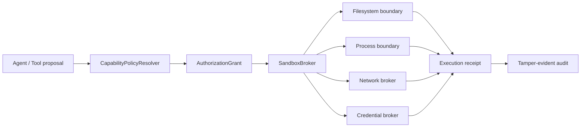

# OpenDrSai 智能体安全 P0：真正安全边界实施方案

> 状态：Proposal  
> 优先级：P0（P1、P2 的安全前置条件）  
> 适用范围：Desktop/WebUI、本地 Agent Kernel、动态 MCP/HepAI 工具及后续运行时适配器  
> 基线调研：[agent-security-controls-research-2026.md](./agent-security-controls-research-2026.md)

## 1. 总体目标

在模型、提示词、工具实现和 Approval 判断均可能出错的前提下，建立一个由宿主系统强制执行、不可被 Agent 自行绕过的能力边界。Approval 只决定是否授予某项能力，不再充当文件系统、进程、网络或凭据隔离本身。

P0 完成后必须满足：

1. 未获授权的进程不能读写工作区之外的宿主文件；仅依赖命令文本扫描不算满足。
2. 网络默认关闭；开放时只能访问解析后仍满足规则的目标，不能访问环回、私网和元数据服务。
3. Agent 不继承宿主完整环境变量、凭据、句柄和管理员权限。
4. 高危硬禁止规则不能被“完全访问”、`/dangerous on`、模型判断或普通用户 Approval 覆盖。
5. Approval 必须精确绑定未经脱敏的规范化操作摘要；展示和审计数据单独脱敏。
6. 安全后端缺失、启动失败或无法证明隔离有效时必须 fail closed。

非目标：P0 不负责优化 Approval 交互，也不定义三种产品模式；二者分别属于 P1、P2。

## 2. 解决方案

采用“策略解析—能力签发—隔离执行—结果审计”四层结构：

### 2.1 平台策略

- 定义跨平台 `SandboxBackend` 接口；不得让业务工具直接调用 `subprocess`、shell 或裸文件 API。
- Windows 首发后端使用受限身份/低权限令牌、Job Object、显式文件系统投影和代理式网络出口；隔离必须由集成测试证明，而不是仅检查配置值。
- Linux 后端规划为 namespace + bind mount + seccomp/cgroup；macOS 后端规划为受限进程与显式目录授权。未实现的平台拒绝进入需要隔离的模式。
- “完全访问”在 P0 中仍只能表示隔离环境内部的完全能力；宿主裸权限不作为常规产品能力。

### 2.2 策略与数据模型

新增不可变 `ResolvedCapabilityProfile`，至少包含：工作区根、只读/可写挂载、进程能力、网络规则、凭据引用、资源配额、硬禁止规则版本、到期时间和策略摘要。Run 创建后只能通过显式提权事件生成新版本，不能原地修改。

新增 `ActionProposal` 的双轨表示：

- `canonical_payload`：原始语义规范化后计算 SHA-256，用于 Approval/Grant/执行绑定，不进入普通日志。
- `display_payload`：脱敏后用于 UI、事件和审计展示。

Grant 必须绑定 `run_id + proposal_digest + capability_profile_digest + operation + expiry + nonce`，且默认单次使用。

## 3. 模块变更清单

### 3.1 新增模块

建议放在 `cores/python/packages/drsai/src/drsai/backend/runtime/security_boundary/`：

| 模块 | 职责 |
|---|---|
| `models.py` | Capability、Proposal、Grant、Receipt 的不可变模型 |
| `policy.py` | 策略合并、硬禁止规则、配置校验及版本摘要 |
| `sandbox.py` | `SandboxBackend` 协议、健康证明和 fail-closed 路由 |
| `windows_backend.py` | Windows 隔离进程、Job Object、令牌及资源限制 |
| `filesystem.py` | 工作区投影、受保护路径、无符号链接穿越的文件代理 |
| `network.py` | 默认拒绝、域名/CIDR/端口规则、DNS 重解析防护和出口代理 |
| `credentials.py` | 按引用、按用途、短时注入凭据；禁止全环境继承 |
| `grants.py` | Grant 签发、校验、消费、防重放 |
| `audit.py` | 安全判定、隔离证明和执行回执 |

### 3.2 更新模块

- `backend/runtime/agent_kernel.py`：所有工具执行前解析 Capability；`conditional` 必须有中心化语义，不能退回工具内部判断。
- `backend/runtime/engine.py`：保存原始规范摘要、Grant 和执行回执；副作用 claim 时重验实际参数摘要。
- `backend/runtime/security.py`：保留 `SecureWorkspaceFS` 作为文件代理组件；修复脱敏后哈希；逐步移出重复 Approval 状态职责。
- `modules/agents/skills_agent/drsai_assistant.py`：工具策略改为声明所需 Capability，而不只是风险标签。
- `modules/agents/skills_agent/managers/operater_funs.py`：`run_bash`、读写和编辑统一经 SandboxBroker；禁止业务层直接 `create_subprocess_shell`。
- `backend/codex_adapter/security.py`：Codex Approval 结果只生成 Grant，不能直接放行裸执行。
- Gateway/Android/OAEP：返回有效权限、拒绝原因和隔离后端证明，不泄漏规范化原文或凭据。

### 3.3 移除或降级

- `_check_cmd_paths`、危险命令正则和 `only_in_workspace` 文本检查降级为提示与纵深防御，不再是安全边界。
- `/dangerous on` 不得关闭硬禁止、隔离、凭据和网络边界；迁移后删除其“解除安全控制”语义。
- 禁止新的工具实现直接调用裸 `subprocess`、`os.system` 或不受控网络客户端；CI 加静态检查和例外清单。

## 4. 功能点、测试与验收

### P0-F01 不可变能力配置

功能：Run 启动时生成版本化 `ResolvedCapabilityProfile`；合并系统、管理员、工作区、用户和模式规则，采用“拒绝优先、最小权限”语义。

测试：

- 单元测试覆盖每一层覆盖顺序、拒绝优先、未知字段拒绝和摘要稳定性。
- 属性测试生成随机策略组合，证明结果不会比任一上层硬限制更宽。
- 并发测试证明 Run 中途配置变更不会静默影响既有 Grant。

验收：每个工具执行回执都能定位唯一 profile 版本；无法解析策略时工具未启动且 Run 收到结构化拒绝。

### P0-F02 文件系统强制边界

功能：仅投影明确授权的工作区路径；默认拒绝工作区外读写、符号链接/联接点穿越、设备路径、UNC、ADS 和受保护文件（如凭据、策略及 Agent 自身控制文件）。

测试：

- 单元测试覆盖路径规范化、大小写、`..`、符号链接、junction、hardlink、UNC、长路径和竞态替换。
- 集成测试让 shell、Python、Node、编译后二进制分别尝试越界读写。
- TOCTOU 压力测试在校验与打开之间替换目标。

验收：攻击样例均不能读取或修改哨兵文件；合法的工作区原子写和重命名不回退；测试在打包 Windows 应用中通过。

### P0-F03 进程与资源隔离

功能：子进程使用非管理员受限身份，禁止继承无关句柄；限制子进程树、CPU、内存、运行时长和退出清理；shell 与 argv 执行明确区分。

测试：

- 验证创建孙进程、脱离进程组、句柄继承、提权、服务/计划任务写入和调试其他进程均失败。
- 超时、崩溃和应用退出后检查整个 Job 内无遗留进程。
- 资源耗尽测试验证限制产生可诊断的终止回执。

验收：隔离 worker 不具有宿主用户完整权限；逃逸测试套件零成功；失败时不自动回落到宿主执行。

### P0-F04 网络出口边界

功能：默认无网；按域名、解析 IP、CIDR、端口和协议授权；拒绝环回、私网、链路本地、云元数据和 DNS 重绑定；所有出口经 Broker 留痕。

测试：

- 覆盖 IPv4/IPv6、CNAME、重定向、DNS rebinding、代理环境变量、DoH、原始 IP 和本地监听端口。
- E2E 证明“无网”进程即使自带网络库也无法外连。
- allowlist 测试证明仅目标域和端口可达，重定向后重新判定。

验收：默认模式无未经代理的成功连接；每个放行连接能关联 Run、Grant 和最终 IP。

### P0-F05 凭据与环境隔离

功能：环境变量采用 allowlist；凭据以引用形式由 Broker 按用途短时注入，默认不落盘、不进提示词、不进日志、不传给未授权子进程。

测试：

- 注入假密钥，扫描进程环境、日志、事件、崩溃报告、临时目录和子进程。
- 验证凭据用途、目标域、TTL 和单次使用限制。
- 测试恶意工具枚举环境和系统凭据库。

验收：秘密扫描零明文泄漏；越权使用得到硬拒绝并产生安全事件。

### P0-F06 不可覆盖的硬禁止层

功能：阻止破坏安全控制、宿主持久化、凭据窃取、跨进程注入、关闭审计、访问宿主控制面等类别；规则在所有产品模式之前执行。

测试：策略矩阵覆盖每个模式、用户 Approval 和自动 Approval，结果始终为拒绝；变形命令和间接调用纳入攻击语料。

验收：任何普通配置、模型输出、Approval 或旧 `/dangerous` 开关均不能放行硬禁止项；管理员策略变更独立审计并要求重启/重建 Run。

### P0-F07 Proposal、Grant 与实际执行精确绑定

功能：规范化原始参数后哈希；执行前重新计算实际参数摘要并原子消费单次 Grant；展示脱敏与授权摘要完全分离。

测试：

- 两条不同命令含同名敏感字段时摘要必须不同。
- 修改空白、参数顺序、路径解析结果的等价/非等价测试由规范定义决定。
- 重放、过期、跨 Run、跨工具、并发双消费和参数替换全部失败。

验收：数据库中无明文秘密，但任意参数实质变化都必须触发新授权；同一 Grant 最多产生一个副作用回执。

### P0-F08 不可信工作区处理

功能：首次打开或来源变化的工作区默认为不可信；不执行仓库内启动脚本、Agent 配置或插件；信任决定按工作区指纹保存且可撤销。

测试：恶意仓库包含启动 hook、同名工具、配置覆盖、符号链接及提示注入时，不得扩大 Capability；工作区移动/关键控制文件变化后重新判定。

验收：未信任工作区只能使用最小只读能力；UI 能解释阻止了什么，信任操作不能覆盖系统硬限制。

### P0-F09 安全回执与可观测性

功能：记录策略版本、隔离后端、Grant 消费、资源限制、网络目标和拒绝码；用户日志脱敏，安全审计可验证事件链完整性。

测试：事件 schema、脱敏快照、断电恢复、顺序/链摘要篡改检测和高并发压力测试。

验收：一次执行可从 Proposal 追踪到 Decision、Grant、Receipt；日志不能用于重放或恢复秘密。

### P0-F10 迁移与 fail-closed

功能：按工具类型逐步切换；旧执行路径必须在显式开发开关下存在且不进入发布包。隔离健康检查失败时禁用相关工具。

测试：模拟后端缺失、版本不匹配、Broker 崩溃、数据库锁和升级回滚；检查没有裸执行回退。CI 静态扫描新增裸进程/网络调用。

验收：发布包中所有副作用工具均经过统一 Broker；故障注入测试证明失败不会扩大权限。

## 5. 实施顺序与门禁

1. 建立模型、策略摘要、Grant 绑定与测试攻击语料。
2. 接入文件/进程隔离，先迁移 shell 与文件工具。
3. 接入网络和凭据 Broker，再迁移 MCP/HepAI 动态工具。
4. 加入不可信工作区、硬禁止、审计和发布健康证明。
5. 删除发布路径中的旧裸执行回退。

P0 完成门禁：所有 P0-F01～F10 验收通过；Windows 打包 E2E、逃逸攻击套件、崩溃恢复和回归测试连续通过；独立安全评审确认 Approval 全部失效时仍无法突破上述边界。未达门禁，不得把 P2 的“帮我批准”或“完全访问”设为可用。

