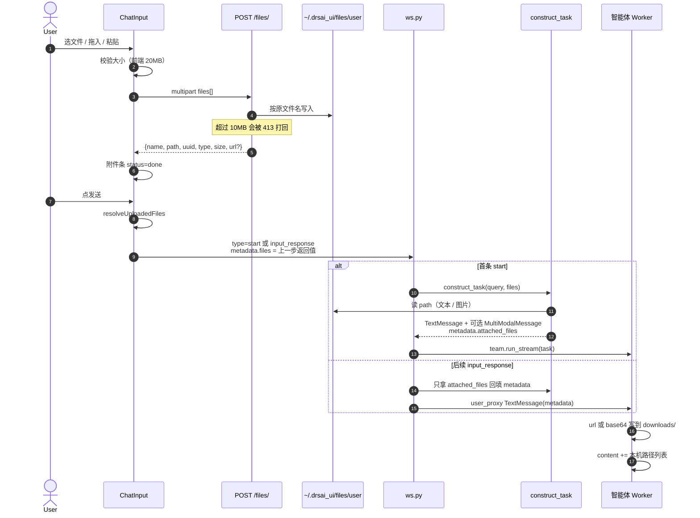

# 聊天框上传文件：从前端到后端再到智能体

本文描述 **当前 WebUI 聊天附件** 的实现，不是工作区文件树（`/api/files/v3`），也不是 Native API 附件。

范围：用户在聊天输入框选文件 / 拖入 / 粘贴 → HTTP 立刻上传 → 点发送时把**文件元数据**塞进 WebSocket → 后端 `construct_task` 变成 AutoGen 消息 → 智能体落到自己工作区的 `downloads/`。

文字消息本身怎么走 WebSocket、怎么流回前端，见：

- [chat-send-message-roundtrip.md](./chat-send-message-roundtrip.md)
- [chat-user-message-ws-agent-flow.md](./chat-user-message-ws-agent-flow.md)

工作区浏览、GFS、附件存储 Provider，见 `cores/python/packages/drsai/docs/file-storage-design.md`。那是另一条系统。

---

## 1. 先记住两件事

1. **上传发生在选文件的那一刻，不发生在点发送的那一刻。**  
   点发送时 WebSocket 只带路径、uuid、可选 url，不再传二进制。

2. **WebUI 后端和智能体不共享磁盘。**  
   文件先落到 `~/.drsai_ui/files/user/<user_id>/`。智能体真正能读的，是自己工作区里再写出来的一份副本（url 下载，或 metadata 里的 base64）。

```
┌────────────── Browser ──────────────┐
│ ChatInput                           │
│  选文件 / 拖入 / 粘贴               │
│  立刻 POST /files/                  │
│  发送时 WS 只带元数据               │
└──────────────┬──────────────────────┘
               │ ① HTTP multipart
               │    POST /files/?user_id=&session_id=
┌──────────────▼──── WebUI Backend ───┐
│ files.py 落盘 + UserFiles 表        │
│ 可选再传到 HepAI Files              │
│                                     │
│ ② 点发送：WS start / input_response │
│ ws.py construct_task                │
│  · 文本：读进 internal 消息         │
│  · 图片：MultiModalMessage          │
│  · attached_files JSON（url/base64）│
└──────────────┬──────────────────────┘
               │ ③ AutoGen 消息 dump
               │    HepAI Worker RPC
┌──────────────▼──── 智能体 Worker ───┐
│ run_stream 读 metadata              │
│ download_file_from_url_or_base64    │
│ 落到 downloads/<文件名>             │
│ 在用户消息末尾追加本机路径          │
│ 模型 / 工具按路径读文件             │
└─────────────────────────────────────┘
```

---

## 2. 总览时序

最常见路径：先贴一个 PDF 或图片，再输入文字发送。



---

## 3. 阶段一：聊天框里选文件（立刻 HTTP 上传）

入口：`apps/webui/frontend/src/pages/chat/chat/chatinput.tsx`  
上传逻辑：`apps/webui/frontend/src/pages/chat/chat/hooks/useFileUpload.tsx`

三种入口最后都进 `handleFileValidationAndAdd`：

| 操作 | 触发 |
|---|---|
| 回形针选文件 | `<input type="file">` `onChange` |
| 拖到输入框 | `onDrop` |
| 粘贴图片 / 超长文本 | `onPaste`（长文本会先变成 `.txt` 再上传） |

「库」里已经在服务器上的文件走 `serverFilesPrefill`，**不再上传**，直接并进 composer。

### 3.1 前端校验

```ts
MAX_FILE_SIZE = 20 * 1024 * 1024   // 20MB，见 chat/constants/fileConfig.ts
```

- 超 20MB：前端直接报错，不发请求。
- 同名文件：composer 里已有同名附件则拒绝。
- `ALLOWED_FILE_TYPES` 写在常量里，**当前聊天框没有按 MIME 拦截**。任意扩展名只要过了大小就能上传。

选中后立刻：

1. `fileList` 加一条 `status: "uploading"`。
2. `fileAPI.saveFilesToServer(userId, [file], sessionId)`。
3. `sessionId` 只是 query 参数。后端 `POST /files/` **并不读取它**，附件按用户存，不按会话隔离。

### 3.2 HTTP 上传

```
POST {webui}/files/?user_id=<email>&session_id=<n>
Authorization: Bearer <jwt>
Content-Type: multipart/form-data
files: <binary>
```

前端：`apps/webui/frontend/src/components/views/api/file.ts`  
后端：`apps/webui/backend/.../web/routes/files.py` 的 `upload_files`

JWT 里的 `current_user` 必须等于 `user_id`，否则 403。

后端做的事：

1. 目录：`~/.drsai_ui/files/user/<user_id>/`（`_APPDIR` 可改根目录）。
2. 原文件名落盘：`{user_files}/{user_id}/{filename}`。同名会覆盖磁盘上的旧文件。
3. 用落盘后的真实字节数判断大小。**超过 10MB 返回 413**，并删掉刚写的文件。提示去知识库：`https://ragflow.ihep.ac.cn`。
4. 每条记录生成 uuid，写入 `UserFiles.files`（SQLite JSON）。
5. 若环境变量 `USE_HEPAI_FILE` 为真，再用用户 personal key 把同一份文件 `client.files.create(purpose="user_data")` 传到 HepAI Files，并填 `url = https://aiapi.ihep.ac.cn/apiv2/files/{id}/preview`。

成功返回（前端只吃 `data` 数组）：

```json
{
  "status": true,
  "data": [
    {
      "name": "report.pdf",
      "type": "application/pdf",
      "path": "/home/.../.drsai_ui/files/user/alice@ihep.ac.cn/report.pdf",
      "suffix": ".pdf",
      "size": 123456,
      "uuid": "3f2c....",
      "url": "https://aiapi.ihep.ac.cn/apiv2/files/file-xxx/preview"
    }
  ]
}
```

`url` 仅在 `USE_HEPAI_FILE` 开启时存在。没开的话，后续只能靠 WebUI 本机 `path` 读文件，再把内容打成 base64 带给智能体。

前端把这条对象存进 `uploadedFilesInfo`，并把 `fileList` 该项标成 `done`，`response` 指向同一对象。失败则 `status: "error"`。

### 3.3 大小限制为什么打架

| 层 | 上限 |
|---|---|
| 聊天框前端 | 20MB |
| `POST /files/` | 10MB |
| Native API 附件 | 10MB / 条，单条消息合计 25MB、最多 5 个 |

10MB～20MB 的文件前端会开始传，后端会 413。用户看到的是上传失败，不是「发送失败」。

---

## 4. 阶段二：点发送（WebSocket 只带元数据）

`ChatInput.handleSubmit`：

1. 没有文字但有附件时，自动填 query：`请帮我分析这些文件。`
2. `resolveUploadedFiles`：必须已经 `done` 且拿得到服务端 info。还在传 → 提示稍候；失败或丢了 info → 拦住发送。
3. `onSubmit(query, uploadedFilesInfo, ...)`，然后清空输入框和附件条。

`ChatView` 按 Run 状态分流：

| 状态 | 函数 | WS type |
|---|---|---|
| 首条 / 重启 | `runTask` | `start` |
| `awaiting_input` / `ready` | `handleInputResponse` | `input_response` |
| 断线且不是在等人 | 同上 | `continue`（后端可能改写成 `input_response`） |

`useTaskActions.ts` 把附件原样放进 `metadata.files`，**不再读本地 File 对象**：

```json
{
  "type": "start",
  "stream_protocol": 2,
  "task": "{\"content\": \"请帮我分析这些文件。\"}",
  "metadata": {
    "files": [
      {
        "name": "report.pdf",
        "type": "application/pdf",
        "path": "/home/.../report.pdf",
        "suffix": ".pdf",
        "size": 123456,
        "uuid": "3f2c....",
        "url": "https://aiapi.ihep.ac.cn/apiv2/files/file-xxx/preview"
      }
    ],
    "team_config": {},
    "settings_config": {}
  }
}
```

后续轮次结构类似，只是 `type` 换成 `input_response`，正文在 `response` 里，`metadata.files` 仍是兄弟字段。

---

## 5. 阶段三：WebUI 后端把文件变成消息

路由：`apps/webui/backend/.../web/routes/ws.py`  
装配：`apps/webui/backend/.../backend/utils/utils.py` 的 `construct_task`

### 5.1 首条 `start`

`ws.py` 从 metadata 拆出 `files`，再：

```python
task = construct_task(query=task, files=files, metadata=start_metadata)
```

`construct_task` 对每个文件：

1. 没有 `url` 时，从 **WebUI 本机 `path`** 读字节，打成 base64。
2. **图片**（MIME `image/*`、旧值 `image`、或常见图片扩展名）：`Image.from_file(path)`，进入 `MultiModalMessage`。
3. **其它文件**：尝试 UTF-8 当文本读。成功则拼进一条 `metadata.internal = "yes"` 的 `TextMessage`（界面通常不展示）。失败（PDF / docx / zip 等）只记一行 `failed to process content`，**base64 仍会进 `attached_files`**。
4. 每条附件写入：

```json
{
  "name": "report.pdf",
  "type": "application/pdf",
  "size": 123456,
  "url": "https://...",
  "base64": "<无 url 时才有>"
}
```

整表 `json.dumps` 后放进用户消息的 `metadata.attached_files`。

于是 `start` 实际交给 Team 的是一组 AutoGen 消息，不是原始字符串：

| 消息 | 谁看得见 | 内容 |
|---|---|---|
| `TextMessage(internal=yes)` | 模型，前端一般不画 | 文本附件正文，或「处理失败」提示 |
| `TextMessage` 或 `MultiModalMessage` | 前端气泡 + 模型 | 用户 query；图片时 content = `[query, *images]` |

`WebSocketManager.start_stream` 会把这条用户消息 echo 回前端，所以气泡上的附件名来自 `metadata.attached_files`。渲染：`rendermessage.tsx` 的 `RenderUserMessage`（`attached_files` 优先，没有再看 `files`）。

`files` 列表还会继续传给 `TeamManager._create_team`。BESIII 的 `HepAIWorkerAgent(..., files=files)` 接了这个参数，但当前 worker 主体吃的是消息 metadata，不是构造函数上的 `files`。

### 5.2 后续 `input_response`

`_enrich_input_response_with_files` **也会**跑一遍 `construct_task`，但只用它产出的 `attached_files` 回填 metadata，**不会**把 `MultiModalMessage` 塞进后续轮次。

后续真正进 Team 的是 `user_proxy` 吐出的 `TextMessage`：

1. `handle_input_response` 把 `{response, metadata}` 放进输入队列。
2. `RoundbinDrSaiUserProxyAgent` 取出 `metadata`（含 `files` 和刚 enrich 的 `attached_files`）。
3. 把 list/dict 再 `json.dumps` 一遍（AutoGen metadata 只接受字符串）。
4. `TextMessage(source=user_proxy, content=<response JSON 字符串>, metadata=...)`。

所以：

- **首条图片会作为多模态内容进模型。**
- **后续轮次的图片不会再走 `MultiModalMessage`。** 模型看到的是文本 + 落到磁盘上的文件路径（见下一节）。前端气泡靠 `metadata.files` / `attached_files` 显示文件名。

---

## 6. 阶段四：智能体把文件写进自己的工作区

远程智能体（最常见）：

1. `HepAIWorkerAgent` 把 AutoGen 消息 `model_dump(mode="json")` 后调用 `a_chat_completions`。
2. Worker `DrSai.handle_input_info` 收下 `messages`，再 `TextMessage` / `MultiModalMessage.model_validate` 还原。`metadata.attached_files` 跟着走。
3. `DrSaiAssistant.run_stream`（本地 custom 模式则是 `DrSaiAgent.run_stream`）扫描每条消息：

```python
attached_files_json = msg.metadata.get("attached_files") or msg.metadata.get("files")
attached_files = json.loads(attached_files_json)
for file in attached_files:
    download_file_from_url_or_base64(
        file_info=file,
        save_path=f"{self._user_profile_manager.download_dir}/{file['name']}",
    )
```

落盘位置（技能助手）：

```
~/.drsai/workspace/runs/<user_id>/downloads/<原文件名>
```

`DrSaiAgent` 基类路径略有不同：`{_file_save_dir}/{user_id}/{thread_id}/{name}`。

`download_file_from_url_or_base64`（`drsai/utils/utils.py`）：

1. 有 `url` → HTTP GET，按字节写入。
2. 否则用 `base64` 解码写入。
3. 两者都没有 → 静默跳过（本地 `path` **不会**被智能体直接打开，那是 WebUI 机器上的路径）。

成功后在用户消息 `content` 末尾追加：

```
The files uploaded by the user are as follows:
/path/to/downloads/report.pdf
```

模型因此知道本机路径，后续 `read_file` / bash / 其它工具按路径工作。`assistant_skill.py` 里还有一处 `TODO: check attached_files`，目前没有第二套处理。

`internal=yes` 的文本附件消息也会进 `input_messages`，所以 UTF-8 文本往往被模型读两次：一次是内联正文，一次是 `downloads/` 里的文件。

---

## 7. 数据在各层长什么样

同一份文件，四处字段不完全一样。

| 位置 | 关键字段 | 二进制在哪 |
|---|---|---|
| 浏览器 `File` | `name`, `type`, `size` | 内存里的 `originFileObj`，上传完就不再发送 |
| `POST /files/` 返回 / WS `metadata.files` | `name`, `type`, `path`, `suffix`, `size`, `uuid`, `url?` | WebUI 磁盘 `path`；可选 HepAI `url` |
| `construct_task` → `attached_files` | `name`, `type`, `size`, `url`, `base64` | url 或 base64；**没有 uuid / 本地 path** |
| 智能体 `downloads/` | 原文件名 | Worker 本机文件 |

`path` 只在 WebUI 进程有意义。跨机器时必须靠 `url` 或 `base64`。

---

## 8. 和这条链路相邻、但不是它的东西

| 能力 | 入口 | 用途 |
|---|---|---|
| 聊天附件（本文） | `POST /files/` + WS `metadata.files` | 跟某一句用户消息走 |
| 用户文件库 | 同一 `POST /files/` + `GET /files/{session_id}` | 「库」页列表；`session_id` 路径目前不按会话过滤 |
| 工作区 / 共享盘 / v3 附件存储 | `/api/files/v3/{workspace\|shared\|attachments}` | Agent 工作区浏览、GFS、HepAI Files Provider |
| Native / 桌面附件 | `native_attachments.py` + Native API `attachments[]` | 不透明 `att_` id、10MB、TTL 24h，走另一套 store |
| 技能 ZIP | `POST /files/hepai/upload` | 技能广场，不是聊天附件 |

不要把聊天框上传和工作区文件树当成同一条 API。

---

## 9. 当前实现里值得注意的点

1. **前端 20MB、后端 10MB。** 中间这段会上传失败。
2. **`session_id` 没用来隔离。** 注释写过「file upload no longer depends on sessionId」。磁盘和 `UserFiles` 都是按 `user_id`。
3. **磁盘文件名是原始名，不是 uuid。** 同名覆盖；uuid 只在数据库里。
4. **二进制附件不会内联进 prompt。** PDF/docx 在 `construct_task` 里 UTF-8 失败，但对智能体仍可通过 base64/url 落到 `downloads/`。
5. **只有首条 `start` 的图片会进 `MultiModalMessage`。** 后续轮次图片只作为文件路径出现。
6. **`USE_HEPAI_FILE` 关着时，整文件 base64 会进消息 metadata。** 大文件会撑大 WS 帧、数据库里的 Run 消息、以及 Worker RPC 载荷。
7. **智能体不读 WebUI 的 `path`。** 跨机部署必须开 HepAI Files，或接受 base64。

---

## 10. 代码索引

| 文件 | 职责 |
|---|---|
| `apps/webui/frontend/src/pages/chat/chat/chatinput.tsx` | 选文件、拖放、粘贴、提交 |
| `apps/webui/frontend/src/pages/chat/chat/hooks/useFileUpload.tsx` | 立刻 `POST /files/`，维护 `fileList` / `uploadedFilesInfo` |
| `apps/webui/frontend/src/pages/chat/chat/utils/resolveUploadedFiles.ts` | 发送前确认上传完成 |
| `apps/webui/frontend/src/pages/chat/chat/constants/fileConfig.ts` | 前端 20MB、允许类型常量 |
| `apps/webui/frontend/src/components/views/api/file.ts` | `saveFilesToServer` |
| `apps/webui/frontend/src/pages/chat/hooks/useTaskActions.ts` | WS `metadata.files` |
| `apps/webui/frontend/src/pages/chat/rendermessage.tsx` | 用户气泡上的附件名 |
| `apps/webui/backend/.../web/routes/files.py` | `POST /files/` 落盘、10MB、可选 HepAI |
| `apps/webui/backend/.../web/initialization.py` | `~/.drsai_ui/files/user` |
| `apps/webui/backend/.../datamodel/db.py` | `UserFiles` |
| `apps/webui/backend/.../web/routes/ws.py` | `construct_task`、`_enrich_input_response_with_files` |
| `apps/webui/backend/.../backend/utils/utils.py` | `construct_task`：读盘、图片、attached_files |
| `apps/webui/backend/.../web/managers/connection.py` | `start_stream` 把 files 传给 Team |
| `apps/webui/backend/.../agents/user_proxy.py` | 后续轮次把 metadata 打进 `TextMessage` |
| `cores/python/packages/drsai/src/drsai/utils/utils.py` | `download_file_from_url_or_base64` |
| `cores/python/packages/drsai/src/drsai/modules/agents/skills_agent/drsai_assistant.py` | Worker 侧落到 `downloads/` |
| `cores/python/packages/drsai/src/drsai/modules/baseagent/drsaiagent.py` | 本地 Agent 同样的落盘逻辑 |
| `cores/python/packages/drsai/src/drsai/modules/agents/skills_agent/managers/user_profile_manager.py` | `work_dir/downloads` |
