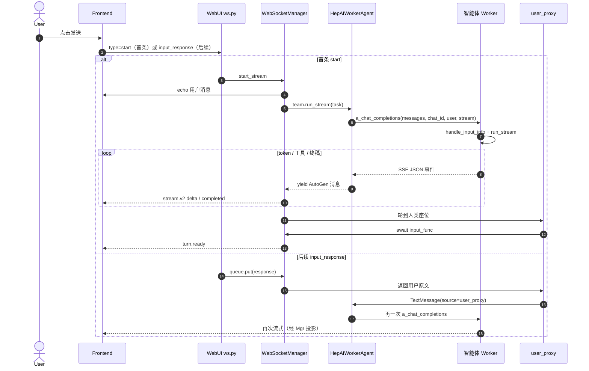

# 一条聊天消息的往返：前端 → 后端 → 智能体 → 后端 → 前端

本文按时间顺序写清：**用户点发送**之后，消息怎么进 WebUI 后端、怎么转发给智能体、智能体怎么解析并跑一轮、事件怎么流回后端、后端再怎么投影给前端画气泡。

描述的是 **当前 WebUI 实现**（协议 v2）。更细的状态机、`interrupt()`、处理过程框见 [chat-user-message-ws-agent-flow.md](./chat-user-message-ws-agent-flow.md)。

---

## 0. 三个进程，不是一次 HTTP

```
┌──────── Frontend (浏览器) ────────┐
│ ChatInput 点发送                    │
│ WebSocket 发 start / input_response │
│ 收 stream.v2，画气泡                │
└──────────────┬────────────────────┘
               │  WS  /api/ws/runs/{run_id}
┌──────────────▼──────── WebUI Backend ──┐
│ ws.py 分发 type                         │
│ WebSocketManager                        │
│  · start_stream 建 Team                 │
│  · 输入队列等人                         │
│  · StreamProjector 投影事件             │
│ RoundRobin: [HepAIWorkerAgent, user_proxy] │
└──────────────┬─────────────────────────┘
               │  HepAI Worker RPC
               │  a_chat_completions(stream=True)
┌──────────────▼──────── 智能体 Worker ──┐
│ POST /apiv2/chat/completions            │
│ handle_input_info 解析 kwargs           │
│ agent.run_stream(task)                  │
│ SSE 吐 AutoGen 事件 JSON                │
└────────────────────────────────────────┘
```

要点：

- 前端和 WebUI 后端之间是 **WebSocket**，不是 REST chat。
- WebUI 后端和远程智能体之间是 **HepAI Worker 的 `a_chat_completions`**（OpenAI 风格外壳，载荷是 AutoGen 消息 dump）。
- `custom` 等本地模式把 Agent 跑在 WebUI 进程里，没有这一跳 Worker RPC；**remote / ddf / besiii** 才会转发到独立智能体进程。
- 后续消息不是再 POST 一次。`start_stream` 里的 `async for` 一直活着，`user_proxy` 堵在输入队列上，下一句只是 `queue.put`。

---

## 1. 总览时序（remote 智能体，最常见）



---

## 2. 阶段一：前端点击发送

入口：`ChatInput.onSubmit` → `RunView` / `WelcomeScreen` 看当前 Run 状态，决定发哪种上行帧。

```text
status ∈ {awaiting_input, ready} 或答案已经画上屏幕
    → handleInputResponse → WS type=input_response
否则
    → runTask             → WS type=start
断线且不是在等人
    → type=continue（后端若 Team 还在，会改写成 input_response）
```

代码：`apps/webui/frontend/src/pages/chat/hooks/useTaskActions.ts`

### 2.1 点发送时前端立刻做的事

- **不会**在本地插入用户气泡。气泡要等后端 echo，或 `user_proxy` 产出的 `TextMessage`。
- 只乐观改 UI 状态：`status → active`，亮「正在调模型」，清掉 `input_request`。
- 确保 `ws(s)://{host}/api/ws/runs/{runId}` 已 OPEN（最多等 10s）。
- 发送身份绑在 **当前 Session 的 `agent_mode_config`**，不用全局刚选中的智能体，避免串台。

### 2.2 首条：`start`

`runTask` 组包：

```json
{
  "type": "start",
  "stream_protocol": 2,
  "task": "{\"content\": \"用户原文\", \"plan\": \"...可选...\"}",
  "metadata": {
    "files": [],
    "team_config": {},
    "settings_config": {
      "agent_id": "...",
      "agent_mode_config": { "mode": "remote|ddf|besiii|...", "...": "..." },
      "defult_config_name": "模型别名",
      "lang": "zh"
    },
    "skills": [{ "id": "...", "source": "..." }]
  }
}
```

注意：`task` 不是纯文本，而是 **JSON 字符串**。后端会把它整段当成 `TextMessage.content`；前端渲染再用 `parseUserContent` 取出 `.content`。

Session / Run 是之前 REST 建好的（`POST /sessions/` 会顺带插一条 `Run(status=created)`）。WebSocket **不建会话**，只挂到已有 `run_id`。

### 2.3 同一轮后续：`input_response`

```json
{
  "type": "input_response",
  "response": "{\"accepted\": false, \"content\": \"下一句\", \"defult_config_name\": \"...\"}",
  "metadata": {
    "settings_config": { "agent_id": "...", "agent_mode_config": {} },
    "files": [],
    "skills": []
  }
}
```

内层 `response` 同样是 JSON 字符串。`content` 才是用户可见文本；`accepted` / `plan` 给 Magentic-One 审批。附件和 skills 在信封 `metadata` 上，不塞进内层 JSON。

---

## 3. 阶段二：后端接到包，转发给智能体

入口：`apps/webui/backend/src/drsai_ui/ui_backend/backend/web/routes/ws.py`

连接建立后立刻下发 `{ type: "system", status: "connected" }`，然后 `while True: receive_text()` 按 `type` 分发。

### 3.1 `start`：新开一条永不结束的 stream

`ws.py` 做完这些再丢给后台任务（**不阻塞**读循环，所以后面的 `input_response` / `stop` 还能进来）：

1. `set_stream_protocol(2)`。
2. 从 `metadata` 拆出 `team_config`、`settings_config`、`files`、`skills`、`lang`、模型别名。
3. `construct_task(query=task, files=...)`：
   - 用户 query（仍是 JSON 字符串）→ `source="user"` 的 `TextMessage`。
   - 非图片附件读成文本，拼进 `internal=yes` 的消息。
   - 图片走 `MultiModalMessage`。
   - `attached_files` 写进 metadata。
4. `asyncio.create_task(WebSocketManager.start_stream(...))`。

`start_stream`（`managers/connection.py`）再做：

1. 同 `run_id` 若已有 Team，先静默停掉旧的。
2. 新建 `TeamManager` + `CancellationToken`。
3. 安装本条消息选中的 skills，把 `attached_skills` / `skill_proxy` 注入 task metadata。
4. 用 `agent_id` 从 `UserAgents` 取出 `agent_mode_config`；本轮 `defult_config_name` 可覆盖保存的默认模型，但不写回全局。
5. **Echo 用户消息**：非 internal 的 task 消息 `_send_message` + `_save_message`。这是首条用户气泡出现的时刻。
6. `create_input_func(run_id)`：闭包里 `await` 该 run 的 `asyncio.Queue`。
7. `async for message in team_manager.run_stream(...)`。

`TeamManager._create_team`（`task_team.py`）按 mode 装配真正的执行者：

| mode | WebUI 进程里是什么 | 会不会再转发到独立智能体 |
|---|---|---|
| `remote` / `ddf` | `HepAIWorkerAgent(name="RemoteAgent")` | 会：`a_chat_completions` → Worker |
| `besiii` | `HepAIWorkerAgent(name="besiii")` | 会 |
| `custom` | `RAGFlowAgent` 本地跑 | 不会 |
| `magentic-one` | GroupChat（web_surfer / coder / …） | 不会（本地 Team） |
| `pip_install` | 安装包里的 factory | 取决于实现 |

主聊天（remote）包成：

```text
RoundRobinGroupChat([HepAIWorkerAgent, RoundbinDrSaiUserProxyAgent])
```

先智能体答当前 task，再轮到 `user_proxy` 阻塞等人，如此交替。

### 3.2 真正「转发」发生在 HepAIWorkerAgent

文件：`cores/python/packages/drsai/src/drsai/modules/agents/drsai_worker_agent.py`

`on_messages_stream` 并不自己调 LLM。它：

1. 把本轮新消息写入 model context。
2. 如有需要，按消息里的模型别名 `switch_remote_model`。
3. 组 OpenAI 风格参数，调用 Worker 函数表里的 `a_chat_completions`：

```python
completion_kwargs = {
    "messages": [message.model_dump(mode="json") for message in messages],
    "apikey": self.api_key,
    "stream": True,
    "model": agent_name,          # 例如 "RemoteAgent"
    "chat_id": self._chat_id,     # WebUI 的 run uuid
    "user": self._run_info,       # name / email / …
}
# 可选 defult_config_name
stream = self._funcs_map["a_chat_completions"](**completion_kwargs)
```

`messages` 不是 `{role, content}`，而是 **AutoGen `TextMessage` 的 JSON dump**（带 `type`、`source`、`content`、`metadata`）。智能体端按这个格式还原。

连接信息来自 `agent_mode_config`：`url`（默认 `https://aiapi.ihep.ac.cn/apiv2`）、`name`（worker 名）、`api_key`。函数表由 `get_worker_sync_functions` 在 Agent 初始化时拉下来。

### 3.3 后续句：不转发新 Team，只唤醒队列

`input_response` 路径：

1. `ws.py` 给 files / skills 做 enrich（`construct_task`、安装技能），得到 `attached_files` / `attached_skills`。
2. `handle_input_response`：
   - 没有 `TeamManager` → 告诉前端 session 丢了，`status=stopped`，下次必须 `start`。
   - 有 `settings_config` → 尝试热切换远程模型。
   - `queue.put(response)`。
3. 正在 `await` 的 `input_func` 返回。
4. `user_proxy` 解析 JSON，yield `TextMessage(source="user_proxy")`。
5. RoundRobin 把这条交给 `HepAIWorkerAgent`，于是 **再打一次** `a_chat_completions`。

---

## 4. 阶段三：智能体解析请求，跑一轮

Worker 入口有两层，最终汇到同一套解析。

### 4.1 HTTP / RPC 入口

- HTTP：`DrSaiAPP.a_chat_completions`（`app_worker.py`）读 `Authorization` 和 JSON body，要求有 `messages` + `model`，转给 `a_start_chat_completions`。
- HepAI Worker RPC：`DrSaiWorkerModel.a_chat_completions`（`run.py`）直接转 `drsai.a_drsai_ui_completions`。

WebUI 的 `HepAIWorkerAgent` 走的是 **RPC `a_chat_completions` → `a_drsai_ui_completions`**。这条路径专门给 UI：yield 的是 AutoGen 事件，不是 OpenAI `chat.completion.chunk`。

### 4.2 `handle_input_info`：把 kwargs 收成 UserInput

文件：`cores/python/packages/drsai/src/drsai/dr_sai.py`

从 kwargs 抽出并落库 `UserInput`：

| 字段 | 来源 | 用途 |
|---|---|---|
| `user_messages` | `messages` | 本轮 AutoGen 消息 dump 列表 |
| `api_key` | `apikey` / `api_key` | 智能体调模型 |
| `stream` | `stream` | 默认 True |
| `user_id` | `user.email` 或 `user.name` | 身份 |
| `thread_id` | `chat_id` | 和 WebUI run uuid 对齐，用来复用 agent 实例 |
| `extra_requests` | 其余 kwargs | 含 `defult_config_name` 等 |

同一 `chat_id` 再次到来时更新同一条 `UserInput`，不新建。

### 4.3 还原消息、加载 / 复用 Agent、`run_stream`

`a_drsai_ui_completions` 接着：

1. 按 `thread_id` 复用 `self.agent_instance`；没有则 `_create_agent_instance`（可带本轮模型别名）。
2. 把每条 dump **按 `type` 还原** 成 AutoGen 对象：
   - `TextMessage` / `MultiModalMessage` / `HandoffMessage` / `StopMessage` / `ToolCallSummaryMessage`
   - 其它 type 直接报错。
3. 用还原后的列表当 `task`，更新/创建 Worker 侧 `Thread`（状态、历史）。
4. `agent.run_stream(task=task)` —— 真正的 Agent Loop：context、LLM、工具、Skill、子智能体。

用户原文此时仍可能是 JSON 字符串（前端包的那层壳）。智能体内部要自己从 `content` 里取文本；WebUI 的 `user_proxy` 会用 `HumanInputFormat.from_str` 先拆出 `content` / `accepted` / `plan` 放进 metadata。

### 4.4 智能体这一轮产出什么

`run_stream` 吐出的是 AutoGen 事件流，常见包括：

| 事件 | 含义 |
|---|---|
| `ModelClientStreamingChunkEvent` | 一个 token / 一小段正文或思考 |
| `ThoughtEvent` | 隐藏思考的权威快照 |
| `ToolCallRequestEvent` / `ToolCallExecutionEvent` / `ToolCallSummaryMessage` | 工具 |
| `AgentLogEvent` / `FilesEvent` | 日志、生成文件 |
| `TextMessage` | 一条完整回复 |
| `TaskResult` | 本轮 `run_stream` 结束 |

`a_drsai_ui_completions` 只把 `metadata.internal != "yes"` 的事件编码成 SSE：

```text
data: {"type": "ModelClientStreamingChunkEvent", "content": "...", "source": "...", ...}\n\n
```

换 source 的第一个 chunk 会打 `metadata.start_flag=yes`，方便下游开新气泡。`TaskResult` 作为结束帧。

---

## 5. 阶段四：智能体流回 WebUI 后端

`HepAIWorkerAgent.async_stream_generator` 消费这条 SSE / Worker stream：

1. 每个 chunk 是 dict。
2. 若 `chunk["type"]` 在 `DrSaiMessageFactory` 里，`model_validate` 还原成 AutoGen 对象，`yield` 给 RoundRobin。
3. 见到 `stop_reason` 就停。
4. 暂停 / 对端断开会变成 `CancelledError`。

WebUI 后端的 `TeamManager.run_stream` 把这些事件原样交给 `WebSocketManager.start_stream` 的 `async for`。**智能体看不到 WebSocket**；它只 yield 消息。投影和落库全在 WebUI 后端。

`user_proxy` 不参与这一跳。它只在 RoundRobin 轮到人类时 `await input_func`，把队列里的用户 JSON 变成下一条 `TextMessage`。

---

## 6. 阶段五：后端投影，再转发给前端

协议 v2 由 `StreamProjector`（`stream_protocol.py`）把 Agent 事件变成前端能画的帧。所有 v2 帧：

```text
type: "stream.v2"
seq / event_id / message_id / stream_id / run_id
```

### 6.1 事件怎么投影

| Agent 事件 | 发给前端 | 落库 |
|---|---|---|
| `ModelClientStreamingChunkEvent` | `message.started`（新气泡）+ `message.delta`（`channel=reasoning\|content`） | 否，token 不落库 |
| `ThoughtEvent` | reasoning snapshot | 可选 reasoning summary |
| `TextMessage`（完整回复） | `message.completed` + snapshot | 是，带 `message_id`，`turn_plane=final` |
| 工具 / 日志 | 先 `interrupt()` 封上当前气泡，再走旧格式帧；`agent.working phase=tool` | 工具/日志会存 |
| `UserInputRequestedEvent` | **丢弃** | — |
| `CheckpointEvent` | 不发前端，压缩进 `run.state` | 状态 |

`<think>...</think>` 在投影器里拆成两个 channel，前端不再自己剥标签。

工具一来必须先 `interrupt()`：同一 `message_id` 上不能再糊新字。打断的 hop 落成 `stream_status=interrupted`、`turn_plane=process`，前端收进可折叠「处理过程」；`turn.ready` 前最后一条 completed `TextMessage` 才是框外终稿。

### 6.2 一轮答完，等人

`user_proxy` 调用 `input_func` 时：

1. 默认 prompt（空 / `Enter your response:`）→ `kind=turn_ready`；否则 `kind=blocking`（审批、显式提问）。
2. DB：`run.status = awaiting_input`。
3. v2 + turn_ready：只发 `stream.v2 event=turn.ready`（带 `final_message_id`），不下发旧的「等待输入」。
4. blocking：发 `interaction.required`，并双发旧 `input_request` 给审批按钮。
5. `await queue.get()`，超时 600s 则 `stop_run`。

队列对象就是前端那条 `input_response`。取到后 status 回到 `active`，并发 `agent.working phase=model`。

### 6.3 前端收包、画气泡、改状态

`useChatWebSocket.handleWebSocketMessage`：

1. JSON 进 60ms 批量队列（token 风暴合成一次 React render）。
2. v2 → `reduceStreamEvent`（按 `seq` 去重、补洞；洞太大则 `stream.resume`）。
3. `materializeStreamMessages` 把 `{reasoning, content}` 填回 `currentRun.messages`。reasoning 仍包成 `<think>` 给现有 Markdown。
4. 用事件改 Run 状态：

| 事件 | 前端 status | 输入框 |
|---|---|---|
| `agent.working` | `active` | 锁 |
| `message.started / delta` | 有 token 后清 working | 锁 |
| `message.completed` | **立刻 `ready`** | 可提前解锁 |
| `turn.ready` | `ready` | 稳定解锁 |
| `interaction.required` | `awaiting_input` | 审批 / 特殊输入 |
| `completion cancelled/error` | `stopped` / `error` | 下次走 `start` |

用户气泡：

- 首条：后端 echo 的 `type=message`，`source=user`，content 是 JSON 字符串。
- 后续：`user_proxy` 的 `TextMessage`。`user_proxy` **不走** streaming adapter。
- `parseUserContent` 解开 JSON，得到可见文本、plan、附件。

`message.completed` 提前解锁是产品选择：少等 `turn.ready`。用户可能在 `user_proxy` 还没 `await queue` 时就发出下一句；后端靠队列缓冲。

---

## 7. 一条非首条消息的对照清单

RoundRobin + remote Worker + stream v2：

| # | 谁 | 做什么 |
|---|---|---|
| 1 | `ChatInput` | 用户点发送 |
| 2 | `RunView` | `canSendInputResponse` → `handleInputResponse` |
| 3 | `useTaskActions` | WS OPEN；组 `input_response`；`status=active` |
| 4 | `ws.py` | enrich files/skills；`handle_input_response` |
| 5 | `WebSocketManager` | 可选切模型；`queue.put` |
| 6 | `input_func` | 从 `await` 返回；`agent.working` |
| 7 | `user_proxy` | `HumanInputFormat.from_str`；yield `TextMessage(source=user_proxy)` |
| 8 | Projector | v2 `complete` 用户气泡 + 落库 |
| 9 | Frontend | 用户气泡出现 |
| 10 | RoundRobin | 把该消息交给 `HepAIWorkerAgent` |
| 11 | WorkerAgent | `a_chat_completions(...)` 转发到智能体 |
| 12 | 智能体 | `handle_input_info` 解析；还原消息；`run_stream` |
| 13 | 智能体 | SSE 吐 chunk / 工具 / `TextMessage` / `TaskResult` |
| 14 | WorkerAgent | `model_validate` 后再 yield |
| 15 | Projector | `delta` / `completed` / 工具旧帧 |
| 16 | Frontend reducer | 助手气泡从空到满；`completed` → `ready` |
| 17 | RoundRobin | 再轮到 `user_proxy` |
| 18 | `input_func` | 再阻塞；`turn.ready` |
| 19 | Frontend | 输入框稳定可发下一句 |

首条把 2–8 换成：`runTask` → `start` → `construct_task` echo 用户消息 → `team.run_stream(task)` 直接进第 10 步（第一句没有 `user_proxy`）。

---

## 8. 刷新 / 断线时这条链路会断在哪

- Socket 断了可以重连，**进程里的 `TeamManager` 必须还在**，`input_response` 才有人收。
- 后端重启后队列和 Team 都没了，DB 却可能仍是 `awaiting_input`。再发 `input_response` 会失败，前端必须用新消息 `start`。
- `continue` 是给「断线时 Agent 还在跑」打的补丁：有活 Team 就当 `input_response`，否则等于重启。
- 智能体 Worker 用 `chat_id` 复用 `agent_instance`。WebUI 重启但 Worker 没重启时，两边状态可能不一致。

---

## 9. 代码入口

| 层 | 文件 |
|---|---|
| 前端发送 | `apps/webui/frontend/src/pages/chat/hooks/useTaskActions.ts` |
| 前端收包 | `apps/webui/frontend/src/pages/chat/hooks/useChatWebSocket.ts` |
| 前端归约 | `apps/webui/frontend/src/pages/chat/chatStreamReducer.ts` |
| WS 路由 | `apps/webui/backend/src/drsai_ui/ui_backend/backend/web/routes/ws.py` |
| 运行管理 / 转发循环 | `.../web/managers/connection.py` |
| 流协议投影 | `.../web/stream_protocol.py` |
| Team 装配 | `.../teammanager/teammanager.py`、`.../agent_factory/magentic_one/task_team.py` |
| 人类座位 | `.../agent_factory/magentic_one/agents/user_proxy.py` |
| 转发到 Worker | `cores/python/packages/drsai/src/drsai/modules/agents/drsai_worker_agent.py` |
| Worker RPC | `cores/python/packages/drsai/src/drsai/backend/run.py` |
| 智能体解析与 loop | `cores/python/packages/drsai/src/drsai/dr_sai.py`（`handle_input_info`、`a_drsai_ui_completions`） |
