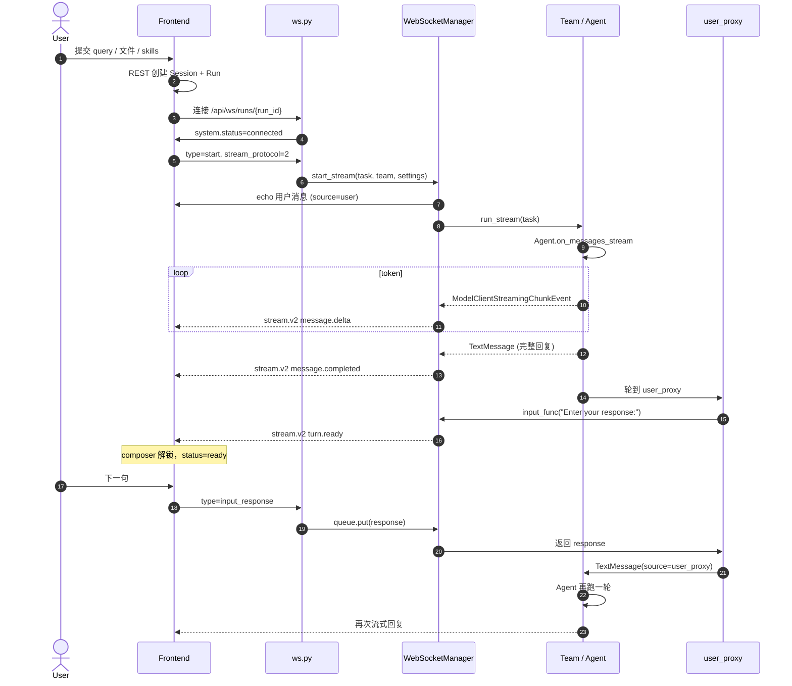

# 用户消息 → WebSocket → Agent 回复：端到端过程

按时间顺序看「点发送 → 转发智能体 → 解析 → 流回前端」，见 [chat-send-message-roundtrip.md](./chat-send-message-roundtrip.md)。

本文描述 **当前 WebUI 实现**（不是目标设计）。范围是聊天主链路：用户在输入框提交 → 前端走 WebSocket → 后端启动 / 唤醒 Team → Agent 推理并流式回包 → 前端渲染气泡并解锁下一轮输入。

用来重新规划这条链路时，先对齐「现在每一层实际经历了什么」。

相关代码入口：

| 层 | 关键文件 |
|---|---|
| 前端发送 | `apps/webui/frontend/src/pages/chat/hooks/useTaskActions.ts` |
| 前端收包 | `apps/webui/frontend/src/pages/chat/hooks/useChatWebSocket.ts` |
| 前端渲染归约 | `apps/webui/frontend/src/pages/chat/chatStreamReducer.ts` |
| WS 路由 | `apps/webui/backend/src/drsai_ui/ui_backend/backend/web/routes/ws.py` |
| 运行管理 | `apps/webui/backend/src/drsai_ui/ui_backend/backend/web/managers/connection.py` |
| 流协议投影 | `apps/webui/backend/src/drsai_ui/ui_backend/backend/web/stream_protocol.py` |
| Team 装配 | `apps/webui/backend/src/drsai_ui/ui_backend/backend/teammanager/teammanager.py` |
| Agent / UserProxy | `apps/webui/backend/src/drsai_ui/agent_factory/magentic_one/task_team.py`、`.../agents/user_proxy.py` |

---

## 1. 三层各自扮演什么

```
┌──────────── Frontend ────────────┐
│ ChatInput / WelcomeScreen        │
│ 决定 start vs input_response     │
│ 乐观改 status，不乐观插入用户气泡 │
│ useChatWebSocket 收包 → currentRun│
└──────────────┬───────────────────┘
               │  WS  /api/ws/runs/{run_id}
┌──────────────▼──────── Backend ──┐
│ ws.py 按 type 分发                │
│ WebSocketManager                 │
│  · start_stream 创建 Team        │
│  · input queue 阻塞等人          │
│  · StreamProjector 把 Agent 事件 │
│    投影成 stream.v2 / 旧帧       │
└──────────────┬───────────────────┘
               │  asyncio generator
┌──────────────▼──────── Agent ────┐
│ TeamManager._create_team         │
│ RoundRobin: [Agent, user_proxy]  │
│ 或 Magentic-One GroupChat        │
│ Agent.on_messages_stream → LLM   │
│ user_proxy 阻塞在 input_func     │
└──────────────────────────────────┘
```

三层不是「请求 / 响应」一次往返。**一次用户发送会把一个已经在跑的 asyncio 生成器从阻塞点唤醒**（后续消息），或 **新开一条 `start_stream` 任务**（首条 / 重启）。

核心对象：

| 对象 | 含义 |
|---|---|
| **Session** | 一次聊天会话。创建时顺带建一个 `Run(status=created)`。 |
| **Run** | 一次执行。WebSocket 按 `run_id` 挂接。同一 session 通常复用同一个 run。 |
| **TeamManager** | 后端进程内的 Team 持有者：建 Agent、跑 `team.run_stream()`。 |
| **user_proxy** | Team 里的「人类座位」。轮到它时调用 `input_func`，把 UI 输入变成 `TextMessage`。 |
| **Agent** | 真正调模型 / 工具的参与者（DrSai / Remote / BESIII / Magentic-One 等）。 |

---

## 2. 总览时序

下面是 **最常见路径**：新会话首条 `start`，Agent 答完后 `user_proxy` 等人，用户再发后续 `input_response`。



---

## 3. 阶段 0：还没打字之前

### 3.1 新聊天

1. `useSessionManager.createNewChatSession` 把首条 query 存进 `pendingFirstMessage`。
2. REST `POST /sessions/` 创建 Session，并 **立刻** 插入一个 `Run(status=created)`（`sessions.py`）。
3. `chat.tsx` 加载到这个空 Run 后，`pendingFirstMessage` effect 自动调 `runTask`。

### 3.2 已有会话

1. `getSessionRuns` 取该 session 最新 Run。
2. 若 Run 仍是 `active / ready / awaiting_input / pausing / paused / error`，但 WebSocket 已经没了，前端会把 status **强制改成 `stopped`**，避免页面刷新后误发一条过期的 `input_response`。
3. 用户再发送时走 `start`，后端会停掉旧 Team 再开新 stream。

Session 与 Run 是 REST 创建的；WebSocket **不负责建会话**，只绑定已有 `run_id`。

---

## 4. 阶段 1：前端组包 —— 同一输入框，三种上行 type

输入框本身不区分「第几句」。`WelcomeScreen` / `RunView` 的 `ChatInput.onSubmit` 只看当前 Run 状态：

```text
canSendInputResponse =
    status ∈ {awaiting_input, ready}
    或 turnSettledVisually（答案已经画到屏幕上）

是  → handleInputResponse → WS type=input_response
否  → runTask             → WS type=start
```

断线重连且 **不是** 在等人，会走第三条：`type=continue`（见 4.3）。

前端 **不会** 在本地插入用户气泡。用户消息要等后端 echo，或 `user_proxy` 产出的 `TextMessage` 再出现。发送瞬间只改：

- `status → active`
- `agent_working.phase = orchestrator | model`
- `input_request` 清空

### 4.1 首条 / 重启：`start`

`useTaskActions.runTask`：

1. 拉最新全局 settings。
2. `setupWebSocket(runId, fresh_socket=true)` → `ws(s)://{host}/api/ws/runs/{runId}`。
3. 等到 `readyState === OPEN`（最多 10s）。
4. 发送：

```json
{
  "type": "start",
  "stream_protocol": 2,
  "task": "{\"content\": \"用户原文\", \"plan\": \"...可选...\"}",
  "metadata": {
    "files": [/* 已上传文件元数据 */],
    "team_config": { },
    "settings_config": {
      "agent_id": "...",
      "agent_mode_config": { "mode": "remote|drsai|besiii|...", "...": "..." },
      "defult_config_name": "模型别名",
      "lang": "zh"
    },
    "skills": [{ "id": "...", "source": "..." }]
  }
}
```

注意：`task` 不是纯文本，而是 **JSON 字符串**。后端 `construct_task(query=task)` 会把这整段字符串当成 `TextMessage.content`。前端渲染时再用 `parseUserContent` `JSON.parse` 取出 `.content`。

### 4.2 同一轮后续：`input_response`

`handleInputResponse` 在 socket 已开、且 Run 处于 `ready / awaiting_input` 时发送：

```json
{
  "type": "input_response",
  "response": "{\"accepted\": false, \"content\": \"下一句\", \"defult_config_name\": \"...\"}",
  "metadata": {
    "settings_config": { "agent_id": "...", "agent_mode_config": { } },
    "files": [ ],
    "skills": [ ]
  }
}
```

内层 `response` 同样是 JSON 字符串。`accepted` / `plan` 给 Magentic-One 审批与计划；`content` 才是用户可见文本。

BESIII 等面板可以把额外字段放在 **信封** `metadata` 上（与 `response` 同级），不塞进内层 JSON。

### 4.3 断线中途：`continue`

若发送时 socket 需要重连，且当前 **不是** `awaiting_input / ready`：

- 上行变成 `type=continue`，payload 形状接近 `start`（带 `task` + `team_config` + `settings_config`）。
- 后端若发现该 `run_id` 仍有活着的 TeamManager，会把 `continue` **改写成 `input_response`**，避免 `start_stream` 把正在跑的 Agent 掐掉。
- 否则走完整 `start_stream`（等于重启）。

### 4.4 其它控制帧

| type | 作用 |
|---|---|
| `stop` | 用户取消。后端 `stop_run`，发 `completion.status=cancelled`。 |
| `pause` / `resume` | 暂停 / 恢复 Team。 |
| `ping` | 心跳，回 `pong`。 |
| `stream.resume` | 前端发现 seq 缺口，请求从 `resume_after_seq` 重放。 |

---

## 5. 阶段 2：WebSocket 入口

`GET/WS /api/ws/runs/{run_id}`（`ws.py`）：

1. 查 Run 是否存在。若 status 已是 `stopped / complete / error`，清掉旧 `run.state`，避免 load_state 立刻终止。
2. Native 客户端带 Bearer 时校验 owner；浏览器暂可无 token。
3. `WebSocketManager.connect`：`accept()`、换代 `conn_gen`、为该 run 建 `asyncio.Queue`（输入队列）。
4. 立刻下发 `{ type: "system", status: "connected" }`。
5. 若 DB 里仍是 `awaiting_input`，重发 pending 的 `turn.ready` / `interaction.required`，让刷新后的页面能继续。

之后进入 `while True: receive_text()`，按 `message.type` 分发。断线默认 **不停 Run**（`disconnect(stop_run=False)`），允许重连续跑。

---

## 6. 阶段 3：`start` 在后端经历了什么

`ws.py` 对 `start` / `continue`：

1. `set_stream_protocol(2)`（前端声明了 `stream_protocol: 2`）。
2. 从 `metadata` 拆出 `team_config`、`settings_config`、`files`、`skills`、`lang`、模型别名。
3. `construct_task(query=task, files=files, metadata=...)`：
   - 非图片附件读成文本，拼进一条 `internal=yes` 的 `TextMessage`。
   - 图片走 `MultiModalMessage`。
   - 用户 query（仍是 JSON 字符串）成为 `source="user"` 的消息。
   - `attached_files` 写进 metadata，供前端气泡和 Agent 读路径。
4. `asyncio.create_task(start_stream(...))` —— **不阻塞** WS 读循环，所以后面的 `input_response` / `stop` 还能进来。

`WebSocketManager.start_stream`：

1. 加 `_start_locks`。若同 `run_id` 已有 Team，先 `stop_run(mark_closed=False)`（对前端静默），关掉旧 Team。
2. 新建 `TeamManager` + `CancellationToken`。
3. 安装本条消息选中的 skills，把 `attached_skills` / `skill_proxy` 注入 task metadata。必要时在 task 文本末尾加「请先用 Skill 工具加载 …」。
4. 解析 `agent_id`，从 UserAgents 取出 `agent_mode_config`；本轮 `defult_config_name` 可覆盖保存的默认模型，但不写回全局配置。
5. **Echo 用户消息**：把 `construct_task` 的非 internal 消息 `_send_message` + `_save_message`。这是首条用户气泡出现的时刻。
6. `create_input_func(run_id)`：闭包里会 `await` 该 run 的输入队列。
7. `async for message in team_manager.run_stream(...)`。

`TeamManager._create_team` 按 `agent_mode_config.mode` 分支：

| mode | Team 形态 |
|---|---|
| `magentic-one` | GroupChat：web_surfer / coder / file_surfer / user_proxy + Orchestrator |
| `remote` / `ddf` / `besiii` / `custom` / `pip_install` | 单个 ChatAgent + `RoundbinDrSaiUserProxyAgent`，包进 `RoundRobinGroupChat([agent, user_proxy])` |

DrSai 主聊天走的是 **RoundRobin**：先 Agent 答当前 task，再轮到 `user_proxy` 阻塞等人，如此交替。

---

## 7. 阶段 4：Agent 这一轮做了什么

以 `DrSaiAgent.on_messages_stream` 为代表（Remote / BESIII worker 结构类似）：

1. `_add_messages_to_context`：把本轮新消息（首条是 `start` 的 task；后续是 `user_proxy` 产出的 `TextMessage`）写入 model context。
2. 可选：memory / RAG 更新，先 yield 内部事件。
3. `_call_llm`：流式调模型。每个 token yield `ModelClientStreamingChunkEvent`；结束得到 `CreateResult`。
4. 若模型带 hidden thought，再 yield `ThoughtEvent`。
5. `_process_model_result`：
   - 纯文本 → 最终 `TextMessage` / `Response`。
   - tool call → `ToolCallRequestEvent` → 执行 → `ToolCallExecutionEvent` / `ToolCallSummaryMessage`，可能再推理一轮。
   - 需要人批 → 走 `ApprovalGuard`，最终也是同一个 `input_func`，但 `input_type=approval`。
6. RoundRobin 把这些事件从 `team.run_stream()` 吐给 `WebSocketManager`。
7. 每吐一条，RoundRobin 还会跟一条 `CheckpointEvent`（压缩进 `run.state`），给刷新 / 重启用。

Agent **看不到 WebSocket**。它只看到 AutoGen 消息序列，以及（间接）`input_func` 何时返回。

`user_proxy.on_messages_stream` 在轮到自己时：

1. yield `UserInputRequestedEvent`（后端故意丢掉，不发给前端）。
2. `await input_func(prompt)`。默认 prompt 是 `"Enter your response:"`。
3. 返回值可能是 `str`，也可能是 `{ response, metadata }`。
4. `HumanInputFormat.from_str` 解析内层 JSON：取出 `content` / `accepted` / `plan`。
5. yield `TextMessage(content=原来的 JSON 字符串, source="user_proxy", metadata=...)`。

所以后续用户气泡的 `config.content` 经常是 JSON，渲染层必须 `parseUserContent`。附件不在 content 里，而在 `metadata.attached_files` 或 `metadata.files`。

---

## 8. 阶段 5：后端如何把 Agent 事件变成前端能画的东西

`start_stream` 循环里，协议 v2（当前 WebUI 默认）走 `StreamProjector`：

| Agent 事件 | 投影结果 | 是否落库 |
|---|---|---|
| `ModelClientStreamingChunkEvent` | `message.started`（若新气泡）+ `message.delta`（`channel=reasoning\|content`） | 否（token 不落库） |
| `ThoughtEvent` | reasoning 的 snapshot | 可选 reasoning summary |
| `TextMessage`（完整回复） | `message.completed` + snapshot | 是，带 `message_id` |
| Tool / Log / ToolCallSummary | 先 `interrupt()` 把当前气泡标 completed，再走旧格式帧；并 `agent.working phase=tool` | 工具/日志消息会存 |
| `UserInputRequestedEvent` | 丢弃 | — |
| `CheckpointEvent` | 不发前端，压缩进 `run.state` | 状态 |

`<think>...</think>` 在投影器里拆成两个 channel，前端不再自己剥标签（v2 路径）。

旧协议（未声明 `stream_protocol: 2`）仍发：

- `message_chunk` / `message` / `message_thinking` / `message_log` / `message_files` / `input_request`

v2 客户端若收到旧帧，`LegacyStreamAdapter` 会把它改编成 v2 事件再进同一个 reducer。

### 8.1 `interrupt()`：封上当前气泡，不是把思考塞进处理过程

同一条 v2 气泡有稳定的 `message_id`。token 一直往这个 id 上追加。工具一来，这条气泡必须先结束，否则工具后的新字会糊进同一颗泡里。

`StreamProjector.interrupt()` 做的就是这件事：

1. 把当前 `message_id` 标成 `status=interrupted`，发 `message.completed`。
2. 把 think + 已流出的正文落库成**一跳 Assistant 气泡**（`stream_status=interrupted`，`turn_plane=process`）。
3. 再发工具帧；之后新的 token 会 `_ensure` 出**新的** `message_id`。

时间线是：

```
处理过程框（hop1 旁白 + Skill / search + hop2 旁白 + 再 1 个工具）
气泡 final（turn.ready 前最后一条 completed TextMessage）
```

`turn.ready` 会带 `final_message_id`，并把该 hop 钉成 `turn_plane=final`；同一 user turn 里其余 ReAct 行（interrupted hop、工具、日志）都是 `turn_plane=process`，前端收进同一个可折叠「处理过程」。

前端只通过 `buildTurnSegments` 读这个文档：每个 user turn 固定为「处理过程框 → 终稿」。数组里工具行在终稿后面也会被抬进框里。终稿气泡只保留正文，reasoning 进处理过程，不再在答案上挂「思考完成」。

### 8.2 一轮结束，等人

`input_func`（`create_input_func`）被 `user_proxy` 调用时：

1. 判断 prompt 是不是「默认续聊」（空 / `Enter your response:`）→ `kind=turn_ready`，否则 `kind=blocking`（审批、显式提问）。
2. DB：`run.status = awaiting_input`，记下 `input_request`。
3. **v2 + turn_ready**：不下发旧的 `system.status=awaiting_input`（避免闪「等待输入」），只发 `stream.v2 event=turn.ready`。
4. **blocking**：发 `interaction.required`，并双发旧 `input_request` 给审批按钮。
5. `await queue.get()`，超时 600s 则 `stop_run`。

队列里的对象就是前端那条 `input_response`（字符串或 `{response, metadata}`）。取到后 status 回到 `active`，并发 `agent.working phase=model`。

---

## 9. 阶段 6：前端收包、画气泡、改状态

`useWebSocketManager` 按 session 缓存一条 socket。`useChatWebSocket.setupWebSocket` 挂上 `onmessage`：

1. JSON.parse 后进入 60ms 批量队列（token 风暴合成一次 React render）。
2. `handleWebSocketMessage`：
   - v2 → `reduceStreamEvent`（按 `seq` 去重、补洞；洞太大则 `stream.resume`）。
   - 再 `materializeStreamMessages` 把 `{reasoning, content}` 填回 `currentRun.messages`。reasoning 仍包成 `<think>` 给现有 Markdown 渲染。
3. 用事件改 Run 状态（这是前端「Agent 还在不在干活」的真相来源）：

| 事件 | 前端 status | 输入框 |
|---|---|---|
| `agent.working` | `active`，亮 working 指示 | 锁 |
| `message.started / delta / snapshot` | 有 token 后清 working；若是 `ready` 则拉回 `active` | 锁 |
| `message.completed` | **立刻 `ready`**（答案已上屏，不必等 turn.ready） | 可提前解锁 |
| `turn.ready` | `ready`，清 `input_request` | 解锁 |
| `interaction.required` | `awaiting_input` + 填 `input_request` | 审批 / 特殊输入 |
| 旧 `input_request` | 同上 | 同上 |
| `completion cancelled/error` | `stopped` / `error` | 下次走 `start` |
| `error` | 非终态则改 `stopped` 并关 socket | 下次走 `start` |

用户气泡：

- 首条：后端 echo 的 `type=message`，`source=user`，content 是 JSON 字符串。
- 后续：`user_proxy` 的 `TextMessage` 经 v2 `complete()` 或旧 `message` 进来。`useChatWebSocket` 对 `user_proxy` **不走** streaming adapter。
- `rendermessage.parseUserContent` 负责把 JSON 解开成可见文本、plan、附件。

---

## 10. 阶段 7：用户再发一句时，Agent 如何被叫醒

这是和「首条 `start`」最不一样的地方。

```
用户点发送
  → 前端判定 ready / awaiting_input
  → WS input_response
  → ws.py 给 files / skills 做 enrich（construct_task、安装技能）
  → handle_input_response
       · 没有 TeamManager → 告诉前端 session 丢了，status=stopped
       · 有 settings_config → 尝试热切换远程模型
       · queue.put(response)
  → 正在 await 的 input_func 返回
  → user_proxy 产出 TextMessage
  → RoundRobin 把这条消息交给 Agent
  → Agent.on_messages_stream 再跑 LLM
  → 流式事件再次穿过 Projector → 前端
  → 再一次 round，user_proxy 又阻塞
```

**Team 没有结束。** `start_stream` 那个 `async for` 一直活着，直到 `stop`、出错、或 RoundRobin / Orchestrator 自己停。所以后续消息不是「再 POST 一次」，而是往一个阻塞队列里塞数据。

这也是为什么刷新页面很敏感：socket 断了可以重连，但 **进程里的 TeamManager 必须还在**。若后端重启，队列和 Team 都没了，DB 却可能仍显示 `awaiting_input` —— 此时再发 `input_response` 会失败，前端被要求用新消息 `start` 重启。

---

## 11. Run 状态机（后端 DB vs 前端 UI）

后端 `RunStatus`（落库）：

```
created ──start──► active ──input_func──► awaiting_input ──queue──► active
                      │                         │
                      ├─ pause ─► paused        │
                      ├─ stop  ─► stopped       │
                      ├─ error ─► error         │
                      └─ TaskResult ─► complete
```

前端额外有：

- `connected`：只来自 WS `system` 帧，几乎立刻被 `start` 改成 `active`。
- `ready`：v2 语义「这一轮答完了，输入框可以发下一句」。DB 仍可能是 `awaiting_input`（`kind=turn_ready`）。加载历史时 `normalizeRunInteractionStatus` 会把这种 awaiting **映射成 ready**，避免刷新后出现「等待输入」横幅。
- `agent_working`：不是 status 枚举，是 `currentRun` 上的附属字段，用来画「正在调度 / 正在调模型 / 正在用工具」。

---

## 12. 下行协议速查（v2）

所有 v2 帧：`type: "stream.v2"`，带单调 `seq`、`event_id`、`message_id`、`stream_id`、`run_id`。

| `event` | 含义 |
|---|---|
| `message.started` | 新气泡 |
| `message.delta` | `channel=content` 或 `reasoning` 的增量 |
| `message.snapshot` | 权威快照（补洞 / thought） |
| `message.completed` | 气泡结束，`snapshot.status=completed\|interrupted` |
| `turn.ready` | 默认可续聊；带 `final_message_id` 指向本轮框外终稿 |
| `interaction.required` | 必须人介入 |
| `agent.working` | 后端在等模型 / 工具 / 编排 |

旧帧仍可能出现：`system`、`message`、`message_chunk`、`message_log`、`message_files`、`message_thinking`、`tool_call_summary`、`input_request`、`result`、`completion`、`error`、`tool.progress`。

---

## 13. 重新规划时，这条链路真正咬死的点

按「改一处会牵一片」排序，方便拆方案：

1. **两种上行动词**  
   首条 `start` 创建 Team；后续 `input_response` 只唤醒队列。前端用 Run status 猜该发哪个。status 稍有漂移（刷新、completed 早于 turn.ready、socket 假死）就会发错动词。

2. **用户消息不乐观上屏**  
   气泡出现依赖后端 echo 或 `user_proxy` 回程。规划新输入体验（立即出用户气泡、可编辑、可撤回）必须先定「谁是用户消息的权威来源」。

3. **用户 content 是 JSON 字符串**  
   `task` / `response` 内层包了 `content` / `accepted` / `plan` / `defult_config_name`。前端 `parseUserContent`、后端 `HumanInputFormat`、DB 里存的都是这层壳。想改成纯文本 + 结构化 metadata，三端要一起改。

4. **文件 / skills 挂在信封 metadata，又被 construct_task 再写回 attached_***  
   `start` 和 `input_response`  Enrich 路径不完全对称。附件回显依赖 `attached_files` vs `files` 两套字段。

5. **一轮 = 一个永不结束的 `async for`**  
   Agent 生命周期绑在 `start_stream` 任务上。多标签、刷新、后端滚动发布，都要处理「Team 还在不在」。`continue` 是为此打的补丁。

6. **双协议窗口**  
   v2 Projector + 旧 `_format_message` 并存。工具/日志仍走旧帧。前端 reducer 和 legacy adapter 两套。规划渲染，先决定是否关掉 v1。

7. **`message.completed` 提前解锁输入框**  
   产品上是为了少等 `turn.ready`。代价：用户可能在 `user_proxy` 还没 `await queue` 时就发 `input_response`。后端靠队列缓冲；前端靠 `canSendInputResponse`。两边时序是隐式契约。

8. **Agent 模式分叉**  
   RoundRobin（大多数 DrSai / Remote）vs Magentic-One Orchestrator。后者会在计划、审批、handoff 时用 **blocking** `input_func`，不是每次都 `turn.ready`。输入框语义不能假设「每次答完都能自由打字」。

9. **模型 / Agent 身份跟 session 走**  
   发送时用 `session.agent_mode_config`，不用全局当前选中的 Agent，避免「串台」。热切换模型走 `input_response.metadata.settings_config` → `team_manager._switch_remote_model_if_requested`。

---

## 14. 一条消息从按下发送到屏幕上出现回复：对照清单

以 RoundRobin + stream v2、非首条为例：

| # | 谁 | 做什么 |
|---|---|---|
| 1 | `ChatInput` | `onSubmit(query, files, skills, llm)` |
| 2 | `RunView` | `canSendInputResponse` 为真 → `handleInputResponse` |
| 3 | `useTaskActions` | 确保 WS OPEN；组 `input_response`；`status=active` |
| 4 | `ws.py` | enrich files/skills；`handle_input_response` |
| 5 | `WebSocketManager` | `queue.put`；可选切模型 |
| 6 | `input_func` | 从 `await` 返回；`status=active`；`agent.working` |
| 7 | `user_proxy` | 解析 JSON；yield `TextMessage(source=user_proxy)` |
| 8 | `WebSocketManager` | v2 `complete` 用户气泡 + 落库 |
| 9 | Frontend | 用户气泡出现 |
| 10 | RoundRobin | 把该消息交给 Agent |
| 11 | Agent | context + LLM stream；yield chunks / tools / 最终 TextMessage |
| 12 | `StreamProjector` | delta / completed |
| 13 | Frontend reducer | 助手气泡从空到满；`message.completed` → `ready` |
| 14 | RoundRobin | 再轮到 `user_proxy` |
| 15 | `input_func` | 再阻塞；`turn.ready` |
| 16 | Frontend | 输入框稳定可发下一句 |

首条把 3–8 换成：`runTask` → `start` → `construct_task` echo 用户消息 → `team.run_stream(task)` 直接进第 10 步（没有 `user_proxy` 参与第一句）。

---

## 15. 不在本文范围，但会碰到的旁路

- **Native / 桌面 / 移动**：`native.py` 等也调 `handle_input_response` / 同一套 `WebSocketManager`，协议应对齐。
- **暂停、取消、审批按钮**：仍是同一条 WS，只是 `pause` / `stop` / `input_response("approve")`。
- **历史回放**：`turn.ready` 后会 REST merge DB messages（`reconcilePersistedMessages`），防止 WS 漏的工具/文件行。
- **右侧文件 / 日志面板**：从 `currentRun.messages` 里抽 `FilesEvent` / `AgentLogEvent`，不是另一条 socket。
